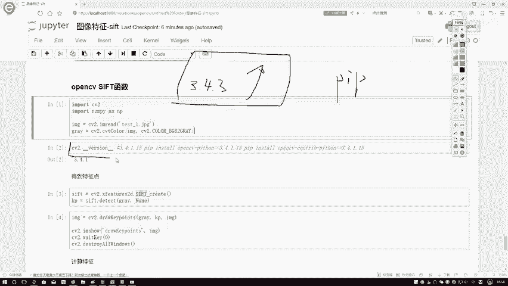
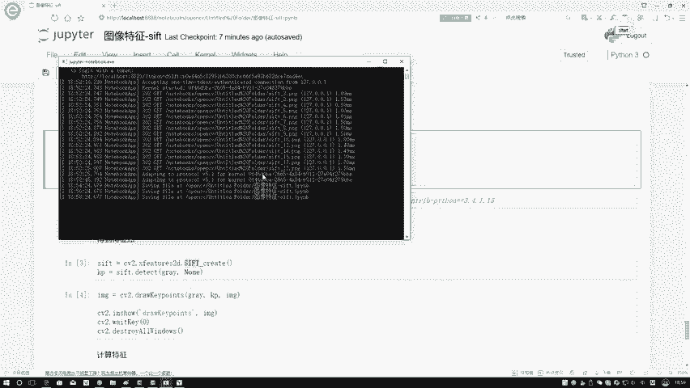
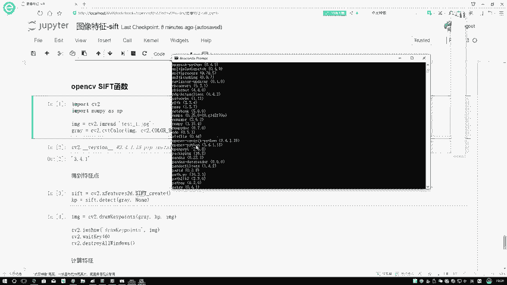
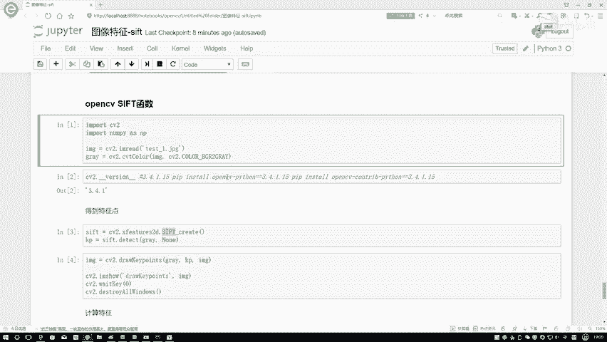
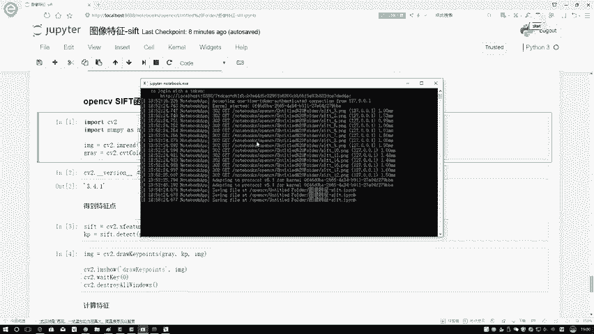
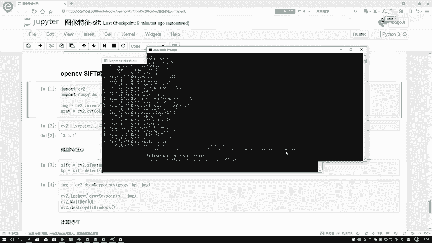
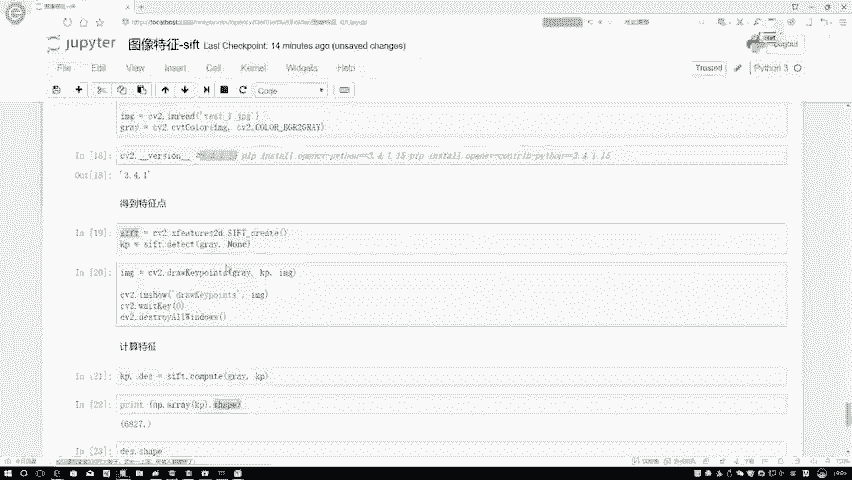

# 比刷剧还爽！【OpenCV+YOLO】终于有人能把OpenCV图像处理+YOLO目标检测讲的这么通俗易懂了!J建议收藏！（人工智能、深度学习、机器学习算法） - P51：6-opencv中sift函数使用 - 迪哥的AI世界 - BV1hrUNYcENc

接下来啊咱们再来看一下在这个open CV当中啊，我们该怎么样用这个sf t算法，以及呢把我们的关键点检测出来，并且构建成一个特征向量呃，首先先说第一个事，就是当大家去用工具包啊。

做这个呃SFT函数的时候，可能会遇到一些问题页面啊，就是我刚才查了一下这个SD算法，它在这个open CV当中啊，从他的一个3。4。3版本以上开始啊，就进入了一个专利保护的阶段，所谓一个专利保护啊。

就是说这个东西啊你想用免费的已经用不了了，在我们CV当中，应该是把这个函数啊做了一些处理，反正就是对于我们来说啊，就用不了了，所以说大家在做的时候，我们需要把这个open CV版本稍微的往下降一降。

因为啊就是你从现在开始，无论你是用pip store去安装的，还是你用源码去c make编译安装的，反正你的版本，我估计都会比这个3。4。3还要高的，那这个就是呃一些函数就用不了了。

因为它已经申请专利了，所以说我们需要怎么办，把这个东西啊你得降一下版本。

降版本是这样，先跟大家说一下我们该怎么样进行操作，如果说以前啊你那个版本挺高的。

在这里这样我先进入到这个ANACCOUNT当中。

然后呢你进入到，因为我这里边他这个Python环境比较多，然后我得先去找一下，进入到我特定的一个Python环境当中啊，然后要不然我这个PIPI配错了，然后嗯到时候大家用的时候应该比较简单。

如果说你只有一个Python的话，你直接在全局pip就行了，但是我我但是我这里啊，我已进入到这个scripts文件夹当中，就相当于啊是用我的这个python3。6，去做这样的一个安装。

我这里啊结构比较多，我有3。5，3。6，3。7，甚至我还有2。7，这些啊都是不同项目去做的，所以说我这里做起来麻烦点，到时候大家也进入到你选择好的Python，然后scripts当中就可以了。

然后或者就是你有一个Python，你全局打这个pip就行，第一步你打一下这个pip list在这里啊，我们是有两两个东西给大家看一下，就open CV哦，找一下O开头的OPQ应该是P前面啊。

在这里这一块大家来看这两个，第一个是什么，第一个是open CV啊，open这个open CV啊，Control python，第二个呢就是open CV，Python大家默认安装的。

它就是只有我下面这个东西，相当于这样，我画一个蓝色吧，相当于啊在这里你默认安装只有这个东西，但是呢这个东西里边我现在蓝色框起来的，它是没有啊，这些就是图像特征的一些函数的。

比如说咱sf t这个东西它就没有，你需要自己再把上面这个东西给它装一下。

装法在这里我已经给大家写上了，就是首先第一步。

如果说以前你装了一些高版本的需要怎么办，你装了一些高版本的时候啊。

需要这样，你先得把这些高版本的全给他删掉，就是一个pip，然后在这里pip，然后an然后install一下，然后比如说你的一个open CV什么东西，哎我看一下，在这里就应该是一个看一下。

把他的名字直接复制过来就行了，这个这个东西就是后面不带版本号，你把这个东西复制过来，在这里相当于把这个删掉，并且呢不带control这个东西你也得给它删掉，就是一个open CV Python。

这样东西我们都需要给它删除掉，然后呢你再重新装一下，重新装一下，这样也给大家写好命令了，就是一个pip store，先装open CV Python，再装open CV control Python。

把这俩都需要配一下，然后呢这个CTRL相当于这个意思啊，它提供了一些额外的扩展包，比如说咱这个Z的函数啊，它就是包含在了这个扩展包当中，我们需要把这个东西啊也装一下，这个装起来简单多了。

直接pip3就行，装完之后啊，你什么都不用配置正常import cv2就可以了，然后呢之前我看了我查了一些资料啊，就是说这个以前有说装拍，4。3。4。2版本的，还有3。4。1版本的，我试了几个版本啊。

基本上是这个版本，3。4。1。15这个版本啊，我们的SLD算法是没有什么问题的，点二以及点三以上的可能啊，他就是已经进入到一个专利保护状态了，咱们就用不了了，所以说在这里尽量咱们把这个版本降一下啊。

降成当前3。4。1啊这样一个版本，然后呢说完之后咱怎么用给大家，然然后咱们再来看一下，我们怎么样用open c把这个关键点做出来，首先第一步我先要在这个特殊提取当中啊，把这个sf t算法给它实例化出来。

第一步进行一个实例化，很简单，这样代码到时候大家直接复制过去就行了，当我们用一些其他方法的时候，也是类似的，先进行一个实例化，然后呢第一第二步我去detect一下，detect一下。

里边需要你传进来一张图像，通常我们都是传建一个灰度图啊，在这里我先这样，我先不用test1呃，我先写这个丽娜吧，先把这个LINA这个图像传进来，然后转换成一个灰度图，这是第一步。

这一步我这个CV two，这是杠上杠，这注意点，这是两个杠，不是一个杠，你看这是一个，这是另一个杠杠，它的一个版本杠杠，这样呢会显示出来你当前的版本，我现在用的是这个3。4。15。

如果说大家你们安装过程当中遇到一些问题，把你的版本降下来，降成跟我一样的，就没什么就应该可以了，让这一块我们去detect一下，detect过程当中啊，把你的灰度图给他传进去，咱就可以得到的结果。

我来执行一下，执行完之后啊，他会得到KP，KP是什么意思啊，key points就是一个关键点，而默认情况下咱们可以看一下，默认情况下这个KP它是什么，它是就是封装好的一个类型。

我们是没办法直接进行显示的，在这里咱们就不自己啊去画了，因为它是open CV啊，封装好的，我们可以用这个直接open CV，当中有个函数叫做一个joo components。

可以把这个关键点直接写出来，注意点，这里我们是用人家给我们提供好这样一个接口，叫做一个JOKEPL子去画质啊，去绘制这个关键点，而不是自己在拿这个点的坐标去做，因为自己去做比较麻烦。

这样你传进来几个参数，第一个我的一个图以及我的一个key points，就完事了，再来看一下显示出来它的一个结果吧，在这里相当于就是嗯在LINA这张图像当中啊，我把这些关键点全绘制出来了吧。

大家可以看一下，这里边就是我关键点绘制完啊，它的一个结果，这些圈起来的就是我的一个关键点，可能这张图看有点小，是不是咱换一个图，我换一个图，换个稍微大一点的，我换这个test杠一那个房子那个行。

这个图看起来大一点，这就是啊我现在做出来关键点的一个结果，这张图表关键点做完之后啊，可能大家第一个感觉哇这个关键点有点多，是不是，那你现在现在我们关键点已经会会绘制了，但是通常情况下，我们的一个关注点。

并不是说在于你的关键点在哪儿啊，我需要把这个关键点，我可能还要去做一些额外处理操作吧，给它转换成一个向量吧，就像我们在原理过程当中说的，我们得到关键点之后，可以把它特征计算出来，特征计算是这样。

首先拿你实例化出来的对象去computer一下，传进来啊，当前你要计算的一个图，以及呢你的一个关键点哎，注意点在这里你需要传进来，你的关键点是什么，这就完事了，在这一块一个关键点，一个图。

他会帮我做计算，计算完之后呢，它会返回两个结果，第一个有key points，就是还是关键点，咱可以这样你可以打印一下它的一个shift值，但是注意点你直接打印的时候不行，它是个绿色的结构。

你需要给它转换成一个南派点，array下N列read格式，shift值一共有八千六六千八百二十七个关键点，然后呢最后返回第二参数，就是每一个关键点它相应的一个特征嘛，我可以先给大家看一下它的维度。

6827，逗号128，是不是表示着，对于我当前每个关键点都转换成了，128维的一个向量啊，那这里是不是说现在所有特征向量也拿到手了，一共拿到6827个，每一个都是这样一个长度，像大家说的。

默认长度就是一个128维的啊，这样一个向量，然后呢你感兴趣你还可以打印，你还可以把这个向量展开看一下，在这里传进一个INTEX值，你就能得到它具体向量的一个结果了，那这个就跟大家说了一下呃。

我们怎么该怎么样用open CV当中的啊，SMD函数去帮我们检测到它的关键点，以及呢得到我们关键点的一个，具体特征的表示啊。

