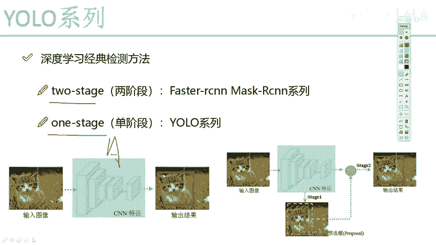
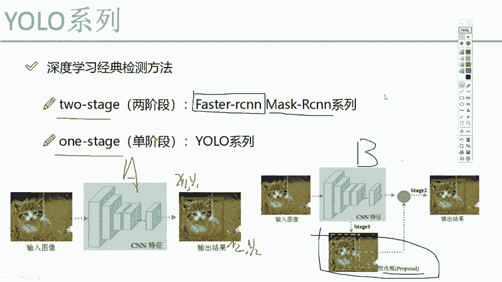

# 比刷剧还爽！【OpenCV+YOLO】终于有人能把OpenCV图像处理+YOLO目标检测讲的这么通俗易懂了!J建议收藏！（人工智能、深度学习、机器学习算法） - P52：1-检测任务中阶段的意义 - 迪哥的AI世界 - BV1hrUNYcENc

从这个开始啊，要给大家讲一下在优鲁系列当中啊，他的一些经典的做法，以及呢在代码当中啊，我们每一个细节该怎么样进行实现，我会给大家先讲yo的第一代版本，也就是V1，然后呢再讲V2和V3，大家可能会问啊。

现在优菈已经有第三代版本了，我们为什么不直接讲这个yo v3啊，因为很多个细节，很多的基础都是由V1开始一步步去做的，相当于啊V2诶是在V的基础上做了一点改进，V3呢又在一些细节上做了一些升级。

其实只要大家能够理解第一代版本，你再看它的升级版和改进版，其实我觉着整体难度就不大了，所以说啊会给大家，咱们尽可能覆盖到每一个细节，先从啊他的yo b1开始讲，然后呢我会逐给大家去说啊。

后续我们做了哪些个改变，哪些个升级，然后呢先看这个吧，先给大家说一下在深入学习当中啊。

一些经典的做法啊，这里我提到了两点，一个什么two stage，一个呢one stage什么意思啊，我们要做一个检测任务啊，有些算法是分两个阶段的，有些算法是分一个阶段的，我先给大家解释一下。

什么叫两阶段和一个一阶段，我们先来看一下，就是左边这个图，哎我说这个A图吧，A图是这样一件事，我说啊，现在啊我要做一个物体检测或者是目标检测，那现在呢我输入一张图像，好比说一张图像就一个猫。

然后最后啊他给我输出了一个框啊，就是猫的一个坐标，但其实大家想一想，我说我做一个检测，我需要得到什么结果啊，在这里我往简单了说，我说我们得到四个值就行了，哪四个值啊。

我现在不是要画一个框吗，我只需要知道框的X1Y1。

然后呢还有这个X2Y2是就可以了。

相对来说我得到了四个预测结果吧，那给我们感觉这像个什么任务啊，那是不是就是一个很普通很普通的回归任务啊，所以说啊在yo系列当中，哎我们提到一个东西叫one stage，One stage，什么意思啊。

当我们想做一件事好了，一个CN网络直接做一个回归就完事儿了，中间啊我不需要加入额外的一些，就是额外的一些映衬吧，或者额外的一些补充，所有的额外东西，我通通不需要一个CN网络，直接把这件事给我做出来。

行不行，肯定是可以的，这个也是优秀系列当中啊，它最核心的一个出发点，我就要做一个事，那非常简单思，想一个CN网络取T特征做回归就好了，哎看起来我们由输入到输出，结果就是一个CN网络下去就完事了吧。

还有这个东西啊，叫做一个BSTAGE，然后呢我大家说一下，在我们的一些简单算法当中啊，还有一种方法叫tooth stage，它什么意思呢，除了这个yo算法啊，我估计大家可能还听过一些其他算法。

像是之前啊15年底非常有名的算法，叫什么faster r cn。

我估计大家可能都听过，是不是物体检测开山之作，物体检测怎么样怎么样的。

唉被赋予了非常众多奖项的一篇论文。

那这个faster r c音，或者说啊它的一些后续升级版本，master rs音之类的，它是怎么去做呢，咱们来看下右边这个B图啊，这个我只需要大家简单了解就行，之前没看过8SRC。

没看过master rc，没关系啊，对于这个图咱们简单了解一下。

我说现在啊我还是输入这张猫图像可以吧，那最终结果呢我也没变。

最终结果，反正我就要检测一下他对猫的一个位置吧，但是呢在检测的过程当中。

我说我多加了一个东西，多加这个东西啊，在论文当中啊，它叫做一个RPN啊，就是一个区域建议网络，什么意思呢，好比说啊现在我为了得到我最终的一个结果，那你看我中间这一块儿先蓝色框起来的，它多了什么。

多了一个预选框，诶你看这里有一个呃绿色的虚线，还有个黄色曲线，什么意思啊，好像说啊最终的结果哎呦，是由一些候选人所得到的，那给我们的感觉呢，就是现在啊你还是要做一个检测任务，得到一些坐标值。

但是呢在我们做的过程当中，他多做了一步，多做了一步，什么意思啊，好像我们感觉啊如果说是一个单阶段的，那就好比说现在啊，你要哎在你的一些就在你的人当中吧，你的手下当中，你说选一些人哎去参加一个比赛。

然后呢一个one stage方法就是这样的，你选这些人啊，就随便选了1000个，拿出来让他去做了一次比赛，可以吧，然后呢B他是这样的B啊，他说他也要选1000个人去参加这个比赛。

但是呢他对这1000人多做了一件事，他说这1000人啊，你可不是随便给我选的，我要先经过一步什么，先经过一步预选，或者先进一步先经过一步初选，我把这1000人诶在我整个的13亿人口当中吧。

选一选哪些人有什么特长，把一些好的我先拿出来，把一些经过初试的拿出来再去做预测结果，那给我们的感觉好像这样的，对于一个A网络，也就是一个onstage来说啊，就直接的该怎么做就怎么做就完事了。

然后呢B网络TOC知道我做这件事分为两步，第一步先来个预选，预选完之后再通过预选结果得到最终的结果，那给我们感觉什么样数，B做这件事稍微的麻烦一些啊，但是他虽然麻烦了，他有什么好处，有什么收益吗。

可以说B这个网络在效果上，你听我刚才说的，我现在预选出来一些，那最终结果是不是相对我直接选的，可能会好一点啊，好了这里啊给大家说了一下，在深入学习当中啊，两种经典的东西，一个叫two stage的。

一个叫WESTAGE的。

大家如果说啊对这个faster rc，还有master rc哎，不太熟悉，没关系啊，你就当做是我们两阶段的。

是多了一步预选的操作啊，只是这样而已。

然后呢我们今天要讲的YOO这个系列，它是没有那个预选的东西，直接一个网络拿出来直接做就得了。

我为什么要给大家讲这个two stage。

还有one stage啊，其实我们这个系列当中啊，不会去讲master rc的东西，主要是让大家知道我们yo这一系列算法来说，有什么样的一个优点。

以及有什么样的缺点，学完一个论文之后啊，我们得知道实际应用场景来了。

我是选master r cn啊，还是选yo啊。

