# 比刷剧还爽！【OpenCV+YOLO】终于有人能把OpenCV图像处理+YOLO目标检测讲的这么通俗易懂了!J建议收藏！（人工智能、深度学习、机器学习算法） - P54：3-IOU指标计算 - 迪哥的AI世界 - BV1hrUNYcENc

好了像我刚才说的，刚接下来我们给大家介绍一个指标叫MVP，因为一会儿啊我们会讲yellow的第一代，第二代，第三代，在讲每一代的时候，我也会给大家对比啊，这么做改进了，改进的目的是什么，只有两点。

一点是让我们的速度更快，另外一点呢让MVP值更高吧，所以说啊，一会儿我会给大家经常拿出来一些分析的表格，哎里边会有些MVP值，我得让大家先知道MVP值它是什么，以及呢它对结果啊是怎么去做的，好了。

我给大家先通俗概述一下啊。

MVP它表示这样一件事综合的啊，注意点，我这里提到了什么综合的去衡量什么。

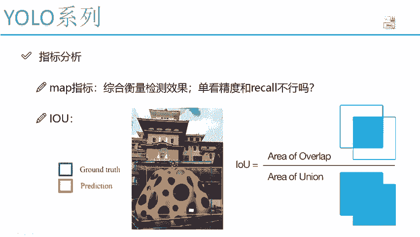

我们的检测效果了，像我刚才说的，对于检测效果来说，哎你可以说它这个精度，你可以说它的一个召回率啊，精度就是你这个检测到的一个东西，跟实际的一个框到底是吻不吻合。

那召回率呢哎有没有一些框里没检测到。

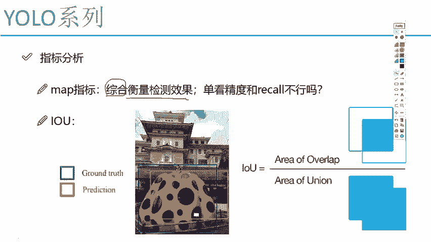

那像我这个问题来说，精度和召回率，我单独的看其中某一个指标不行吗，哎如果大家熟悉机器学习，肯定是要一点精度和recall啊。

在很多问题上它要怎么样的，是不是说一个高了。

另一个就低啊，他俩是一个矛盾的吧，所以说啊我光看这两个值，我很难综合去说当前这个结果到底好还是不好，因为这个高那就低那个低啊。

这就高是不是这样一件事啊，所以说啊这里唉咱们在检测任务当中啊。

通常我们都用MVP值来进行表示，一会儿我会给大家去说MVP我们该怎样进行计算，说这MVP值之前啊，我先给大家提另一个非常重要的概念。

叫IOU哎，这也是我们之后要用到的嘶。

什么叫IOU呢，IOU啊，它就是几个单词的缩写啊。

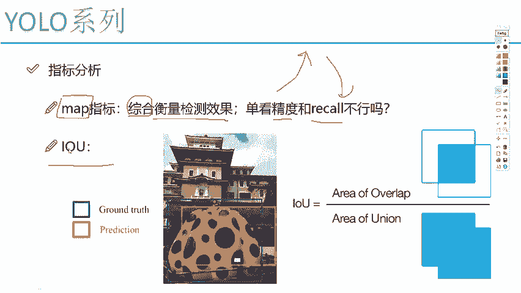

Intersection of union，什么意思啊，我的一个交集和并集的一个比值。

咱们来看一下我右边这个图非常简单啊，你看他是怎么去做的。

首先我的分子是什么解分子，你看上面这个图它是什么集啊。

是不是一个交集啊，什么和什么的交集，这里大家可以把它当做是我的一个。

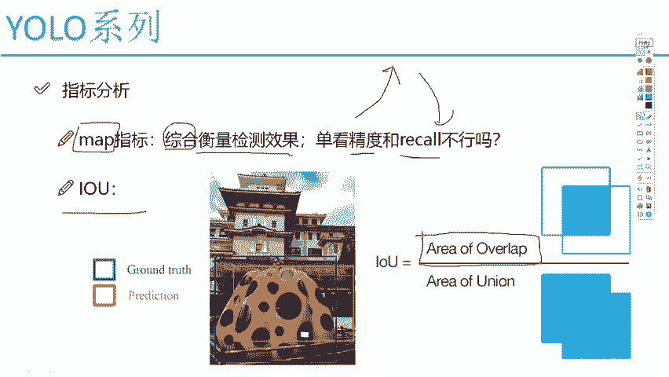

真实值和预测值之间的一个故事，什么叫真实值呢。

你看这块儿我画了一个蓝色的框，这里你别管他是什么了啊。

就是一个就是大大妖怪吧，把妖怪框起来了，这个蓝色框我们叫ground truth啊。

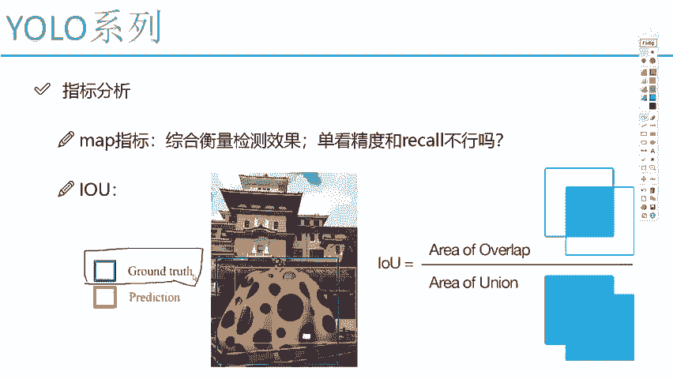

叫做一个实际的真实值或者是实际的标签值，也就是说啊你拿出去之后，哎我们这些标注数据当中给出来的，实际它物体所在的一个位置啊。

蓝色的叫真实值，然后呢这个黄色的我说啊。

这是我的一个预测值是吧，那大家想一想，哎你说当我们预测的时候。

我们希望是什么，我拿这个哎我这还没棕色的。

我就拿这个拿什么，拿这个黑色吧来比喻吧，你说啊，我是不是希望我这个预测值能尽可能的。

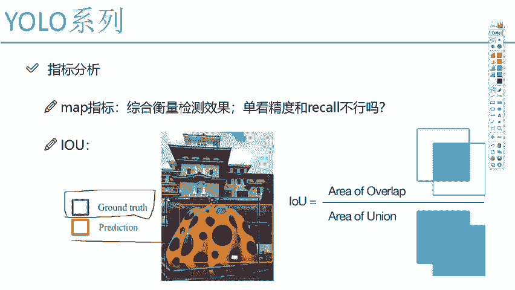

跟我这个蓝色的真实值要越接近越好啊。

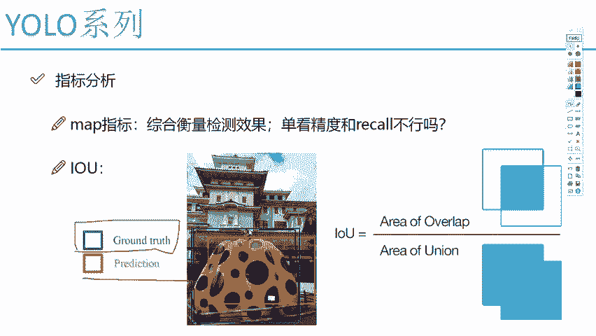

他俩完全一模一样才好呢，我是不是要说要做这样一件事啊，那精度是指的是什么，大家来想一想，其实精度无非就是说你的预测值，和你的一个真实值，哎，他们间的一个它们之间是不是吻合的啊，他们之间是不是希望。

我希望他们应该是越重叠越好的。

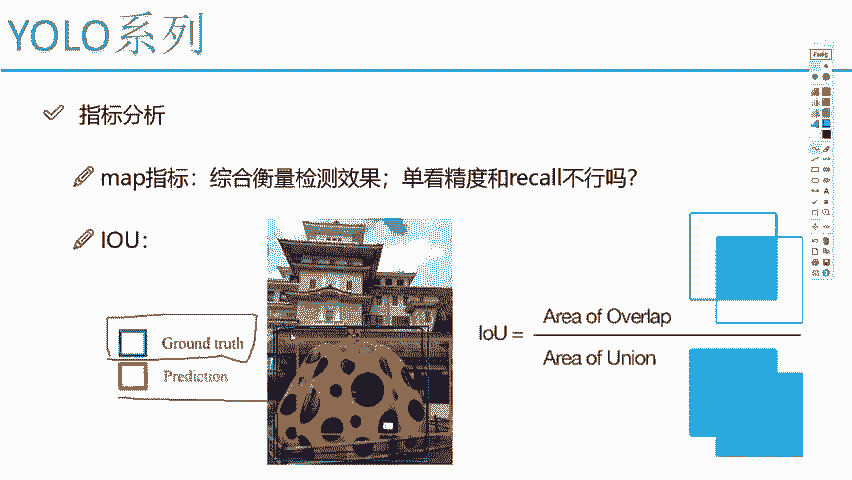

最好一样才好呢，是不是这样一件事啊，那record呢。

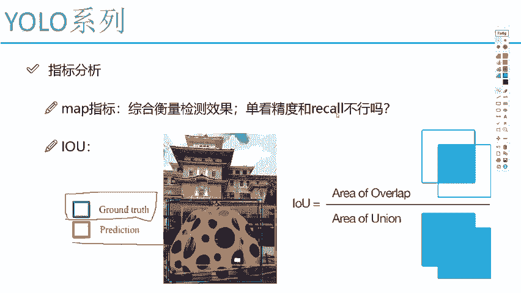

record意思比如说我原始图像当中啊，我还有一些标注的数据。

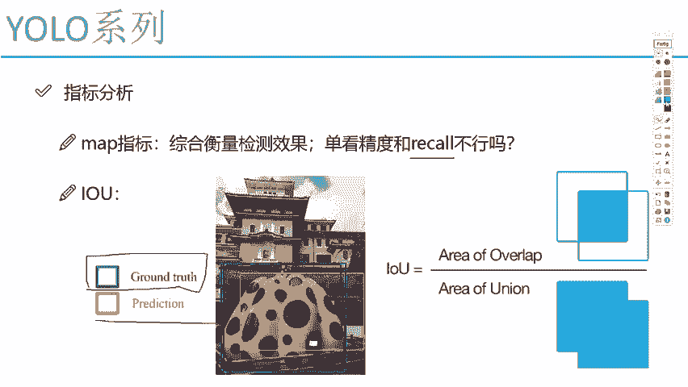

我说这块儿啊，我还标记了一个有个阁楼吧，但是呢我的一个预测值当中。

我没有检测到这个阁楼，是不是record值就会比较低啊。

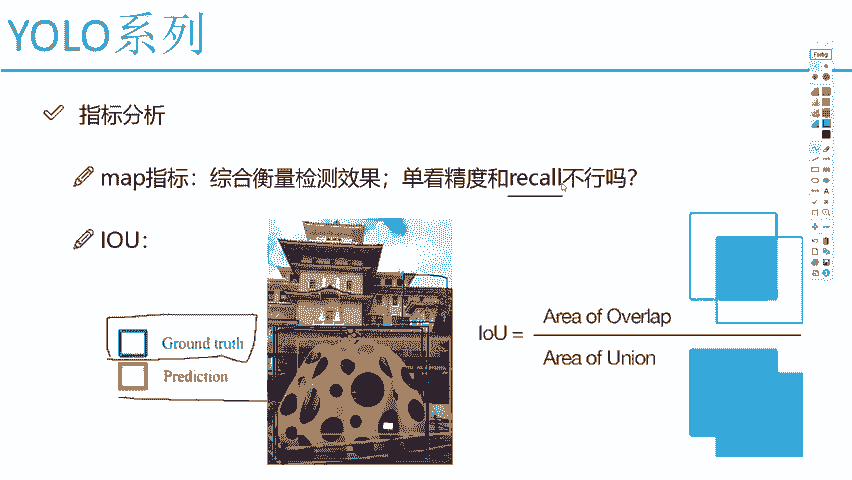

所以说record表示这样一件事啊，你原始图像当中啊，有很多个标注的物体，是不是都检测到了精度呢，表示着啊对于每一个咱们需要检测的东西，你检测的好不好呢，那大家来想一想。

他俩一定程度上可能是一个矛盾的吧，一会我给大家看例子啊。

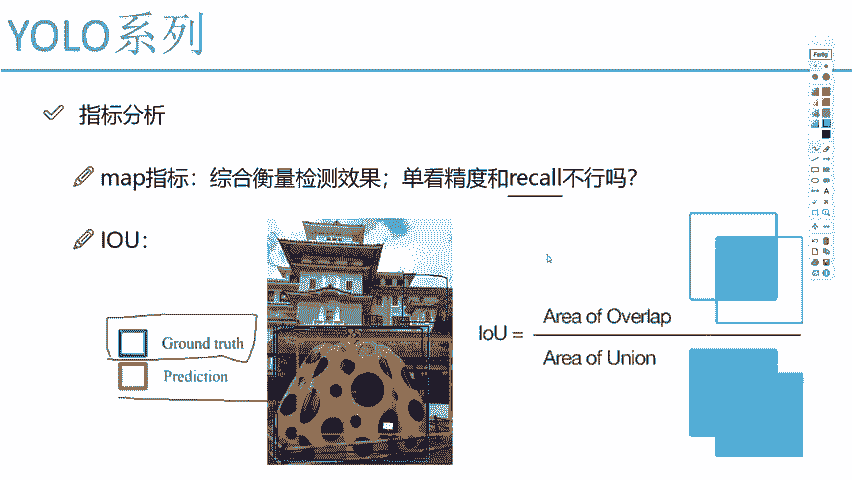

他俩到底怎么矛盾的，然后呢这里啊这个IOUIOU说的什么。

你看啊我们的分子分子是什么，我们的一个交集吧。

好了，我可以说啊，他是我的一个真实值啊，和我的一个预测值之间有一些重合的地方吧。

抽和六在哪呢，我拿红色就画了，哎是不是这里我们有一些重合的地方啊。

画出来了是吧，这叫什么，这个叫做我的一个交集。

然后呢下面下面什么是不是我的一个并集啊，并集什么意思啊。

那这个图画的很明显了，就是把它俩都圈上呗，把并集拿到手就行了吧。

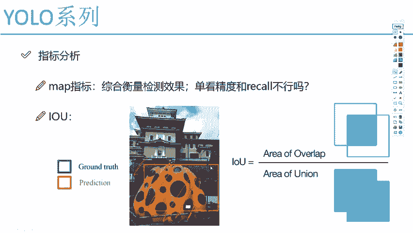

好了，那这里我们说了一个概念，叫做一个IOU，那大家来想一想，哎你说这个IOU啊，我们通常情况下哎你说是高点好呢，还是一个低点好，这个问题IOUUIOU越高，是不是说咱越重合呀。

越重合说明你事做的越好吧，那IOU越低呢，是不是做的越不咋地啊，哎这里我们先提了一个点，叫做一个IOU，后续啊我们会用上的，其实很简单。

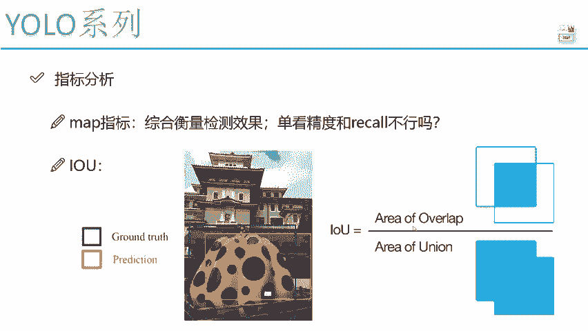