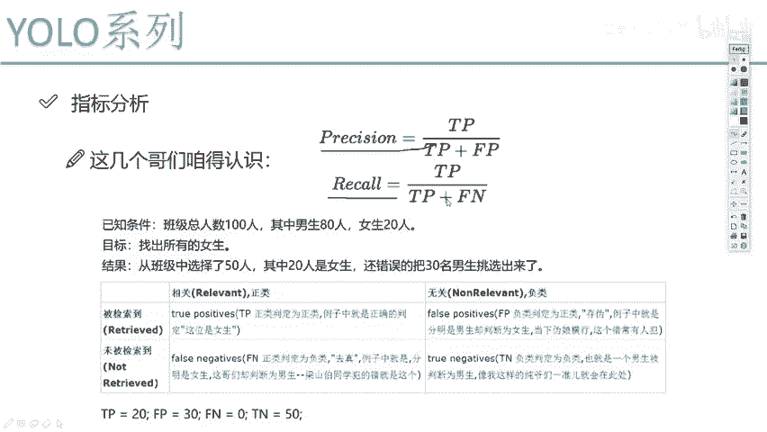
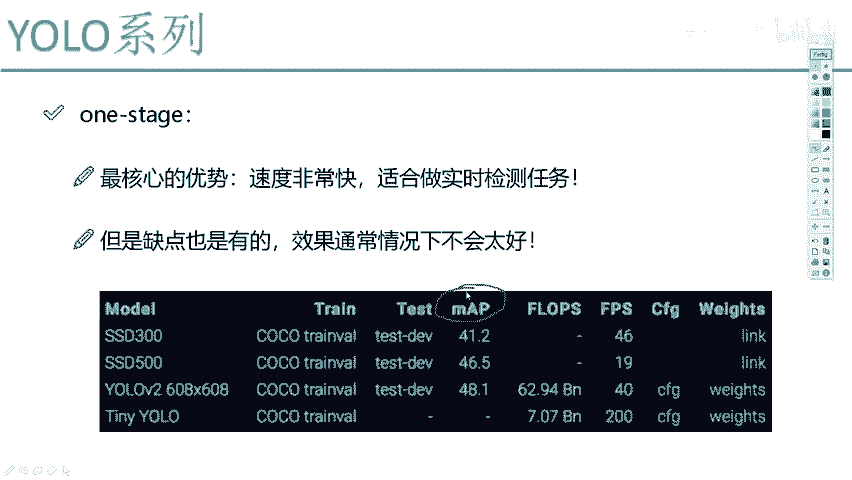
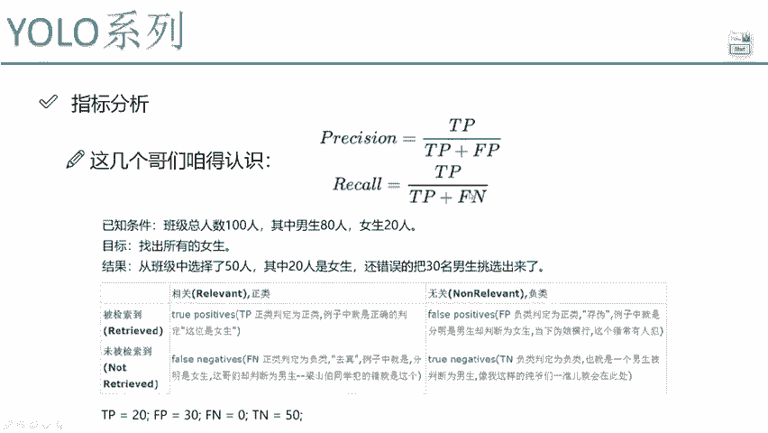

# 比刷剧还爽！【OpenCV+YOLO】终于有人能把OpenCV图像处理+YOLO目标检测讲的这么通俗易懂了!J建议收藏！（人工智能、深度学习、机器学习算法） - P55：4-评估所需参数计算 - 迪哥的AI世界 - BV1hrUNYcENc

嘶然后呢，接下来我要给大家说这两个指标了，这个非常关键，在物理检测当中，像我刚才说的，我们第一个值叫什么，叫做一个精度吧，第二值呢叫做一个record，叫做一个召回率，为什么要给大家说这两个指标啊。

因为一会儿我们要提的是什么呀，就是你在论文当中，或者说你在实际任务当中，以及你跟别人去吹的时候，跟别人唠嗑的时候。

大家都会提到的一个词叫mp值，是不是好，我们来说一下MVP值是怎么算的，算的过程当中啊，需要我们先算出来两个指标，一个就是精度，一个就是召回率，如果现在我把它两个公式给大家放往这一放，我说公式当中啊。

这个啊一个精度就是true ptive，比上true ptive加上false positive哦，Record true partive，比上true ptive加上false negative。

我这么跟大家说完之后啊，大家可能有点发懵，因为这几个词咋这么扎眼呢，咋看着这么烦呢，是不是好了，我需要给大家先来介绍一下，这几个指标分别是什么意思，像是TPFPFN啊，要大家知道一下这几个值啊。

它是什么意思，以及呢在我们检测任务当中，它都描述着哪个指标，因为后续啊大家肯定会看一些论文，在论文当中啊，会经常出现这些个词啊，各种各样表格当中，全部都是这些统计的结果好了，我先给大家举个例子。

通过这个小例子啊，我们来认识一下TP好，还有FP这些东西都是什么，我先给大家说一下，咱当我们在理解的时候，应该怎么样去理解TP，还有FP这个值，比如说我们现在有这样一个例子，我说呀现在我们有个班级。

班级当中呢一共有100人啊，其中男生有80个，女生有20个，这是咱班级啊，男生和女生的比例，男生80个，女生20个，然后呢我说啊你做了一次预测吧，或者说你建了个模型啊，预测我就要找到所有的女生。

然后呢我测试了50个数据，就好比说从班级当中打出50个人，这50个数据当中啊，其中有20个是女生，那是不是说剩下还有30个男生啊，但是你的目的是什么，你的目的是说找出来所有的女生。

那说这30个男生是不是错误的被选出来了，这20个女生她是正确的，被选出来了吧，好了就这么个事，基于这个事啊，咱们来说一说吧，TP是什么，之前我一问大家TP是什么，很多同学告诉我TP是回程啊。

也不知道这东西怎么能转向回程，那咱们来看一看啊，TP我希望大家理解的时候是把它分开理解，把它换成什么，T代表的是一个true，P呢是一个party，true的意思代表什么，我给你写全一点。

true的意思是什么，是不是说一件事你做对了，做得好，我说叫做一个true啊，做的不好叫做一个false吧，那好了，对于咱们这事来说，我说现在啊从这个班级当中选了50个人，20个是女生，那我问大家。

这20个人你做的好不好，哎你目的是找的女生，然后你目的是找所有女生，然后你找出来20个女生，这是不是做对了的哎，这是不是好的呀，但是呢你还错误的把30个男生挑出来了，这30个男生是我不希望的。

也就是一个不好的吧，那此时true party代表什么，true代表你做对的，在做对的情况下把他判断成了什么，positive判断成一个正例，这里呢比如说我是女生，就是个正理，我的目标就是找到女生。

那女生是个正立，男生是个负力，可以吧，那好了，TP的意思再听我说一遍，TP这个东西非常关键好，首先TP我们要分开理解，True positive，true是代表你做对了。

并且正确的把它判断成了一个PTIVE，既然是正确的，把他判断成一个positive，那也就说明它本来就是一个positive，并且你把它预测成了一个positive，这没问题吧，那放到我们任务当中呢。

是不是说本来她是一个女生，你正确的把她判断成了一个女生啊，好那你说这个值等于多少，一共卷了50个人，其中有20个是女生，20个本来就是女生，我也把他判断成了女生，没问题吧，所以说第一步我们算出来了。

TP等于20，这没问题吧，好我们算下一个下一个FPLP，我们来想一想好，按照我刚才给大家说法，怎么去办这件事的，先看f false positive，首先是做错了。

做错的情况下把他判断成了一个positive，那也就是说它本身是一个正立吗，本身不是一个正例啊，它本身应该是个负力，我错误的把它判断成了一个正例哎，Fpo false party，是不是这样一件事。

首先做错了，做错的情况下把他判断成了一个正立，那也就是说它本来是一个负利，然后呢我给他错误的判断成一个正列好了，回到我们任务当中，本来复利是吧，本来他是个男生，我错误的把他判断成了是个女生，等于多少啊。

看这里师傅说班里边一共100人，我说选了50个，20个是女生，还错误的把30个男生拿出来了，那这个FP等于多少啊，是不是就等于30啊，好了，这是FP，接下来呢还有FN来，我们来看一看方法一样的吧。

False negative，错误的把他判断成什么负利了，那错误的把他判断成负利了，也就是说它本身是什么，它本身得是个正立啊，结果呢判断成一个复利，那也就是说把女生当作男生拿出来了。

你看这个问题当中一共有20个女生，我把哪个女生当作男生拿出来了吗，我目标找的所有女生，20个女生是不是都拿出来了，那剩人了吗，一个都没剩吧，所以FN等于多少等于零吧。

好这是一个false negative，最后一个最后一个什么一个true negative，好，tn t什么意思啊，首先做对了还是做错了，做对了吧，正确的判断成了一个native。

那也就是说本身是一个复利，并且我预测成也是一个复利吧，本身是男生把他当做男声判断出来了，是不是这样一件事啊，看我们任务当中，我说找出来所有的女生好，我选了50个人，其中20个是男生，30是女生。

那言外之意，剩下的50个我是不是都要当做是一个男生了，哎剩下50个也正好怎么样，也正好都是男生吧，因为男生一共80人，错误的有30个，那正确的只有50个吧，男生还是复利啊，所以说tn等于多少50吧。

这没问题吧，好了这里要给大家看了一下，就是在我们几个指标当中，我们的TP还有个FN，还有FP这些个值啊，都是什么意思，我不建议大家就是把这些指标值你都背下来，因为背下来我觉得不太现实，总混这几个词。

当大家以后看到这几个词的时候啊，你就先想T和F代表什么，是做对了还是做错了，P呢就是一个正力，N呢就是一个负力，哎这个我希望大家咱能这么去理解，然后接下来呢我们来观察一下，就是我们现在要说的两个指标。

一个是什么，一个是一个精度，精度等于什么，好了，首先我们的分子式TP有没有问题，TP啊，在我们检测任务当中好比说什么，哎呦它本来是什么，本来这块有个真实的框，然后呢你也检测到了哎。

TP true ptive本身哎它就是要被检测的东西，并且你也检测到了，这是TP吧，所以说我说TP啊，就是我们检测到的东西来检测对的东西，这没问题吧，把它放到分子肯定没问题吧，那对于精度来说。

分母是什么，那应该是TP加什么，加上一个FPFP是什么意思啊，False positive，首先第一点你怎么样，你做错了，并且错误地把他判断成了什么，判断成了一个正例吧，这就是一个精度分子呢。

哎就是正确的检测到的分母呢，就是你正确检测到的，加上你错误的检测到的一些结果，这我说叫精度没问题吧，一个TP比上TP加FP哎这个很简单，然后呢我们再看看召回率，这召回率啊，它有学名叫什么查全率。

咱想一想它为什么叫查全率啊，我们来说一说，首先这个TP当分子，这也不用说了，那分母是什么，既然是查全率，那这个TP是你检测到的也是对的，那既然是查全，那你的任务可能没把所有的东西都找到吧。

肯定还有遗漏的吧，遗漏怎么表示，False negative，什么叫false native，在做错的前提下把它判断成了一个复利，那这个FN啊，他的言外之意是什么，就是说本身诶我要去检测这个东西。

但是呢我没有检测到，因为我把它当做一个复利了，复利你可以把它说当做是一个背景啊，当做成一个背景的，意思就是说我认为它不是物体，但是呢标注当中它可能是个物体，这说明什么，它就是我没有检测到的吧，好了。

这个就是一个record，也叫做一个查全率啊，那么现在给大家哎说两点，一个叫精度，一个叫record，那这两个能构成咱们的一个评估标准吗，可以说都可以，但是让我们来想一想，无论是精度还是召回率。

都是从某一个角度去形容你做得怎么样的吧，好了。

接下来我们来看一看。