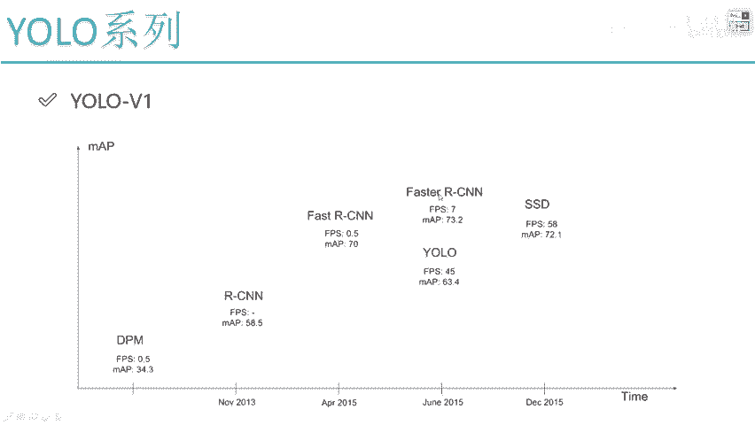
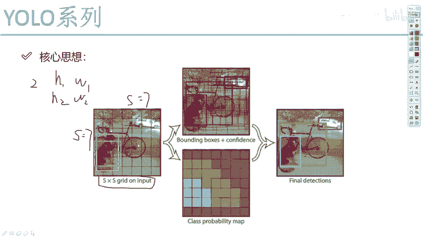

# 比刷剧还爽！【OpenCV+YOLO】终于有人能把OpenCV图像处理+YOLO目标检测讲的这么通俗易懂了!J建议收藏！（人工智能、深度学习、机器学习算法） - P57：YOLO算法整体思路解读 - 迪哥的AI世界 - BV1hrUNYcENc

这节课呀咱们要从细节的角度来说一说啊，yo当中的第一代版本，也就是YOOV1UV一样，可以说是一个经典的one stage方法，做一件事啊，我们直接一步咱就能做完，来看下它的名字吧，叫什么。

有only look once as，你要做一件事啊，你看一遍就完事了，说明啊我们把这个检测问题变得非常简单，一个网络架构直接会出一个结果，它是把最终结果直接的转换成了一个回归问题，所以回归问题啊。

就是说哎你最后啊要预测几个值，那比如说经典检测问题当中，我们是不是说需要一个起始的位置，再需要一个长一个宽，就能把一个框我给它画出来了，这个就是优菈他爹版本当中要做的一件事，直接呢在网络当中。

哎我说我进行一个特征提取，然后呢把提取特征图，我说呀转换成最终要求解的一个结果，就是XYWH就完事了，一个CN网络啊，咱就给搞定了，可以说啊UOV1啊，它主要的任务是干什么的。

就是对视频做一个实时的检测，应用角度来说啊，可以说是非常的广阔吧，因为在16年的时候，优鲁唯一它是16年的一个产品，16年的时候大家已经等他呀，等的迫不及待了，因为15年底的时候。

fast r s d n诶，那一系列是不是出来了，但是呢当大家在玩fast r cn的时候，都觉得一件事，哎呦这个算法非常牛，非常好诶，能利用的地方挺多的，但是就有一点它不太爽，就是速度太慢了吧。

之前啊可以说这个fast r cn解决问题解决的不错，MVP值也非常高，但是呢我们可以来观察一下，在这个16年的时候，发SC啊和yo都出来了，大家做了一个比较，虽然说啊这个fast r cn啊。

它的MVP值比较高，是不是，但是呢这FPS也太低了吧，离实时检测可能差的还比较多吧，这里写的IPS等于七，但实际上因为可能还达不到这个效果，可以说它的速度是非常慢的，但是效果还不错。

所以说呢大家终于等到什么，终于等到一个在速度层面上能更高一点的，yo系列算法，虽然说啊在很多问题上，MVP值跟faster r cn比，那差了十个点，差的数还蛮多的呀，但是大家回头一想也有很多问题啊。

其实我要检测的东西都很简单，我检测一个人，检测一个物体，并不是说检测那么复杂的，也并不是说要把一张图像当中，所有东西我都要检测到啊，所以说啊yo系列一来之后，哎呀大家觉着这个东西实在太爽了。

LP值非常高吧，用起来也是比较方便的，所以说啊yo系列从16年开始，它就一下子火起来了，到后续啊V2V3版本。

我还为大家一个介绍它的细节啊，是怎么去做的，这个是我们今天要讲的一个YOLOV1的系列，然后呢在这个V1当中啊，我要给大家说一下他的一个核心思想了，这个非常非常关键啊，也是挺直接的。

他的一个想法就是作者啊，他说想这样一件事，那我现在要去预测一下诶，一张图像当中啊有哪些个物体，那咱们来观察一下吧，比如说啊在我们左边这张图当中，哎我们可以看到他有个狗，还有个自行车，是不是。

那我说我现在要预测个狗，预测一个自行车，那交给谁来预测呢，比如说这样吧，我说我现在有一个输入啊，它是一个S乘S的，也就是说高度和宽度都是S哎，你就不用管S多多大啊，假设它是等于七的吧，假设等于七。

哎这只是举例子啊，我说现在有一个长宽等于七的一个格子啊，这是我们的一个输入，在这个格当中我观察一下，哎你说这个狗啊，它是不是落在图像当中的一个位置了，那你说我说这样吧。

我说现在每个格子你都不能给你们白吃饭，你得给我干活啊，那每个格子你都负责预测一下在你这个格子上，它是什么物体，那比如说现在我们来看一下我这个狗，这个狗啊落在图像当中一个区域当中了。

但是呢我现在只关心它的一个中心点落在哪里，比如这里我画了一个红色的框，有个红色中心点吧，好了，我说啊，现在红色中心点点到是不是其中的某一个格子，我说你这个格子啊，你就负责预测一下这个狗。

因为呢有一个物体啊落到你这上面了，并且你还是中心点啊，也就是说这样一件事，现在我用S乘S的格子，每个格子去负责预测一下，它所代表的物体是什么，或者说物体啊，如果说落到了以这个格子为中心点的话。

它这个格子需要把这个物体给预测出来啊，要做这样一件事嘶，那大家可能会想，那这件事我们该怎么去预测的呢，那可以观察一下，在我们当前这个格子当中啊，它有两个黄色的框，是不是我们可以这么想。

我说啊这个黄色的框啊，它不是我最终的结果，我说我先这样，我说现在啊这个红色格子诶，他要去做预测了，但是呢他也不知道啊，这个狗它到底长什么样子的，那我是不是得有一些经验的东西啊，什么叫经验的东西，哎。

比如说一个物体啊，可能会是比较长的，哎有这样的物理挺多的吧，一个长方形的，然后呢还有一些物体它是一个正方形的，这只是我举例子啊，比如说它的长和宽是多少的，一些经验值经常出现的，我说这样吧。

一开始的时候啊，我先在这个位置当中，哎呀我也不知道这个狗实际位置，我说先来个经验值吧，啊就是两种长宽的一个比例，第一个H1W1，第二个呢H2W2，可以吧，先列出来两种长宽比例。

虽然说跟实际的可能有些不符合，是不是，然后我来观察一下，观察什么呢，你看我现在我列出来两个黄色的，那针对于当前这个狗来说，你说啊这个我写个H1H2吧，H1是这个长方形的，H2，它是这个正方形的。

你说这个H1和H2给我们的感觉啊，哪一个可能更靠谱一点啊，是不是说第一种框啊，那好了，他说第一然既然啊第一种框诶，我觉得稍微靠谱一点，但是呢他还跟我实际的一个检测结果不太一样，我需要干什么。

我需要把我的一个候选框吧，相当于一开始哎我提出来两种经验值，但经验值毕竟它是不准的吧，但是可以供参考，是不是我说把我的一个经验值啊，这个长方形这个框能不能做一些修正呢，把这个框我说做个改变长和宽啊。

哎要不然你就是变长或者是变宽一点，或者是做各种各样的变换，可不可以啊，把我的一个框我要做一个微调，所谓的微调大家来想一想，这是不是一个回归任务啊，我要预测出来什么H我应该怎么变，W我应该怎么去变吧。

所以说啊归功就是归根到底，我们整体要做的就是什么，就是一个回归任务，通过回归任务，我要看一下H和这个W什么时候最合适吧，并且还有什么我的起始位置XY吧，只不过说啊在DI版本当中，哎我们说的起始位置啊。

