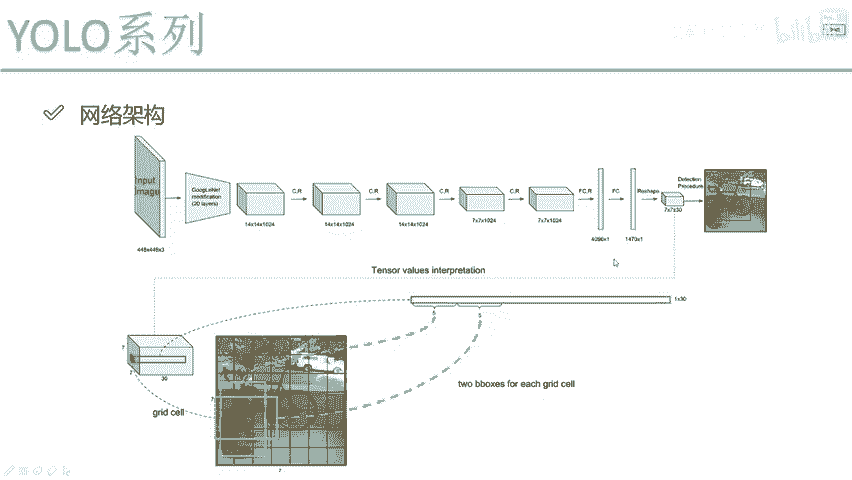

# 比刷剧还爽！【OpenCV+YOLO】终于有人能把OpenCV图像处理+YOLO目标检测讲的这么通俗易懂了!J建议收藏！（人工智能、深度学习、机器学习算法） - P58：2-检测算法要得到的结果 - 迪哥的AI世界 - BV1hrUNYcENc

那在这里啊，我先给大家咱们来做一个总结，我们现在有了一个输入数据，我说把这个输入数据啊分成很多个小格子，然后呢每个小格子诶，要给我产生出来两种候选框啊，注意点，这是V1版本当中啊，产生两种候选框。

那大家可能现在也有想法了，那实际当中有这么多种物体，你说你两种候选框够用吗，根本感觉不够用吧，但是V1当中啊，他的一个想法也是提出来指定个壁纸啊，论文当中B值的意思等于二。

就是说在这里哎我先提出来两种候选框，然后呢每个格子有两种候选框，那每个格子都要去看一下，我这两种候选框跟实际哎，一个真实的物体到底匹配的怎么样，比如说这点，你看真实的狗，我们在算的时候。

我是有真实值的吧，比如说我拿蓝色画一个真实值，这里我会有真实值吧，然后呢，我蓝色真实值和我两个候选框我都可以算什么，我是不是都能算这个IOU的值啊，咱们之前讲了IU吧。

intersection union啊，算它的一个重合比例，那如果说啊两种候选框当中我找找什么，其实我说两种候选框，好像说我现在有两个替补的队员，然后一会要上场，但是一会儿上场究竟谁上。

我是不是看他俩谁的能力强，那这里呢我们来看我需要找的候选框唉，就是说跟我的一个真实值的IOU真实值，我有候选框，我也能一开始提出来的经验值吧，IOU我是不是能算啊，谁的IOU大，我说这样吧。

谁的IOU大，一会我来微调谁，所以说这里啊我们虽然说是提出来两个，但是最终呢我只选择一个来去做微调，哎这么说可以吧，好了，那在微调的过程当中啊，我们要算什么，微调完了之后可能会导致一个现象。

我们要计算出来啊，很多很多的什么一些候选框吧，那大家可能会说诶，为什么有这么多候选框啊，因为每一个位置我都要干什么，都要进行一个预测吧，但是每一个位置他要预测的时候，我会得到一个结果值叫什么。

这里写了叫confidence，什么意思啊，执行度，什么叫置信度呢，你看这里啊，我说一个狗这个红色这个点啊，我虽然选出来两互选框，然后得到一个物体，它确实是狗吧，那好我换一个位置。

我说当前这个位置我拿这个红色来画，我说当前这个位置啊，这个位置如果说我做一个框出来，我随便画了一个框，那你说它是个物体吗，它不一定是个物体吧，所以说啊当我们在预测的时候，我们要预测的值是几个。

不只是这个X还有Y，还有这个W和H它只是表示什么，只是表示你的一个回归，你最终啊预测的一个框诶，应该由你的经验框做什么样的偏移，那现在呢我们还要再预测一个值，就是除了这个bounding box以外。

我们还需要一个confidence，表示的是当前这个点啊所对应的一个候选框，或者说当前这个点吧，它要预测出来的结果，它是物体还是不是物体，比如这样，我说一个置信度等于0。9代表什么。

这里啊比如当前这个点吧，它置信度可能就0。9，代表着它会网络会认为这个位置的框，会有非常大的概率，它是一个物体，那比如说现在呢我画的右边这个红色点，我说它的置信度啊，可能只是等于这么0。2，0。

2代表什么，当前这个位置啊，它只有小可能性，它是一个物体，那是不是说啊，现在我对图像当中每个框也就不是每个框，就是格子当中SXS的格子当中，我每一个位置我都可以做计算啊，计算出来它各种各样的指标吧。

有什么四个偏移量加上一个置信度的值吧，那当我做完这个置信度值之后，你说要干什么，那些置信度比较小的，你说我关注吗，置信度减小的自然要被我过滤掉吧，因为我希望找到的是一个物体吧，而不是一个背景啊。

啊所以说这点我们要做这样一件事，对于每一个格子来说，我需要预测出来一些值有几个值啊，好了有四个是坐标值，表示的是我第一个bounding box该怎么去做，还有一个呢是一个知心度值。

表示的是当前这个点对应的，到底它是物体的可能性是有多大的啊，我们要做这样一件事，那最终呢我们把诶这些知进度，我说我可以做一个就是过滤吧，把小知心度我说我全部过滤掉，并且呢我在这里哎。

可能还后续我会给大家去说啊，咱们再做一些MS，因为有一些框重合了，我一会跟大家说啊，重合怎么去做，那最终我希望得到什么，就是我右边这张图当中的结果，实际的一个检测框了，好了，这里要跟大家先说一下。

优菈在V1版本当中基本的一个出发点，我再给大家总结一下，首先输入对我来说啊，就是一个S乘S的格子，在这个格子当中，我希望格子里啊每一个点，每一个比如说这里红色点哎，这是其中一个吧。

每一个点我说啊给你产生出来两种候选框吧，两个候选框你要去做做一个微调，但是呢并不是所有候选框都做微调的，得是什么，得是切实有物体的吧，什么时候我去判断有这样一个物体啊。

如果这里诶每个格子我还要预测一个值，叫做知心度啊，置信度比较高的，或者说一会儿设置阈值大于我这个阈值的，我说诶它可能是一个物体，它既然是物体了，我才对物体当中有的两种候选框做一个筛选，筛选出来一个吧。

因为我们之前说了要算什么一个IOU吧，IOU大的那一个，我说当做哎他实际参加比赛的，实际要做结果的好了，实际做结果，那你把你的XYWH算出来之后，应就是映射到原始图像当中。

我是不是说就能把这个框给他算出来了呀，哦这里跟大家说了一下，在yo当中啊，我们的一个基本出发点，这里啊我只给大家先做简单的一个概述。

然后呢我们再从细节角度。

