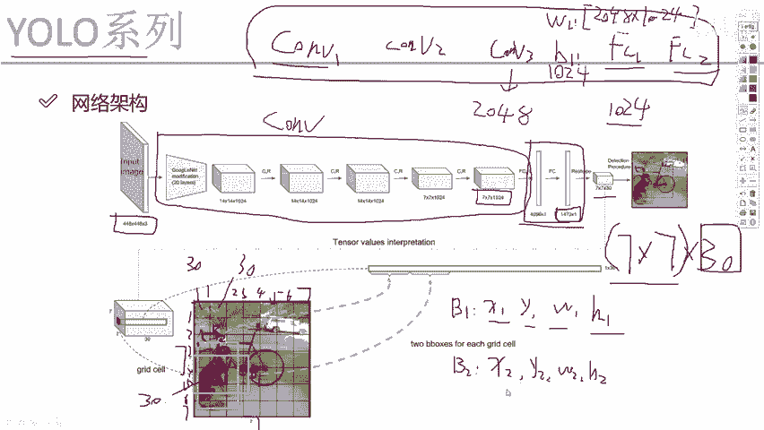
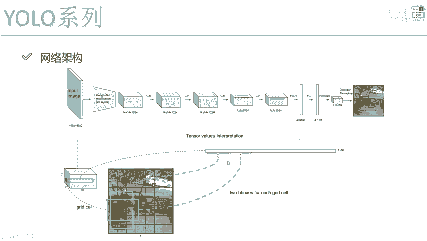

# 比刷剧还爽！【OpenCV+YOLO】终于有人能把OpenCV图像处理+YOLO目标检测讲的这么通俗易懂了!J建议收藏！（人工智能、深度学习、机器学习算法） - P59：3-整体网络架构解读 - 迪哥的AI世界 - BV1hrUNYcENc

首先呢第一步我们拿到了一个输入图像，在V1版本当中啊，啊它指定的输入大小是448×448乘三的，相对来说啊是一个固定值啊，可能大家觉着哎呀，固定值是不是说只能检测固定大小一些东西呢。

啊其实这个也也不是啊，固定的一个值，只是说我们把图像reset到固定值了，你的一个里边的物体坐标都相应的会做改变，你到时候还可以实际的映射到原始的一个，输入数据当中，但是呢由于啊我们的训练只训练一个。

448×448乘三的，可以说V1版本当中啊，有一点局限了我们的输入，我们的输入图像大小被限制住了，在后续的改进版本当中，哎，我们可以说，可以把当前这个数值大小做一些改变哦，但是当前这个版本是改不了的。

大家想一想，为什么我说一个卷积神经网络，咱们的一个输入大小是不能变的，原因是什么，大家可能觉着一个卷积神经网络当中啊，不是就有一些哎卷积层，我这里什么池化层那些我就不写了，比如卷积一，卷积二。

然后卷积三，然后正常情况下，最后啊它不就连个FC1，然后连个FC2吗，那你说啊最终它的一个大小不能去变，主要原因是因为卷积，还是因为全连接啊，其实卷积对我的输入要求有影响吗，我说我设置好一个卷积核。

在原始图像当中只有卷积去提特征，你原始的输入大小爱谁谁吧，400的，800的，900的我都能去做吧，只不过说我得到的特征图大小不一样啊，但是呢FC层全连接层可以吗，可以这么说，全员阶层是定死的。

比如说之前啊之前我得到了一个卷积诶，它是有到这吧，我说我给他做个拉长，它有2048个特征吧，然后呢这个FC1我说要做成1024个特征，那怎么去做的，这里我是不是得有一个权重参数矩阵。

还有一个偏置参数矩阵啊，那比如这里只要你这个前面一层是定的，后面一层也是定的，W1是不是固定下来了，得多少，2048×1024的一个矩阵吧，然后呢B1呢B1就看输出结果吧。

一共有1000 024个特征要变成，那B1是不是只有1024个呀，那我问大家一个问题，B1和W1啊，当你在训练网络的时候，他俩能动态的改变吗，哎大家见过一个权重参数矩阵啊，就是W这个矩阵在训练过程当中。

这次是2048×1024，下次变成1024×201024，大家见过这个东西吗，好像没有吧，也就是说啊，全连接层你必须固定好前面特征图的一个大小，前面特征的大小一旦你不固定，这个事就没法去做了。

所以说啊由于yo在V1版本当中啊，它是有这个全连接层的，所以说啊，这里我们必须做一个限制输入数据的大小，诶你不能去变了，必须啊是一个448×448，再乘上三的，然后呢我们来看一下中间的过程啊。

中间过程这个我现在框起来的这个蓝色的框啊，是其中它的一个特征提取的网络啊，这个我觉着对大家来说就不重要了，因为在V1版本当中啊，它的特征提取方法还是比较简单的，后续的版本我们会做一些改进。

大家不用去管啊，这个GOOGNET他做些什么事了，现在可以说用的也比较少了，后续我们有些替代的东西，大家直接把这个东西，你就当做是一个卷积神经网络就得了，在这里我们对输入数据做了好多次卷积。

得到了一个特征图啊，比如这里我得到了一个7×7乘，1024的一个特征图，那大家可能会问，那这个卷积网络它重不重要呢，啊其实这样的后续啊，在我们第三代版本当中，我会给大家去说啊，第三版本人家是怎么去做的。

因为相对于第三代版本啊，第一代版本，这个网络你就一点学习的价值都没有了，太简单太单一了，也没有什么特别的，就是个卷积网络，所以这个我不给大家当做重点了，整体网络细节的东西，咱们V3的时候我跟你详细去唠。

因为V3啊它东西挺多的，并且它是实际有价值的，这里你就当做一个卷积来就完事了，卷积完之后啊，我得到了一个7×7乘1024的一个特征图，大家可能会问，那最终啊我这个特征图我要得到什么东西啊。

那这里我们要关注一下，它的一个全连接的结果了，这里全连接当中啊，我们来看一下第一个全连接诶，他说啊给它转换成4096个特征啊，这也没问题，这重点看第二个第二个权阶层啊，他说是1470，哎。

大家你说你见过这么1470的一个东西吗，好像没见过，是不是，那它表示什么意思啊，直接你看这个1470啊，看不出来什么东西，我说这里啊我给他RESHARP一下，再来观察一下RESHOP成多少呢。

7×7乘30好了，这个值是非常关键的，在第一代版本当中啊，咱们也得知道这个7×7表示是什么，30又表示的是什么，它呀是非常关键的，为大家着重来说一下诶，当前我们的一个结果，7×7表示是这样一件事啊。

他说啊现在我最终啊只获得到了一个，就是嗯把它当做一个特殊图吧，在特征图当中啊，它是一个7×7的，就好比说是下面这个它是一个7×7的格子，好了，像我们之前说的，我们的格子大小它是一个7×7的。

那30又是什么意思啊，大家来看，我说在这块我说先画上一个括号，可以吧，也就是说啊7×7的一个格子，每个格子当中有30个值，没问题吧，有这点哎这一块它是有带有30个值，这里它带有30个值。

每一个点它实际上都会有30个值，那这个30表示什么意思啊，7×7我能理解，哎你说把这个数据啊变成7×7的一个格子，那每个格子要预测出来三折值，它表示什么呢，来看一下吧，之前我们是不是说了。

哎当前我说对每一个格子我要产生几种框啊，是不是每个格子我要产生两种框，那这点我们来线线，第一种就是一个B1啊，B1是第一种框，第一种框当中啊，它是不是得有X1Y1，还有一个W1H1啊。

只不过这里啊大家得先注意点啊，咱们没讲没讲代码，在讲代码的时候，我会给大家去说啊，这个X1Y1啊不是实际它的一个坐标值，而不是实际它这块的一个坐标值，而是什么，而是归一化完之后啊。

相对啊整个图像来说的一个0~1之间的值啊，它在百分就是这点，一般事情是这样，从这个点开始，这是1234567，然后这点开始1234567，它不是啊，就是一个什么2345哎这样一个实际坐标值。

而是说啊相对整个图像当中啊，他是个0。3，0。8，代表着在相对的一个长宽的一个位置，是等于多少，所以说啊这里哎我们求出来的实际结果，它并不是一个值，而是一个归一化周围结果相对的一个位置。

WHR也是呃相同的，可能之后讲代码的时候会，大家看到这里还要经过一些对数变换啊，这些就是所有一些坐标操作吧，咱放到代码当中，因为放到代码当中啊，咱讲代码的时候，我还会给你给你去讲这些坐标，咱们该怎么玩。

现在呢我只需要大家去知道，在我们每一个格子当中，我需要去预测什么，哎这就足够了，B1当中，那我是不是得有这个指标啊，那比如说B1他是这个呃长方形的框，那除了这个比较长的框，那这块是不是还有个B2啊。

也就是说有两种框吧，那好了，那我们再写V1当中啊，有这个X1Y1W1H1，那B2当中是不是也一样的，也有这个X2Y2，还有一个W2H2，是不是，那只有这四个吗。

在这个框当中，我们之前说什么来着，当前啊对于每一个框，我都需要去判断一下它是一个前景还是个背景，哎或者说它这里边它是不是一个物体吧，咱们提到一个东西叫什么，叫做一个置信度吧，那这一块我说写个C1吧。

那这一块显然它得有C2，那我们来看一下，你说啊当前一个格子我们现在有几个值了，B1当中有几个五个吧，B2当中有几个也有五个吧，来看一下Z30的组成，其中前五个我说他是B1的结果可以吧。

然后接下来五个我说它是B2的结果，可以吧，好了，那一共是30个结果，现在我们说十个，那还有20个是什么呀，20个就是一个20分类，什么意思啊，我说当前啊这个是跟不同数据集是不一样的，有的数据集是20的。

有的数据集是可能以后你会降一些，八十一百的都行啊，咱们拿这个20来举例子，比如当前我们要检测的一个数据集当中啊，它是一共啊有这么20个类别，那比如说狗是一个类别，汽车是个类别，自行车是一个类别。

那这个20表示什么意思呢，一共20个类别，我说这里啊对于每一个格子当中，它得预测一下当前这个就是当前这个格子啊，它是属于啊，比如说你是属于狗的概率啊，比如这一块我写个20吧，20当中第一个位置啊。

它是狗的概率，第二位置是猫的概率，第三个位置是自行车的概率，第四个位置点点点点，一直到第20个位置，相当于啊我会预测一下当前这个格里边诶，它属于每一个类别的概率值分别等于多少，其实无非是什么。

就是一个分类任务吧，啊这里我们还有个20分类，所以说啊我们把这几个数咱们汇总一下，5+5再加20等于多少了，就等于30了吧，所以说啊，最终啊大家一定要理解这个30是怎么来的，只要你能去理解这个30。

你基本把这个任务咱就想明白了，因为啊我在整体的网络架构当中，我要的结果是什么，哎就是这个最终的7×7乘30吧，7×7表示格子的大小，30呢表示这是哎，我最终啊咱要得到的结果是什么，有30个值。

那之前讲的时候，很多同学都问我，老师啊，你说让前五个值哎是B1，中间五个就是后五个是B2，然后最后面是30，你这么说，我认了，但是这个计算机，它凭什么能按照你这么来去做呀，那计算机凭什么能能这么去做啊。

计算机为什么会达到这样的结果，因为我会给它指定一个损失函数吧，在损失函数当中我会告诉他，我希望的值是什么的时候，损失函数能会最小，那计算机在做的时候，它就会逐渐的去猜到你，每个值到底要表示什么意思。

怎么样去做，能迎合你这个损失值，让损失最小吧，所以说啊整个的神经网络，我觉得它有一点非常大的魅力，就是说最终啊你要什么样的结果，你只需要给它去，就是合适损失值，它就真帮能你就是他就真的能帮你这么去做。

我觉得这点真的非常神奇啊，很多一些看论文的思想，基本上就是论文的作者诶，他就这么去想的，并且呢设计这样一个损失函数，最终结果就真做出来了，哎这个就是咱要达到的一个结果，哎7×7乘30。

我先给大家从头到尾解释了一下。

