# P5：1-图像平滑处理 - 迪哥的AI世界 - BV1hrUNYcENc

这节课呀，咱们再说一下，关于图像怎么样进行一个平滑处理，说白了就是要对我们的图像数据，进行各种滤波操作了，呃，如果说以前啊，大家有了解过卷积相关的一些概念，再来看这个平滑处理啊，应该都比较简单的。

咱这样先给大家看一下，我们的输入图像长什么样子，这一回呢我拿到了一张图像，只不过说啊我给它加上了一些稍微的处理，我们先来看一下，展示一下我们当前的这个输入数据。

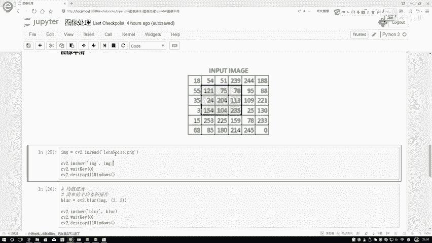

这个输数据啊看起来有点特别诶，上面有些什么东西啊，有些焦沿有些噪音吧，所以说啊现在我们图像带上了一些噪音点，那我现在想通过一些滤波啊，或者是一些平滑处理操作，怎么样能够尽可能去掉这些噪音点呢。

咱俩就要做这样一件事，我先来说一下我们要用的一个方法。

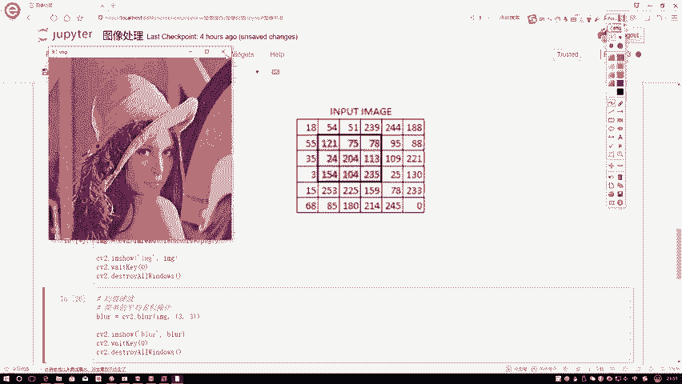

也就是几种不同滤波操作，在这里我们先来介绍，第一种叫做一个均值的滤波，呃，可能啊以前大家没有没有听过滤波这个事啊，我先给大家解释一下，其实啊就是它是一个简单的一个平均的卷积的。

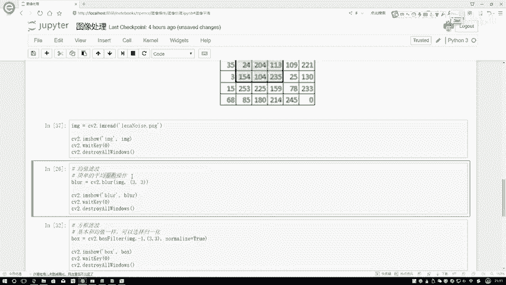

操作，是这样，就是当我们现在拿到了一张图像，这个就好比是我们现在图像，它像素点的一个矩阵，然后在这一块我需要指定的是一个核的大小，比如说我指定的是一个3×3，这个332表示就是在你图像当中啊。

嗯在这里你要做平滑处理，说白了，你还是要对其中每一个像素点做些变换吗，在这里，比如说我现在想对这样一个像素点进行变换，那把它变换成什么样的值是比较合适呢，咱们先做的是一个均值的滤波，一听到这个均值啊。

大家来想，我们第一感觉就是这个像素点，它应该等于什么值，应当啊是跟它周围是比较相关的吧，在这里我可以做这样一件事，它不是这几个数吗，我写一下120一页，我加上75，再加上78点点点点，一直加多少。

最后一个值，反正接下来20 420413，最后加到235吧，我把这一共几个数啊，这是一个3×3的，所以说它是有九个数吧，我最终啊在求了一个平均，那是不是说我就知道了当前这样的一个位置。

它平均的一个结果应该是等于多少吧，这个啊就管它叫做一个均值的滤波，做法是很简单的，那你说这个操作，我们该怎么样给它实现出来了呢，一就是通常情况下我们先构造一个卷积矩阵啊，底是这样的，1111。

然后这块也是一个一这个卷积矩阵啊，他是不是说通过我的一个filter，和这个是一个3×3的，里边都是一吧，它会跟我们实际输入图像当中进行一个什么，进行求内积吧，所谓求内积就是对应位置相同。

1×121加1×75，加1×78，上面都是一乘加一乘，完事了，最终呢再求一个平均数不就完事了，所以说啊，我可以把这个均值滤波当做一个简单平均的，就是一个简单啊平均的一个卷积操作。

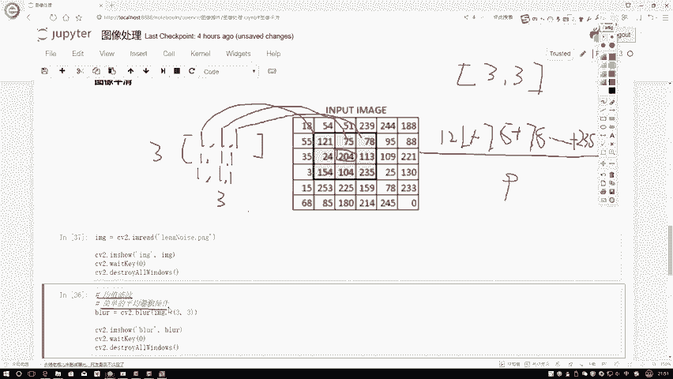

这样谢谢大家看一下我的一个结果就在这里啊，我们调用的是CV two，然后一个均值滤波的一个操作在这里啊，我们只需要两个参数就足够了，第一个参数就是我输入的这个图像数据，就在这里。

我们是把整张图像数据啊输入进去，接下来你要去给我算的时候，是不是应该每3×3区进行一次计算啊，所以说你还得告诉我你的一个filter，或者是你的一个和它的大小是多少，在这里呢我们3×3去做也行。

5×5去做啊，其实也可以就是看啊，比如说5×5在这里画不出来5×5了，但是在这里我们可以画一个4×4的，但是通常情况下我们都是用一个奇数啊，在这里我画片5×5了，所以我画了个4×4的。

在这里假设是4×4的吧，那是不是用周围的这样一个点去进行计算啊，但是我们通常没有用一个就是偶数的，基本要么是357啊，就好比这个意思。

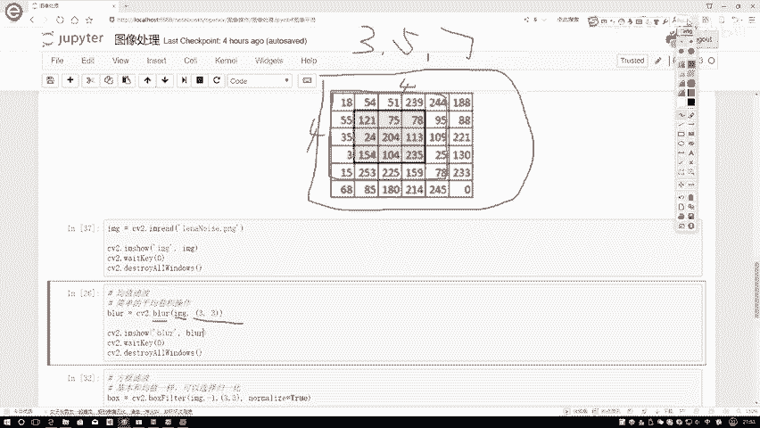

那下面再执行一下，看一下它的一个结果，执行完这个滤波操作之后。

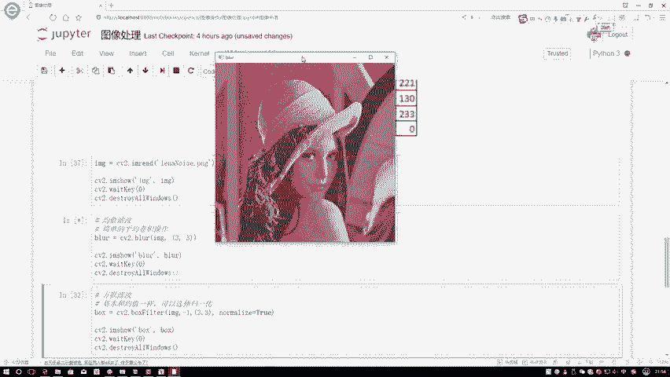

嗯这么的，咱看先来看一下原始图像，原始图像当中，你看他这个椒盐椒盐这个噪音是不是挺明显的。

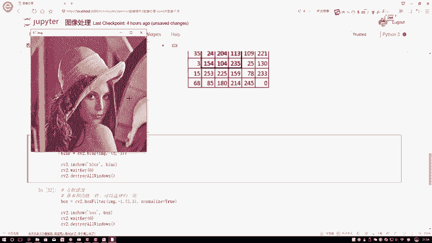

当我执行了一个就是均值滤波，咱们来看一下。

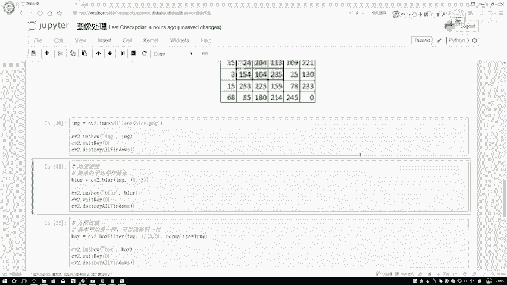

执行完之后啊，是不是说我这些噪音点就没有那么直接了，看起来就是稍微的淡了一点，是不是这意思啊，但是你从整体上感觉，是不是还是有这样一个现象，这个就先跟大家解释一下，我们最基本的一种滤波操作。

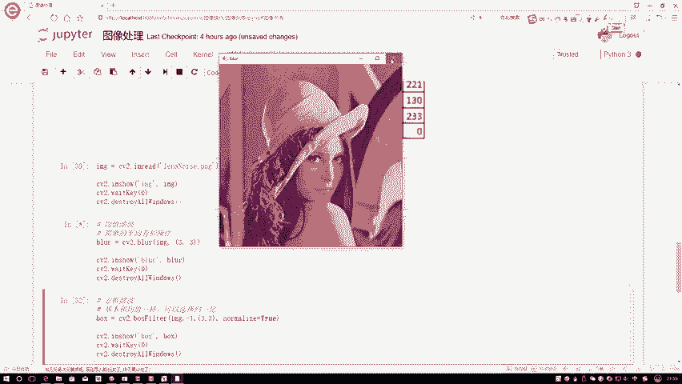

叫做一个均值滤波，说白了你要构造一个卷积核的大小，这个核当中所有的值都是一个一啊，这样一个意思，然后呢我把所有位置加在一起，不要忘记最终啊再除上我这个盒大小，相当于啊这一块你前面乘个1/9。

或者说那你最后除个九只都可以的。

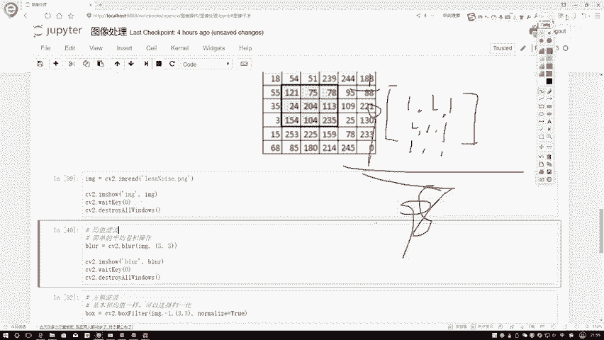

这样我们就完成了一个最基本的一个均值滤波，不光有这个均值滤波操作啊，下面我们还有方框滤波疯狂滤波啊，就是大家可以这样，你就把这两个函数啊当成是一个函数就可以了，因为他俩做法是一模一样的。

只不过说呀在这个方块滤波当中啊，你可以多选一个参数为大家来看一下，这个就是boss filter当中啊，首先第一个参数还是咱们的输入数据，然后第二参数只剩一，是这个意思，Python当中啊。

当你去指定一个一，是不是说我们让它自动的进行了计算啊，它表示啊就是我们得到的一个结果，跟你原始输入的一个颜色通道数，它就是在颜色通道上是一致的，一表示一致，通常情况下也都是一啊。

这些值基本上大家都不需要去改的，然后呢这个三次按也是一样的，也是表示我的一个filter，我的一个卷积核，咱是用3×3的，还是用5×5的，然后呢它只是啊多了，最后这一项咱们来看一下。

之前我是不是说对应诶把所有的位置加起来，然后除一个九，那像感觉像不像一个归一化的一个操作，normalize一下吧，那如果说诶我能不能不做归一化呀，我就直接给它加在一起，当做这个值行不行。

那大家可能乍一想好像也行，但是你想这么去做的时候，你看啊就随便一个值，121+75好像没啥毛病，但是呢你看75，如果说和204加在一起等于多少，等于279吧，它是不是大于255的一个值。

那会发生一个什么现象，发生一个越界吧，此时啊就是当我不用normalize去做的时候，可能会发生一个就是过界，就是越界的一个现象，咱这样先把这个值指定成一个数值，相当于啊我做归一化。

一旦你这个指定成个数值，就相当于是跟你这个均值滤波是一模一样的，所以说分号滤波和均值滤波就差这一点了。

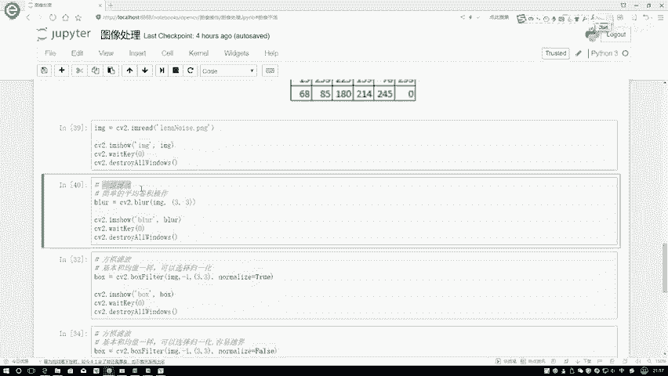

你要不要去做一个归一化，如果说你要做归一化，咱得到的结果是一模一样的，你看现在这里，我用来去做完这个fl滤波之后啊，咱得到结果是不是跟刚才的那个均值滤波，是一模一样的吧。

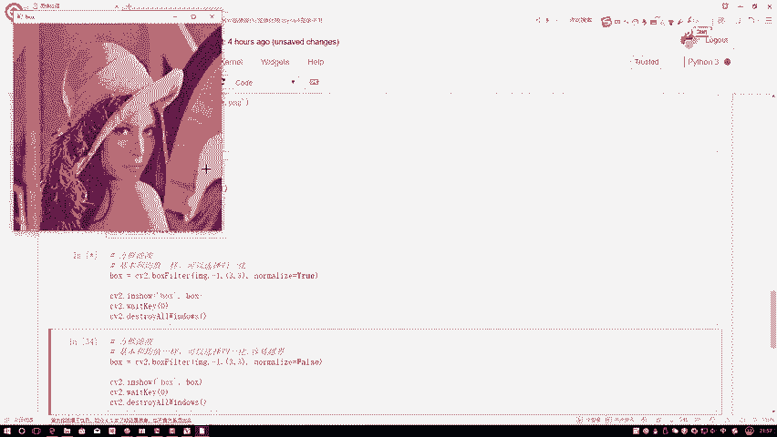

这回要我稍微改一个值，我把这个LNICE我改成一个处值啊，在这里我看下面改没改，偶像没有去改，那这样我把它哎在这在这改了，这块改成个false值是吧，改成false是什么意思啊，就像我刚才说的。

它还是这样一个区域，它会把120一页加75，加点点点都加一起，只不过说他没有除九那个操作了，那大家可能会问，那越界了怎么办呢，咱现在看结果吧，结果就告诉咱们了，他越界会怎么样进行一个处理。

还是相同的参数啊，咱们来执行一下这一回啊，来看好像大概轮廓也有，只不过说好像怎么什么东西都这么白呀，白是用哪个像素点表，两个像素点来表示啊，255吧，所以说啊它一旦发生越界，就是越界时候它会怎么办。

所有越界值只要大于255了，我就全取255，当做当前的一个结果了，所以说当你要用boss filter的时候，一旦发生越界现象，它会啊直接取到255这个意思。

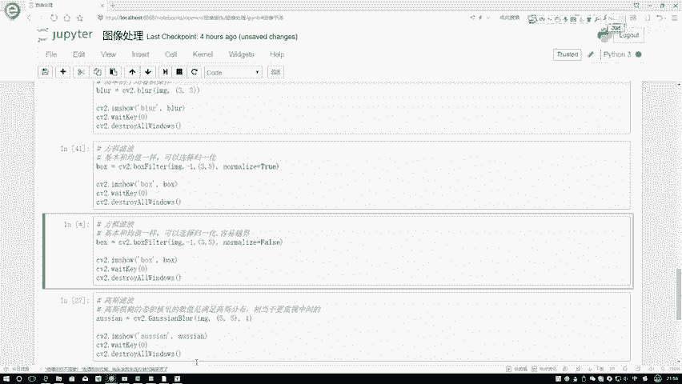

这个呀就是我的一个方框滤波啊。