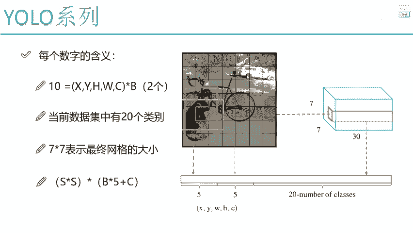
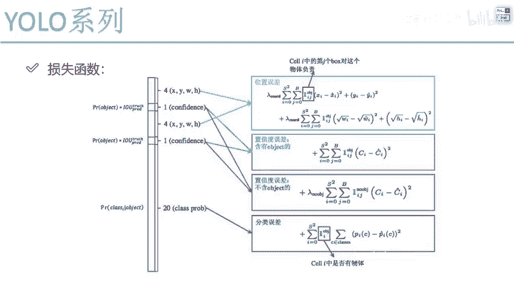

# 比刷剧还爽！【OpenCV+YOLO】终于有人能把OpenCV图像处理+YOLO目标检测讲的这么通俗易懂了!J建议收藏！（人工智能、深度学习、机器学习算法） - P60：4-位置损失计算 - 迪哥的AI世界 - BV1hrUNYcENc

好了总结一下吧，这里十啊代表什么，我们这个B啊，它是有两个两种不同大小的框，咱之前说了两种，那肯定是不够的，是不是fast r cn或者是一些其他论文当中，人家做了几种啊，人家可能做了九种，做的更多啊。

但是呢大家又想了一个问题，我们的优菈第一代版本出发点是什么，我考虑最终这个结果到底多准吗，要把这个东西做的多细吗，不一定吧，速度快是不是就行了，所以这里啊它的B哎当前是只选了两个。

然后呢当前我数据集当中啊，一共是有这么20个类别，所以说啊咱们是5+5，再加上一个27×7呢，就是啊咱们网格这个大小，这里是给大家说了，哎我们网格其中的一个大小，那最终啊实际大小。

如果说啊你想改变一下网络结构，那不管怎么去改，最终的格子大小，如果是S乘S的，那最终我得到的一个预测值是多少，应该是S乘S这么多的一个网格，是不是每格网格当中要预测B乘五个，比如说啊B有两个。

那就是十个，再加上呢多少个类别的，这个是给出来的公式啊，相当于最终预测结果是等于多少的，这里给大家解释了一下，其中每一个值啊，它都表示啊什么意思好了，那接下来啊就是我们网络结构哎给大家说完了。

以及我们最终预测什么也给大家指定了一下，那接下来我们就要做这样一件事了，还差什么了，其实还差了就是一个损失函数吧，我们在讲一个算法的时候，其实只需要大家关注两点，网络结构最终输出值你希望得到什么。

或者说输出值咱们咱们怎么得到的，然后呢有了这个输出值之后啊，我们的损失函数该怎么定义，把这两个我们解决掉了，是不是说整个呀咱第一个算法我们就讲完了呀。

所以说接下来我们来看一下损失函数啊，我们该怎样去做，先来想一想，我们都需要几种损失函数啊，或者说我们这件事当中我们做了什么，首先第一点我们做了要有就是有哪些预测值，XYWH这些东西我是要做预测的吧。

那你说那你说啊，你预测出来这个XY和WH跟最终啊，真实的值之间肯定会有差异吧，那你说我希望这个差异啊，是大一点好还是小一点好啊，肯定是小一点好吧，所以说哎对于这个呃一个实际的位置，XYWH这几个指标。

我要指定一个损失函数去最小化什么，他们跟真实值之间的一个误差吧，好了，这就是我们第一个损失函数，也叫做一个位置误差，我们来观察一下，在位置误差当中啊，我们提到一点啊，我们来看一下他怎么去做的。

首先啊先来看第一个框，第一个框什么意思，I从零开始到S方，也就是说现在啊我这块网格当中啊是有S个的，是不是，那他要做的就是在这S乘S的网格当中，对于每一个我是不是都有预测的结果啊。

那每一个我都实际的得去算吧，好了，这是S啊，这是第一个I从零开始到S方，一共有S方个网格，每个网格咱都得去算一遍，然后第二呢J从零开始到B，我们说这个B有几个对于其中的某一个格子吧。

它是不是说有不同的几种框两种框吧，这里他虽然写了个B，但是优LOV1当中它就等于二了，后续可能会改啊，这里我们就当这个B它是两个AJ等于零，或者是J等于一，表示的是第一种框，还有第二种经验框啊。

这个意思，然后接下来接下来这里你看就写了个箭头啊，它什么意思啊，他的意思啊，就是说了呃当前啊这个CEL他对什么负责啊，我们刚才是不是说了，你这里哎不是有两个候选框吗，但是呢对于一个真实值来说。

比如说真实值它是一个蓝色的，真实来说啊，它跟两个候选框我都能算一个IOU吧，啊就像我刚才说的，我们有两个候选人，但是呢不都用选谁啊，选一个能力比较强的，跟这个真实框最接近的啊，相当于他是最可救的吧。

啊它相当于就是给它微调完之后啊，能会更好一点，微调起来更容易的，所以说我们选择哎其中LU最大的那一个，然后呢我们要算什么，算他们差异吧，这里差异，是不是说，就是真实值和预测值之间的一个差异了。

那这里你看我们XY咱们这么做的，WH是不是我们也是这么去做的呀，但是我们来观察一点有没有什么不同啊，XY我们直接哎做了一个差异，但是WH呢他这块做了一个根号，哎，WH他为什么要做个根号啊。

其实这里啊论文当中提到这么一点啊，他说这样一件事，他说现在啊对于一个损失来说，比如说我画一个图像，图像当中呢有一些红色的物体吧，这块有一个比较大的物体，这块呢有一个比较小的物体。

那你说啊现在呃我说这里啊我预测了一个结果，蓝色预测的结果吧，这是蓝色预测结果，这也是蓝色预测的结果，那我说这样它们两个的误差啊，在H和W当中，我说都是一个单位吧，都是一个单位，可以吧。

那对于一个比较大的物体来说，一个单位无所谓，是不是我这个物体这么大呢，一个单位相对来说很小很小了，我对于一个差异好像来说哎无所谓啊，这是对于大物体来说，但是呢对于一个小物体来说，虽然说只是一个单位。

那可能这个物体它的两个单位，那一个单位的偏差可能就会比较大了吧，所以说啊这里它得强调一件事，有些啊物体会比较大，有些呢物体会比较小，那我应该更注重什么，我应该更注重于这些WH比较小的吧。

如果说他们比较小的，我应该更重视一点，它们比较大的时候，我稍微的粗糙一点，是不是也没问题啊，因为物体来说它是有大小之分吧，物体的大小你虽然说不能控制，但是呢我们可以在一个实际计算损失的时候。

来去有一些衡量，或者说来有一些侧重点吧，这里啊他加了个根号啊，给大家解释一下为什么要加根号，我先画一下吧，比如给大家写这个函数吧，Y等于根号X我直接给大家画一下，这里呃这是X轴，然后这是一个Y轴。

然后这个函数啊大概长什么样子，大概的一个趋势啊，应该是这个样子的一个趋势吧，那这个样子趋势我们可以观察一下，我画它的一个切线吧，呃在这里画个切线，当啊可以说是当X比较小的时候，你看它的切线怎么样。

或者是当X比较大的时候，也就是说啊当X比较小的时候，Y等于根号X这个函数它的变化的一个就值啊，它变化的一个幅度会比较大吧，随着X的增大，你的变化幅度又画了个切线，它会变化比较小吧。

那这里啊它加上了一个根号，相当于什么，如果说数值较小的时候啊，它会较为敏感，数值较大的时候，它会相对来说就没有那么敏感吧，但是大家可以想一想，加了一个根号真的能解决这个问题吗，可以说是解决了一点。

但是解决的不够透彻啊，这是V1当中他做了一个，做了一种我稍微的改进吧，在这一块哎我们说了一下，对于WH2，我们加上根号，主要目的是为了呃去解决哎一些小物体，当中啊偏移量比较小的时候，他可能对它不敏感。

这回呢我让他稍微的敏感一些，有这样一个意思，然后前面前面他这个角标都是一样的，I和JI表示对于每个格子，J表示每个格子当中有两种bounding box框啊，这个意思，然后呢前面它还加上了一个系数。

这个系数啊在损失函数当中啊，就表示的是呃你的一个权重项吧，啊，现在这里我们可以啊自己的去加上一些权重项，如果大家想看详细的信息，哎可以在原始论文当中去看一看，他对他对啊，这个公式当中每一个指标哎。

都是有这样一个介绍的，也就是跟我给大家介绍的，其实来说啊是一模一样的，这个是我们说的。

