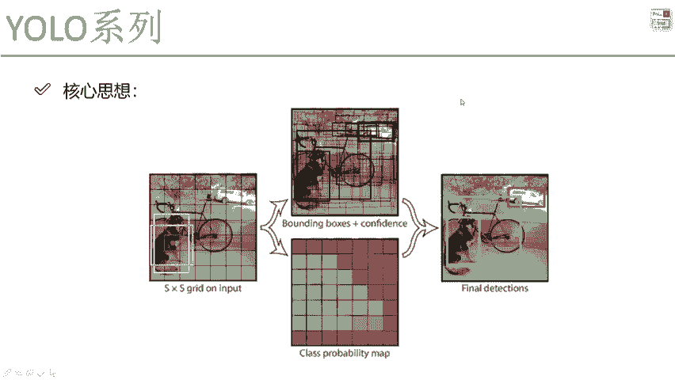

# P61：5-置信度误差与优缺点分析 - 迪哥的AI世界 - BV1hrUNYcENc

然后呢除了位置，我们再想一想，还有什么，我们在预测的时候，我说这点啊，我还需要一个置信度吧，就是confidence值是不是，那大家来想这个执行度啊，哎我要不要分类来考虑考虑啊，什么叫分类来考虑。

因为在图像当中啊，有一些地方它是前景，有一些地方是背景吧，比如说我画一个图，我画一个图当中，在这里我这块他有一个人吧，这有点，那显然我这个区域当中这个格子预测出来的，我希望是个前景，是不是。

那换一个位置呢，我说这个位置这个位置啥也没有啊，那我再预测出来的东西，我希望它是个前景吗，我就不希望了，我希望它是什么，我希望它是一个背景吧，那好了，在整理图像当中啊，大家可以来观察一下。

你说是前景多还是背景多啊，比如这里来说，我说这个红色的它是个前景，就是有物体的，这个蓝色的它是个背景，那显然是背景会更多一些吧，所以说啊一会儿我们在做这个confidence，就执行度的时候啊。

我得分类来讨论了，一种情况下是说他预测的是一个前景的，一种情况下，他说是预测成是一个背景的，比如这样，我说啊背景的时候置信度啊，我希望它是就是真实值，我说背景的时候，知心度它的真实值是零。

然后前景的时候呢，我说置信度它真实值是一个一哎，这没问题吧，就是第二代表着他声音没有一，代表着它是一个前景，那这里呢我们来想，对于一个某一个候选框来说呀，我是不是都要做这样一个值啊，那这个值该怎么去做。

那比如说现在有一个候选框来了，诶，它是落到这里了，一旦这个候选框跟某一个真实值的，IOU会比较高的时候，比如说我说大于阈值吧，大于0。5的时候，我说怎么样，大家可以大家这块比较比较重点啊。

大家得听我说一下，因为它会比较绕，这里，首先第一步，我会算一个框跟真实值的一个IOU，如果说它大于0。5，当然这0。5是我给定我自己先设个阈值啊，如果说它大于0。5的时候，我认为哎当前这个框。

它可能要预测的是一个前景，所以我希望当前这个框它的一个confidence，真实值应该是多少，应该是个一吧，它越接近一越好啊，这是这样这样一件事，但是呢这样它做成一吗，不是的，它毕竟还不是一个真实框吧。

它会有什么，它会有IOU的一个值吧，我们希望当前这个值跟这个IOU怎么样，比如说IU现在等于一个0。7，那我是不是说我希望当前这个框做出来，执行度越接近于这个IOU它是越合适的呀，这是第一个有一种框啊。

它是跟当前就是有一些候选框，跟我当前真实框是有些重叠的，那问题来了，那跟一个真实框来说呀，重叠的可能不仅是这个黑色的，还有可能是这个绿色的，哎，这有绿色的绿色，它比它可能这个黑色的，它是这个0。7。

然后绿色这个呢它是0。6，那好像说一个真实框啊，有多个候选框跟都重叠了，这个时候怎么办呢，这个时候啊咱只选一个啊，只选IOU最大的那一个来做计算，IOU小的那个像绿色的就被淘汰出局了，这个是什么时候。

我们是一个前景，那我们再来看，那其他时候呢小于0。5的时候呢，或者说压根都没有的时候更多吧，这个时候什么这个时候我们就是一个背景了，背景当中我就希望那显然就等于零，是不就完事了呀。

好了这里啊咱们提到一点，怎么样去基于我的一个置信度来计算啊，当前我的一个格子吧，它预测结果是一个前景还是个背景，我们来看一下，在这个论文当中啊，他也是分为两部分，第一部分你看就是之间的误差。

含有物体的和不含物体的含义来说啊，就这样呃，A等于零到X方，每个格都要去算吧，J等于零到B啊，两种候选框，然后呢算知进度和我的一个真实值之间的差异，置信度就是实际它预测出来的结果，真是指像我刚才说的。

哎，我们要看什么实际的一个IOU，它是等于多少吧，并且它是LU比例大于0。5的时候，才能满足咱这样一个要求吧，这个是我们算了一下置信度和真实值之间，我差了多少，这是含物体的，那不含物体呢。

那是不是道理是一样的，那不含物体的，它我希望这是指就是IOU最大的时候是一，那可能小一点的时候，0。90。8，是不是，那这里呢不含的不含的就只是零了吧，所以说啊在这块我们分为两个，一个是含有物体的。

一个是不含有这个物体的，这两个我要分开进行讨论，为什么要分开进行讨论啊，咱们来看这块多了什么，多了一个权重的参数吧，大家想为什么要加权重参数啊，可以说啊，我说这样，我说这个东西啊它是一个正样本。

这个东西它是个负样本，可以吧，那你说在整个的一个就是实际当中吧，这个格子当中你是前景多还是背景多啊，是不是说我们的一个背景会是非常非常多的，前景会比较少啊，那这样显然会导致样本它是不均衡的。

如果说在你设计这个损失函数当中，不加这个权重项，那可能大部分损失都由谁来影响了，都由这个背景来影响了，它可能很难去识别出来一个东西，它是不是个前景，所以说啊在这里我们在损失函数当中啊，也要做一些文章。

让损失函数知道哎我们前景是更壮一些的，背景这个全数参数，比如说0。1，这是个一可以吧，背景的相对来说啊，他就不是那么重要了啊，这个是给大家说了一下，我们还有一个置信度啊，咱们的损失我们是怎么去算好。

接下来最后一个最后一个就比较简单了，一个20分类，那不同任务可能不一样，你以后会见到20的，还有80的，还有更多的20分类，这个就比较简单了吧，它到底哎是什么样的一个类别，跟我们分类当中的一个损失函数。

就是预测它的预测，比如它真实是狗吧，那预测狗的概率和真实之见狗的一个概率，我们算算交叉熵是不可以啊，分类损失函数啊，这个比较简单，就是基本啊咱们一个多分类问题行了，这块给大家从头啊到尾概述了一下。

在我们损失函数当中啊，每一个地方啊是怎么去做的，主要就是有三种误差，其中呢第一个是我位置的一个误差，哎一会儿我要做一些位置上的一个偏移啊，位置offset这个值，然后呢还有一个执行度，执行度啊。

就是说偶预测前景和背景，它是不是一个物体当中的一个误差，还有呢就是最终啊我的一个识别哎，在做分类的时候。

当前这个框到底是什么的时候，我们损失函数是不是也给大家做出来了。

好了，这里啊咱给大家说了一下整个损失函数当中啊，我们整体是怎么做的，那最终啊损失函数等于什么，最终loss看看这是什么法，是不是加法呀，把这几个哥们儿，我说我全串一块全加到一起。

就形成了当前我们yo v1版本当中，整体的一个损失函数，我们是怎么去做的，其实不光啊V1当中我们去这么做的，后续啊基本也一样的，基本还还都是这么东西，只不过说可能会加入一些细节啊。

整体的框架我们是不变的，这个就是yo v1当中我们整体的损失函数，其实呢说完这个损失函数当函数之后啊。

咱们整体哎所有事我们是不是就解决了，网络架构跟大家说了一下，很简单吧，只是最终的一个输出结果，7×7乘30。

这个我需要大家知道30表示什么，以及呢在我们构建损失函数的过程当中。

我们需要诶描述几个问题的损失，再把这两个事儿串到一块儿，我们是不是就能做训练了，好了这里啊给大家说了一下我们的损失函数。

还有网络架构整体哎是怎么去做的，然后呢最后一个小知识点啊，就是呃之前咱们也说了，在预测框的时候，比如说在测试的时候，我可能会检测到很多框都是重叠的，都是重叠的时候该怎么办啊，啊。

这里有个东西叫NMNMS叫做非极大值抑制，这个是测试的时候咱经常会遇到的，比如说呃同样一个人吧，检测到了好多人脸，我可以看什么，我可以看到这个置信度只有0。98，这有0。8几，只有0。75。

基本想法就这样，先按置信度来进行排序，比如说我说呀这个IOU大于一定比例的，我全拿到手，然后按照执行度来排序，那非极大值抑制，是不是我汲取一个执行度极大值，把其他的我就不要了就完事了。

这个大家只需要了解就行啊，就是我选择最终哪个框，如果有大部分重叠的情况下，IOU诶，满足一定值的时候，我把最大的值给拿出来，其他的我就不要了，这是叫NMS，在戴尔当中啊。

咱后续会看到有这样一个非解压值抑制行了，这个就给大家从头到尾啊说了一下。

我们yo当中啊，第一代版本啊，他是怎么去做的，那行了，说完第一代版本之后啊，我们得让大家说一说问题了，来想一想UOV1当中啊有哪些个问题，第一个问题是什么，我说当前这一个点啊，他只去预测几个类别啊。

是不是预测一个类别啊，但我会选择其中一个吧，预测出来它到底属于什么样的一个类别，那问题来了，那这一块有个狗，那旁边如果说在蹲一只猫呢，它俩如果说高度重合在一起了，我能检测到猫吗，好像就够呛了吧。

所以说yo当中啊，DI版本有点小问题，重合在一起的东西啊，这东西是很难进行检测的，这是第一点，第二点呢，如果说现在啊最终啊，咱们刚才是不是说做了个20分类，那看哪个概率高，取哪个是不是。

那这里如果说我做做这样一件事，我说现在啊啊我的标签当中，它有可能不光是这个狗，它可能有一些这样的，比如说有狗啊，有斑点狗，有这个什么有这个这个什么哈士奇之类的，那可能它既是狗又是哈士奇，又是什么东西。

它可能有好多个标签，那我们的一个soft max能做一个，就是能把它多个标签拿到手吗，好来说不太好去做，是不是，而且做的效果也不好吧，这个是右手器械当中啊，我们可能会存在一些问题，小物体检测不到哎。

还有一些就是为什么小的附体也不大，因为他这个预定的框来说，预定的框来说是固定的，只有这个B1和一个B二两种先验框，两种线框可能包含的大部分情况下啊，它这个键值都是一些比较大型的物体。

它没有考虑一些小物体，那第一点小物体我没考虑到，第二点呢，还有什么我们在做的过程当中，重叠的东西不好去做预测，是不是，而且多标签这个事也不好去做吧。

所以说啊优鲁V1诶给大家从到尾讲了一下，给我们的一个直观感觉啊，是不是说做起事来肯定会挺快啊，网络结构挺简单，要做些事也也也不难，是不是快速简单，我觉着是它的一个优点。

但是问题呢我刚才是给大家提了几个呀，哎也也就是比较重要的几个，每个CEL只能预测一个类别啊，还有重叠的没法去解决，长宽比是不是太单一了，只有两个B1和一个B2，那这两个能预测的东西是有局限的吧。

一些非常规的物体我就很难去做预测了吧，所以说这块跟大家介绍了一下，我们的yo v2第一代版本DI版本当中。

我希望大家掌握就是它的一个核心思想，以及我们的损失函数。

因为后续啊咱们再来讲这个V2V3的时候，整体来说没有什么太大的改变，只是在细节上有一些变化啊，希望大家先能把V1哎理解好了，咱再讲V2V3就容易多了行了，这个就是我们这节课的内容。

