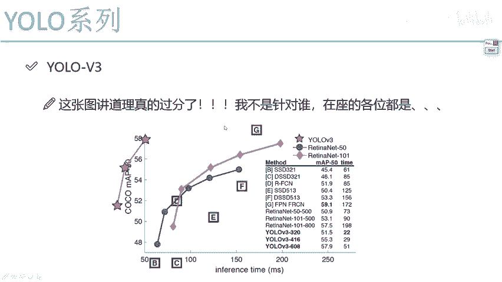
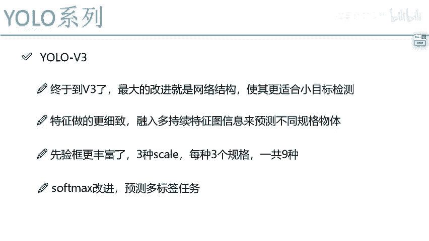

# P62：1-V3版本改进概述 - 迪哥的AI世界 - BV1hrUNYcENc

这节课啊咱们终于到了优菈当中啊，第三代版本了，我会跟大家来说一下，在yo v3当中啊，他做了哪些要改进，只不过说啊不像UV2当中啊，有那么多个小的细节，优鲁V3啊就围绕着一点啊。

我的一个整体的核心网络架构，能不能再做一些升级，相当于啊我希望诶把这个特征提的更好一些，怎么样去设计一个网络结构，能让我啊检测的目标，哎无论你是一个大的中的小的，咱的一个结果都要更进一步啊。

这个是他的出发点，所以说啊，一会儿我主要给大家讲的就是UV3当中啊，我们的DARNET网络哎该怎么样进行一个升级，然后这里我们先来看这张图啊，这张图你看我写的真的太过分了。

这张图画的论文当中要给出这么一张图，如果说大家不仔细去看，觉得这东西好像画错了似的，怎么现在啊这个优路V3诶，这个粉色的画到了一个图的外面了呢，咱们来仔细看一看我们的X轴，X轴表示什么。

当前啊它的一个啊预测的一个时间，就是说预测一张图像可能需要的一个时间，然后呢Y轴表示着它的一个map值，在这里我们来观察一下，它的一个就是当前这个原点不是零吧，原点是谁，原点是50，那他呀是故意的。

把yo v3给他划到了第二象限，相当于啊他是对其他算法吧，我觉着是做了一个笔试，我比你们的一个效果哎，多出来一个相界，我跑到第二象界当中了，其实啊他就说这样一件事啊，在这个UV3当中啊。

无论是一个速度还是一个MVP值，跟当年啊一些其他算法相比，那比他们简直强太多了，这是我觉着啊，右路V3当中最有意思的一件事啊，他把这个论文图诶画的很好玩，第一眼看你就觉得会很奇怪。

第二眼看你就会觉着哎呦V3这东西啊，确实要比其他的要强很多，这里呢列出来了很多，就是当年一些代表作品吧，由于这一项咱们课程当中也没给大家去说，我不给大家详细做介绍了，感兴趣啊，我们也可以去简单看一看。

一会儿呢我还为大家围绕着右手V3哎，我们的网络结构来大家进行展开哦，然后这里我再说一个小插曲，优菈已经到了这个V3版本，可能大家会问啊，这东西有没有V4V5V六啊，那正常情况下。

这个作者如果说啊他觉着拥有这个东西哎，大家比较实用，确实诶挺好挺好的一个东西，他可能会做V4V5V六吧，但是呢在这个2020年初啊，yo这个作者诶发表了一个博客或者说说吧。

他说啊yellow诶这个系列的东西啊，以后我就不再做了，我要退出计算机视觉界了，大家可能会好奇，为什么这么牛逼的作者，给大家提供了这么好的一个思想，而且实用价值非常大的，哎一些网络结构他就不去做呢。

这个作者说了，说这个从这个V3角度来说啊，现在我很多算法已经被这个美国啊，应用到太多的军事打击当中了，比如说无人机的一些追踪啊，炮弹的追踪，哎反正我不是做炮弹的，我不太了解这个东西。

但感觉是不是说做一些追踪和定位，相关的东西啊，作者啊他说这样一件事诶，他说这些东西啊是他所不希望看到的，所以说yo v3就相当于是一个终点了，以后呢，他都退出计算机世界界了，也不会再有这个V4和V5了。

虽然说啊他说这样一件事，但我们反过来想一想，这句话是不是也证明了，优鲁V3这个东西确实使用价值比较高啊，已经应用到一些军事当中了，虽然说啊他本人可能不会做这个V4，V5V6了。

但是其他人肯定会在他的基础上，再做一个延伸吧，好了，刚才给大家说这些点，主要就强调了一下哎优鲁via它的一个实用性，可以说啊现在的一些企业级的项目吧，很多都是参考YOO这个来去做的。

比如说啊做一些实时检测，还有一些追踪任务，这些啊，都是直接你往这个yo项目当中去套用，就可以了，也就是说啊我觉着这些这一切论文啊，最大的给大家最大的一个帮助，就是以后你但凡有实际工作了。

直接用人家源码来去做就行了，无论是人家的论文还是像吧，还还是那个源码，还是一个预算模型，其实对我们大家来说啊，都是个现成的吧，实际过程当中啊，其实说白了工程师啊就是一个搬运工。

把现成的论文现成算法拿过来是自己的了，把这些代码拿过来也是自己了，直接去套用我们自己任务就行了，这是后续啊，我再给大家讲源码的时候，会大家去说啊，优LOV3诶，这个源码我们该怎么样进行使用。

哎这是咱们后续讲的，我们还会讲源码行了。

然后进入到我们的正式内容当中吧，跟大家说一说，用了V3当中啊，他对细节诶是怎么去做的，刚才我是不是强调一点啊，最大的一个改进就是一个网络结构，我们这回目的啊其实也是一样的，优菈啊。

在一开始无论是第一代版本还是第二代版本，始终都是带带被大家质疑的，质疑什么，至于它这个检测的一个效果诶，是不是有点太差了，因为YOLO本身出发点是做一个速度的吧，那用了V3就响了，那这么多人质疑我。

我在V3当中我得改进改进改进网络结构，让我就是检测的效果能够更好一些吧，所以说UOV3当中啊，它的一个主要出发点诶，并不是在速度当中，而是说啊要在我的检测效果当中。

尤其是针对谁啊这些个小目标检测图像当中啊，比较小的一个物体，V1V2当中，哎V2我们之前说了，有一点改进，是不是，但是仅靠耐一点改进做的还不行，V3当中呢我们需要把这件事做得更细致一些，那怎么去做呢。

其实从yellow本质的出发点来说，它就是一个WESTAGE思想，这就是一个大CN网络，那既然是个WESTAGE思想，我们也不能像那个master rs in那个master rs n系列似的。

而引入一些分支，引入一些其他层，使得我的一个效果更好，我们这个yo是考虑速度的，所以说啊它只能从哪下手，我们的整体的一个大C因网络当中，我得想一想怎么样提特征能让我效果更好一些，这个是V3当中啊。

它的一个基本出发点啊，一会儿和大家说网络结构，并且呢不光在我的网络结构当中，在先验框的选择上也是更丰富了一些，咱们来咱们来想一想，V1当中有几种框啊，V1当中，这给大家看了我们一个B值是等于二的吧。

相当于我们只有两种框，V2当中呢哎我们说聚乐做了一个聚类，然后有五种了，V3当中啊，其实它也是聚类去做的，只不过说做的会更多了一些啊，V3当中他用了九种诶不同的线框，一会儿我会给大家去说啊。

这九种诶是怎么去做的，每一种表示什么事，最后要改进，当我们啊在做一个最终啊识别，也就是说现在你检测到一个框诶，你要看一下这个框当中啊，是狗啊，猫啊，飞机还是大炮来做一个判断吧。

那之前啊都是用那个salt max来去做的，salt max啊，它是一个多分类的一个分类器，是不是，那最终啊salt max给我们的结果，是不是说它属于某一个确定的类别，是返回概率最高那个结果吧。

在这呢我们来想一想，有些任务啊，可能不一定非要让我们输出某一个结果，那比如说一些多标签任务，什么叫多标签啊，比如现在我说一个物体啊，不光诶它有个标签是一个动物，它还是一个哺乳动物，还是一个狗。

哎或者再往下分，它是个哈士奇之类的，可以说啊一个物体我可以给它打上四个标签，或者是多个标签，那它呢可能同时满足于你整个的一个类别，比如100类别当中吧，它可能同时满足诶那么两三种。

如果你用salt max去做，那给我们感觉只预测出来一种数不太合适啊，所以这里啊他要对sd max做改进，哎其实就是把多分类改成了很多个二分类，我每一种类我都要判断是还是一个不是哎。

其实就是跟那个逻辑回归啊是差不多的，一会儿呢我跟大家再说一下，最后说简单说一下salt max啊，在优路V3当中我们做了哪些改进，这些点啊，我相信大家咱们都从头到尾给大家强调了一下。

一会儿呢我们会说的几个点，这些点就包括了优菈V3当中啊，所有的改进的思想了，除了这些点之外，其他的跟V2和V1来说，整体网络架构和损失函数，以及我们的要做的目标吧，没什么太大区别，就是网络结构诶。

