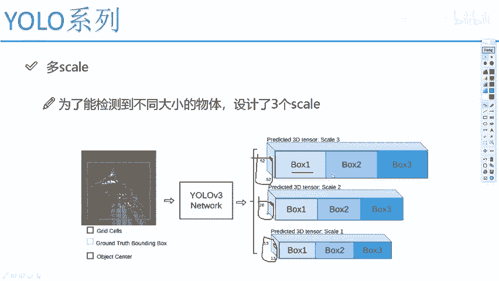
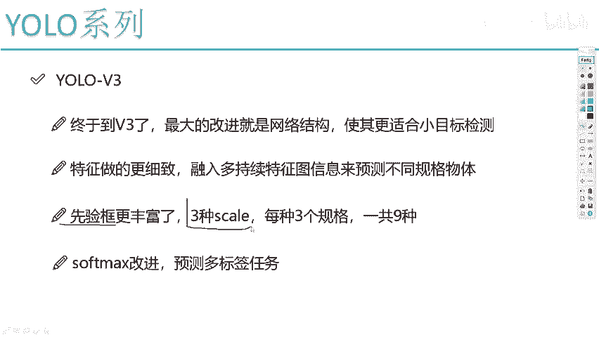
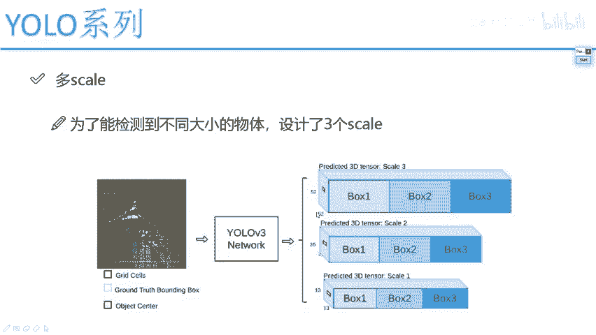
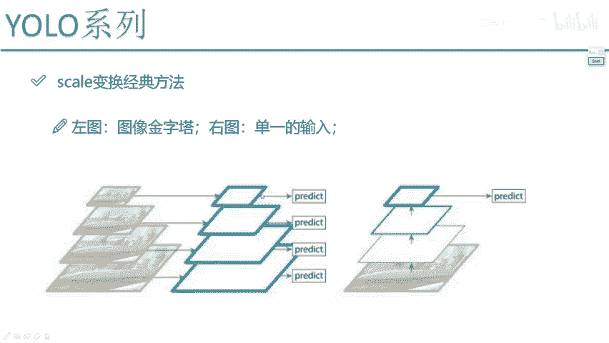
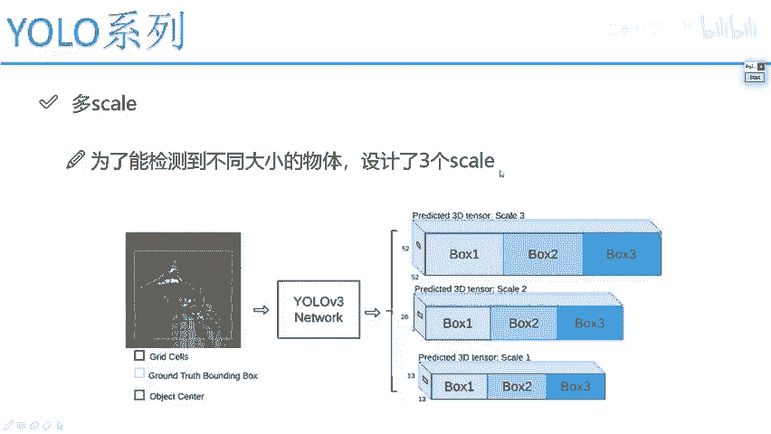

# 比刷剧还爽！【OpenCV+YOLO】终于有人能把OpenCV图像处理+YOLO目标检测讲的这么通俗易懂了!J建议收藏！（人工智能、深度学习、机器学习算法） - P63：2-多scale方法改进与特征融合 - 迪哥的AI世界 - BV1hrUNYcENc

好了我们来先先来说第一点，第一点是这个网络球当中啊，最重要一点他提出的思想，哎其实他这个我觉得不是他提出来的思想，因为啊当年的时候已经有很多，很多论文在做这件事了，叫做一个多SK多次SK有什么意思啊。

他说现在我要检测到诶不同大小的物体，那首先第一点物体啊它是有大小之分的，是不是有这么大的这么大的这么大的，在V2当中我们是不强调一点，哎我说啊咱们做那个感受野的时候。

我们最后一层的哎感受解最后一层特征图，可以跟前一层特征图，哎我说融合到一起，融合成一个大向量，但是大家来想一想，你说这么做好吗，这么多感觉是行，但是我给大家举个例子啊。

我说现在好比说哎你现在是呃有一个人啊，他那个他是就是有两有两个非常专业人吧，第一个人诶，他是专门做这个什么什么电电器的吧，然后呢第二个人他是专门做这个，怎么说专门做这个水电焊的吧，我也不知道什么东西。

随便想了两个词，那你说要把它俩融到一起，一起去做一个综合任务，这样做合适呢，还是我说电气的，你就把电器的给我做好，水电的你就把水电给做好，然后分别返回一个结果，那大家来想一想，你说哪种做法好啊。

那是不是说人家专业干啥的，你就让他干啥就得了，你给它们融合到一起之后，可能效果虽然说你说是在最后一层项目当中啊，拼音上之前的，那可能你把人家擅长的东西反而给淹没了进去，是不是人家电器上传的东西。

你融入到水电焊当中，那可能你只融进一部分人家擅长的点就没了吧，所以说啊在我们U鲁V3当中啊，它的网络设计它是这样了，既然我们的目标是有这个大中，小三种不同的物体好了，那就是术业有专攻吧，他说啊。

你这点哎你要预测大的，你单独取预测大的预测中的，单独预测中的预测小的哎，不是写反了，预测一个大的哎，这个是实战特征13啊，最后这个特征图大小是预测一个大的，因为它的感受也是怎么样，他是最大的吧。

然后呢26×26的，这是一个预测中的，然后52×52的就是最终特征数大小哎，这是预测一个小的，什么意思呢，就是说这个网络啊，我还就输入数据，还是经过了我这个网络，然后经过网络之后，那比如最后一层的输出。

最后一层肯定是最小的吧，我说假设它是个13×13的，然后前面还有一层，我假设这层吧，往前点它的特征图可能会稍微大一点吧，我说这是一个26×26的，然后这里啊我说再往前一点，它有一个52×52的。

那相对来说啊，是不是最后一层这个13×13的，他的感受也最大，所以说它就是专门预测大目标的，然后呢这个26×26的，他可能就是特征图是呃，他的感受也可能相当于中等一点，他专门预测终极目标。

不是就是中等那个中啊这个中的目标，然后呢52×52的，他的感受也相对来说比较小，那它是不是预测一个小目标就行了，V3当中啊，像我说的，那既然每个人都有擅长的点，那你就自己啊把自己这摊的事整完就得了。

哎这个是我们一会给大家去讲的，UOV3当中网络结构里边，当我们在预测的时候，我说这样吧，谁擅长什么，谁就把他们那些擅长的东西做好就可以了，然后这里先跟大家说了一下，就是有这个52×52，还有26×26。

还有13×13，哎这些什么意思，然后呢我们再来看这里，还有这个box1box2box三啊。

他什么意思啊，我们之前啊刚才给大家说的时候，我说这里啊，咱们的一个线框是不是更丰富了一些三种scale。

是不是说完了哪三种啊，13的26的，52的三种是吧，那每一种我都需要一些候选框吧，那好了，比如这里52×52的，我说他的候选框可能比较小啊，有这么大的，然后还有这么大的，还有这么大的哎三个是不是。

然后26的呢，它可能稍微大一点，有这么大的，有这么大的，还有这么大的三种吧，然后13×13呢它可能就更大了，就这么大的，有这么大的，还有个这么大的，哎，这是13×13的，所以说啊这里边每一种SCP当中。

我写了一个boss1boss2boss三，相当于啊这里边啊在每一种特征图上，我要产生出来三种候选框了，这三种这三种这也三种，然后呢，三个三种，是不是说一共啊我们就有九种候选框了。

所以说啊在这个U5V3当中啊，它为了使得我们的检测效果更好一些，诶它是设置了三种不同大小的一个特征图啊，十三二十六，52，以及呢在没有特征图当中啊，它想检测效果都差不多一点，但速度呢又不用太慢。

所以说它的候选框选择了是三个啊，这是我先跟大家说了一下，一会儿呢我们的网络结构啊，咱们的一个出发点要得到52，26。

还有13的哎，这个是我们的一个目标，然后啊在这个目标当中啊。

我需要先给大家来说一说啊，就是呃怎么样去得到这个52的，还有26的，还有这个13的，如果问大家怎么去得到大家，我估计很多同学啊都会告诉我，最就是最基本的一种想法是怎么样去做的，那就是一个CNN哎。

就有很多卷积层，那最后这个你说把13拿出来，这把26拿出来，这把52拿出来，那不就得了嘛，这就完事了呗，但是这么做合适吗，大家想一想这么做合适吗，给我感觉啊就是13的哎，好像说什么13的。

他是说它是包括了最后的一个特征，26个中间特征，52刚开始的特征，那好像是这样一件事，如果说啊这个东西我们用一个眼界来看啊，你说13的时候，这个人就像是岁数比较大的一个人诶，他活了100岁了。

他走的路比较多，他的眼界比较广，他能看清这个事物的一个本质，那所以说你说他做一个大目标检测行不行，没问题吧，对于这个13来说，它好像行，但是你说这二十六二十六好比说是个中年人。

这中年人啊就是刚经历这个社会啊，只是走了一半的路，他可能还不知道后续路该怎么走，对后续有些迷惑，那你说这个26这块的时候，他说他想预测一个中目标，但是呢他现在啊就是人到中年会迷茫，是不是当他迷茫的时候。

他该怎么办，他是不是得问问诶，一些仙人，比如说13，13对他来说是不是他的一个仙人啊，因为13在他后面把他没走路走了吧，所以说啊一会儿我会跟大家去说这个预测中，目标的这个26。

它会在这个13当中啊去借鉴出来一些思想，大家听我说法，大家说也明白了，我们需要把最后的一些特征图怎么样，想办法跟26的特征图，哎我们要做一个融合，这也就是说的这个到终点的时候迷惑了怎么办，看一看诶。

人家把后面路走完了之后，我管他去借鉴一些思想，那52呢52就好比说是个年轻人，他的目标他是他是要预测小目标的，但是他的眼界比较小啊，因为它只是这个CN当中的前一部分吧，那你说他是不是得又问问后人。

问问这个26哎，说你这个路怎么走的呀，后面有没有什么坑啊，我得把这个坑避开，先26取取经吧，所以说啊一会儿咱们在讲网络结构的时候，大家会看到我们的网络结构，不是说直接你最后一层就提个13。

中间就提个26，刚开始提52，我们需要再做一些特征融合诶。

