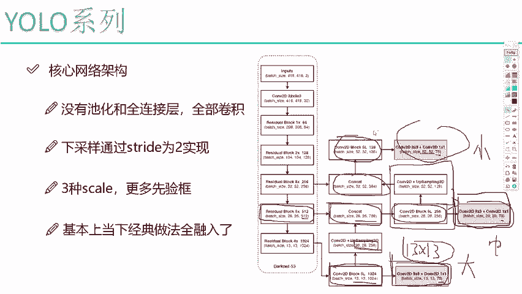
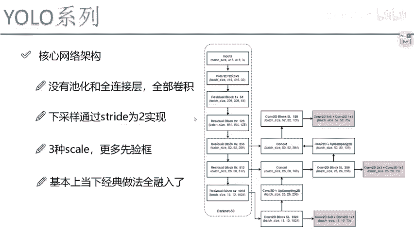
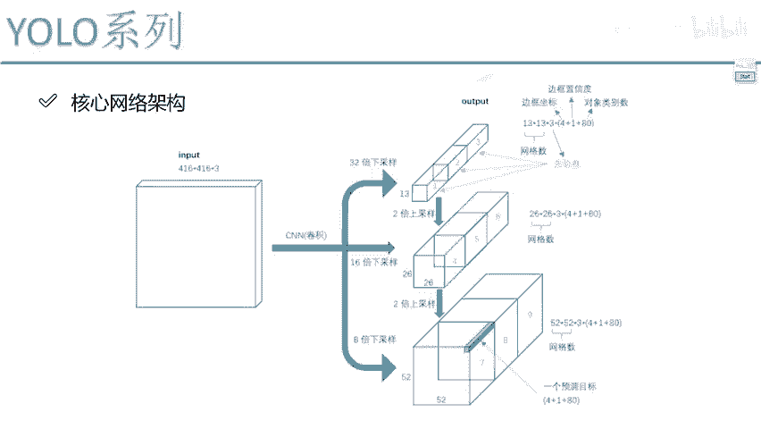

# 比刷剧还爽！【OpenCV+YOLO】终于有人能把OpenCV图像处理+YOLO目标检测讲的这么通俗易懂了!J建议收藏！（人工智能、深度学习、机器学习算法） - P66：5-整体网络模型架构分析 - 迪哥的AI世界 - BV1hrUNYcENc

然后呢，我们这个那什么我们那个U鲁V3当中啊，他给这个东西起名啊，叫做DARNET53啊，其实叫D2代53，你就把它当做是RESNET，是一样一样的，没有什么区别，我们来看一看嘶输入来说啊。

跟之前没什么变化，然后这里呢你看这块它有什么，这是一个残差的block吧，这也是一个残差block，这是乘1×2乘8×8乘四，相当于我重复堆叠多少次啊，这个意思，因为这个网络图太大了。

你把它整体的一层层画画不下，所以说呢他把所有重复的部分哎都标出来了，只有一层二层，还有八成，还有四成哎，这些都是一些残差模块，然后我们来看一下这个网络结构啊，我先给大家说一下这个特点，最大的特点是这样。

他说这个网络当中啊，没有池化，全连接层，没有全连接层，之前在VR当中，我是不是都大家解释了哎，全连接这个东西嗯其实不太实用，是不是我们去掉了，为什么也不要石化了，石化把特征给做压缩了。

我特征图会就是我特征图会做一些压缩，那反而可能效果还不好，他说这也这样，你石化我这回我都干脆不要了，好全部再来干卷积，那大家可能会问一个问题，你全做卷积的时候，特征图啊怎么样变成原来的1/2啊。

你看这块这是416的，这是208的，那这东西怎么去变的，其实我们只需要设置一个参数，是不是就可以了，设置一个参数，这里哎我说现在stride默认就是卷积，THRIDE为解为一吧。

唯一的时候我们那特征图大小是不变的吧，那straight为二的时候，一次我说我滑动两个单元格，能不能让我的一个特征图大小，变成原来的1/2啊，就是HW都变成原来12，肯定可以的吧。

所以说啊在这个优鲁V3当中啊，他说哎池化你也上一边去吧，不需要你，我全部用卷积，然后呢但凡我需要下载的地方，我说我thread为二，不需要下台的地方，thread为一是不可以啊。

好了这个是它的一个特点啊，只有卷积了，哎其实现在所有算法当中都有这样一个趋势啊，因为卷积省时省力，速度快，效果还好，所以说能不用的东西咱就统统不用了，全用卷积咱俩去玩，然后呢我们来看在这个结构当中啊。

你看这个最后一个这个13×13的，哎，不是不是这这块这块，最后啊，这里咱们得到了一个13乘上，一个13的一个结果吧，咱们先不用去管啊，最后这个什么75啊，是什么意思啊，以及一些其他值。

一会我跟大家去说啊，这里边我们都要预测哪几个指标，这张图画75，可能其他的地方就不是75了，因为不同数据集它是不一样的，大家不用去管啊，那这块我们来看它是不是13×13的，相当于要预测什么大目标吧。

好了，那这个呢是我刚才说的26×26的，这是中目标，然后这个东西它是个小目标，你看他怎么去做的，在我们得到了13×13这个特征图之前诶，是不是也是个13×13乘1024的，哎，这是不是实际特征图啊。

然后最后我现在拿蓝色画吧，我蓝色的是我输出结果，我红色的是前面这个13×13成交量，24是我特征图吧，他说好，我把这个特征图怎么样做一个上采样操作，并且这个上采样做完之后还要再做卷积啊。

我说把它变成一个26×26的，可不可以可以吧，那我们来看，现在我说啊，这个当我做了一个上采样和一个卷积之后，得到了一个26×26乘256的，然后呢我说我要做一个融合了，是不是啊。

之前我们来看之前那个26×26的，它是乘512的吧，好了，我说这俩规格都一样的，我一拼不就完事了，拼完得多少，26×26乘768了吧，好了，那你说这个是我现在一个特征了，对于这个特征。

我说我再做卷积进行信息再提取，然后我再完成最终的一个预测，可不可以，那最终你想我现在黑色框，且这部分它不光有26×26的信息了，还有什么它后面录的信息吧，因为这一块我们上采样进来，还有一些信息吧。

好这是一部分，还有一部分呢，你看这里对于这个52×52的，它到底是不一样的，在这一块我们是不是也做了一个上采样，上传完之后，然后怎么办，再给它拼在一起，再做卷积，得到我最终的一个输入结果。

是不是就可以了，所以说啊从整体的一个思想来看，嗯其实我觉着没什么太大难点，就是基本的一个残差网络，参，网络当中呢得到了三种不同输出的一个特征图，诶，一个十三二十六五十二。

然后为了使得咱们特征图啊能够做的更好一点，他也说了，不光有哎咱们之前的一些信息，你还要把之后的一些信息，我也融入进去，这样我们这件事是不是就做的会更完美一些啦，好了这里啊给大家解释了一下。

就是在我们的网络架构当中。

整体的一个模子。

