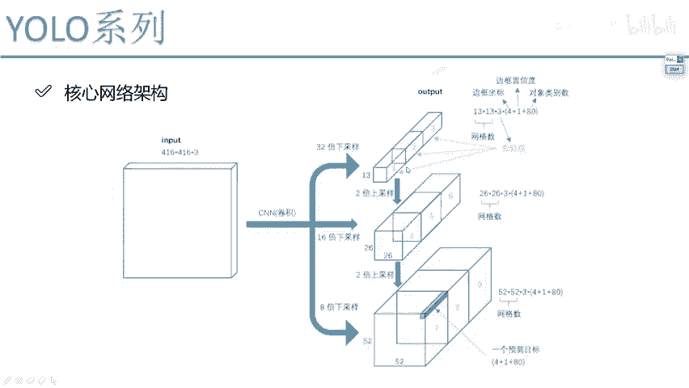

# P67：6-先验框设计改进 - 迪哥的AI世界 - BV1hrUNYcENc

其实这张图当中啊画的已经是很清晰了，对于我这个数来说，哎我要做卷积，卷积当中呢，你看有不同的一个采样倍数，就是经过了多少stride为二的一个卷积，32倍的，16倍的，八倍的是不是都有啊。

然后呢我给大家来说一说，就是最后啊，比如说你现在要预测这个结果，它是个13×13，然后再乘三，再乘85，哎就正常情况下咱们应该是这个值啊，但是你不同的数据那可能是不一样的。

为大家举例说明一下13×43是什么，是我们网格的一个大小吧，哎这是我们网格啊，咱的一个大小网格数来，大家想一想，U6V1当中网格多少，7×7吧，U6V2当中的1313吧。

V3当中呢V3当中多少它是一种吗，不是吧，13的，26的，52的有三种吧，好，这个东西，我们现在说的就是跟之前咱说那个网格诶，它俩是一模一样的，现在呢我得到的是一个13×13的网格。

然后这个乘3×3什么意思啊，我们刚才是不是说了，你看这个box一box二boss3，我们是不是说啊在每一个就是网格当中一个点，我说我要给它产生有这么三种不同的先验框，是不是，这是先验框的个数吧。

我也都得到吧，好了，13×13乘三，然后还有85，85，什么意思啊，85这样85它是一个80，然后再加四再加一四啊，这个归大家肯定很理解了，bonding box就是我预测出来啊。

我的一个XYWH哎那几个偏移量吧，然后一呢一就是那个competence，就是它当前是不是一个前景还是个背景，它是一个就是物体的一个可能性，就这个一吧，只要80啊，就是说咱们当前这个数据集当中啊。

一共我们是有80个类别，那你是不是得每个类别都判断一下，他是不是这个类别啊，一会我给大家说怎么样去把sd max转换，这个是一个85啊，所以说当大家看到这个什么13乘，13×3乘85啊。

你理解一下其中每个数就行了，可能啊就是你看的图，如果说是不同数据集上的，最终这个80可能不一样，但是前面这个四一还有十三十三三哎，这些值啊都得是一个一样的啊，这个就是我们的网络结构，其实跟这个VR相比。

也就是我们做了一些网络细节上的改变而已。

好那来看一下线框吧，现框当中啊，我们之前VR当中唉说给大家说了，聚类去做吧，聚类能有一点好处，就是更符合实际的一个情况吧，但在VR当中啊，他也这么去做的，哎不是在B3当中他也这么去做的。

只不过说呢他又多做了一些事啊，他说这里诶他说我选九种，但是呢这九种不是说啊对于每一种，就是不是说对于每一个格子当中哎，每一个点都要预测九种，它是给它分了几对，为大家来看一看九种都有哪九种。

他说啊他做完做完了一个聚类之后，哎他得到了有这么九种吧，常见的一个规格，然后他分类一下，他看什么，他说这个规格当中啊，哎呀有些比较大，你看我现在黑色框有这些，这些是比较大呀。

那这些大的先验框哎你说交给谁合适，那是不是说交给13×13那个特征图合适啊，因为它感受也大呀，它适合做大目标的，是不是好了，像我刚说的术业有专攻吧，他干水电的就是干水电的，干电气焊的，就是干电气焊的吧。

干拖拉机的，干挖掘机的，那你不能让他们混着使啊，所以说我就把诶这些大框大的线框交给谁，那肯定交给13×13的，是不是，然后再往下看诶，他又发现了有三个框，相对来说比较就是中等大小的。

中等大小教育谁交给这个26×26的吧，这是中等大小的，然后呢最后这个最后这个多少，那是不是这个东西就比较小了，那小框谁擅长做小框啊，52那个特征图，那哥们人家擅长做小的，你让人家的线框就选的比较小。

是不是就会会更合适一点啊。

所以说啊在V3当中啊，我们的先验框的选择相对来说是更科学了一点，不像那个V2当中啊，就是也不管你大小了，反正就是每一点你都预测五个啊，然后然后最终得到结果，V3当中呢相当于哎我先给它画分分类吧。

有三种不同的一个擅长的一个特征图，你擅长做什么，你就去预测什么，这就完事了啊，就是跟下面列这个表当中是一样的，根据咱不同的感受，也诶每一种匹配了，咱们现在有这么三种框，这个是跟V2来说啊。

咱们不同的一点哎，V2直接去做的，我们现在呢多做了一个划分啊，自己玩自己擅长的看一下吧，这个就是呃在图像当中啊，咱的一个结果图都是相同的大小，但是呢我们来看啊。

黄色的表示的是一个就是ground truth，就是一个呃标签吧，然后这个蓝色的就是咱们那三种候选的，你看在13×13特征图当中，蓝色的这三种框比较大，是不是26呢，就是中等吧。

然后52当中这是不是就比较小了，哎这个大家看了一下，就是咱们这个先验框诶，我们做出来的一个结果，从大小上来说啊，大概是长什么样子，最终啊反正就是基于这三种线框，咱们做一些微调诶。

