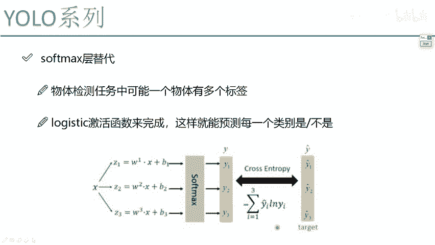
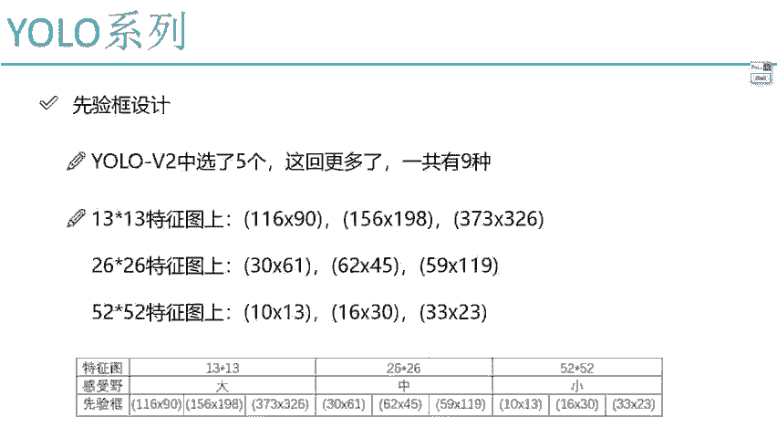
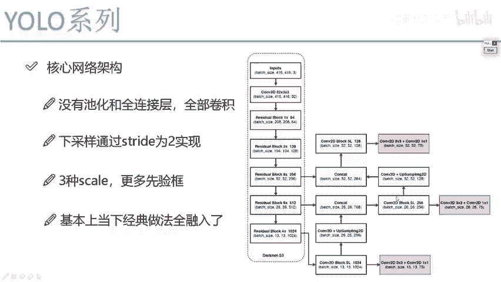
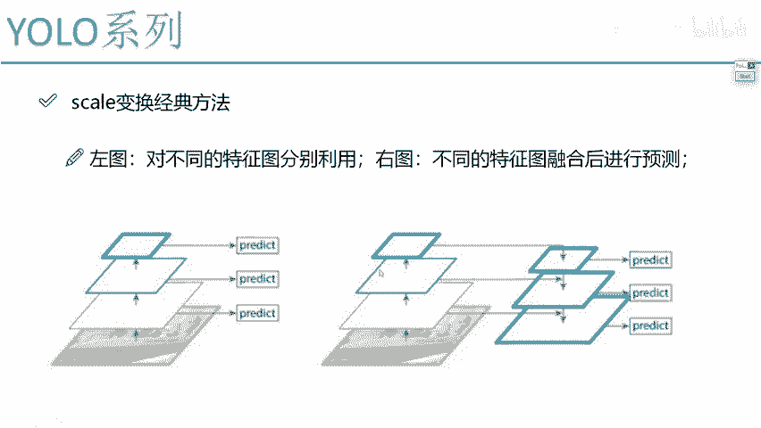
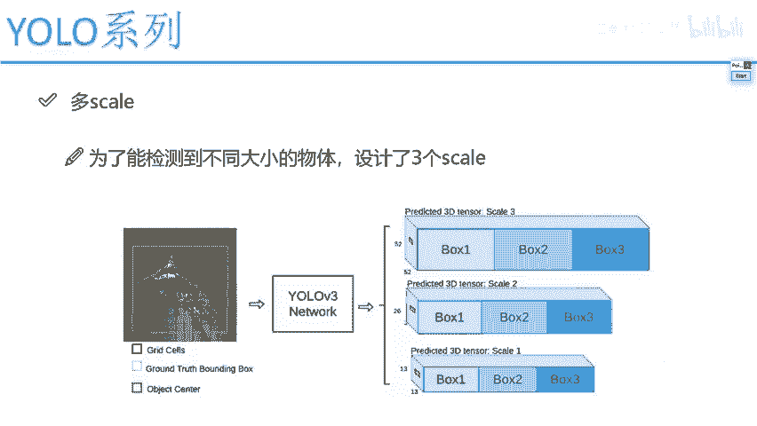
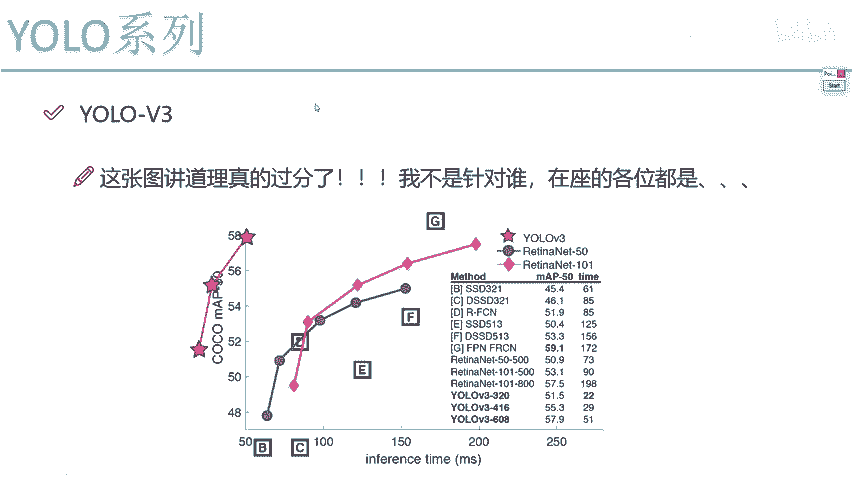

# 比刷剧还爽！【OpenCV+YOLO】终于有人能把OpenCV图像处理+YOLO目标检测讲的这么通俗易懂了!J建议收藏！（人工智能、深度学习、机器学习算法） - P68：7-sotfmax层改进 - 迪哥的AI世界 - BV1hrUNYcENc

好了，然后最后一个点最后一个点就是他的一个sd max，Sd max，他说这样一件事，刚才说给大家解释过了，他说我们最终要预测结果，那可能不是只有一个标签，它不光是个狗，它还是个哺乳动物，它还是个动物。

它还是个哈士奇啊，所以说我们现在有很多标签，如果说你直接用这个salt max去做，那最终损失函数怎么算的，哎，最终损失函数是不是这样的，sd max当中我给大家画一画呃，损失函数它是个对数。

是不是在对数当中啊，我们要看一下它属于正确类别那个概率值哎，注意点，我们只看它属于正确类别概率值吧，比如当前啊一个预测它原始它是个猫，然后呢预测出来它属于100个类别的概率，我其他类别概率我不管。

我只看它属于猫这个类别的概率，比如等于0。8，那是不是0。8跟这个一样，100%差一点，所以说啊最终的一个损失值是在这个对数图像，这是不是对数图像当中，我们去看啊，第二图像当中这个值为几一吧。

这个值为几零吧，所以说你看当一个预测正确概率越高的时候，就是越接于一这个点，它Y上的值，或者说它的损失值怎么样，越接近零吧，就没有啊，预测对了，正确率也百分之百，哪有损失啊，那预测越差呢。

就是等于正确类别，本来是个猫，你预测猫等于个0。1，那你是不是预测越差呀，然后你就看我虚线这个绝对值，因为这个东西它前面还有负号吧，所以说你看它的绝对值就行，它怎么样，它的一个损失会越大吧。

这个是在那个salt max啊，也就是我们通常叫的交叉商哎这样的一个损失，这东西啊，你看显然跟我刚才那个多标签标签任务来说，是不符合的吧，所以说这里我们这样，这里呢他说你也别做这个读标签了。

那比如说类别当中啊，有好几个类别啊，有这个猫的，然后有这个狗的，哎呀这写不下了啊，就随随随随便写吧，一堆他说每一个咱能不能都做二分类，每一个是不是猫，是不是狗，比如是不是猫得到概率是0。7。

是不是狗得到概率是0。3，然后是不是我想想还有还有什么猫，还有个就随便写吧，就大猫小猫吧，反正都是都是它的标签，大猫的概率，比如说他是个0。8，然后小猫的概率，小猫的概率它是一个0。9。

然后其他的是飞机的，是大炮的概率是不是都能算啊，那最终结果怎么办，最终结果说这样吧，我说取这个阈值吧，阈值但凡大于0。7的，全部是属于的，那一看最终列表什么有猫的，有大猫，有小猫的，是不是其他不属于的。

我就不管了，只把大于我阈值拿出来，是不是就得了，所以说这里啊当我们这个V3版二当中诶，他做这样一个改进，不光我们结果能预测诶，它是属于某一个类别，还可以去预测一下，就是它属于一个多标标签任务。

这个也是有了V3当中能去做的，在salt max层当中啊，又做了诶一些改进，这是V3版本他做的全部的一个升级内容了。

行这里啊，基本上已经给大家说完了。

就是在V3当中，我们的一个核心网络架构，也就是大内53，其实很简单，残差这个东西残差block，只要你能去理解，以及呢咱们这东西为什么要做上采样。

这东西大家明白什么意思，我觉着用了V3，咱就给大家讲完了。

已经因为从它的一个整体的网络，和从它的流程来说没有什么太大的一个区别，跟他的V甚至说跟V1版本来说，只是在网络细节上做了一些改变。

是不是好了，这个就是能达到非常逆天的效果的一个V3啊，但是这个只在当年啊，现在来说啊，就物理检测当中哎用算还挺多的，但是大家反正都有个习惯，都愿意去用一些经典的，是不是一些最新的可能大家反而不愿意去用。

因为经典的被人证实过了，也有源码也好用，哎所以大家用的最多的就是尤鲁VCR这个版本，记住一下他这个图吧，啊记住一下他这个图有多过分就行了，把自由真的我就是看这么多篇论文啊，这是唯一篇论文。

说能把自己的结果给他跃到第二象限上去啊，然后去秒杀一下其他结果，他这个坐标点起始位置，他拿个50来玩，他不拿个零，这点真的太有意思了，我当时看这篇论文的时候行了，这个跟大家说了一下，UOB3当中。

我们所有的一个细节主要在网络结构当中。

