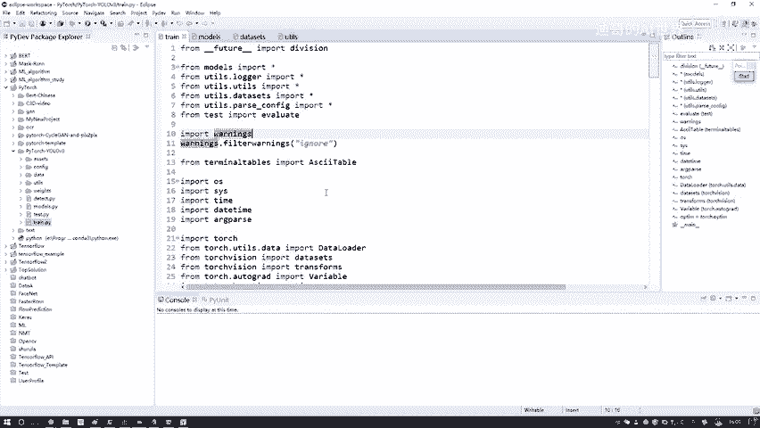
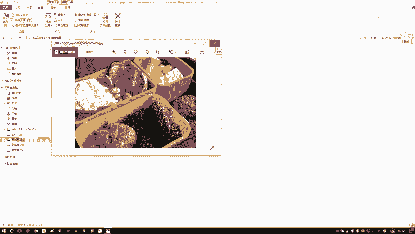
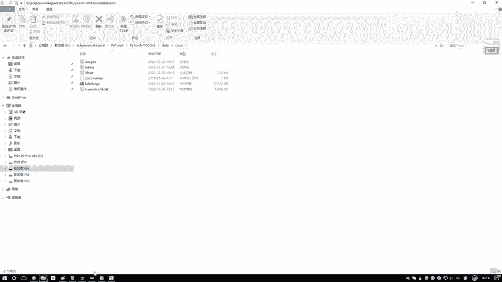

# 比刷剧还爽！【OpenCV+YOLO】终于有人能把OpenCV图像处理+YOLO目标检测讲的这么通俗易懂了!J建议收藏！（人工智能、深度学习、机器学习算法） - P69：1-数据与环境配置 - 迪哥的AI世界 - BV1hrUNYcENc

之前啊给大家说了一下，在yo当中啊，V1V2V三各个版本当中一些改进，还有细节，今天这节课咱们要从实战角度出发了，在代码当中给大家讲一下yo v3版本，哎咱们讲的是V3V3，所有的实现细节。

整体的网络架构怎么去做的，每一行代码什么意思，我们该怎么样把最终啊预测结果给得到手，这个是我们本节课咱们最核心的一个任务啊，然后呢在讲之前，我先跟大家说一下我们所需要的一个配置环境。

我希望大家就是自己能够动手啊，把这个任务哎，毕竟我们自己做一遍，能对这个任务印象会更深刻一些吧，我先跟大家说一下，就是咱们当前的一些环境呃，首先啊需要大家准备的就是一个ide id啊。

就是说呃你Python编程的一个工具，这个工具啊就是也没有什么限制啊，我给大家说下，我这个我这个东西啊叫eclipse啊，它是既能写Python，又能写这个C的，还能写java的，相当于呃万能吧。

写什么语言都行，因为我有时候要写一些HADOP的，所以说我愿意用这个eclipse，但是大家你们可以选择自己喜欢的，你不用这个ELISE，你用PCHARM啊，或者用一些其他id，这些都是可以的。

没有什么限制，喜欢用什么咱用什么，或者说之前用什么，用什么也可以，那如果说啊大家之前没用过id，那我建议还是跟我一样吧，你就别想其他了，毕竟有些配置可能稍微的不是特别一样，但是代码都是一样的。

如果大家以前诶没用过eclipse，或者说以前用其他的，你想用跟我一样的，你可以去找个教程啊，就是你在百度上一搜这个东西，教程满地都是啊，你搜一下eclipse Python，你就能找到诶。

人家会教你一步一步，怎么样把这个lips给它配置起来，其实很简单，几分钟时间下载个软件，一装就完事了，当然大家自己选择自己喜欢的，哎这也没问题的，这是第一个事啊，需要大家装一个eclipse。

因而不是eclipse啊，就是需要一个id，因为后续啊我会给大家进入到debug模式。

debug模式啊，就是这里我会给大家咱们一行代码，一行代码往里跳。

因为我们讲整体代码，可以说啊整体代码来说是相当多啊，里边的一个模块有这么多模块，如果说啊我每我单独给大家讲哎，这个模式做什么的，那个模式做什么，你好像没有一个整体的流程。

哎不知道这个代码从前到后怎么走的，但是呢我们进入到这个debug门当中啊，相当于呃代码它代码它怎么执行的，我会一步一步进行追踪的，所以说我觉着debug模式是适合大家学习，也是适合我啊。

给大家做讲解来做演示的，这个就需要有一个哦id了，在这里你看我能打上一个断点啊，相当于我希望代码在什么位置给它停下来，这个是需要大家第一个先去装的，叫做一个呃id，然后第二需要去装的叫做一个框架，诶。

这里给大家选的是当下用的最多的，最流行的这个PYTORCH框架，可能大家以前啊如果有同学啊，对这个PYTORCH框架，你说你以前不太熟悉啊，或者以前没用过呃，有两种方法，第一个你听我给大家通俗去讲。

因为这里呢我会给大家说一下，PY套当中还有些基本用法，我都给大家稍微带一带，如果说大家啊还想把这个东西，你想掌握的更深刻一些，也可以参考一下我的课程，我的课程当中有PYTORCH实战这个课程。

PYTORCH实战当中啊，会给你详细去讲啊，PYTORCH哎一步怎么去用，怎么用PYTORCH框架做各种各样实际的项目，咱们这个课程当中啊，是直接用PYTORCH框架来去玩的。

所以需要大家就是呃你得把PY套这个框架，我们得配置起来，一会儿呢会给大家录一下怎么样去装诶，Python这个框架，这个是咱们第二个东西，一个深度学习框架，有这两个来说啊，基本上就差不多了一些。

其他的像是南派啊，pandas as这包啊，这我就不说了，都是一些必备的啊，好了，我们两点必须的，第一个IDE我们要打断点做一个debug模式，第二个配套的框架，你需要自己啊给它安装好。

这个是我们的一个环境。

然后呢我再说一下我们的一个数据啊，数据当中，这样我给大家进入到咱们这个数据当中，这个数据啊需要我们大家自己的去下载一下，因为这个数据量其实还蛮大的哦，迪迪自己把它下载下来。

我可能没法把它放到我们开始当中，这个需要大家我们自己来完成下载，你看我这里，我当前这个项目已经达到了19。2G啊，其实代码不占多少，模型也不占多少，主要就是什么，主要就是我们的数据啊，我给大家看一下。

在这里要给大家选的就是跟论文当中啊，是一样的，是那个coco数据集，也就是这个coco数据集在这个code数据当中啊，就是到时候大家下完之后，我会一会会给大家去说啊，到哪儿去下。

然后这里有一个images，就是我们放数据的地方呃，这里吧你用什么数据都行，但是你得确定一点，你数据啊下载的一个位置和你标签诶，它要对应的，它有好多版本啊，这个coo当中你下这个2014的哎。

就比如train2014的，那你标签也得是2014的，这两个别吓混了，我这里用的就是train2014和VOALIDATION，2014，因为我电脑里本身就有这两个文件夹，我就不下其他年代的版本了。

然后进去之后给大家看一看，大家可能如果说你用笔记本打开啊，会比较卡，我这个机器比较快，所以打开比较快，这里边每一个它都是实际的一个图像，你看这是其中一个图像，那这也是其中一个图像，一些图像当中啊。

它会有一些物体，有一些信息，咱们以MAGINEVR当中啊，包括的就是所有的图片的数据，这里是所有图片数据，我们有两个文件夹，一个是train2014，一个是validation，2014。

相当于啊一会儿我要去呃，有这个训练集，然后呢我也会有这个验证集，咱们训练的时候是都需要用上的，Valudation，2014其实也一样的，也是一些图像，只不过说它不是炫技当中。

那些图像都是生活当中一些实际的场景啊，这个挺好吃的，你也不用管是什么了，就是一些图像数据哎，这个是imagine VR当中啊，我们有两个啊，数据集，两个文件夹，二都是一个数据集。

code数据当中train2014，还有validation2014，然后呢，接下来还有一个labels文件夹在这个label VR当中啊，其实对应的也是一样的。

也是这个train2014和validation2014吧，点进来看一看，这里边它都是一个TIT格式的，我随便大家点开一个，我们来看一看，随便点开一个它是什么，它都是一些什么坐标值吧。

这个坐标值啊表示的是啊。

当前它属于哪个物体，有这样一个框，哎这样吧，我用这个呃其他其他的编译器打开，我们来看一下这里，他说这样一件事。

就比如说我看要打印哪一个，打开这个你看啊，我给他找一下他这个名字吧，我把这个名字CTRL加C啊，然后复制一下，复制完之后呢，然后我在这个客户当中。

我说呃在imagine当中吧，穿204老师，我去查一下，查的时候是不是能查到我当前的对应图像，所以说他们的一个呃图片的名字和label的名字。

它俩之间是一个一一对应起来的。

这就是我那个label文件吗，然后你点开这里，点开这里之后啊。

哎呀把它缩小一点吧，然后左边是个图片，右边是个标签，他就说啊当前这个图片当中哎它有几个框。

你看有几个，12345678诶，他说啊当前这个图像当中啊，有这么八个框，这是我们的一个标签值啊。

也就是我们的一个label，他俩在文件夹这个名字当中是一一对应起来的。

所以说啊大家需要准备的就是呃我们这个数据，还有一个标签，到时候啊我看看我这个能不能打包吧，能打包，把这个给大家打包好，大家就不用去改了，如果这个实在太大了，网盘上传不上去。

那需要大家直接在那个客户官网当中，你得自己去做一个下载，下载完之后，你把这个imagine labels诶给他搞好就行了，这就是我们的数据，还有标签存放的一个位置，然后呢不光有这些哎呀其实还挺麻烦的。

还需要有两个。

我再给大家说一下，这块还有一个train validation点TXT，我点开来看一下这个TRAFDATION点TXT啊，它是这样，当我们实际啊再去读这个数据的时候啊，它其实不是直接的去把你那个呃。

直接不是直接在VR当中读数据，它是需要先传进来一个路径，就是你那个数据存在哪，这个叫什么，这个叫train validation5K点TXT，它里边就包括了咱们所有训练数据诶，它的一个路径。

你看这是一个路径吧，到时候啊，咱们读数据会基于这里边给出来的一个路径啊，来去读数据的，这是咱们读数据的一个路径，然后等一会儿啊，在代码当中啊，我会跟大家去说啊，怎么样去设置诶。

咱们这个路径其实你放到哪儿都行啊，也不一定非要他这个他这样的一个位置，你自己放到其他位置，你说你把这个做一个替换，是不也行啊，只需要你指定一个TXT文件，这个TXT文件当中存的是所有咱们训练数据哎。

它的一个路径就行了，这是我们这个数据个十百千万10万哎。

十多万张图像数据，然后呢这块还有一个5K点TXT。

我们再来看一下它打开完之后这是什么，这就是一个validation吧，你看这是VL2014，所以说有一个train啊。

我们所有路径还有一个validation，咱们所有路径这些啊，就是大家诶你们需要自己先整好的，就这几个，我给大家就是拿蓝色标一下，这些是我们需要有的东西啊，一个实际的数据，实际的标签儿。

然后呢我们的一个train数据，它的一个位置，一个VOIDATE哎，这个5K点TIT一个VOIDATION数据，它的位置有这几个就行了啊，这个是咱们这个数据。

因为代码当中我们实际要构建一个generator，生成器，需要我们的数据，还有标签的好，这是我们的一个data，data完之后，然后这块还有个CONFIG文件夹，我们点来看一下这个CONFIG当中啊。

哦我们直接看这个吧，咱先不看这个customer，customer相当于是你自己数据集，咱看这个YOLOV3，然后点CFG，他啊就是你的一个QQ数据集啊，我们该怎么样进行一个配置，我点开给大家来看一下。

在这个数据集当中啊，它就包括了就是呃有你需要的一些参数，还有咱们网络模型啊，所有的一个网络结构了，你看下面这里，比如说呃它有一些卷积层，那卷积层当中你要得到多少特征图啊，你的一个卷积核大小啊。

stride padding都为多少，这个就是说呃他按照从上到下的一个流程，一步步去做的，因为一会啊我们会构建一个DARNET是吧，在构建这个dr net过程当中啊，我们会读这个配置文件。

基于配置文件当中啊，这些所有参数，我说第一个这是呃就对应好了，这是第一个层，然后这是第二个槽，我们会在配置文件当中把这些参数读进来，然后呢一个一个卷积网络去做这样一个对应，然后前面它有个名字。

这个名字啊，你看它有名字，这块就是说它是卷积层，这也说它是卷积层，那下面这些就是卷积层，它所涉及到的参数，这里边不光卷积层，还有其他层，为大家来看一看，你看这个还有什么shortcut吧，这是什么卷。

那个残差连接当中from等于三，就是你想连前面多少层，然后做一个残差连接，这些啊就是我们所有网络的一个配置文件了，从上到下网络一层一层都是怎么连的，这里啊给你详细的去写了。

然后最后啊最后的时候它有优了层，最后这个优路层啊，相当于就是呃你的一个候选框了，你看这一块儿它有这么九种候选框是吧，然后当前这个yo操，我们不是说有三种吗，一个是13的，26的，还有52的代码当中。

我们会给大家体现出来啊，不同的层，你在这个候选框当中，那比如说这块，比如说吧它是一个呃52×52的，那它是个最小的，那他可能选择前三个，这个是不是，所以这里啊我们不光是有卷积层，所有的一些网络配置的槽。

全部在我们的当前的点CFG诶，这个配置文当中一块代码里啊，我会把这个配置员读出来，基于配置文件当中啊，每一个层咱们来实际的把呃网络的一个结构，还有参数全部加进去诶，这就完事儿了。

这个就是需要大家我们掌握的呃，有两个吧，基本的东西，一个叫configure，还有我们的一个配置文件，一个是data，我们都要coo数据集，我建议大家就先用这个coo数据集吧，因为毕竟是比较经典的。

你要嫌大，你说你用其他数据集也行，但是呢你得得在代码当中，你得把这个数据处理的一个代码，还有标签处理代码稍微改一改啊，然后就能去做一些其他数据集了，后续我也会跟大家说啊，咱们该怎么改这些。

这两个相当于是最核心的，先把这两个事儿咱搞定，configure这个东西啊，都给大家上传进去的，这个大家不用自己去做了，但数据我不确定能不能传上去啊，传不上去，我给大家一个coo的网址。

到时候大家你就直接进客户网址当中，自己下也行，客户当中里边有2014，有2017哎。

