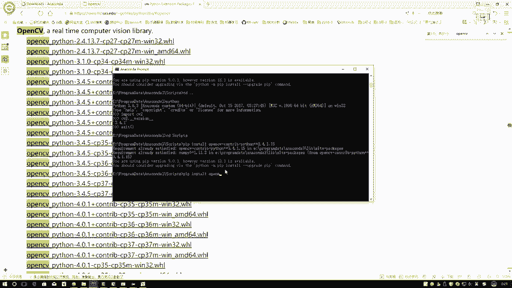
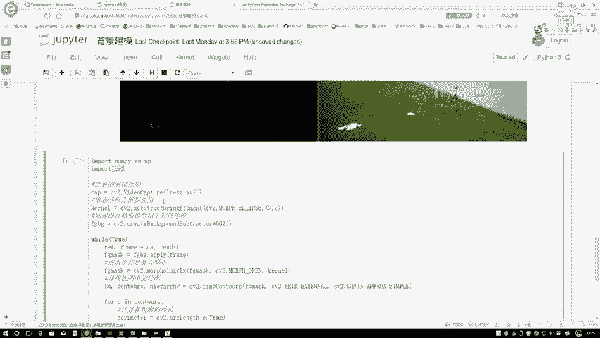
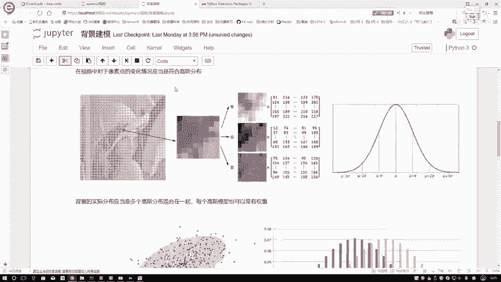

# 比刷剧还爽！【OpenCV+YOLO】终于有人能把OpenCV图像处理+YOLO目标检测讲的这么通俗易懂了!J建议收藏！（人工智能、深度学习、机器学习算法） - P6：2-Notebook与IDE环境 - 迪哥的AI世界 - BV1hrUNYcENc

然后再跟大家说一点，就是我们不不光是open CV，我怎么去装，其他的时候你用到了，可能课程当中会用到一些额外工具包，其他工具包安装方法都是一样的，我们可以先尝试一下pip store。

然后打上工具包的名字，看一下呢这个东西能不能装上，如果能装上，那就最好了，我们就不用管了，如果说装不上的前提下，再给大家说，第二招，在这里这个界面这个界面它是一个，你看一下。

它是一个windows的一个非官方的一个Python工具包，安装的一个地址，然后这一块他又收录了好多工具包啊，比如说再来看一下吧，在这里CTRLF一下，CTRLF一下，让我搜一下。

比如说我就想装这个open CV，然后呢我点进去，刚才就假设说吧，在这里它装的时候就是pip store的时候直接装。

哎呀出现一些错误，这错误呢可能由于就是一些版本不匹配，或者各种各样原因导致的，我们可以在这个网站当中去搜一下，有没有合适的一个版本，在这里啊，所有open CV当中给大家解释一下。

它会出现这么一大串子字面串的当中啊，第一个位置它是一个文，就是当前工具包的名字，Open cv python，第二个是它对应的版本号，2。4版本的，3。1版本的，3。4版本的，甚至最新还有四版本的。

因为四版本这个东西啊有点太新了，我觉着可能会遇到的坑比较多，现在啊就公司企业当中啊，基本上还是用2。4或者是3。3，版本的比较多，所以说咱们课程就不以四版本去讲了，因为四版本比较新哦。

里边估计坑是挺多的，等之后啊把所有坑都人家都踩完之后，你工作当中啊，如果是用到四版本，咱们再进行升级啊，咱们课程当中就不先涉及四版本的东西了，然后呢咱们来看一下这一块，这一块还有CP35。

CP36CP37分别表示着你的一个Python版本，最后呢win32，win64表示着你的一个操作系统，你选择你对应合适的一个，就选择你对应你需要的东西就可以了，在这里比如说我需要问CV Python。

然后是64位的，我是一个3。6的Python，那按照我刚才这个东西，是我点开这个东西可以了，下载完之后啊，它是一个点WHL文件。

这个文件啊不需要你操作任何东西，你把这个文件直接复制到一个位置就行，或者是你复制到咱这个scripts文件夹当中，比如说在这里我复制过来之后。

你看这块它是不是有一个东西叫做一个open CV，Python杠3。4。5，Ctrl cv36，然后CP36，win64点WHL复制过来之后，它就是我下载的结果，直接执行一下回车，这就完事了。

因为我这个已经装了一个3。4。1啊，我就不给大家再去装这个3。4。5了，到时候如果说大家遇到一些问题，我们可以去下一个点WHR文件来进行安装，但是呢就是这个网站收录的，基本上都是一些最新版本。

如果说你要安装一些老版本的话，那你还得自己啊，百度或者谷歌，咱们查一查有没有一些老版本啊，供大家进行选择的，基本上随便一搜都是挺多的，这个就先跟大家说了一下嗯。

咱这个open CV啊该怎么样进行一个配置，然后呢咱再说第二点，就是我们系列课程当中，我们的一个写代码的环境，在这里我们大家就先点这个ENECA3，那你看到三当中啊，有一个东西叫做一个notebook。

我们可以把它先打开来看一下，这块呢我直接打开了，就你点一下这个notebook，它会先弹出来，我看一下它会先弹出来一个黑窗口呢，应该喂，我看一下这里，哎他应该会有个弹出黑窗口，我找一下哦。

在这呢这回这这块有黑窗口，这个黑窗口弹完之后，它会在你浏览器当中啊，弹出来这样一个界面。

比如说这个就是我起始的一个界面，在这个界面当中啊，我们就要去写一些代码了，如果说啊大家在这个界面你没打开，那检查一下浏览器，就是你的一个浏览器，它的一个配置，或者是有没有一些就是阻止了一些窗口弹窗啊。

或者是你的防火器，就是你的防火墙啊，有没有阻止一些东西，咱先讲下这个事，或者说呢你可以这样，如果是浏览器没自动弹，你把这个东西什么local host888端口，CTRL加C1下，在这里。

比如说在这块这个咱呃这个还得用我这个吧，哎呀你看也用在这块吧，直接复CTRL加CTRL加V1下，你把这个东西啊复制到浏览器执行一下，是不是也能到咱当前这个位置当中啊。

这个就是我们当前给大家准备的一个环境，这个环境当中你可以去新建一个Python，在这里再来看一下吧，就是建完之后你可以试一下这个东西好不好用，print一下，那算了，Print open cv，得了。

open CV shift加回车执行一下，执行出来结果是就可以了，这个就是咱的环境。

这个环境我觉得比较简单，我我不用给大家多做介绍了，在课程当中，我觉得就这个东西大家简单摸索摸索看一看，看我怎么执行的，就一眼就出来了。

他这操作太简单了，我不给大家去说了，然后跟大家说一下，就是咱这个呃就是用这个它用咱们这个notebook，他去写代码的一个好处，我随便打开咱们这个课件来看一下吧。

比如随便打开一个，随便打开这个吧，这个就是我们其中一课叫背景建模的。

然后首先会给大家讲一下，它的一个算法是怎么去做的，然后大家来看啊，在这个notebook当中，它像什么，像不像是个教案似的，或者说它像不像一个笔记，像不像一个博客似的，你可以自己去写什么。

你可以自己去写，哎我当前要写的东西，以及呢你可以往这里边插上一些图，插上一些公式吧，我双击进去来看一下，这就是我编辑的界面，在这里你可以有两个选项，一个是markdown，就是像你写博客的那种格式。

一个是code code，写代码吧，markdown当中，你看我用一个呃，这个井号键来表示我字体的一个大小，然后呢shift加回车一下，就是我写出来的字，比如这块我想插入一张图片，那插入一张图片。

shift加回车一下。

是不是图就出来了，那接下来我想去插入图片，去解释咱当前每一步的做法。

是不是按照这个流程往下写就可以了，所以说我们所有的一个讲解算法。

讲解过程当中都是基于notebook去做的，在这里呢不光有我们课程当中会涉及到的。

所有算法的知识点，以及咱的一个结果，并且notebook还能干什么。

他要光能去写，就是这些东西，那我还不用PPT去做呢，还能干什么，还能写代码吧，下面就是我们写代码的一个环境，在这里啊，我们导进open CV，然后下面代码的东西啊。

咱不给大家解释，因为课程当中我们会详细一步去说，在这里只是看环境，这样看下执行结果吧，执行过程这样就是它是一个CEL，一个CEL执行有这样一个好处，比如在这里这里我写我写个A等于三，我执行完之后。

执行完之后啊，你是不是你想去观察一下其中一些变量值，那我写个A我执行一下是不是出来一个结果了，相当于啊用这个notebook，它可以按照我们的一个顺序来进行执行，并且呢把我其中的每一步结果。

都可以进行一个展示吧，我是觉着这个操作比较方便，并且呢能和我们的笔记结合在一起，我建议大家就把咱们的课件把。

就是把我们的一个课件和我们代码结合在一起，这样我觉着啊就是大家在复习的过程当中啊。

是比较方便的，你不用单独去翻PPT了。

现在我在做课件过程当中啊，我也不愿意做PPT，因为这个PPT啊你一边翻PPT，一边翻代码，觉得比较麻烦，都把这个东西啊放一起执行起来，它的一个就是感觉还是比较爽的，然后再来看一下，比如执行代码在这里。

你shift加回车一下。

这个就是我们执行一个代码，它就在这跑程序了，这个程序啊我们做了一个啊，就是一个背景建模啊，去识别一下哪些个是一个背景，哪些个是一个前景，顺便还能做一个非常简单的一个追踪，追踪的一个操作。

这个是课程当中最具体的支点。

在这里啊，不给大家详细去说了，然后我们就给大家看一下这个环境就可以了，这个是我们第一个环境。

就是一个notebook，安妮康达里边已经自带了，我们把它配置好。

这就可以了，这个环境咱就说到这，然后呢哎这样我进入到咱们的第一课当中，在那个第一课当中啊，再给大家写一下呃，图像我看这个里基本操作基本操作当中啊，这样吧，呃我把我把这几个路径啊都给大家复制一下。

第一个是安妮康达下载的一个位置，顺便大家可以看一下我这个markdown基本语法，你写上一个杠给大家写一下呃，就是环境配置地址吧，第一个它是一个anaconda，写一下A这是一个安妮康纳它的一个地址。

然后第二个呢，第二个就是如果说啊，你下载工具就是下载过程当中啊，遇到了一些问题的时候，在这里我们可以进入到咱当前的这个Python的一个，我就写一个Python，然后写一个杠WHL吧。

WHR文件下载的一个地址，这就是它WHR文件下载地址，这两个暂时就足够了，然后呢我看一下还有其他的吗，基本没有其他了，然后咱们再说另一个环境，那个环境啊，就是在这个eclipse当中了。

这个就是你的一个IDE啊，一般情况下，就是你当你们要做一些大型项目的时候，咱还得再有一个id来支撑，因为id里边它能做的功能相对来说更多一些，因为id因为有些时候，我们的一个代码量相对来说是比较大的。

所以说咱尽可能还得有一个id来去执行，我们的代码，比如说也可以给大家看一下，有些个代码啊，它的量就是一些咱们的项目实战当中啊，代码的量其实挺大的，在这里写了一堆一堆的函数，你说这么一堆一堆的函数。

你放到notebook当中，第一点notebook它是按顺序进行执行的，他没体现出来面向对象那个感觉，第二点呢就是给大家讲解的时候，他没有debug那个功能，这点就比较闹心了，我们需要干什么。

在讲解过程当中，我是给大家，就比如在这里啊，咱你说你说比如说问大家，你说我找个长点的，你说这一行这代码做些什么事。

如果说我在这里跟大家整体说啊，我说这个代码整体做了些什么事。

那大家可能自己看的时候还有点懵，那这里咱打上一个断点，一行一行看第一步这个代码做什么意思啊，得到返回值是什么东西，接下来又做又要做什么事，怎么去做的，每一步的返回值是什么，进入到我们的debug模块。

是不是能一行一行的去看每一个变量，每个变量进行观察啊，这样我觉着在讲解过程当中啊，应该会讲解的更清晰一些，所以说呢就是我们所有的项目实战，大概得有那么快十来个吧。

所有项目实战都是基于我们的eclipse去做的，在这里啊，就是关于id的选择，大家可以自己选，你不一定非要用我的这个eclipse，只不过说我用它用习惯了，之前我写那个哈杜普，还有写C加加。

因为这个eclipse就是eclipse这个东西啊，它不光能去写咱们的一个Python，你写C加加写java或者写HDP那套都可以啊，我是不愿意换环境了，我就用eclipse了。

或者说现在在Python当中啊，不有东西更出名吗，py charm吧，一般我觉着可能用py charm人更多，专门做Python的，这个到时候大家自己来选择吧，我觉着无论什么id。

咱们代码反正都是通用的，只要有一个debug功能能执行代码，结果这就可以了，这个就是我们id的选择，到时候大家啊按照自己的喜好来去选择，这就可以了，这个就是我们的环境配置地址，然后顺便给大家再写一下吧。

我这个东西它是一个eclipse，然后到时候大家自己我再写一下吧，按照自己的喜好，按照自己的就是选择一个能debug的就好行，这个就是我们基本的一个环境的一个配置，那行了，那这节课就跟大家说了一下呃。

我们的一个open CV啊，该怎么装，现有Python环境在open CV，open CV当中要装那么两项不要忘了，然后呢一定注意我们的版本号，建议大家3。4。1。15，整个啊。

到时候大家执行过程当中突然给你报个错，说这个东西申请了专利了，没法用了，他是不是就蒙圈了，尽量咱们这个版本跟我一样就可以了，然后呢就是我们的实战实战当中啊，我们都是用eclipse去做的。

因为实战相对来说代码量比较多啊，这里边需要一个debug功能的，那么大家把这些配置好之后，开始我们的课程就可以了，我们所有啊理论的讲解都是基于notebook，就是现在这种就是浏览器当中写我们的代码。

然后去展示结果，那么去做的所有的实战都是基于id去做的。

