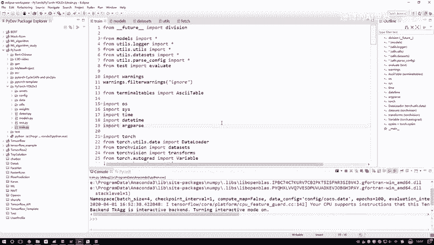
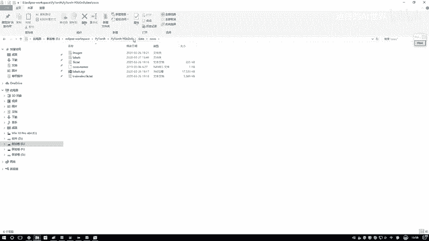
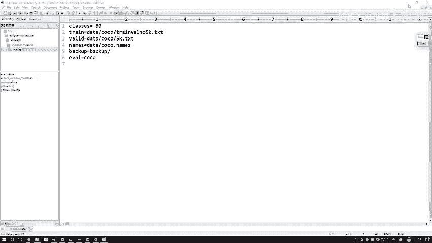
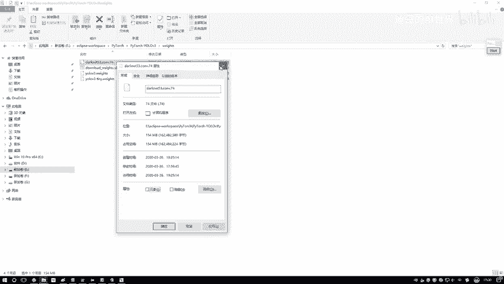
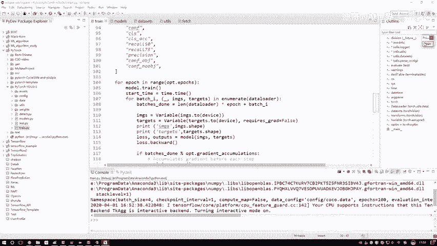

# 比刷剧还爽！【OpenCV+YOLO】终于有人能把OpenCV图像处理+YOLO目标检测讲的这么通俗易懂了!J建议收藏！（人工智能、深度学习、机器学习算法） - P70：2-训练参数设置 - 迪哥的AI世界 - BV1hrUNYcENc

接下来啊给大家演示一下，咱们这段代码该怎么样进行使用，首先第一步，我们需要把所有需要的参数全部啊给它传进去。

大家不要担心啊，这些参数诶要不要我自己一个去写啊，其实啊就是常见的参数哎，比如说咱们迭代的一个次数啊，白日size啊，还有呢咱们的一个model定义的一个文件，以及我们数据在什么样的一个位置。

这些啊都已经写好了，不需要大家额外再配置了，比如说我们输入大小之类的，只需要大家写进来两个额外参数就行了，我跟大家说一下怎么样去写，这里如果说啊大家跟我用的是同样id。

咱们点下右键预言当中有一个run as，选最后一个就是去配置一下，当前我们这个代码点进去之后啊，他会给我弹出对话框，在我们的对话框当中啊，有一个呃参数，就这里哎它有第二个，这是配参数的。

我们点一下这个参数啊，这里哎我是已经把我们两个需要参数啊，写进去了，如果大家自己玩的时候，那你这id里啊肯定是没写过参数的，你需要指定好两个参数，第一个参数就是data configure。

相当于啊就是呃我们那个coco点data，我给大家看一下，这里我们有个文件夹叫做哦，找一下呃。

在这里CONFIG当中有个叫coco点data，我们点开看一下这个co点DA当中，它就描述了当前你训练这个数据集诶，所有需要的信息了，比如说呃一共我们要做80分类这样一个任务，以及呢你的一个训练数据。

哎，咱之前不说了，这里存的都是我们训练数据所谓的路径吗，然后你的void就是验证数据，所有存的一个文件夹，以及呢诶当前呃下面这几个咱们暂时用不上，主要就是上面两个我们数据咱拿到手就行了。

这是第一个，你需要在CONFIG当中咱写进去的，我们的一个呃呃训练还有验证数据，咱们在哪儿都写到coco点data这个VR当中了，然后第二参数，第二参数呢它叫做一个pretrain model呃。

pertrain with就是预训练的一个权重模型，这里是这样啊，就是我们不是啊从头开始自己做训练，无论大家就是你们玩儿呃，其他任务，或者说咱们建设这个任务，基本上我们都是用迁移学习来去做的。

所谓一个迁移学习啊，就是说现在我们先把人家哎，训练好的模型拿过来，可能人家的模型跟我这任务不太一样，那也没关系，人家是个800分类的，我是个200分类，但是呢我们的卷积层是不是都提特征啊。

所以说第一步哎我先加载一个预算模型，就相当于一开始啊，我不是所有全数参数都是随机初始化的，我拿一个比较好的，相当于就是你从小学到上大学，咱这么的不得了，我说我直接跳到高中啊，直接从高中开始我学一些东西。

然后再上大学，是这样一个意思啊，这个就是那个DR内53，然后点cover点74，这个文件我会提醒大家，大家到时候用的时候直接啊在这个我找一下，在这个vs当中，你看这个文件是不是已经给大家下载好了。

大家直接加载一下，我当前给大家提供好的一个预选模型就完事了。

这个是需要大家呃，或者说只需要大家我们写进两个参数，第一个就是数据的一个路径，哎，有一个coo点data这个文件，第二呢就是一个print model，一个训练好的模型，点完之后啊。

然后你点一下这个apply，然后再点一下run就行了，这样我把它复制出来吧，我把它复制到我们电脑当中，这样就是方便大家以后呃，就是你们直接啊在这块做一个复制粘贴就行了，咱可以直接把这个东西以做。

粘贴到你的一个呃配置当中就完事了，如果说你使用的是其他id也没关系啊，方法是一样的，所有id啊都能设置的参数，把参数一设置就行了，然后我跟大家说一下，咱们怎么讲，我会给大家就打上一个断点。

咱们一行一行代码来去看，然后看的过程当中呢，可能呃我们的顺序稍微调整，因为正常情况下咱们来看代码，我先跟大家说一下，整体的第一步加载所有的一个配置参数啊，就是你的一个所有输入参数，这没什么说的很简单。

然后第二步第二步直接到这里了，第二步它是要对模型进行一个构造，模型构造，相当于哎整个DARNET网络结构怎么走的，怎么做的，中间前向传播哎，做件什么事，这些咱也都写好，相当于model当中啊。

你得写两件事，一个是网络的一个定义，一个是网络这个前向传播怎么走啊，反向传播不用你的，不用你操心了，反向传播这个框架所帮你去做了，所以说你得写一个网络模型当中，用到了哪些个组件。

并且呢这些组件怎么样去做的，这个前向传播，这两个事是在model当中啊，我们去做的，然后第三个，然后第三个就是你实际哎，把这个数据读进来之后，我以及我们这个预算模型，这是W，这是预算模型。

这个data把预算模型数据读进来之后，然后接下来我们就进行一个训练。

这就完事儿了。