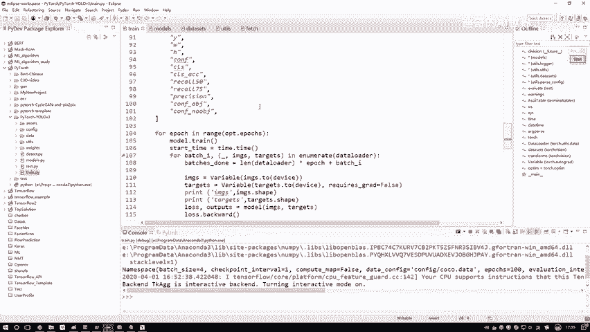
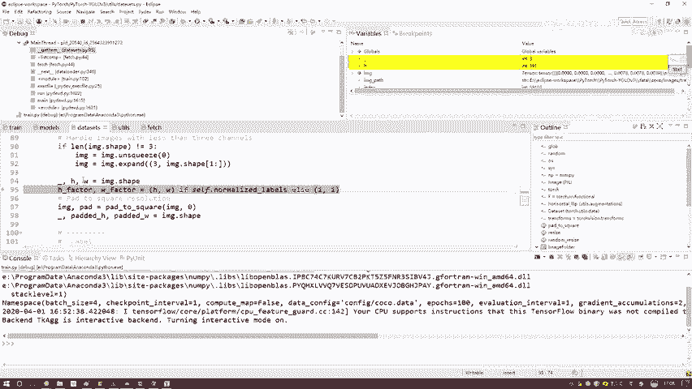

# 比刷剧还爽！【OpenCV+YOLO】终于有人能把OpenCV图像处理+YOLO目标检测讲的这么通俗易懂了!J建议收藏！（人工智能、深度学习、机器学习算法） - P71：3-数据与标签读取 - 迪哥的AI世界 - BV1hrUNYcENc

可能跟大家我们的一个想法稍微的有点不一致，我们大家可能觉得应该这样，就是先把数据读进来，然后呢再用数据往模型当中去传，其实啊不是这样的，我给大家说一下这个东西啊，叫做一个generator。

叫做一个生成器，生成器啊，它是这样一件事，哎你说咱们现在这个数据大不大，可以说coo数据集还蛮大的吧，18G的一个量啊，从量上来说挺大的，那如果说啊你先把所有的数据都读到内存当中，你说合适吗。

不是说不合适，而是说做不了吧，你因为咱们一之后啊拿显卡去跑，你没有那么大的一个G，就是显存能存多的数据吧，所以啊咱们是用一个generator，所谓一个generator，他是这个意思。

就是说啊现在啊好比说我们这有一个模型二，然后这个模型当中啊，需要你给我往里边去有一个输入的数据了，但是这个输入数据啊，不是一次输入到内存当中的，我是这样，我说这块咱们相当于这是我的一个model模型二。

然后这一块呢我说有一个供应商吧，什么叫供应商，供应商啊，就是说哎，一会儿它会给你的模型提供所需的一个数据，但是供应商呢，他不会一次把所有原材料都买齐吧，捐的数据他不会一次都买进来的，他会怎么样呢。

他会根据啊，你这个model有些需求，比如model我说我训练一次训练，我说我需要64个数据，那好了，那供应商一次我说我读64个数据，然后打好一个包给它丢过去是完事了，然后下一次迭代呢，他再需要64个。

然后我的供应商再读进来，64个，再给它再64个，再给它，再64个，再给它是不就行了，所以说啊我们实际去读这个数据，我们是什么时候读啊，不是说一开始就读，而是训练的时候咱去才能去读数据啊。

大家看下这个代码，戴尔当中我们来看这里，这块是有一个for epoch in，所有我们的一个迭代次数吧，在这个每一次迭代的时候，咱们来看这一块这一行代码我先框起来的。

它是不是有什么for batch i，还有什么images targets，就是我们的数据，还有一标签，是不是，然后呢在我们的data loader当中，所以说啊。

我们的数据是在训练的时候被实时的读进来的，这次我读64个，下次读64个，再读64个，再64个，是这样一件事哦，所以说啊咱们的一个顺序可能稍有点变化，我们是先构建模型，先配置优化器。

所有的数据读是真正训练的时候在读，没训练的时候，那跟数据是没有什么关系的，这个就是一个生成器的意思啊，咱是训练的时候用，到时候咱才去玩啊，但是呢我为了让大家把这个事儿，就是把我先把我们的一个配置。

理解的更清楚一点，咱把讲解顺序稍微调换一下，我先给大家看一下，就是数据我们是怎么去读的，相当于啊一会我要在这块先打上个断点，一会就是我们后讲这个网络模型怎么构造的，先跟大家说一下我们数据是怎么去读的。

因为这个就是方便大家，你们的一个逻辑关系来去理解咱们这份代码啊，其实先讲哪个后讲哪个无所谓啊，咱就按先好理解的，先说数据怎么操作。

然后呢在这个data set当中啊，其实就是一个核心的函数叫get item，这个函数当中啊，它会把你的数据还有标签给读进来啊，有这样一件事儿，然后呢刚才我已经打上断点了。

并且已经执行到我们当前这个断点这了，然后呢我们进入到这个debug门当中，我为大家来看一下当前啊，我们这个代码它是怎么样把咱们的一个数据，还有标签来给它一步一步读进来的，好了。

在我们debug过程当中啊，大家可以观察一下，就是我鼠标当中啊，我会给大家点到这个变量，你可以实际的拿到啊，我变量的一个名字，在我们这个生成器当中，它是怎么去做的，它是一张图像，一张图像去读的。

相当于啊这个供应商诶，人家那个model给你提个需求，说我需要啊，以64个数据为一个包裹，那这里呢这个供应商它会先读第一个数据，再读第二数据，再读第三个数据，点点点点，一直呢咱把这64个数据给它读完啊。

是这样一个过程，所以我们来看一下第一个第一个image pass当中啊，你看是不是我在哪读的，是在咱们那个就是我存的一个train2014哎，那个表当中把路径给读下来了吧，这第一步在我那个TXT当中。

先把我数据的路径哎给读出来，这是其中某一个训练数据，然后呢我把这个pass啊，我做了一个处理，因为啊我我估计啊同学到时候遇到这个pass啊，你们肯定得出错啊，但凡就是你说就是运营过程当中出现什么空值。

然后出现一些报错80%的情况下，都是你这个路径没配置，对你们大家自己把这个数据路径你们放哪儿，那都无所谓了，放哪都行，然后你自己写一下，你在人家这行代码值的下面，自己再写一下，你实际路径存在哪。

你也别用什么相对路径了，之前我总推荐给大家说相对路径怎么地的，方便得了，相对路径用起来一对一一堆乱码七糟的错误，你直接用一个绝对路径来表示你数据的位置，这样肯定是没问题的吧。

所以说这块我对路径做了一个改变，现在我们的得到这个结果，就是我当前哎一个实际图像，它这个路径我拿到手了，然后呢路径拿到手之后，这里咱们用imagine这个包啊去open一下，相当于要把数据实际读进来。

读进来之后啊，然后注意点咱们的数据格式啊，呃你不管你是什么PNG的，JPG的乱码七糟什么格式，我们格式必须统一，要必须统一成RGB，诶当前这个格式，并且呢我需要给它转换成一个tensor的格式。

因为一会儿啊，咱们是用那个PYTORCH那个工具包去做的，你用PYTORCH这个工具包去做，你首先得满足人家要求，输入必须是一个tensor的格式，你看我这里所有的数据怎么样，都是tensor的格式吧。

你不用管里边值是什么，这是我们现在读建数据，它是一个tensor的格式，然后呢接下来啊这块就是数据预处理啊，你如果说不等于三维的，咱们这个数据当中啊，好像不存这个情况，所有数据都是RGB3个维道的。

然后呢我们来看一下这块，我打印了imagine，它这个shape值H是391W是640，哎咱们来想一想，咱们这个数据啊，好比说是这个样子的，它跟我们的输入数据是一样的吗，肯定不一样吧，我们输入数据啊。

起码是个什么东西啊，起码是个正方形吧，但是现在它输进来是个长方形，那这个东西它好像来说是不太合适的，所以说啊一会儿我会对数据啊统一做处理，咱得处理成相同的一个规格啊。

在这里我们来看一下这一块，我算了一个值一个391，一个640是吧，那好了，那我说这样吧，咱得把这个数据啊做一个padding，什么叫做padding，现在这个数据咱们先看结果。

我先给大家看判定完之后的结果，判定完之后H和W都是多少了，你看这个pad h和pad w都是640了吧，就这样一件事，就原来这个数据它可能是一个长方形，是不是现在呢我想把它变成个正方形。

这样我说变成一个呃正方形，对于不同的数据，你变成正方形的时候，是不是说唉它缺了一些东西啊，缺了我做一个padding，做一个填充数就完事了，先把这个数据啊，我说给它添成一个正方形，这是第一步啊。

咱们先把长方形的一些数据或者是一些图片吧，我们做一个处理，全部给它变成一个正方形啊，做这样一件事好了，这是我们的图像数据，我钻排列完之后，现在当前这张图啊，得到是一个640×640的是一个正方形。

然后呢读取我的一个标签标签数据啊，这里大家也注意一下呃，你不同的一个数据集，或者说你不同的一个标签格式，咱处理的方法可能来说啊是一个不一样的，这里看你标签格式是怎么定的，这个相对坐标还是一个绝对的坐标。

还是你那个坐标怎么描述的，这个到时候大家自己看吧，关于标签啊，这里我不给大家详细介绍了自己，咱们看一下QQ数据当中，对标签人家有详细的一个定义，这就完事了，读一下我们标签数据label pass当中啊。

我还是用这个绝对的一个路径，是不是可以把我当前的一个标签给读进来，来看一下它这个pass，你看啊就是这东西什么什么呃，418586是不是这是某一个标签吧，你看跟图片是不一样的。

图片当中最后一个是不是也是什么，418586，他俩怎么样，是一一对应起来的吧，所以说啊这个图片和这个标签二确定一点啊，对应起来，之前有同学啊，就是训练完老师跟我说啊，训练完结果四个字形容啥也不是。

为什么呢，很大可能啊就你这个数据和你的标签没对应上，所以啊自己写完代码之后，自己debug看一遍啊，你的一个标签二，和你的一个实际图像是不是一样的，我遇到太多同学啊，就是这样的问题，数据和标签不匹配。

那最后确认完成结果，那是什么。