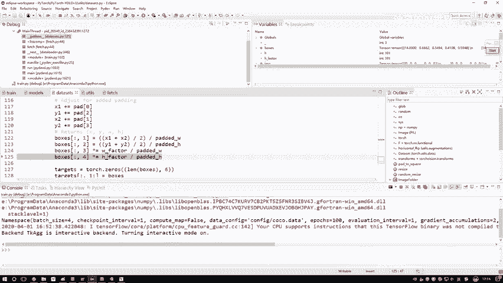
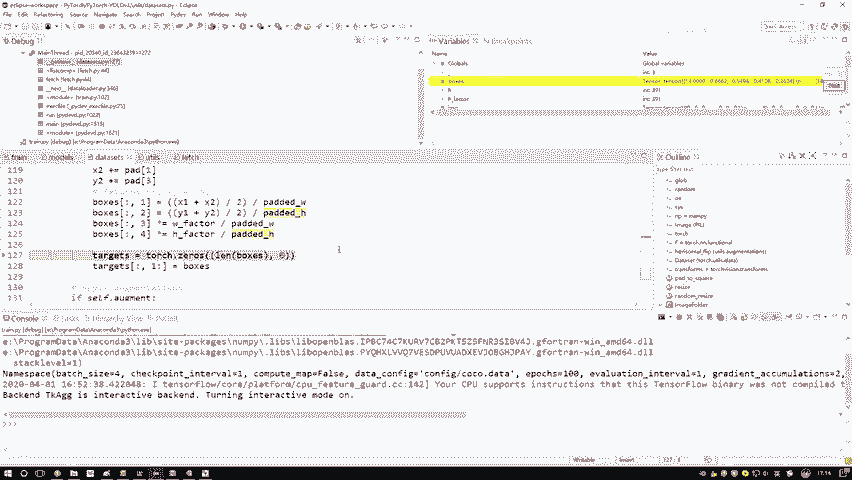
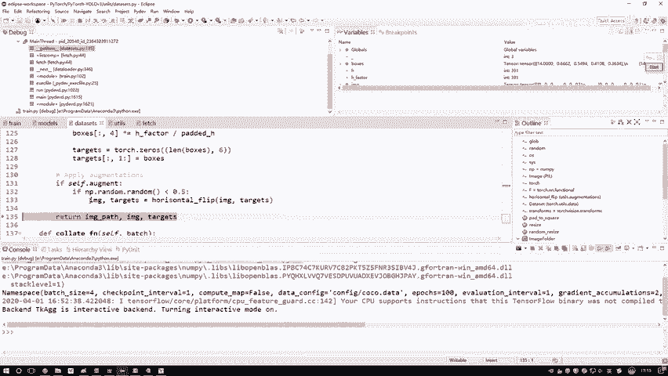
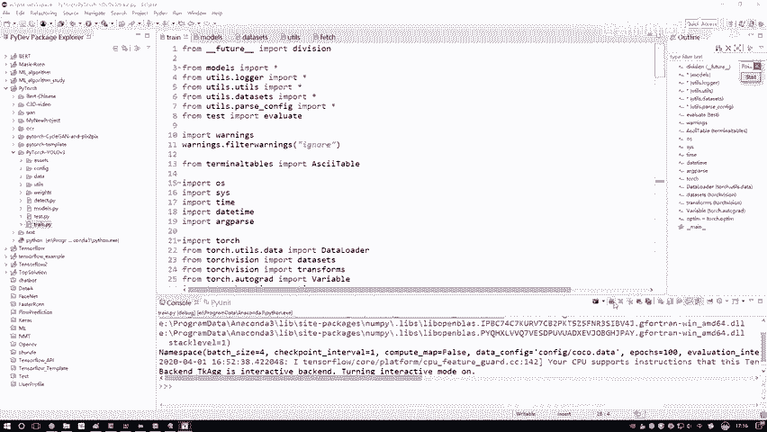

# P72：4-标签文件读取与处理 - 迪哥的AI世界 - BV1hrUNYcENc

好了，接下来在我们的一个pass当中，是不是说这里边存的就是我们实际的哎，一个图像是一实际的一个框是吧，我们把所有的框先读进来，这里啊，咱们把这个框都读进来吧，通过南派点漏TT。

因为那个数据是ti t格式吧，咱先读进来，但是TIT格式你在深度学习框架当中啊，或者说在这个Python当中，不好意思用不了啊，咱们得用这个touch点from安排一下，把当前那个ND尔瑞的格式。

转换成一个tensor的格式，你看这里，这是我们转换完的一个结果啊，转完之后我给大家说一说，其中每一个都什么意思，这里这样，你看一下这个boss当中啊，boss当中哎，第一个值，这有什么十四十四十四。

他是这样，我们那个coco数据集啊，它不是一个80个类别吗，在这个80个类别当中啊，比如说它框出一个框啊，它会告诉你当前这个框啊是个桌子，椅子还是个飞机炸弹之类的，那每一种物体它都会有一个id啊。

这个14表示的就是呃它是第14号物体，但第14号是什么，这个我再也不用去管了，可能是桌子椅子反而是一个物体，然后呢这个就是它的一个相对的一个坐标啊，一个XYWH。

然后接下来接下来我说我现在要把这个坐标哎，给他拿到手了，但是啊我们现在有个问题，我们现在这个坐标什么坐标，我们现在拿到坐标哎，是不是图像当中原始数据的一个坐标啊，原始数据什么样，咱们拿到手的是一个呃。

拿红色画，刚才我们的数据是不是拿到手，坐标是这样的坐标，然后呢我们是不是说对这个数据啊，我加了一个padding，让它变成了正方形，那你说数据变成了正方形，我的一个标签儿，那显然它也应该相应所改变吧。

所以这里啊我们有一个什么，有一个标签的一个变换啊，我们要把当前的坐标再给它变成什么，做完padding之后它的一个坐标，所以这里大家来看一下，首先第一步啊，我得到了当前哎我们的坐标X1Y1X2Y2。

这个都比较简单，只眼数据当中去读相对坐标，先坐标乘上H和W给还原回去一个实际坐标值，咱就有了，有实际坐标值之后，我还要干什么，我是不是还要就是额外做那个拍定了，你这个拍定。

咱们之前是不是看了你这个图像是个长方形的，还是还是个就长的，还是就怎么说呢，就是个这样式儿的，还是个这样式儿的，我好决定他是怎么样去做当前的一个padding吧，有的是上下加，有的是左右加。

所以说我得把拍掉，咱之前算完哎，怎么去加这个结果再加到我现在的坐标当中吧，相当于我现在得到的一个标签，就是做完拍定之后啊，我们得到的一个结果了行了，那么现在得到的是一个X1Y1X2Y2。

但是呢我们论文当中啊，又有论文当中，这个大家是不是也说过了，我们要预测的是什么，我们这个标签值不是一个X1Y1X2Y2吧，而是一个中心点和一个WH吧，所以这里我们把当前坐标哎再做一个转换，一个中心点。

那就是X1加X2比上二，但是呢我们来看看这个结果它是什么，是不是一个相对的呀，比上当前的实际的值，所以说我们现在得到的是相对这个框来说呃，或者相对的一个呃ground truth来说，它在的一个位置啊。

是一个相对位置值，而不是实际的一个值，下面这个X怎么去做的，中心点Y中心点是得这么去做的呀，因为你看得到中心点是不是相对值，所有取值范围都是多少，都是从0~1之间的值吧，哎注意这都是相对值。

这也都是相对值，然后这个W和H也是一样的吧。

这样我们现在就把这个坐标啊。

咱们现在给拿到手了，这个targets当中啊，就存了我们现在所需要的这些个坐标了，这个真容色啊，咱先不用去管啊，前面他先空出来一位，一会呢我帮你放东西，等一会用，到时候再给大家去说。

然后这个14表示的是，那个它是哪一个物体的编号，右边这几个就是呃XYWHXYWHXYWH，这个是我们当前得到的一个结果，然后这块就是呃你可以去选择做一些图像增强。

图像增强是这样一件事，就是现在有图像呃，比如说这一块吧，有一个人，然后这一张图像是不是，那你说我能不能对这个图像我做一些变换啊，做一些镜面变换，做一个翻转，那现在这个人如果做镜面变换，鼠标到这了。

哎这个就是到时候大家你们愿意去做，可以去做这样一个数据增强，但是对于咱们这个任务来说啊，数据量我觉得足够大了，做不做，反正我估计结果，应该没有什么太大的一个效果啊，这是你可以去做咱们的一个增强。

但是不要忘记点啊，你做增强的时候坐标在这儿，这个坐标在这，是不是说坐标我们这个标签也要去变啊，这个到时候大家自己选择去玩吧，感兴趣我们可以做一个图像增强，然后最后呢他又帮我返回啊。

一个image就是返回我当前的一个数据里面，IMG我们这个图像数据target，当前数据所对应的标签，这是说啊我现在做什么啊，现在我们做完了就是供应商当中啊，比如说一次要迭代64个数据。

他现在做完第一个了，那接下来呢你看我又跳这个循环当中了吧，接下来第二个接着第三个点点点点，一直到64个数不就完事了，这里跟大家说了一下，就是呃咱们数据怎么读，以及我们图像数据，还有标签数据啊。

在这里哎他都做了哪些个事，这个相当于啊就是在我们的函数当中，先给大家解释了一下我们的训练模块当中啊，这里我们的一个batch是怎么来的，为大家只是举了一个例子，其中一个数据怎么来的。

那这个IIMG和这个target咱知道怎么来的，加个S是不是相当于你by size，设多少个，我就便利取多少个就完事了好了，这事啊先跟大家说了一下，我们这个数据啊。

