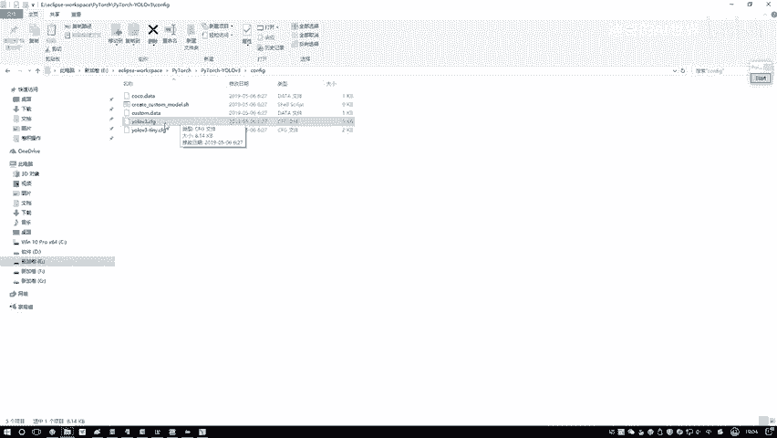
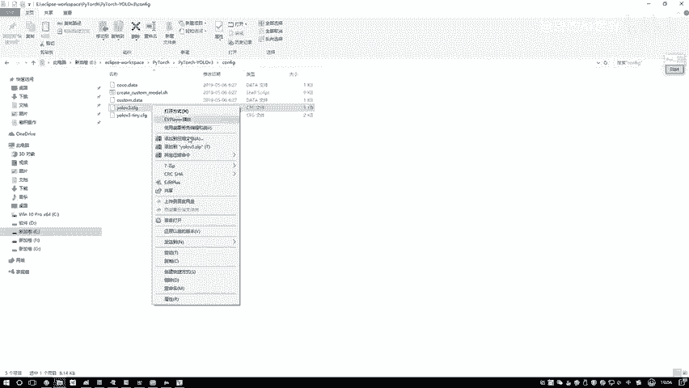
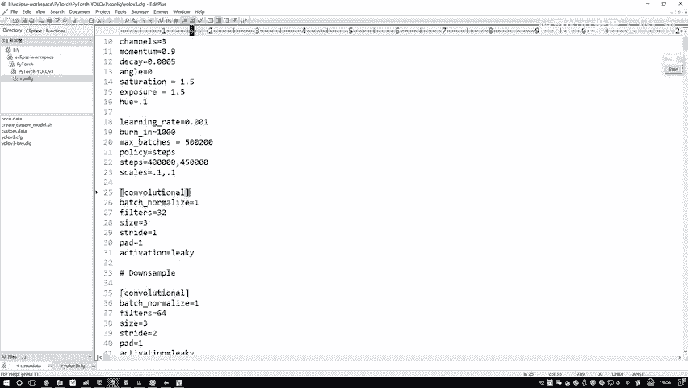
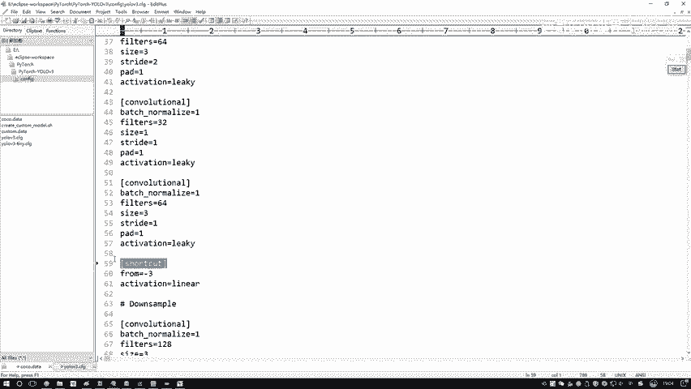
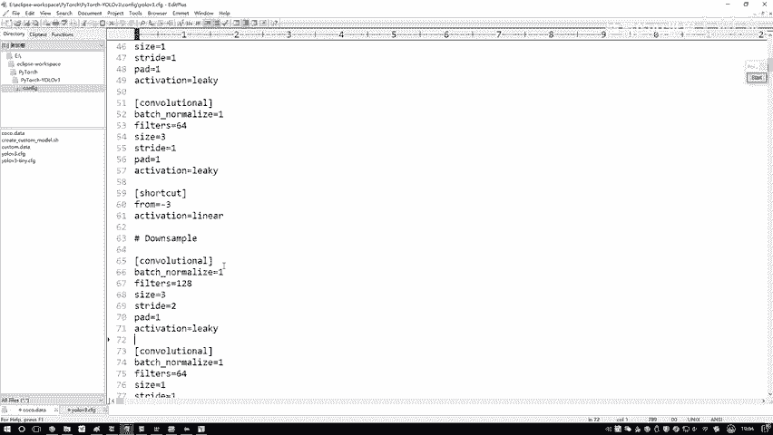
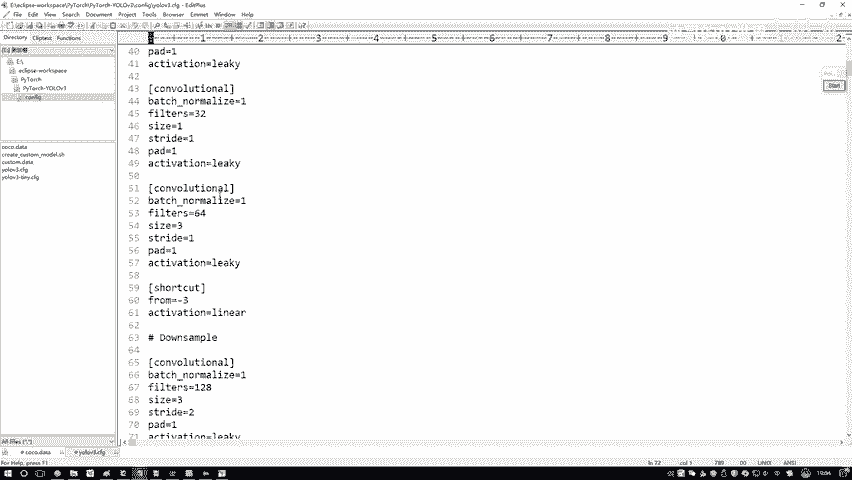
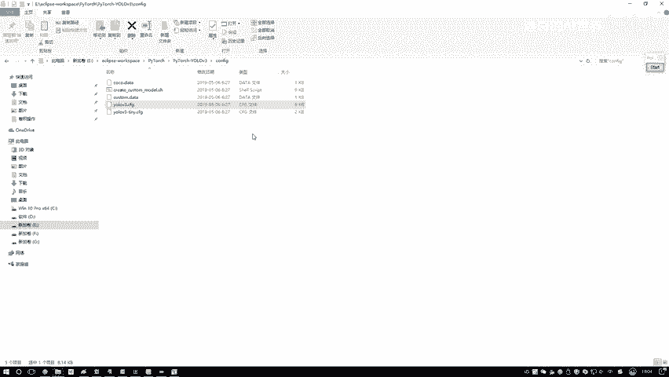

# 比刷剧还爽！【OpenCV+YOLO】终于有人能把OpenCV图像处理+YOLO目标检测讲的这么通俗易懂了!J建议收藏！（人工智能、深度学习、机器学习算法） - P73：5-debug模式介绍 - 迪哥的AI世界 - BV1hrUNYcENc

说完了数据之后啊，接下来就是模型啊，它整体的一个架构了，在这里啊我会跟大家说一下，他这个大概内53啊，该怎样进行构造，以及呢在前向传播过程当中，它实际啊是怎么计算的，相当于啊我们要说两部分。

第一部分我们的一个模型哎，或者说咱们带来这个dr net它是怎么样组成的，这是第一部分，第二部分呢咱们实际数据来之后，从前到后一步一步是怎么去算的，哎所以说我们讲这个模型啊，要讲两部分，一个是它的架构。

一个是它的计算方法，然后呢，所有啊就是核心的代码，都是在这里叫做一个models点pi当中，这个代码当中啊，我一会会进去啊，先给大家去说，然后呢先点就要为大家看一下在PYTOR当中啊。

我们的一个结构该怎么去写，我先给大家简单介绍一下好了，就是这个这里啊我们定义了一个类，叫做一个dr net，哎它其实啊就是pp当中啊，那个dr net53，然后呢因为我们的框架是用Python去做的。

所以说啊大家在这里诶，我们得写两块的一个逻辑啊，第一块的一个逻辑也就是我们的一个构造函数，在这个构造函数当中啊，你需要去指定好，接下来你这个网络模型诶，它都用到了哪些模块。

比如说在我们的一个配置文件当中，哎还能想起来吧，咱们之前有配置文件，在这里有一个优OV3点CFG，它呀就是我们整体要用什么，就是用哪些结构吧，全部是在这里写的吧，一些参数，一些网络层的名字。

让我们点进来看一下哦，不是这个，我重新打开一下。

在这里它是不是包括了一些超参数，并且呢他这块说了哎。

第一个卷积层，然后卷积层卷积层，然后接下来卷积，然后一个呃那个RESNET残差的一个相加。

然后接下来再卷积卷积，然后还有一些其他结构吧，所以说啊，一会儿我们会先把这个配置文件给它读进来，通过这个配置文件当中啊。

它不是按顺序去写的吗，哎你是先有第一个层是什么层，然后第二层是什么层。

然后每一个层它做了件什么事，这里它是不是全有啊，所以说啊一会儿我们在戴尔当转啊。

咱们也是一样的，在这里我们要把这个配置文件，一会给大家演示啊，咱们要第一步先把配置文件给它读进来，然后呢接下来读进来之后啊，我按照配置原当中啊，人家写的一个顺序，逐层把我的结构先定义好。

所以把结构定义好，就是说哦你现在要定一个卷积层，那卷积里边有些参数你设计一下吧，BONALIZATION当中哎可能有些参数，然后还有一些yellow层，这一层当中啊，每一个都有参数，我们需要写好。

从上到下你都有哪些个层，以及呢这些层诶，它们之间的一个参数全部啊，咱们指定好，这个是我们要做的第一件事，就是在这个构造函数当中啊，把咱们需要的东西先都指定好。

然后呢下一个下一个就是一个forward函数，这个forward函数是这样，就是刚才啊你是不是说呃把这个第一层，然后第二层，第三层，第四层，好像说你都告诉我是什么了。

那接下来呢我就要干什么实际的去走一遍，所以实际走就这样，真正来数据的时候，X哎要进来走一步，就是比如这是个卷积层，好，马上就走，然后这块呢比如说它是一个呃short，就是一个那个叫什么那个啊。

就是残差那个连接啊，shortcut一个层，我们做一个残差连接，然后接下来再往下走，这样走呢可能又是一些卷积，然后可能还有一个比较复杂的，就是它这个yo层，yo层相当于我要得到最终的一个输出结果了。

以及我的一个损失值计算，所以说啊在forward函数当中，我们会给大家去说啊，一个X11来了之后，怎么样一步步去走，一步步我们是怎么样得出来诶，最终小于结果的，所以说啊大家啊到时候你们自己写网络结构诶。

跟这个逻辑啊也是一样的，只要你用这个Python框架哎，或者其他框架其实也大同小异啊，第一步我们都需要去写构造函数，来写一写里边用到什么东西，然后接下来就是一个for的函数，for的函数当中啊。

你别看这里代码挺小的，一会儿就是剩下这里吧，给大家看一看，上面这些所有的可以说大部分内容啊，咱们要讲的都是ford函数当中，我们要讲怎么样去实际做计算了，所以说这一步都是需要大家自己去写的。

这些诶是比较核心的东西，一会儿呢咱们会进入到DEBU门当中，为大家一个去说，先给大家从整体上讲了一下，哎咱们一会儿呃在这个model当中我们要做什么事，那现在呢我们就进入到debug模当中。

