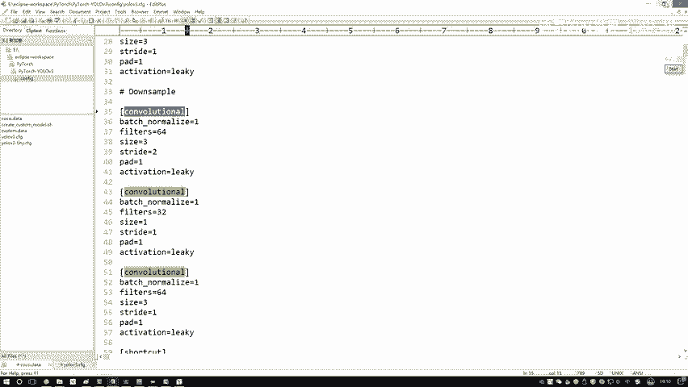
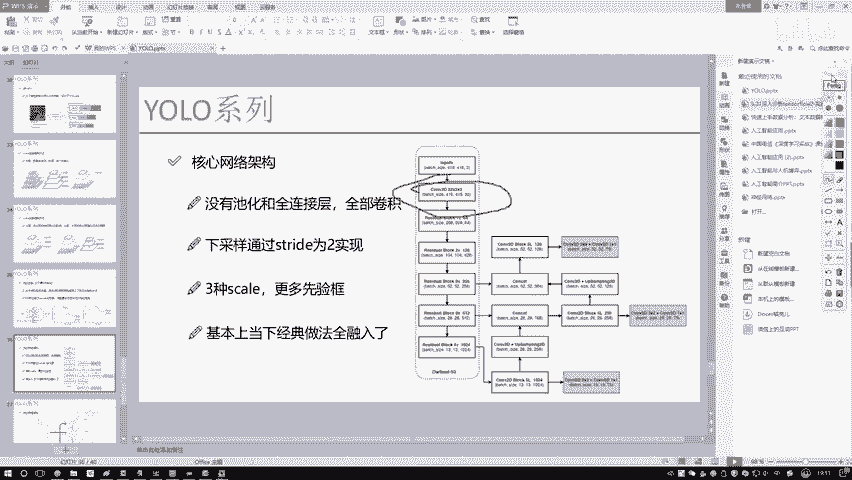
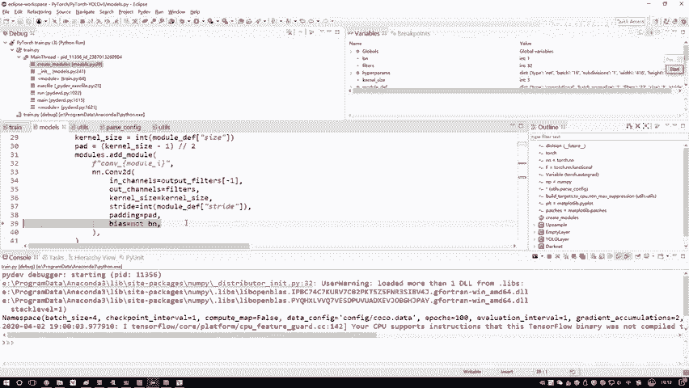
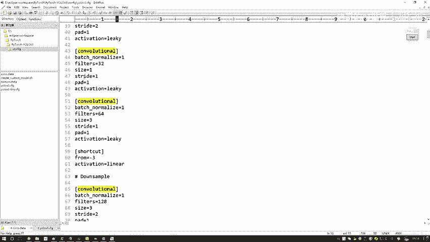

# 比刷剧还爽！【OpenCV+YOLO】终于有人能把OpenCV图像处理+YOLO目标检测讲的这么通俗易懂了!J建议收藏！（人工智能、深度学习、机器学习算法） - P74：6-基于配置文件构建网络模型 - 迪哥的AI世界 - BV1hrUNYcENc

这里啊我就打上好断点了，然后在咱们底盘模式当中啊，直接的F然后跳进去跳进去啊，第一步像我刚才说的，我们是不是底下有构造函数啊，构造函数当中，你看这一块，我就是第一步要从咱们的一个优菈V3点，CFG张东。

我们这个配置文件吧，好第一步先把配置文件给它读进来，独家配置文件当中啊，就是里边写的哎，它当前是什么类型啊，然后有哪些参数啊，所有的信息这里是不是都有了，这是第一步，我们先把啊这个配置文件给读进了。

然后读进来之后呢，然后下一步要创建模型了，这个我给大家F5，我们跳进去啊，来看一看他是怎么创建的，创建过程其实挺简单，哎这里吧就是我们配置文件当中啊，包括了两部分哦，我拉到最上面最上面一部分。

什么最上面这些它是不是一些参数啊，然后除了这些参数之后，下面的这些就是上面当中除了这个net的啊，它是一些参数，然后下面呢是不是所有的，它都是一个网络结构了，所以说这里第一步我先想这个pop一下。

零二最开始这个东西它是什么，给大家看了吧，我们所有的一些超参数网络模型，你配置一些参数，哎，这个咱们后续啊训练时要用到，然后接下来呢就是我们重点了，重点啊，就是我们要把这个网络的结构给搭起来。

我们来看一下吧，在搭的过程当中，这里我说先指定NN点model list，就是说一会儿我要按顺序把我一个模块，一个模块往里去搭了，相当于这样一件事，现在我们指定这个list当中。

哎是一个非常大的一个块吧，然后一会儿呢我会把第一块放进去，然后第一块下面一块，再下面一块，按顺序咱一步一步往里去加哦，那行了，那我们就加吧，那加也就是一个便利操作，我会遍历一下。

就是当前我们这个配置文件当中诶，把它其中的每一个层都拿出来，我们来看一下吧，好了，然后当前第一个模块，第一模块当中啊，你看这个tab值它是一个卷积，是不是，然后还有一个by chonization。

还有filters，还有一个呃你的一个卷积核大小，一个步长，一个padding，还有一个软弱的一个计算方法，这里是不是都有啊，但是大家注意点，我们现在读建这个东西，就比如说这个你现在啊读进来这一块。

哎你说它是一个卷积层吗，它好像不是一个卷积层，它是一个三合一啊，大家注意一下这个东西，它是一个三合一，它包括了它包括什么卷积，加上这个batch normalization。

再加上一个软弱或者说软路的一个变形体，所以说啊这一块它不是一个层，而是一个组合，那既然它是个组合，在代码当中我们也要体现出来，你看这里，我说这样，我说现在啊既然你要加的它都是些组合了好了。

那我说先把这个组合叫做一个models，哎这里边是个组合，然后呢我说我判断一下吧，判断什么，看一下它当前这个tab值就在这里，在我们的配文件当中啊，是不是这一块它有一个tab值，这个我们叫tab值是吧。

它有那个卷积的，然后剩下还有一些其他的，咱一会看到也给大家说，那它要遍地了，看一看当前啊。

你要加这一层它是什么，如果说哎他是个卷积，那好了，那我们在卷积当中我们要看做哪个事，首先第一个事就是batch alization，咱讲论文的时候是不是说了yo v2当中啊。

最大的一个特点就是把所有地方都加上半，成normalization了吧，那么E3咱们这个版本肯定也一样吧，好第一个BN都是肯定要加的，然后一个filters你得到特征图的个数，第一个卷积得到是32。

然后后面64的就是咱这个PPT当中这个图吧，这个图只不过说它这块有一些残差的模块，它要重复执行好多次。

到时候大家玩的时候，你可以参考一下我们当前的一个PPT啊，然后接下来就是把所有参数咱们都读进来，这个padding是根据那个cl size来进行计算的，然后下一步就是把它实际的一个API调用进来。

所谓一个实际API啊，就是你看这里如果我要做一个卷积，那你指定吧，卷积当中就是N点cover2D哎，做一个2D的卷积，然后你把第一个in china就是咱们当前的一个输入。

比如说第一只刻字卷积in china等于三，然后out channel呢就等于一个60呃，等于32，得到32图嘛，那第一个等于三吧，因为第一个输入的是实际的RGB的一个图像，然后呢一个ko size。

他的一个卷积核的一个大小拽值，这些咱们是不是都指定好了，然后一般情况下这样就是关于这个偏置项，如果你要加上了这个by chalization之后。

很多时候啊咱就不需要这个偏置项了，所以说这里哎咱就暂时先不管偏执这一项了，好了，这是第一步，我说我先在这个API当中啊，把我们这个卷积层写好了，那我刚才说这个东西它是不是一个三合一的呀。

那做完一个卷积之后，接下来紧接着啊就做什么了，紧接着我就做一个batch novization好了，FBI肯定是要去做的吧，把这个BATTRALIZATION直接的给它加进去，就完事了吧。

那BN做完之后，别忘了，我们三合一还剩最后一个就是一个激活函数吧，好了再把一个激活函数哎，这个软路啊做了一个稍微稍微的一点变形体，这个轴给它稍微往下倾一点，是不是这样一件事啊。

这里我们把这个奇偶函数再加进去，这就完事了，这里呢我们当再摁一下这个F6之后，他会给我跳过来了，中间越过了一些东西，越过了什么，越过了一些LSAF，就是一些其他层，因为我们现在做了一个判断。

他当前的是一个卷积层吧，好了，那我们把当前第一个卷积层我们做完了，做完之后呢，我们这个models你看一下这个model model当中包括什么，model当中包括了一个序列吧。

这序列当中第一步一个cover2D，第二步一个拜蛇VIZATION，第三步一个软路，是不是，所以说我把这个三合一的整体加入到我的，刚才一开始指定那个model diss当中。

相当于啊我们第一个模块诶做些什么事，我给它添加进来了，然后呢这个哦output filters啊，它是说呃，把你最终的一个输出的特征图，个数再给它加进来，哎这里我们完成第一步，相当于啊便利了一下。

我配置文件当中的第一个模块，那给大家看一下，我们现在给大家说了好久，是不是咱完成了什么好，整个配置文件你就完成了，我画红色这一部分，那大家来看一看，你说啊就是全部的配置配置文件当中，我们有多少个。

你就往下拉吧，你看它的一个卷积有多少个，特别特别多吧，并且这里它不光有卷积，还有其他层，那这些啊就是卷积层，我就给大家举一个例子，咱们时间关系啊，不给大家重复的去说了。

然后你们愿意大家自己玩的时候，你可以重复的在这个学员当中去执行，但是这个我觉着没必要啊，你就了解一下人家这个三合一诶，他怎么去做的就完事了，然后呢我们跳下一个层amaze ping，咱也不说了。

因为怎么样，V3当中啊，没有这个东西，咱压根也不用考虑了，然后呢咱们来看这个这里啊，它还有一个上采样商材料这个东西啊，其实呃这个我觉得也不用看了，因为它这块什么都没做，因为在我们现在构造函数当中。

它只需要去定义一下，哎，一会我有做上采样，这个事就行了，他这里没有执行实际操作，所以这一块也没什么能看的，就是他只是做了一个定义，把这个上采样层说现有这样一个事，但是这什么都没做一会儿呢。

在那个前向传播当中啊，咱会看的更清晰一点，所以说啊这一块咱就不用去看了，它就是定义了一个呃空的层，他说空的层叫做一个上采样。

