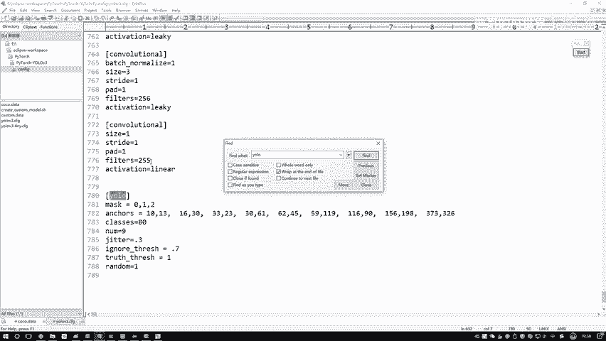
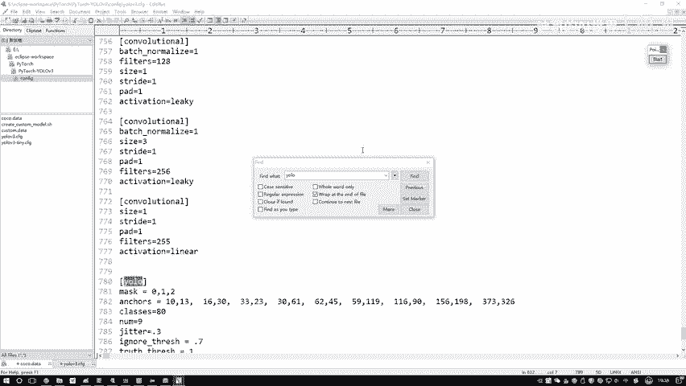

# P75：7-路由层与shortcut层的作用 - 迪哥的AI世界 - BV1hrUNYcENc

接下来啊在我们的网络结构当中，还有一个叫root层的，我给大家解释一下这个root层是什么意思，因为经常有同学啊，可能把这个弱层，还有那个reset当中这个shortcut层，这两个咱们傻傻分不清啊。

我为大家解释一下这两层分别做了件什么事，先说这个root层它是做了一个拼接，什么叫做拼接啊，我们回到PPT啊，给大家看一下，之前我们在讲的过程当中，我放大一点，之前咱们在说的时候。

是不是说网络结构里边哎这一块，比如最后一个吧，有这个13×13，成交率24的，然后我说呢对这个呃13×4啊，成交2024的，我说做一个上采样，变成了26×26，哎，比如再做一些卷积吧。

然后做完卷积之后得到二二百五十六个，那现在我说是不是要把这个上采样的结果，跟之前本身就是26×26的，他俩怎么样，你看这里这是512，这是256，然后最终结果是768，这是什么，这是一个拼接的操作吧。

所以说啊这个root槽，他完成的就是这样一个拼接操作，使得啊咱们特征图哎拼的更长了，拼的更大了啊，这是我们当前我们的一个路由层哎。

就是root槽，他做了件什么事，然后呢在这个配置文当中啊，我们搜一下AHL也搜了，就是root，我们find一下，这里边它只有一个参数，比如这里他写了一个layers，等于一个四。

它的意思啊就是说呃你当前这一层你要拼的话，你是跟比如这是当前最后一层，我写个一吧，然后这是二，然后这是一个三，然后这是一个四啊，他的意思就是说你当前这一层，你跟前面第几层要做什么，做这样一个拼接操作。

跟前面谁去做当前操作，所以说啊在配置文件当中啊，他写了一个负极，就是表示的是前面几层啊，这个意思，然后呢说完了这个路由层之后啊，咱们再来说这个shortcut，在这里啊，我就不提bug给大家看了。

因为这里边什么代码都没有，他创建了什么，他创建了一个空的层，他只是说先把这个层啊给我占一个位置吧，然后实际它做什么，等前向传播的时候，咱们才能去看到，所以说这里只是基本的一个定义，像我刚才说的。

我们的构造函数当中啊，这一块我们只是做一些定义，说明有什么层，这里呢他先占个位置哎，说一会啊，这个槽我要做一个root，但是现在他还没有去做啊，因为现在数据还没来哎，什么都操作不了。

你看这里像我说的二五，26×26乘256，然后呢再结合一个26乘，26×128的等于多少，第三个维度我们拼在一起，但这里啊大家可以计算的时候，你可以按照如果说后续啊，你有其他算法，你可以自己指定维度啊。

按照哪个维度进行拼接，这里啊我们按照的是最终特征图，那个温度啊，把我们的呃一些特征吧又做了一个拼接，然后呢再给大家说一下这个shortcut，直接配置文，当时给他看吧，CTRL加C啊，让我们找一下。

在配置文件当中找到这个说cut，你看这里它有什么，也是一个from吧，然后激活激活层咱也不说了，from得三前面第几层吧，但大家注意一点，比如说给大家举个例子，你说这里啊，咱们现在有一个呃，随便说吧。

比如13×13乘128的，然后另一个呢，就是你不要是做一个就是残差连接嘛，那比如说呃第一个模块这块做完一些卷积，做卷积得到13乘乘13×128了，然后这边拿过来的也是一个13乘。

13128的这个shortcut层，它不是做拼接啊，不是说你这个东西做完之后是13乘，13×256了，它是什么，它就是一个加法的操作啊，所以说计算完之后，我的维度是不会去变的，它是把特征啊做了一个加法。

你但凡看到这个残差连接，你就把这个东西当做是一个加法就完事了，就是数值上的一个相加。

而不是我们维度上的一个拼接哦，在pp当中我给大家看一下。

对应的就是这里，你看诶这这块写了是有残差模块吧，参差模式当中啊，就包括了很多呀，我跟大家说的那个shortcut诶，那个结构这里边它是一个加法加法加法啊，然后路由层是什么，路由层，它不是加法。

256512变768路由层，它是一个拼接啊，在这里我跟大家先解释了一下。

在网络结构当中啊，有两个可能你之后会弄混的槽，一个叫root层哎，这是拼接的，一个叫shortcut槽，这是残差连接的，它是一个加法的操作，但是也是一样的，在这个构造函数当中啊，他没有写实际计算方法。

先把这个位置给占住了，这两个哎是我们说的，一会儿你别弄混的，因为一会儿在其他直播当中啊，我给大家去看路由层，还有一个shortcut，一个加法层，哎你就叫做加法层得了行，这里给大家看了咱们前几种啊。

一个是卷介，然后还有一个路由层，然后还有一个那个shortcut层，然后接下来就是我们重点了，最难的或者说是所有东西吧，最核心的就是它的一个yellow层了，因为yo层要做的事挺多的。

不光我们要得到一个输出结果，在强传播的过程当中哇，还要得到什么最终的损失值吧，并且我们来看一下，在这个U层当中，我control我给大家搜一下，你看它有几个，一个两个三个，所以说我们的yo层。

我们的最终输出结果跟这个PPT当中啊是一样的，我们会有什么这一块这一块这一块儿。

我们分别得把这三块给构建出来好。

接下来咱们完成，最后就是构造函数当中最复杂的哎这个yo层，这里这样我直接打上断点，然后我们跳入到当前的右层当中，给大家说一说，重点说一说yo层它是怎么去做的，在这个U层当中啊，他要做的事还蛮多的。

但是构造函数当中啊，只是做了一些基本的定义，还有说明我给大家来看一下，首先啊第一步就是哎指定了一个线性框的id，因为这样啊，咱们现在说的yo层是其中的一个吧，因为我们一共是有三个的。

在PV当中给大家看一下，这里我说是一种右手操，这是另一种，这是另一种，我为什么说是种啊，因为它们的一个grade size是不一样的吧，这一块对应了三种框，这里也对应了三种框，诶这里也是一样的。

我们需要我们需要代码当中要指定好，每一种用层来说诶，你对应这个框框里一个大小是多少，或者说对应框它这个id是多少，比如这里我说啊这是1012，然后这是345，那这个id就是一个678吧，好了。

这给大家看了一下，咱们当前啊不同的框来说哎会有这样一个id，首先呢就是你先拿到手啊，当前我框对应的id，比如当前我们我们debug过程当中，拿到的是一个678，然后呢接下来你得把这些值啊。

就是我们既有一个id，我们还有它实际的一个数值吧，好了你还得把它实际数值再拿到手，拿数值方法其实很简单，就相当于啊，你把这些框先做成一个一个H和W的一个比例，然后呢找到手。

我们现在对应的一个三个就可以了，现在我们留了三个，一个是169十，还有156198，还有一个373326，这个是我们当前这个右路层，它所对应实际的一个线框啊，它的大小，注意点，这是实际线框，它这个大小。

接下来接下来我们要构造一下当前右手层了，哎这个mg size就是图像的大小，然后还有一个呃输入的一个种类，咱们QQ数据当中啊是有80个类别，所以说number classes当中啊，一共是等于80。

然后输入图像大小，它是等于一个416的。