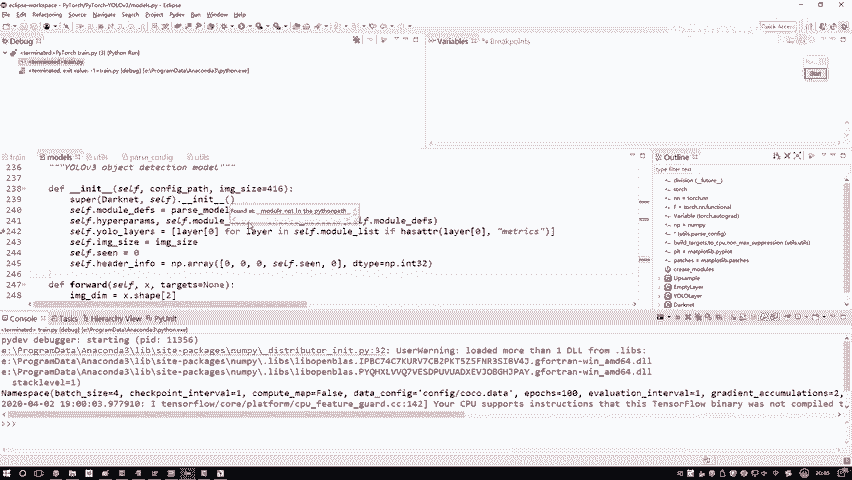
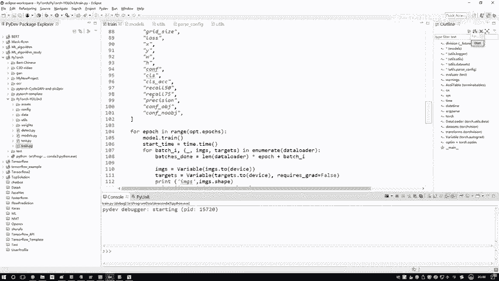
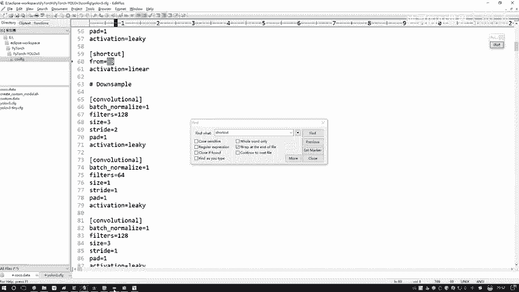
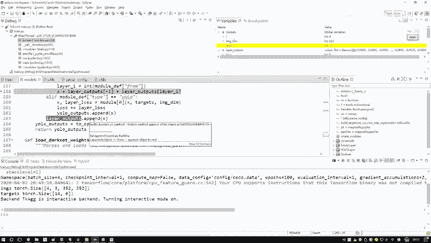

# 比刷剧还爽！【OpenCV+YOLO】终于有人能把OpenCV图像处理+YOLO目标检测讲的这么通俗易懂了!J建议收藏！（人工智能、深度学习、机器学习算法） - P76：8-YOLO层定义解析 - 迪哥的AI世界 - BV1hrUNYcENc

然后呢我们去构建一下当前这个右路层YF啊，跳进去构建过程当中啊，这里它相当于呃是先走了一个初始化这个函数，因为它呀也相当于是一个模块了，在这个模块当中我们也是先做一个构造函数。

然后实际用的时候去走这个forward函数，但是呢所有的核心点其实都在前向传播当中了，咱现在就是打基础哎，把这个前N传播当中啊，但凡会用到的，我们先写出来会到什么，咱们当前的一个先验框，给它一个大小。

然后先验框它这个数量等于三，然后要分类的个数等于80，然后这个就是一个额阈值，然后这块你要做一些损失函数的时候，我再给大家一个去说啊，咱们会用到哪些损失函数先定义出来。

然后接下来接下来这些暂时啊咱都不用的，等一会儿啊，咱们在实际前向传播当中，我为大家演示啊，当前哎我们这些层该怎么去走，这里我跟大家说了一下，我们在网络定义的过程当中啊，还有一个yellow层。

但是呢这个yo层它不是一个，它会有三个的哦，给大家解释了一下，咱们当前啊就是在我的一个呃构造函数当中吧，就是刚才我们在model当中给大家回去看一下，在这个mode当中来找一找，在这里最下面的时候呃。

这个大尔内大二代尔当中，然后我们刚才F跳进去的时候，是跳入到这个函数当中了吧，相当于啊我让这个模型诶，根据我这个配置文件，你去看一看我们都需要哪些个层，以及呢哪些每一个层来说啊。

它都需要什么样的一个参数，咱把它们都搞定了啊，就完事了，相当于啊这一步操作我们是来去创建了，所有我们需要一层，然后正好我把这个断联取消，然后我们跳出去跳出去啊，就又又是到了我刚才给大家看的。

咱们往上翻哦，在这里跳下去之后啊，接下来我们是不是说，现在所有的一个模型早都构建好了，然后这个YLAYERS咱之前也说了，我们现在已经构建了三个不同的一个yo层吧，这mg size啊就是图像的大小。

然后这些咱现在都用不上啊，给大家简单看了一下，我们当前啊这个当代来说哎，构造函数怎么去做的，其实这一步来说啊，是比较简单的，我们只是对这个模型做什么，做了一个基本定义吧。

看配置文件当中有什么把参数读进来就完事了。

所以说构造函数来说没什么难点，接下来呢我需要把这个断点啊，稍微的给他换一换位置，你看我这里有换位置，换到所有的我们的一个前向传播当中，所以说啊一会儿我再给大家debug过程当中。

我们会进入到当前前向传播里边，并且我再打几个断点，这里还需要再再来几个，不光是有这个DARNET前向传播，我们刚才定义的优low层吧，net也非常重要，我在这个右层是地方，这是右手层是吧。

好了在这里我也打上前向传播，然后呢上采样我也打上前向传播了，相当于我看上面还没有，上面没有了，相当于啊我把所有的要做前传播的地方，全给大家打上了一个断点，那大家可能会问我，哎老师。

你这个你为啥刚才不直接继续断点给我演示啊，因为它中间有个跨越啊，什么跨越啊，给大家看一看，刚才我们近断点是通过这个模型，这一行代码进的吧，那什么时候能进行进前向传播呢，是在下面你建全向传播的时候。

是在你训练网络的时候才能走它的前向传播吧，相当于是在这里，你拿到数据之后才能去再走，我们整个的一个前向传播，在这一块你对这个model做了一次调用之后，把数据和标签传进去之后，我要得到一个返回值才能诶。

得到我当前的一个就是前才能进入啊，我们这个前向传播当中，这前面还包括了我们的数据读取，如果说啊你在debug门当中来去读去读数据去呃，做这些batch这些东西速度会非常非常慢哦。

所以啊这块我们得把断点取消一下，咱们重新来执行一下，进入一下我们DR模式，刚才我不是打断点了吗，好了进入到我们新的断点当中，看一看我们第一步啊，第一步来往下找，哎这里这是第一个ford的吧。

你看这个当然得来这个哎不是这个不是这个，这是yo的，往下找，这个这个是大2net当中吧，咱们第一步就会先进到这里，首先帮我去把我的输入数据来做一些计算啊，好了哎呦，这块疏忽了一件事哇。

我这个断点忘取消了，把这个断点重新取消一下，然后我们再debug一下，失误了。

失误了，最开始的断电忘取消了，然后这一块它会跳入到我们DARNET，它的一个前向传播当中，这里吧，其实要做的事就比较多了，你需要指定好咱所有的前向传播的操作了，对于一个卷积来说，因为你看这块啊。

对于一个这里有这三个哥们，这三个哥们非常简单，无论你是一个卷积啊，这咱们这里没有铺垫不说了，还是一个上采样，或者说呢是一个呃，就这俩吧，这俩非常简单，为什么，因为这俩操作是现成的。

在这个PY套工具包当中啊，无论你做一个剪辑还是做个散采样，在一行代码做出来了，工具包里边人家直接给你实现出来了，所以这些我们都不用去做了，我们重点就是那个yo层，它是怎么走的，那块会相对来说比较复杂。

也是代码最多的，首先我们把当前的一个输出卷拿到手，然后一开始的损失反正就是零呗，先定义好啊，我的模型一会儿呢咱会有一个输出结果的输入，就有两个就是当前这个层输出的一个结果，以及呢yellow它输出结果。

一会儿我们要把结果不断的往里去传好了，那我说我做下便利吧，刚才你不是在这个model当中哎，做好了定义吗，每一个层model list当中，咱是不是指定好了，我的一个结构从上到下怎么去走的。

那现在我要干什么，现在我就是把数据拿到手了，来注意一下我为什么说把数据拿到手了，这块有什么X是不是好了，这里X我现在点进去啊，它是不是有些值这些值啊，你看到这些零，因为他是做了一些padding啊。

所以说它这些零实际上它是有数据的，这里就是说我现在已经传建数据了，我要走一遍整个这个流程，把数据经过卷积，经过这个经过，那之后我要看他们输出结果了，来看吧，这里首先做判断，如果说啊它是一个卷积诶。

或者是一个呃上采样，或者是max ping，当然这也没有MASPOTTING直接干什么，直接用你的model去执行就行了，因为对于这些操作是PYTORCH当中现成的API，直接一行代码。

咱得到的结果数就完事了好了，那你看得到结果之后，我这个X是不是里边是有些值的，这个相当于啊就是我的一个输出结果了，经过了一次卷积之后，咱得到结果好了，把当前结果我说给先给它。

放到我当前的一个输入结果当中啊，然后下一步下一步它又是个卷积，因为在我们这个呃，他就是按照咱们这个配置文件当中，他去走的第一步他是走了一个卷积，然后下面他还得再走几次卷积啊。

然后这块快给大家快速给大家过一下吧，又走一次卷积，然后再走一次卷积，然后下一次应该不一样了啊，下一次还是那可能下一次他是一个shortcut层，来看这回他卷积里没跳进去吧，来看看跳哪啊，这块到哪了。

是不是到一个这个shortcut啊，它是什么，我之前是跟大家说了，这是reset当中我们做计算的时候用的一个方法，RESNET里吧，刚才给大家强调做什么法，来你看看吧，我之前是跟大家说做加法呀。

代码当中做什么法，是不是跟我的跟大家说的是一样的，也是做一个加法，然后这一块呢它会啊读出来一个layer i，它的意思等于三，也就是说你配置文件当中啊，呃哪去了，配置文件当中找一找呃。

他这个往下往下再往下找啊，算了找不着了，直接给他复制名字吧，在这里把他名字复制过来，然后搜一下搜一下这块它不是有三啊，三我之前给大家说了，他要选的是你跟前面多少层做一个加法操作。

所以说啊他会把这个layer i传到你的一个输出，结果咱不说这个layer output当中，它是什么，一开始是个空的，然后你执行一次计算之后，我会往里传建一个值吧，那传递的赋值相当于前面几次吧。

所以说这个layer output啊，它相当于就是包括了，咱们但凡得出来每一层结果都会往里去传诶，它是咱们已经得到的所有的一个结果。

三呢就是在当前这一层基础上，前三个哎这个意思啊，然后这一块我们直接跟当前这一层，就是最后一层，是不是当前这一层，然后跟前三，那当前这一层肯定就是我最后一个了，刚拿到手的呀，所以我传递了一。

那前面呢那你愿意跟哪个，你传一个负极就完事了，这里就是执行了一个shortcut，它是一个呃这样加法的操作，那如果说下一次呢这个我就不给大家一个劲了，因为这个入口层它可能会比较，往后的时候才能用到。

我们得先走这个yo层，然后呢走完yo层之后，因为大家看这个PPT要在这个任务当中，你看啊这一块是不是我们有yellow层啊，那是不是先有最后一个yo层，再有这个再有一个这个。

所以说我们先得到的是预测大目标的，再得到预测中标的，再得预测小目标的，应该是这样一个顺序吧，因为有了一个大目标的这个东西，你要做上采样，然后才去再做什么，再做这样一个拼接操作吧，所以说一会儿我会给大家。

先跳入到那个U层当中，给大家讲，然后这个root层给大家简单过就行了，root层没有什么可讲的，直接这个touch点那个contact一下，就是做一个拼接，把这两层。

就是当前这一层结果和前一层结果怎么样，做一个拼接是不是就完事了，这里写了for循环的意思啊，就是说你可能是呃不光是两个拼在一起，也可能是三个拼在一起，但是我们任务来说，基本上就是两个拼在一起的吧。

啊你就知道这个for循环它也可以是拼多个，也是能成立的，也是能实现出来的，咱们这个任务就是把两个一拼就完事了，这个是一个弱槽，我一会就不给大家跳了，因为太简单了，就是一行代码做了一个拼接啊。

