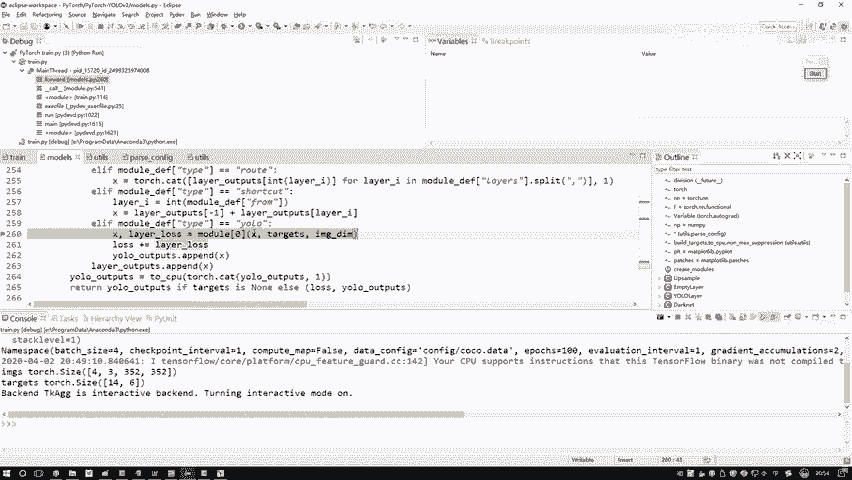
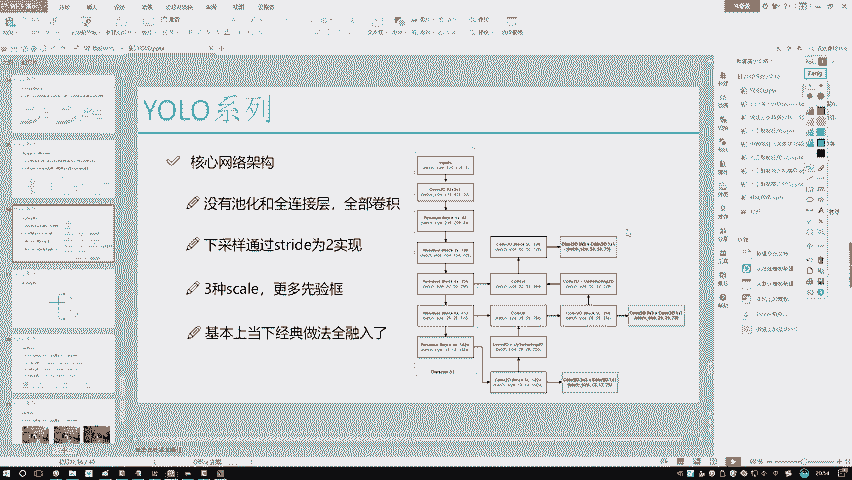
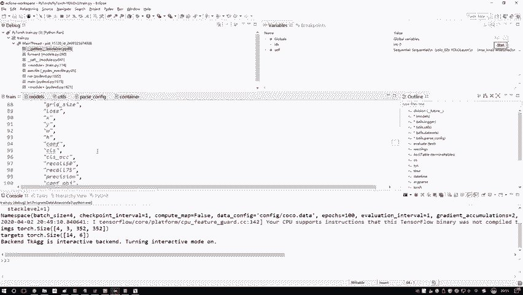
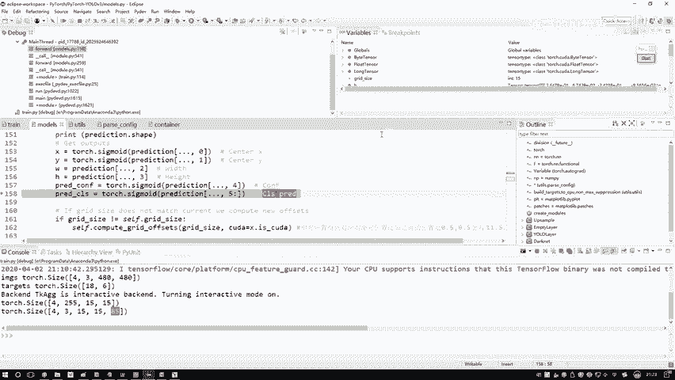
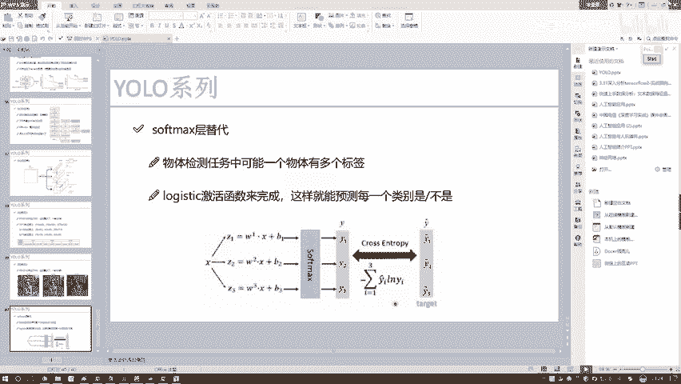
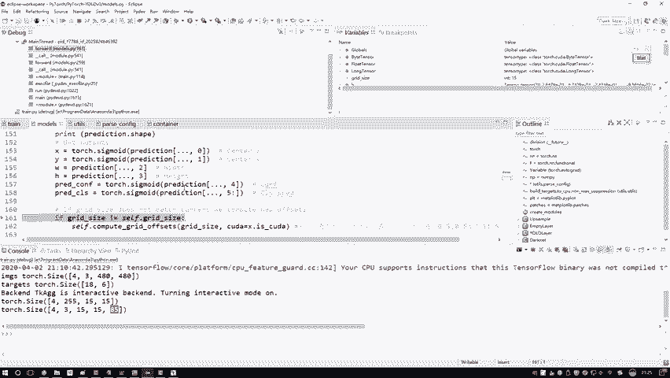

# 比刷剧还爽！【OpenCV+YOLO】终于有人能把OpenCV图像处理+YOLO目标检测讲的这么通俗易懂了!J建议收藏！（人工智能、深度学习、机器学习算法） - P77：9-预测结果计算 - 迪哥的AI世界 - BV1hrUNYcENc

然后呢咱们重点跳哪来，为大家跳这里跳到这个右层当中，外这一块打上断点，然后呢我们去执行，它会跳入到当前我的一个UO层当中，好了，我们来看一下在右手层当中啊，首先看我们的输入输入来说。

有我的一个数据，哎呀现在我这块就已经开始有点卡了，你看这个鼠标翻了半天都没出来，这是什么，这X不是我输入啊，这是前一层的一个结果，大家注意啊，每一次我的返回值是不是都是X，所以说这X它就不是我数据了。

而是我yo层前面它的一个结果，比如在这个PPTPPT当中。

这是右一层，是不是，这就是我前面输出的一个结啊，输入的输出的一个结果，当做我的一个输入了，X是前一层的结果，然后呢这个targets咱之前是不是说了，我们读数据的时候。

我们是把这个标签儿唉也给它读进来了吧，边儿当中有那么几个指标来着，有这么五个指标，然后这个是它属于什么类，第五个类别，第五个是啥，我我也不管了，然后后面那几个XYWH是不是也有啊。

这个是我们的一个标签二，我们的一个targets，然后这个是我输入图像它的一个大小，我们把这三个传进去，然后呢我F1下哎，这块不能F这块我得打好断点，直接跳，因为啊他现在你看会跳哪了。

跳到那个拍套工具包内部了，这块我得稍微的重新打个断点。

在model当中，它要跳到那个yo层的一个前向传播了，我看我打不打断点啊，这里我看一下这是YELO是吧，Yo layer，然后这块打上断点了哈是吧，我们直接往往里跳跳入到当前这个模块这里。

哎我们现在就是已经进入到了一个yellow层了，在这里我们要做的事就比较多了，所有一些计算，包括一个坐标变换吧，损失函数的计算以及就相当于所有操作了，咱都是优楼层来去玩的好，咱们来继续看。

在这个for函数当中啊，我先给大家打印了一下，当前我们输入的一个shape值，也就这里print一下X点shape一下，大家可能会问啊，你打印出来这个shift值，那跟这个代码好像也没什么关系啊。

因为我们现在在做一个debug呀，要大家去讲哎，每一模块我做什么样的操作，做了这些操作之后，我得到了什么东西，所以啊也是建议同学们可以像我一样，当你对一些代码不太理解，过程当中。

你可以去打印看一看它这个shape值等于多少，因为一个代码咱直接看，那很难能看懂他要干些什么事，挺长的，但是呢一个shift值能非常直观的告诉你，当前我们有的东西是什么，我们来看一下吧。

比如说现在我打印出来一个x shift值，这里能出现结果呃，结果当中啊，有几个指标我们来看就是最后这几个，第一个是一个四表示什么，我们当前的一个batch是等于四的，这里我自己设置一个batch等于四。

因为我们经常要做这个debug啊，给大家去演示，所以说bat设置稍微小一点，这样我演示速度能稍微快一点，这个意思，当然你们自己训练的时候，batch啊就是尽可能大吧，能多大算多大。

跟你的一个显存诶是相关的，然后第二个255，就是说现在啊我们得到了呃，得到的一个值吧，是有多少个，我们是有255个，一会儿呢，我会给大家解释这255是怎么来的，它相当于我们现在这里诶。

一个特征图的个数就可以了，然后呢后面这个15×15，也就是说当前我们这个特征图诶，它这个大小是15×1个15的，大家可能就是以前用过一些其他框架，比如turn flower或者其他框架。

跟这个拍套来说可能不太一样，Python里吧是一个channel first的一个结构，因为你看G255，它是个channel吧，写到最前面了，然后一个H和W写在后面了，可能不同的框架。

后续我估计大家可能用到不同的框架，不同款式当中啊，你的一个写法可能会有不同啊，但是没关系，只要大家能够理解哎，其中啊每一个做一件什么事，这就行了，接下来呢我这块就是做了一个判断啊。

因为我们的一个训练过程当中啊，有些同学你可能是用那个GPU去跑的，有的同学呢你可能用CPU去跑，没关系啊，无论用GPU还是CPU，我们需要自己设定一下，当前你的一个格式也就这块。

把tensor格式我都设置一下，跟当前啊就是这个is coa哎，是我满足的，如果你的一个is coa是个true哎，就说明我现在这个环境咱们用GPU去跑的，如果大家也用GPU去跑。

你这个东西也是true，然后我们指定成一种格式，如果说呢你不是一个GPU哎，咱们就是把这个点COA这个东西去掉就完事了，PYTORCH当中啊，所有操作GPU还是CPU操作都是这样一个点KA哎。

用KA来去跑这样一个操作，接下来接下来我看一下，我当前输入图像的大小值480，哎，大家可能说哎为什么不是416啊，咱之前讲那个yo v2的时候，是不是说到一点了，在训练的过程当中啊。

我们会什么样随机的选择一个大小吧，为了使得我这个网络能够适应不同的一个，分辨率吧，所以说每次训练，我们的当前就是imagine那个dimension当中啊，它的值可能是不一样的。

大家自己玩的时候可以这样，你可以把当前的一个debug，然后给它关掉，然后再重新执行一下，执行完之后你会发现有些数哎，它会比如说是320的，可能最小我记得是个320的，然后最大可能是一个500多的。

反正这区间我会有个随机值，只要这个值能被32整除，哎就完事了啊，这里是之前给大家说的，跟VR版本当中是一样的，我们可以啊对输入数据诶做一个随意大小改变，因为这里呢我们是没有全连接层的，可以随便来玩啊。

这样一件事好了，然后number symps就是等于四，表示我当前数据的一个by事啊，一次是训练我们四张图像，然后呢，这个great size就是说我当前啊呃我这个网格诶，它这个大小。

这个网格大小是根据你的一个输入图像来的，它相当于啊就你输入这个图像诶，1÷1个32哎，就完事了，等于多少，它当前的一个网格大小就等于多少，这个就是说啊，我们现在拿到的是15×15的一个网格。

它它是相当于这样，就之前给大家看的不是一个13×13的吗，但是由于啊我把第一个输入大小改了，所以说我最小的那个格子，它这个大小也会相应的做一个改变的，接下来接下来这个protection啊。

他的意思就是说呃我最终要预测的一个结果，这一块我也顺便跟大家说一说，诶那个什么255啊，它是怎么来的，这块呢它X点view就是跟那个南派当中啊，一个RESHARP操作是一样的。

把我的一个数据啊变换一下维度，我给大家解释一下什么意思啊，这里number simples就是bad size，它是等于四的，然后这个呢就是你的一个候选框里的个数，咱之前啊呃直接给大家看值得了。

这值点多少，是不是三啊，咱之前说了，哎，我一格子当中，一个点对应的是三种不同的候选框，然后呢这个number classes当中哎，他说我现在是个八十八十，表示这是我当前要预测的类别，一共80个。

然后这块加了5+5，是说呃这里边我们还有个4+1吧，四就是这个XY还有WH1呢，就是那个confidence，它当前是一个前景还是背景的可能性，就是说是不是物体的可能性。

然后这个grey size就是当前你网格的一个大小，这里啊，我是把我们当前这个特征图，做了一个RESHARP操作，这样给大家执行完之后啊，我给大家打印一下当前他的一个shift值。

大家一看这shape值我估计就理解了，我打印一下他的意思，就这样，就之前的一个呃数据维度是这个4×250，15×15乘15，他说我现在这样，我说我现在把这个结果哎做一个变换，变成什么了。

变成这个4×1个3×15乘15×85，它表示的意思就是说拜仁size哦，一次是四个图像，然后每一个格子当中是有三个候选框，一共格子是15×15的，然后要预测有85个值，哎是这个意思。

大家啊就是在呃去理解吧，这个网络的时候，或者说你在学代码的时候，我建议大家也是像我一样，你就是每个地方方便你自己去看时候，打印下，是不是看一看这个是不是一打印出来上面啊。

就是这个代码做些什么事就非常直接了吧，这里啊就是一个维度变换，你看这块所有操作就说RESHARP操作吧，然后维度再做一个调整，使得我当前格式变成4×3乘15，乘数乘85就完事了，其中每一个值啊。

数据都给大家解释了其它的一个含义啊，然后接下来接下来我说我去呃，先得到我的一个输出结果，咱不是前向传播吗，那我前向传播，我是不是有个结果啊，比如说我的一个预测值，那预测值当中是不是就包括了这85个。

所有要是指标了好了，咱们一个来取啊，第一个X咱们论文当中啊，是不是说了，X是我就是预测的什么中心点的一个坐标，比如预测这这是个框，我我实际预测德国不是这个X1X2，Y1Y2是一个XY。

表示的是中间诶它的一个center，它的坐标，这是一个X还有Y，我先把XYWH都拿到手行吧，相当于啊这85个当中只有85个嘛，然后比如说这么一大长条吧，这么大长条当当中这前四个是XYWH。

然后第五个我写C吧，是confidence那个值，然后后面那80个表示的是这个IDE，二三点点，一共有80个类别，这个是那个85当中啊，他的一个顺序啊，先是XYWH这个顺序绕街来。

接下来这块就是啊我们得到它的一个执行度，执行度就是0~1之间表示的是呃，它是物体的一个可能性，然后接下来接下来就是我们来看这块这块，我不是说要预测最终这个类别值吗，我们来看一下它的一个函数。

这有什么函数，SIGMMODE函数吧，为什么用CNMODE函数，因为C格mod函数是这样的，给大家画一画，这是一个零二，然后这是一个一，然后对于每一个类别，我都需要知得到它当前属于一的一个。

就是不是当前属于当前类别概率吧，这是X相当于你的一个输入，这是Y相当于你的一个输出，任何一个XY输入进来之后，我输出的结果都是0~1之间吧，表示的是属于当前这个类别的一个可能性。

这里边我们是不是有80个类别啊，那所以说你要对每一个类别都预测一下，它属于的可能性，比如这块我们会得到什么0。6啊，0。10。0几，0。0几，表示的是它属不属于当前这个类别，在PPT当中。

我们之前是不是给大家说了，最后的时候我们这个UOV3当中啊，所有就是不是所有最后一个预测的时候，咱不是用那个soft max只得到一个结果吧，而是用好多个二分类，对每个类别都做了一个判断吧。

这个是V3当中啊它的一个不同。

所以说大家注意点这一块，人家是一个CMOD函数，帮你去看啊，每一个类别诶，它属于带类别。

