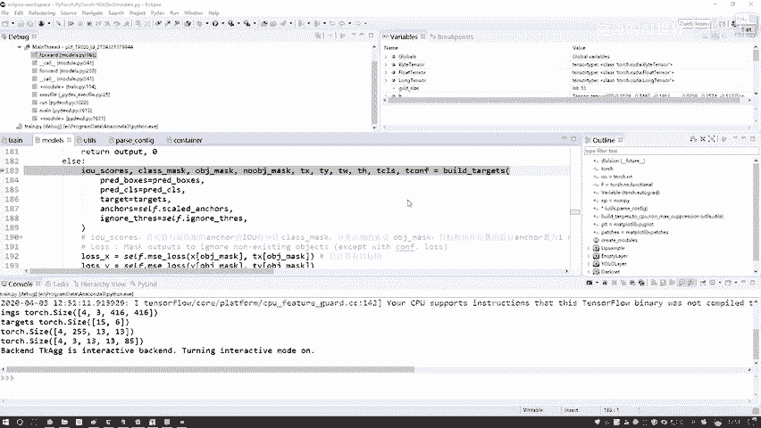
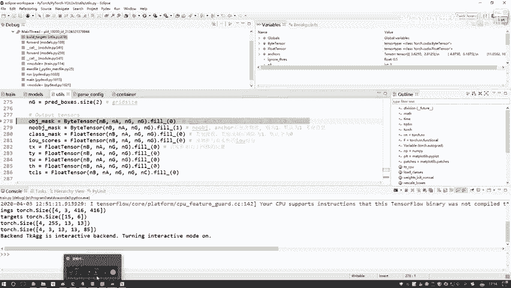
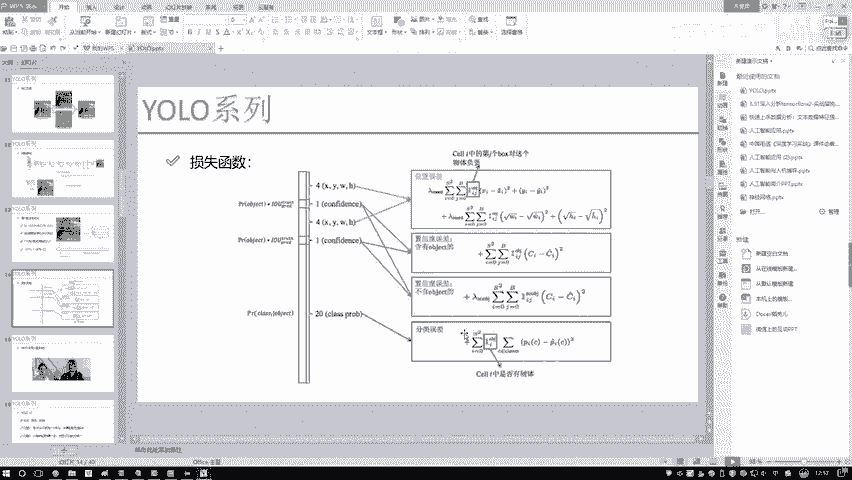

# P78：11-模型要计算的损失概述 - 迪哥的AI世界 - BV1hrUNYcENc

现在啊咱们已经把这个前向传播啊，整体流程跟大家解释了一下，我们是不是只差最后一步了。

该怎么样去计算一个损失值，那我们来想一想，现在我们手里有什么，你看这里啊输入的一些参数参数都说有的吧，比如说现在我知道了呃，我预测的一个结果来说，诶一个XYWH，这是我有的，以及呢我预测结果当中啊。

它属于某类别的，这我也有，并且呢我第一个标签target词，这个东西咱是不是也有啊，那好比说预测值和真实值都有了，那直接做计算不就完事了吗，但是我们想一想，现在啊咱们拿到预测值是什么。

这个哎就先说这个XY吧，这个XY它是不是说相对于一个格子来说，它这个相对位置啊，我的targets呢是相当于整个图像的一个相对位置，他俩根本不在一个频道当中吧，或者说他俩哎表示层面是不一样的。

所以说啊我们在当前这个函数当中，需要先对我的标签做一些处理，把咱们但凡损失当中诶会用到的值，用到这些标签全部转换成相对格式吧，这个函数啊好比说它就是一个打辅助的吧，啊摆这里我们要把这个targets哎。

这个标签做个转换，咱们一个一个来看一看，首先我F5跳进去啊，咱们进入到这个函数当中，我给大家解释一下，其中额每一个值表示什么意思，前面这个就是CPUGPU转换，这咱不说了，然后这里呢有几个值。

我给大家解释一下呃，咱们之前啊在做那个预测的时候，是不是说我现在哎得到什么了，咱们想一想，我说预测的时候，咱得到这样一个值啊，就是一个4×1个三，然后再乘上一个13×13的，大家能不能想起这样一个值。

四表示什么来着，一个数据，我们这个batch是等于多少，比如说啊咱们这个batch，它是等于有这么四个数据的，然后呢这个三表示着说我每一个格子啊，有几种先验框，那这个三表示咱们有三种线框吧。

那这个十三十三呢，表示的是我当前格子的一个大小吧，可能有你的输入不同，由于你当前优路层不同，咱当前这个格子可能不一样，这个没关系，这个大家举例子，那你说现在我的预测值是这种格式。

那真实值或者说一个target，你是不是讲道理也得给它处理成一模一样的，也得是什么一个4×3，再乘上grade，乘上grade吧，才能做后续的所有计算吧，所以说这里啊咱们要先做诶，第一件事。

把我们的一个标签全部转换成相对格式好了，第一步咱们去计算吧，就是在实际的一个预测boss当中啊，咱把这节值取出来，因为不同像我刚才说的，因为不同的一个右路层和不同输入大小，这四个值得到结果不一样的。

所以说这一块我得根据实际情况，把这四个值取出来，NB呢它是等于一个四的哎，一个拜仁赛等于4NA，你看这块它也等于三吧，然后NC它等于一个80，表示着现在我一共有多少个类别，NG呢，表示着13诶。

当前我的一个网格大小，然后接下来接下来这步就很关键了，我们先想一想，一会儿你要去计算一个损失，在计算损失的过程当中啊，我们算了几步啊，有几种损失啊，估计大家已经忘差不多了，没关系啊。

咱回到PPT当中给大家看一下损失有几种。

第一种位置的一个误差吧，好了一会我要去计算位置的误差，那位置误差当中，我都需要用到什么X和WXYWH吧，所以说一会儿呢我需要把XYWH全部转换成，跟预测格式相应的，哎这是第一步，有位置误差吧。

好第二步有什么知心度误差吧，哎但是这个置信度误差当中，你看它包括什么，它有两个，一个是包含物体的执行度误差，一个是不包含物体的执行度误差，那你说一会儿我是为两个我都得算一算，那都需要什么。

我预测值我有了我真实值上需要什么，真实当中我需要这样一件事，比如说在这个格子里边吧，呃前面这个batch和这个和这个混选框勾，我不不我就不说了，那你说是不是得你，你得告诉我。

当前按哎这个格子当中哪块儿它是个一，哪块是个零，什么意思啊，我说它这块是个一，比方说以它为这个中心的时候，这块有一个物体是不是那零呢，就是不含物体吧，我们需要把这两个值，不是这两个标签做个转换吧。

这个不是我们计算啊，因为标签都是现成的，比如说现在我拿到一个实际数据，实际数据当中啊，是不是标定了当前哎这块有个物体，这一块有个物体，比如就标三个吧，这块有个物体，那我是不是得需要在相应它格子位置当中。

在这块标一这块标一这块标一，那其他位置标什么，其他位置都标零呗，是不是这样一件事啊，但是大家注意点，我现在说这种标注方法是对于谁来说的，是不是对于说含有object来说的呀，是不是这样的，我含有物体的。

我希望它能把预测的这块也是一这块也是一，这块也是一其他位置为零吧，那还有什么情况，这是考虑一个有物体的，那再换另一种情况，另一种圈当中还是这三个图，我我画一模一样的吧，这一个，然后这一个。

然后这一个那在不含物体当中，视精度不含object当中，那你说他们应该标什么，根本没感觉，是不是说此时他要标可也，你也可以也可以标一也可以标零啊，这无所谓，根据你自己设计来，那比如说我也标一吧。

这里我这这里不应该它标一，这里应该是这玩意标零了，标零标零的位置表示什么，标零这个位置表示含有物体的，然后呢不含物体的，我要标一吧，为什么，因为对于一个现在这个误差来说，我要计算什么不含物体的。

它的一个损失，相当于啊我有两种执行度啊，上面的我拿不同颜色吧，估计这样大家这块可能混蓝色的，是希望我们什么找到哪块有物体，然后呢下面再画这个黑色的，下面这个黑色是干什么，他希望我找到哪块是不含物体的。

所以这两个东西啊看着说点稍微矛盾啊，那我们是不是得做出两种标签儿跟什么，跟这当前两个损失函数相匹配吧，所以啊大家一会看代码的时候，会看到我做了两种损失啊，一种是含含这个物体的，另一种它是不含这个物体的。

这两个可能大家一会稍微混一会，讲代码时，我给大家再强调一下好，最后一个最后一个分类误差，这就不用说了吧，他是谁，就是一个完好的coding，是谁谁标一不是谁谁谁标零二就完事了吧，这是一个分类的。

比较简单啊。