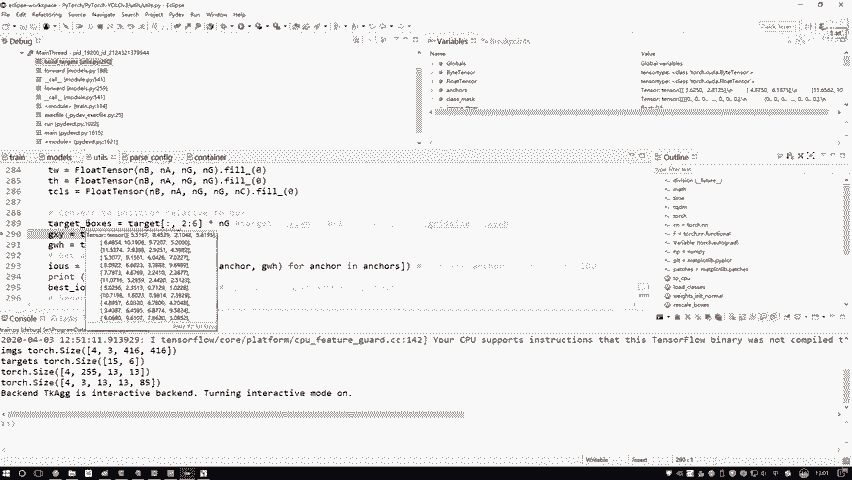
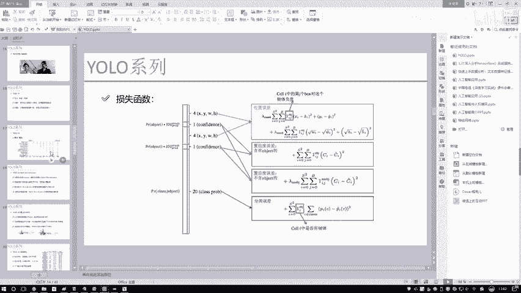
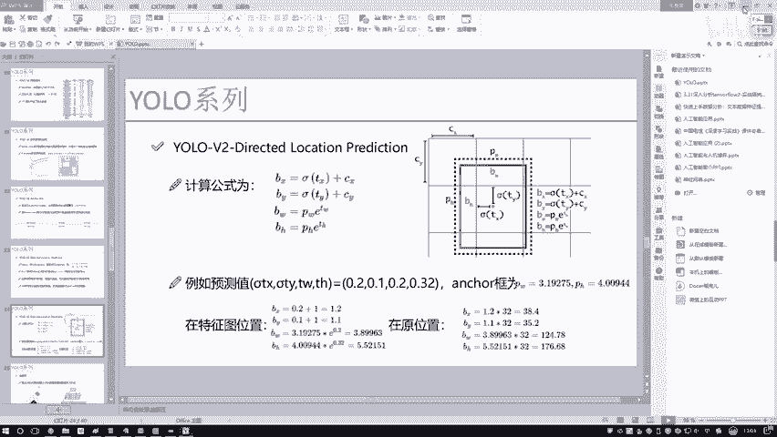
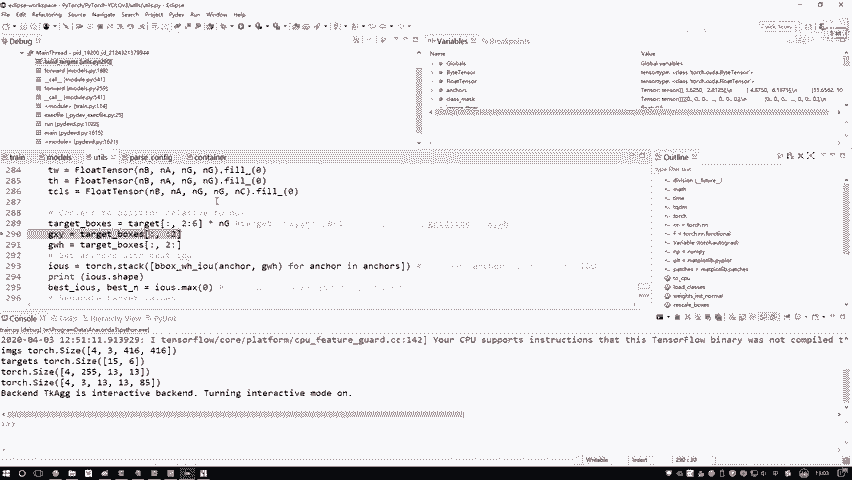
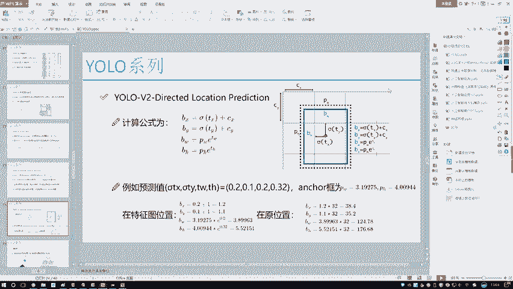
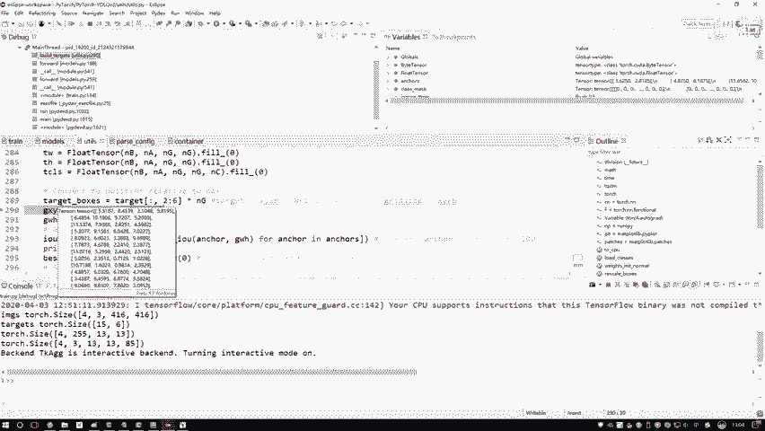
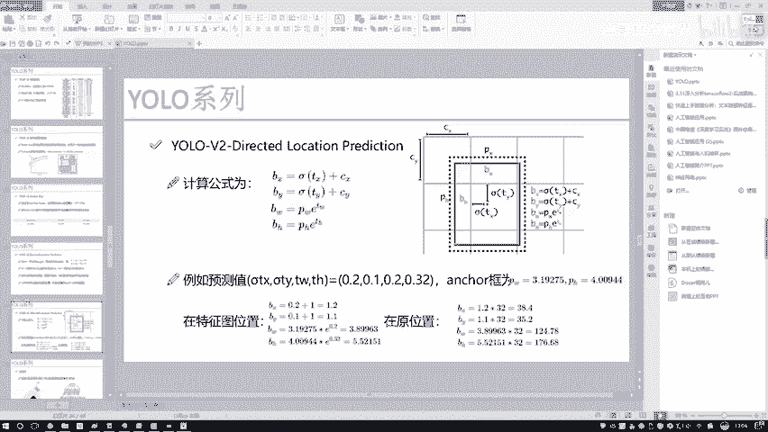
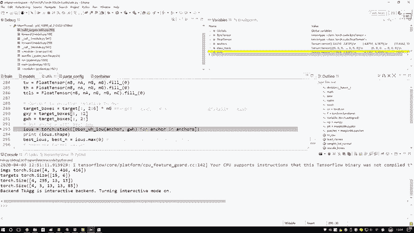

# 比刷剧还爽！【OpenCV+YOLO】终于有人能把OpenCV图像处理+YOLO目标检测讲的这么通俗易懂了!J建议收藏！（人工智能、深度学习、机器学习算法） - P79：12-标签值格式修改 - 迪哥的AI世界 - BV1hrUNYcENc

第一个第一个你看啊这块他是怎么去做的，这个OBJ哦，换红色的吧，这个OBJ，它是不是说，表示的是当前有物体存在的一个地方，我要把这个标签构建出来吧，那怎么构建啊，那是不是说但凡有物体位置。

我标一个一就完事儿了呀，在这里我们来看它初始化是什么，初始化当中这个大小还是一个四三，然后这个13这13这没变吧，一开始他全拿零做填充了，就是说一开始啊所有位置都是零二哎，表示的是我初始啊。

我也不知道哪块有物体，那就都当做是没物体吧，然后呢一会儿我不是有target的标签吗，那个标签当中我就算一下谁哪块有物体了，我说给它制成一个一可以吧，这个就是为什么咱们拿零当初始化。

因为大部分位置都是零嘛，然后少部分跟target当中有一个标定的，我一会有标一哎，这是我们现在标了一个o b j mask，表示的是我当前哪块有物体是一没物体，它就是一个零，哎这是当前这个意思。

接下来接下来看这个名字啊，名字是不是变了，他是什么，之前是一个o b j mask，现在呢是一个NO o o b j mask，那他俩说的是不是像我该给大家PP当中画的，相反那件事啊。

这里我先用一个一表示什么，表示了一个初始位置，一表示初始位置的时候，表示的是我当前啊，哪块儿它是不含有这个物体的，然后呢一会儿我但凡含有物体的，我给它标个零，是不是就完事了。

相当于这里哎我们做了两件事啊，第一件事考虑啊，一会儿有目标的一个损失，第二件事一会考虑它没有目标损失，因为损失函数当中他给我列了两个，这里我也得用两个来去做吧，好了注释也给大家写出来了。

一个就是考虑一个前景，一个就是考虑一个背景，接下来接下来是什么，接下来就是我的一个分类，那分类这个东西比较简单了，那就一开始全标零吧，是谁，比如说这里它是哪个类别的，我在哪个类别当中标一个一说就完事了。

分类的比较简单啊，就是正确为一，然后错为零就得了，然后这一块呢有一个iOS score值，IOSSCE值是这样，一会儿呢我会计算一下，当前一个预测框和真实框，它的一个IOU哎，就是IOU的值是等于多少。

这一块这个IOSSCR1会再用的，用的时候再说啊，我们会有一个计算IOU的，然后这个TXTYTWTH这些，我估计大家看着都比较熟悉了，就是我们现在要算这个真实框，相对于我的一个网格，它的一个位置。

一开始反正我一会儿要在标签当中，实际把值往里去赋值吧，那一开始咱就全拿理由当填充了，一会儿咱们自己去赋值，然后这个这个就是稍微维度跟之前不太一样啊，这是什么，这是一个就是八，就是他那个是80个类别。

是不是，那我们来看你对于每一个格子当中的，每一个位置，就是相当于啊这里边4×3乘13×13，这其中的每一个值我都要去算一下，它属于80个类别可能性吧，所以说在最后啊，我又给他多加了一个维度。

加了个NC表示说呃它到底属于哪一个类别，然后一开始啊拿零做填充，一会我会把它真实值赋为一哎，这个是最终啊对类别做分类的时候，因为我们损失函数当中啊，是不是还有最后一个对类别做的时候，咱也有这些值吧。

好了，我先把这些啊，就是相当于我做了一个我初始化诶，一会儿我会基于啊我初始化的东西，把标签当中实际值往里去添加哦，这个意思好，接下来接下来我说我得对这个格式啊，做诶相应的一个转换了。

第一步第一步咱们来看啊，哎我说这个标签当中啊，咱们之前给大家看那个标签了吧，得到的一个XYWH都是从0~1之间的值吧，比如直线下给大家看一看，这里咱们来看里边所有值都怎么样。

诶不是这里哎哎对这里对吧，这个tart当中里边所有值都都是什么，都是从0~1的吧，咱们看后几个，看后几个，前面这个八，还有这个16是说它属于桌子椅子那个类别，后面这四个是XYWH吧。

你看它所有值都怎么样，都是从0~1的吧，但是我们来想一想，我们的预测值，就是说我们那个之前啊，咱们说前向传播得到预测值，预测值是什么来着，给大家看看这个图，咱的一个预测值，我找找那个损失函数那个图啊。

在这里我这个预测值是什么，你看预测值是得到了它在网格XY，是不是得到它在网格当中的一个位置，哎这里因为它加上了一个CXCY吧，它是相当于网格的一个位置，相当于特征图当中的位置啊。

但是现在呢我们这个target当中，我的标签当中它只是相对于原始图像，它是在这是个0。6，可能这是个0。4，是不是这样一件事啊，所以说我现在物理转换了，我得把这个target这个标签转换成跟我的预测值。

当前这个bs spy这个东西，他俩得是怎么样一致的吧，好了。

我要做这样一件事，那怎么转呢，那其实就这样一件事，你说你现在啊这个TARA这个东西，它现在是相对于原始图像的，那我现在对原始图像的，跟我现在我说我要算它在特征图当中位置，这是不是一个等比例的。

所以说我直接乘上什么，直接乘上我当前这个grade一个大小就完事了，那这样我得到的一个target boss当中，我们的值是什么，相对于当前这个格子，一个13×1个13的格子当中，它是落到什么位置了。

哎这是当前我得到的一个值吧，是不是给他算出来了好了，这是我当前得到的一个结果值，但是呢跟我预测值还不一样啊。

刚才小慧给大家说一句，我们预测值实际上是什么，来看这个东西，这是什么，它真的是一个在格子当中实际的位置吗，咱们之前是不是说了，在讲这个损失函数当中，我给大家详细强调了，为什么咱们不用一个绝对值。

而是用什么相对值吧，别让这个格子满点漂移。

所以说一会儿呢我们在处理这个target当中，不光我要得到它当前属于格当中哪个位置，我还需要知道它当前属于某一个格子里边的。

相对位置是多少吧，大家能不能绕过来，现在我要算点什么，是这个东西，哎这个XY相对于这个点来说啊，这一块可能是0。3，这块可能是0。4，我要得到什么，当前它相对一个格子相对位置吧。

所以说一会儿啊我还需要再额外多做几个事啊，这是我们现在得到他的boss，相当于是在这个特征图当中哎，他的一个实际位置，然后呢这个GX和GY是不是一样的，因为这块我直接二冒号六了。

相当于我这几个值全全部的给它，映射到在格当中的一个实际位置。

这是在特征图当中啊。