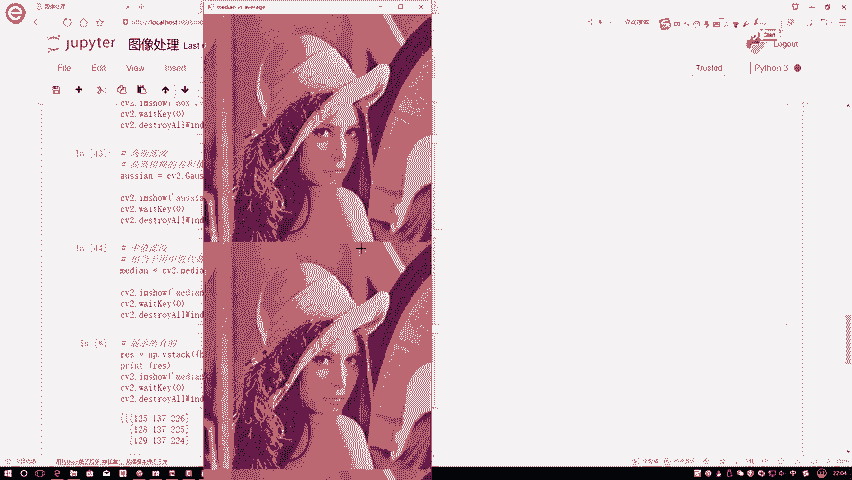

# 比刷剧还爽！【OpenCV+YOLO】终于有人能把OpenCV图像处理+YOLO目标检测讲的这么通俗易懂了!J建议收藏！（人工智能、深度学习、机器学习算法） - P7：2-高斯与中值滤波 - 迪哥的AI世界 - BV1hrUNYcENc

接下来还有高斯滤波嗯，高斯这个函数啊，大家应该都了解吧，我给大家画一下高列函数，是不是这样，比如说在这里我说咱们均值为零，然后指定一个标准差，标准差我们暂时可以不用考虑啊，这是我们现在拿到的高斯函数吧。

高斯函数什么意思，是不是说越接近于我的均值的时候，它的可能性越大，那代表着比如说这里有一个X轴，有一个Y轴越接近X等于零的时候，它Y的一个取值相对来说是不是较大，我们此时还可以这么去看，在这里。

比如说现在呃啊想一想，咱们刚才画那高斯，那个图啊，在这我再画一下吧，就是长这个样子，那你看这里，我刚才啊说那个均值滤波的时候，是不是所有加一起除以九，那你说这么做公平吗，在这里我们可以这么看。

你看还是咱们就拿这204当做中心点吧，你说75离204的距离可能会近一点，是不是，78离204的距离可能稍微有点远吧，幺三哎它又比较近的，235又比较远，104比较近，154可能比较远，这样一个事吧。

按照咱们高斯函数这个思想，是不是说离我越近的，我们应该更重视它呀，所以说啊就是当你啊用这个高斯滤波的时候，我们现在要做这个filter会发生一些改变，我们可以这么来设置。

比如说我说最开始最中间的我设定一个一，表示着诶它的一个嗯，咱就当做权重吧，表示他这个权重啊可能相对来说比较重要，那距离这比较近呢，我可以设成0。8，哎这是比较近的，这也是比较近的，这个呢也是比较近的。

这个相对来说也比较近的，我设置成稍微大一点值可以吧，那接下来像是121748235154的，离我相对远一点，那我设置了一个卷，就是filter盒当中啊，它这个数值是不是也可以是稍微较小一点啊。

表示着它的重要程度，是有这样一个远近的一个关系吧，这个呀就是我的一个高斯filter，他做了一件什么事啊，也就是这样一个高斯滤波，这个道理很简单，就是离得越近的发挥的效果应当越强，离得越远的。

它的作用就没有那么大了，相当于你自己啊构造了一个权重矩阵，怎么去做的。

而不是就是用一个均值去做了，咱这样咱来看一下高斯滤波啊。

它的一个结果在这里呃，我再执行一下，咱们来看嗯，从整体上来说好像是也是有这样一点噪音点。

但是啊给我的感觉好像是，是不是这个噪音点没有之前那么严重了呀，这样一个现象吧行了，这个就是我的一个高斯滤波啊。

比较简单，就是想一想我们的高斯分布长什么样子，然后你再去理解这个高斯高斯滤波啊，就比较简单了，然后下面这个中值滤波。

中值滤标啊是这个意思啊，比如在这里我们现在还是方框这个东西，那你说中值滤波哎，大家来想这个词什么叫做一个中值啊，中指是不是说我要从小到大进行排列序序，找它中间那个值啊，在这里咱来排序一下吧。

我按照从小到大，从从大到小都无所谓啊，反正找中间的第一个是24，第二个呢第二是75，然后是78，然后接下来我看一看，接下来104，然后呢113，121，一百五十四四，然后下面154完是204，235。

当我把这些值啊都找完之后，我找谁呀，我找中间那个，这是第一个，第二个，第三个，第四个找它吧，113吧，前面有四个，后面有四个，注意一点是我按照从小到大，或者从大到小排完序的一个中间值啊。

那此时中间值是113，那这一回我说现在我经过滤波完之后，我当前这个点值多少就是多少了，113吧，拿我的一个中间值，当成是我平滑处理完之后的一个结果了。

这个就是中值滤波比较简单吧，就是直接你把这个呃，你给我指定好你的一个filter大小，比如说你是按照一个5×5的还是3×3的，反正指定个大小就可以了，比如在这里咱指定5×5的。

那接下来它就会按照你框到的这个filter，这个盒当中Z，比如说5×5，那相当于是有25个，有25个吧，前面12个，后面12个，这是中间那个，把中间这个值拿做它的一个处理结果，这就可以了，我们来看一下。

当前当我用中值滤波完执行之后啊。

它的一个结果可以关掉一点，是不是说所有噪音点看起来就都不见了呀，因为他是怎么去做的，用一个中指去做的吧，而没有把噪音点拷贝进来吧，这个就是我的一个中值滤波做了件什么事，所以说当我们的数据当中啊。

有一些噪音点的时候，或者有些像是钙化的那些焦耳噪音的时候，用中值滤波，是不是一下子就能够把这个问题处理掉了。

这个就是一个啊中值滤波，它做了一件什么事，那下面给大家说一个方法，就是当我啊当我们去那个用image show的时候啊，我们可以啊把一些整体的结果都传进来哦，比如说像刚才做了几种。

我们就不把那个方块滤波传下来了，一个是均值的，一个是高斯的，一个是中值的，主要说这三种吧，我们可以把这三种啊通过南派点is attack一下，给它连在一起，这样我可以把这个东西我再打印一下。

我可以print一下，print一下当前我这个stack完它的一个结果，然后呢再来展示一下，你看啊这个结果就是啊下面它会拼在一起了，拼在一起它展示完它就是这样一个整体了，你可以是tag或者是一个呃。

或者是个VISTTAG也行，再来看一下VISTTAG什么意思啊。

你把这个图像是不是由上，就是按照竖着拼接或者横着拼接都可以啊。

只不过说在这里啊，你看这是一个三维，这是一个三维矩阵，这是三维矩阵，这里三维矩阵吧，你可以把图像拼接在一起，相当于把像素点拼接在一起就不完事了，这样吧，我还是给它改成一个H那个还是带个值吧。

要不然看起来不是那么舒服啊，这样我们来观察一下他们的一个结果，一开始这是什么，这是我的均值滤波，右边呢是我的一个高斯滤波，第三个就是我的一个中值滤波，在这里啊，分给大家展示了一下啊。

我们不同滤波的一个结果是长什么样子，这个就是最基本的一个图像平滑处理啊。