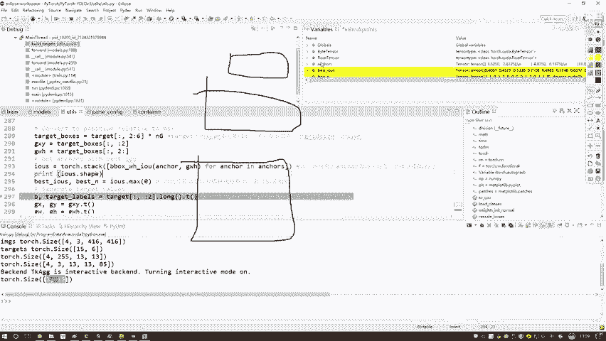

# P80：13-坐标相对位置计算 - 迪哥的AI世界 - BV1hrUNYcENc

那好了，有了在特征图当中实际位置了，哎那我们之前在说啊。

他预测的时候是怎么说他预测来着，大家想一想，我说这是一个格子，这是13×13的，然后呢比如这块吧，额这块我给大家拿绿色来画，这一块呢有一个真实值啊，就是一个ground truth，我写的gt吧。

ground truth真实值，然后现在我说有有个格子呃，就是当前这个格子吧，这个点为中心点，假设说这个点就是格子当中某一个点，那我们之前是不是说某每一个点来说，我要选出来几种候选框，是有三种啊。

那三种候选框，比如我画几个，这是其中一种候选框，然后这是第二种候选框，然后这是第三种候选框，那三种候选框算完之后，比如说写个123吧，这是一，这是二，然后最小那个是三，然后呢我们选了三种获选框之后，哎。

你说啊，最终我用的，或者说最终啊咱回归得到的结果来说，我选谁了，我是把他们都去玩了吗，好来说不是吧，我用的是不是说跟我这个ground素来说，重叠最好的那一个，然后呢去对它做微调啊。

那这里大家能不能看到哎，你说IOU来说最大是谁啊，是不是2号这个呀，所以说接下来哎比如三种候选框啊，虽然说是三个候选人，那我是不是说诶这三个候选人来说，谁跟真实情况下最接近，或者说谁更好一点。

我用谁来去做微调，使得2号就是经过XYWH做成样变换，能得到跟ground truth越接近越好吧，所以这里啊咱们还要做一件事，算什么，算一下当前啊我不是有这么三种候选框吧，那我需要算一算。

对于每一个格子来说，而不是每个格子对于每一个ground truth来说，一个真实值。

ground truth一般有几个，咱们打开那个呃，在这里我看一看这里有没有啊，这里把之前给关掉了，就是我们给大家打开一个标签吧。

来看一看之前给大家看过，在一个标识当中，我们有多少真实值，是有很多真实值吧，不是一个吧，好给大家看一看，在这个eclipse当中我找一找，然后这个data当中我们的客户数据集。

然后这个label当中吧，虽然大家打印一个就train当中吧。

来看一下这里有几个12345，是不是，那比如说就举这个例子啊，比如说它现在它有五个真实值，那我是不是得算一下跟这五个真实框来说，哪五个候选框是个最接近的，因为一共可能有多少种候选框。

每个地方都有三种候选框吧，但是呢我要在这三种当中选多少个选一个吧，哎是有这样一件事啊。

所以说我们回到这个代码当中来看一看，这里呢他做了这样一件事，呃这个IOUS啊，这个变量它是这个意思，他说啊现在你看这有个循环啊，他说是遍历了一下我红色画起来的，当前这里边是不是三种，这里边是有三种框吧。

遍地三种框，都是每一个每一个框去跟我当前GW是什么，就是我的一个真实值，这ground truth吧跟真实之间算算什么，算他的一个IOU吧，全算出来给大家看看它的一个变量值吧。

这里边儿它说有三种相当于当前的一个优菈槽，因为我们是当前是133那个yo槽，哎我们有三种候选框，这咱们之前都已经给大家说过了吧，好三种候选框，然后便利呢其中每一个，然后跟这个WH你看这里有多少个哇。

这这是可能某一边当中有太多了，一二不部署了，反正有一堆跟其中每一个算什么，算他的IOU吧，然后我把这个IOU结果拿到手了，然后这块给大家打印一下，它这个shape值你看得多少，35什么意思，一共啊。

我们有15个ground truth，是我真实框，每个真实框当中，是不是说我要跟哎跟他匹配的三个候选框，要算一算，是不是，所以说3×15表示的是跟当前啊，每个候选框来说，哎跟当前每个真实值来说。

我每一个候选框诶，他这个IOU值这咱数就有了，但是有了之后，我们现在是只是计算出来一个结果吧，那我们实际还有什么，是不是你得算一下当前谁是一个最大的吧，好了，这个IOU当中算一个max。

咱们来看一看这里有一个bx I/O u，它是什么多少值啊，大家想一想，前面这是3×15，然后这块我算了一个max，是不是说就是在这个每一个慧眼框当中，选一个最大的得了，所以这里边应该是有15个值吧。

表示的是哎当前呃我15个就15个候选框，跟我真实框最大的IOU是等于多少的，这个值再算出来了吧，然后这个BSSN你看它这个值啊，这是指什么，有一有零有二什么意思啊，咱们当前是有三种候选框，那比如这样。

我说这三种候选框啊，有这么大的，还有这么大的，还有个这么大的，我说给他做个标号，我说你是0号。

你是一号，你是2号，在这里呢，我们这一个BSN里边，这个一表示就是说跟当前第一个真实值啊，最匹配的一个候选框的规格是一号那个规格的，然后跟第二个真实框诶最匹配的是一号规格的。

跟第三个真实框最匹配的是0号这个规格的，所以说啊这个BN当中表示的，就是跟你一个真实框来说最匹配的一个规格，我们就三种规格吧，好了，他的一个型号在这里我也列出来了，哎这个是咱们一会需要用的行了。

那我们现在就是把这个IOU也算出来了。

那接下来我们再算其他值还需要算什么，那这一块我们还需要算这样东西，因为一会儿啊当我们算这个label的时候，我们需要考虑什么，我们需要去考虑当前的一个batch吧。

因为你知道这是对哪个数据来做这样的操作的，所以说啊在这个target当中，我们把一个batch，和一个它实际属于哪一个类别的标签，哎我们给它给它分开一个B当中啊，有这个0123表示的是当前啊。

我们就是当前这个当前这个框啊，当前比如说某每个框吧，它属于哪个类别的，可能第一张图像当中有两个真实值，所以前两个是零二，然后这里边是第二张图像的，然后这是第三张图像的，这是第四张图像的。

我们把这个batch也得分开啊，因为一会儿你是不是得构建出来，那个B乘上一个A乘上graysize grey size，诶那个那个一个就是大的矩阵啊，所以说这块我得知道当前每一个值。

它是属于哪一个batch的，这咱也分离出来了，然后呢，这个target label就是当前啊，这个框它是属于什么类别的，这就是一个id啊，0~80之间的一个i id值，这个比较简单。

然后接下来呢我要对这个GXGY，我也得去做分离了，因为一会儿GGY我还要再做一些处理变换，WHR我也都分出来啊，这个意思，然后这块多了一个东西叫做这个呃，I和J他是这个意思啊，比如这样嗯。

比如现在你得到这个格子，这是零，然后这是个13是吧，这也是个13，然后呢你的一个XY，比如说XY啊，它是落到这了，我说这块它是一个GXY，然后呢这个I和J啊，是这个意思。

就是说现在啊比如说这个X它是一个8。13，然后这个Y它是一个呃，就我随便写啊，解释个8。8。15吧，然后呢它的一个I和一个J等于多少，就是等于一个八，哎这也是一个八，相当于啊我要看一下它的一个左上角。

哎，比如这个它落在一个点上中了，然后呢这这这是个格子是吧，我要算一下它左上角这个值是等于多少的，因为一呢一会我会基于它左上角的值，我说这是个CX，这是一个CY，咱们大家还能想起这东西cs t y吧。

它实际格子的一个位置，我需要把这个I和J算出来，I呢代表着它的一个CX，J呢代表着它的一个CY哎是等于多少的，所以其实啊这一步非常简单啊，就是对我们的一个XY给大家看一看，这X它是等于一个呃5。51。

然后6。48的，然后这个I呢它是不是等于一个五一个六啊，然后这个Y你看它是等于8。45，然后第二就看两个得了，第20。19，然后这个J它是一个八和一个十吧，是不是就是做一个向下取整就完事了。

I和J要表示的就是呃咱们当前这个格来说，它的一个坐标位置吧，这是零。

这是三，这是13哎。

