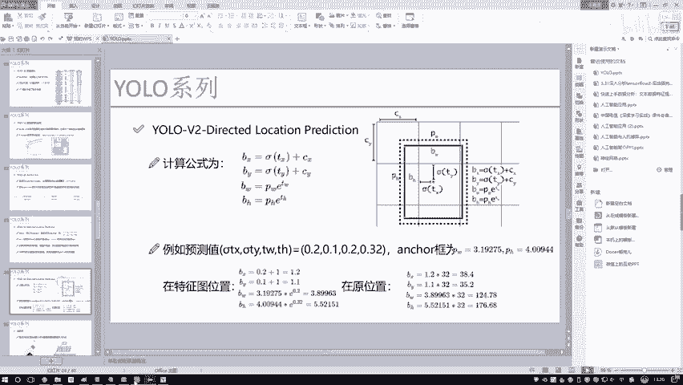

# 比刷剧还爽！【OpenCV+YOLO】终于有人能把OpenCV图像处理+YOLO目标检测讲的这么通俗易懂了!J建议收藏！（人工智能、深度学习、机器学习算法） - P81：14-完成所有损失函数所需计算指标 - 迪哥的AI世界 - BV1hrUNYcENc

然后接下来接下来我要去，就是往我们的一个之前构建出来的，那个o b j mask，还有那个NO o b j mask当中做填充了吧，那我们填充一下吧，实际包含物体的，我是不是要给填充一啊。

因为一开始怎么样了，一开始我是全给它复制成零二，相当于零二代表一个背景，然后target当中有的东西我是要付给赋给什么，是不是要付给成一个一啊，表示着它是一个物体吧，那把什么样的位置复位成一个一啊。

来看这个GGGI为什么把它俩复成，为什么用它俩啊，因为大家来看这个X和Y是不是说一个真实值，它实际的一个位置啊，是一个真实值，实际的位置，我们做了一个下下去找，是不是说在网格当中它的一个位置了。

那在网格当中都有这样一个真实值了，我们讲道理，是不是得把当前位置设成一就可以了，是不是这样一件事啊，那好了，这是对于一个o b j master来说，哎target当中包括的I和J当中坐标。

有的这些有位置标一，然后下面这个NOOBJ当中，那他俩讲道理是不是相反的一件事啊，小该说矛盾的一件事吧，那这个OBJ当中我说事物体包含当做一个页，那o NO o b j当中那是物体。

它就标个理由是完事了，因为他是拿什么初始化的，它是拿一初始化的，一表示着是一个背景，那所以说现在它既然是有一个前景，有个物体了，我就要给它制成个零，这没问题吧，只有这两项，咱们相当于他俩是一个矛盾的啊。

就是它是一，他是零二，因为一个是物体，一个是一个不是物体啊，这样一件事好，我们接着往下看，接下来就是呃在这块我们还会算一个值，就是当我们在计算过程当中啊，论文当中说这样一件事，如果说呀。

当前我们之前咱们把这个IOU全算出来了吗，如果说哎我说当前这个IOU，然后呢大于一定值的时候，我也不能说，比如说现在我们对于这个NO o b j来说，我给大家画个图，大概这个意思，比如现在啊这一块呃。

怎怎怎么解释呢，它是这样，就比如现在我画了有一些呃targets吧，这个跟这个target当中，比如这里这是一个真实值，然后呢跟真实值啊，你说这个真实值标到这了，那你说我现在有个有个东西啊。

我跟这个真实值啊重合的比较多，那你说在我这个NOOBJ当中啊，你给他标什么，你给它标成一个背景吗，合适吗，好来说不太合适，他虽然说这块啊，它不是一个跟那个ground trude完全重合的。

但是如果说他们的交集比较大，你是不是也该认为它应该是什么，应该是一个前景吧，而不应不应该认为它是个背景，所以这一块我们算这样一个东西，就是让所有的一个IOU，咱之前为大家算出来了吗。

如果说这个IOU大于了，我们当前给定的一个阈值，比如说0。5，然后呢，我就认为当前啊只要IOU大于0。5的，那你也不能当做是一个背景，还得当做是个前景吧，要等到前景在我这个NOOBJ当中。

是不是标一个零就完事了，好这里给大家解释了一下，就是我们通过一个阈值，就是这个0。5又去判断一下，在这个NO o b j当中啊，什么样的位置重合，比较大的位置也应该是一个物体，你给它标上什么。

标成一个零，哎这就完事了，这一块就是我遍历了一下所有的一个IOU，看一看他的得分值，然后跟我阈值之间做了一个比较，但凡超过阈值了，我说这块也相当于是有物体的，这是合理的吧。

好接下来接下来我就要我们算这个TSTY，还有TWTH了，这个值啊跟我们那个PPT当中是一样的。

给大家看一看，来我问大家这个TY和TX，想一想咱之前说的他是什么意思来着，我说这个TY和T是这样一个值啊，它表示的是当前啊，这个值相对于我这个格子的一个位置，这个格在哪呢，是不是红色框起这个格子啊。

这个TISTY表示的是，它实际相对于这个格子的一个位置吧，那好了，那我现在真实值我是不是也得做成这种格式，怎么做啊，真实当中我是不是已经知道了，它实际的一个XY，那比如说实际的XY在这呢。

它可能是呃这这样一个值，实际的一个XY值是不是，然后用我实际的一个XY值，因为这格大小都是多少，都是一的吧，用实际的XY值减去什么，X应该减谁，X减谁啊，是不是CX啊，然后呢Y减谁是不是一个CY啊。

这样就只得到了实际的一个TX，和一个TY值吧，哎这块大家能不能理解，之前我们说这个TXTYL预测值，不是相对于这个格子来说的吗，但是我现在真实值，它现在我们做完处理之后，我把它现在得到的是相对于特征图。

也就是整个网格它的一个位置，我还得再减去这个CX和CY才能得到，当前也是相对于格这个位置吧，所以说此时啊在这个戴尔当中，咱们怎么样也得做相应转换吧，你看这里，咱之前是给大家说了。

GX在格斗当中实际的位置，它是不是都是一些就是零到，就是0~13当中一些值吧，没问题吧，减去js floor什么意思啊，它实际的一个格子的坐标，就该说的那个CX，这样我得到的结果都哎呀，这块结果当中。

就是前前面几个，有可能是因为做排量看不出来了，那这样我们实际做出来结果之后，是不是相当于我又得到了它相对的位置，这个TX啊，那这里TY我们讲道理是不是也一样的，好这里我们TXTY咱就做完了。

然后这个TWTHTWTH上，我们算的是什么，W也是相对于坐标框的一个位置吧，就相当于候选框的一个位置，那现在呢我这个TWTH啊，咱们之前在给大家说代码的时候，哎大家记不记得这样一件事。

有个什么点EXP哎，之前我给大家说，我说你先放那，因为实际上我们在做标签的时候，我们会引入一个对数，所以这一块我们做了一个还原，那大家来看一看，这里它是不是跟原始论文当中一样，也做了什么。

也做了一个对数吧。

因为在我们的一个呃，在这里你看这一块是我们的一个做还原的时候。

是做还原的吧，乘上E的多少度，E的什么什么东西，那当你在做就是我们target当中的时候，是不是说在这一块我们得引入的对数啊，啊这块引入了对数哎，就完事了，这一块是一个TSTW还TWH和一个XY。

我给大家解释了一下，他俩是分别怎么去做的。

就围绕咱们这个PV当中图，你能把这个图我之前VR版本的时候，我记得我跟大家花了好长时间解释这个事啊。

在代码当中是不是也体现出来了，跟PPT当中讲道理是一模一样的吧，好接下来接下来就是我的一个t class，它表的是呃我的一个实际它的一个预测值，哪块应该标一，哪块标一啊，那你就看它这块有什么东西呗。

哪个类别的，它是哪个类别，我就给哪个类别标一不就完事了吗，这T和class比较简单啊，然后接下来class bus当中这个算的是什么，这个就算的是呃你的一个预测值，你看这个这是我的一个预测值吧。

这个是我的一个真实值吧，跳算一算我预测值和我真实值之间啊，他们的一个预测情况是算对了，还是一个算错了啊，这有这样一件事，然后接下来，接下来我这块还有一个额外补充的东西啊。

就是呃这个真实框相匹配的这个预测光，就ground truth和我的一个预测框之间，它的IO值啊，一会儿咱们可能用上，我把这个IOU值也算出来，因为真实框咱有的吧，预测框我不也有吗。

它IOU能不能算很容易我就能算出来吧，这IOU哎一会咱们可能会用到。

然后下一个下一个就是真实框的一个置信度，因为啊在我们损失函数当中。

你看这里呃，找一找这里损失函数，损失函数当中还有什么。

是不是说我得有这样一个置信度啊，好了我把这个置信度先也拿到手啊，因为一会儿对于真实块来说，真实框来说执行度多少，那就是一吧，哎真实框它实际有物体，它就是个一再有这个东西啊。

t confidence也拿到手，其实呢它就是咱们那什么o b j master这个东西吧，咱说经做好了，哪块是物体标个一，哪个不是物体标零，这个就就相当于对于我的一个标签来说，也就是置信度，它的标签。

这没问题吧，好了，我说啊，把这几个东西咱都做完了，做完之后我把这些值给它返回回去就完事儿了。

所以说啊现在我跟大家花了好大的一个力气，算了件什么事，算了一下，当前我们该怎么样把这个target做转换，因为标签转换在这里非常关键，预测值我们前后传播已经得到了，然后呢，我们现在需要把标签跟预测值。

处理成相同的维度，或者说相同的格式，就是你这个设计的时候，你预测值怎么设计的，你标签值也转成相对格式，因为一会儿你看下面马是什么，马上就各种loss了吧，我们马上要计算损失了，这一块。

相当于啊把我们所有的准备工作。

