# P82：15-模型训练与总结 - 迪哥的AI世界 - BV1hrUNYcENc

接下来啊就是一个损失计算了，这些就比较简单了，我为大家简单介绍一下这里啊，我们的XYWH2，是我们其他传播当中直接得到结果吧，然后呢，T x t y t w t h2，是我们刚才啊在这个函数当中哎。

花了好大力给大家解释这个函数当中，我们把一个标签制作好了吧，制作好之后，咱把这两个结果之间算什么mc loss数就完事了，但是呢我们在算之前啊，这一块还有什么o b j mask这个东西，什么意思啊。

它是这样啊，就是当我们做预测值的时候，是不是说啊，你对每一个位置都做了这样一个预测啊，但是大家来想一想，你说绝大部分位置都是什么，可能都是个背景吧，我的一个背景跟我的XYWH有什么关系啊。

都不是什么物体，我算什么损失啊，所以这里咱们要注意啊，我对算这就是算我们的那个XYWH，损失的时候，一定要什么前提下，只有目标的我才能去计算当前损失吧。

谁表示只有目标的在o b j mask当中，但凡唯一的表示有目标的吧，所以这里啊咱们当前哎算了一下我的损失当中，XYWH哎分别等于多少，然后接下来接下来还有什么，还有置信度吧，知信度当中还有两个指标。

哎这个也比较简单，一个什么，一个是一个OBJ就是个前景的，一个是一个o NO o b j就是个背景的，然后这块咱们一个b c e loss就完事了，因为它只有什么，只有零或者一两种可能性吧。

我对每一个位置都预测了一下，它属于0~1之间的可能性等于多少，哎那再给大家简单解释一下这个bc loss吧，呃其实公式很简单，这里大家列一下负的分之一，然后这块I从一开始到一个N。

然后YI乘上一个哦xi，然后这一块再加上那个1-1个Y，再乘上一个line，然后1-1个xi就完事了，无论咱们的一个预测值，比如这里我的一个预测值它都是什么，也是0~1之间的吧。

我的一个真实值也是零一之间的，所以这里啊我们直接算一个b c loss哎，就完事了，非常简单，我们就可以把当前它是属于前景的一个损失，以及属于背景的一个损失哎，全部计算完，然后大家以后用的时候。

可能不同版本当中，我看过有一些不同的，还有这个东西啊，叫做那个BCE就有些有些API可能不一样，叫做BC位置，一个log with logic，意思啊就是说呃他是把这个cn mode也加进去了。

但是咱们这个问题当中，我们的所有取值范围已经是0~1了吧，所以说啊咱们就不需要再加CMD那个东西了，直接拿这个现成的bc loss来来去做就行了，因为之前我们已经指定过了，我给大家CTRL点进来看一下。

这里mic loss就是那个PY套当中mic loss，然后b c loss也是一样的，PYTORCH当中都是有现成的，咱直接啊拿过来用就完事了啊，这里给大家看了一下，我们还有一个前景。

然后还有背景的一个损失，这一块我们也给他算完，然后算完这个强氧背景损失之后，我们把它合到一起，就是一个置信度损失，深度损失当中啊，既包括了我的一个前景，也包括了我的一个背景。

然后相应的乘上它的一个就是权重参数，哎这就完事了，这是我的一个呃置信度它的一个损失，然后接下来呢还有那个分类损失，那分类损失道理啊其实也是一样的，非常容易啊，咱们就能把这个分类损失是不是也算出来啊。

这都比较简单，那最终我们所有损失，是不是把这几项都加到一块就完事了呀，XYWH执行度的加分类的，跟咱PPT当中那一样的吧。

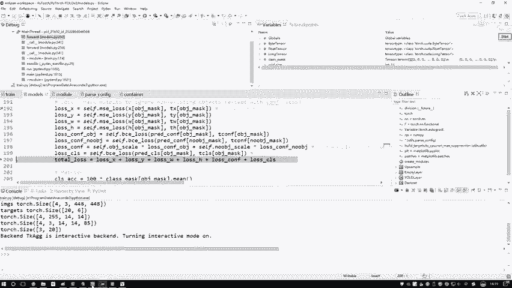

所以说啊损失比较简单，也是比较好理解的东西。

就跟咱讲原理的时候，就这四项哎，非常容易计算了，只不过说有一个比较麻烦的，就是在做物理检测的时候啊，最麻烦的一件事就是标签啊，可预测值之间哎，这些东西相互转换起来特别费劲一件事啊。

你看我刚才给大家说的这个build text函数当中，做了好多事，就是把什么把我们的一个真实值哎，转换成不是，把我们的一个实际标签转换成相对格式，使得跟我们的一个呃预测值之间能匹配起来吧，好了。

最终要把我这个TOLOSS算出来了，算出来之后啊，那接下来剩下就是一些只有标准了，比如说这个到时候大家都给自己加啊。

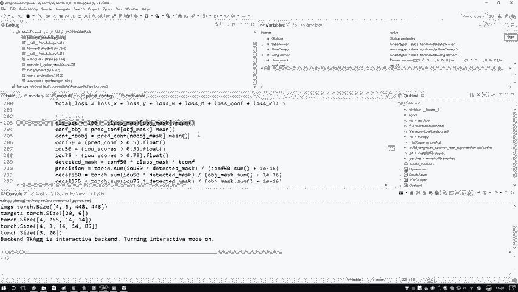

这个我觉着不太重要，大家不用看正文代码当中啊，写了这么多，有recall记了好几个。

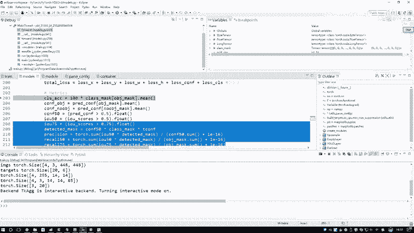

然后还有一些IOU的值，然后就是大于75%的情况下，IOU大于50%的时候。

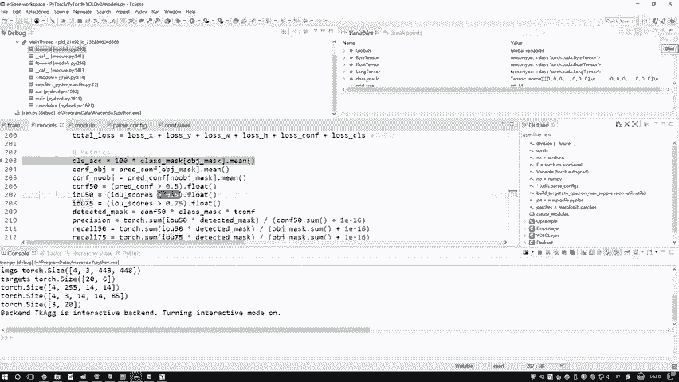

然后置信度，然后这些值这些啊可以说呃不用衡量这么多。

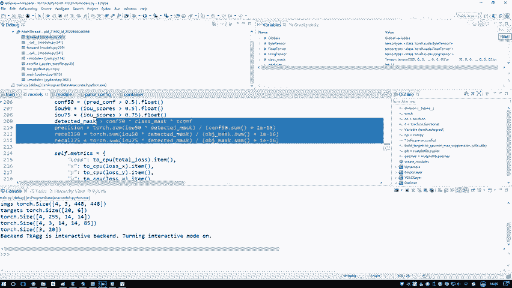

一般啊你就是看一个MVP值，其实也可以啊，这一块我给大家列了一下，就是呃对于每一项损失来说，有各个指标吗，我把这些指标全部列了一下，然后到时候大家你可以自己去添加，你说你想算哪个值啊，想看哪些指标。

你可以把这些所有指标都加进去。

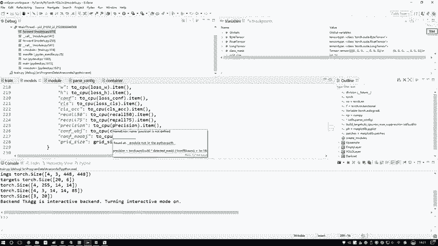

这一些比较简单，我就不给大家去看了，评估标准，然后呢回到我们那儿当中，刚才给大家说什么了好了，我们好大的力气啊，终于说完了我们整个网络的一个前向传播，咱们解释完了吧，大家现在可能有点担心。

就是老师你说完这个强化传播了，那我好像以我对神经网络的一个认识来说啊，前向传播反正不是神经网络当中最难的，好像反向传播是更难的一件事，是不是这个大家不用担心了，因为我们现在是用框架去做的，反向传播。

我们不用去管，因为什么，你看这里，因为对于我们这个损失，刚才给大家看哪，看的是这一行代码当中吧，进入到这行代码走的是我们的一个前向传播，把输入数据标签走进去，该说给大家说了全部的一个流程。

怎么样得到损失的，怎么样得到输出结果的，咱是不都给大家说了一遍，然后接下来反向传播，反向传播比较简单，一行代码完事了啊，所以说不用你自己去算什么梯度，什么更新的啊，什么都不用你去算了。

咱用什么框架来去做的时候，都不需要你自己玩这个反向传播，你只需要把我们的一个前项定义好了，反向这个东西啊，它都是自动去算的，因为在网络当中，我们所有层。

那讲道理是不是都是哎用人家这个Python框架当中，人家实现的，所以这块咱不用管了，直接做个反向传播，那接下来呢那就是一个更新的操作梯度更新，然后梯度至零二跟PYTORCH当中，所有基本的做法。

这都是一模一样的，下面东西啊都是通用的，我觉着已经不太重要了，下面就是你打印出来当前的一些日志，你要去看哪些个评估标准，如果说你想画图啊，在这块再把这个图画出来，然后最终咱把这个模型保存下来。

输就完事了，所以说啊整体接下来的东西，就是呃一些评估的东西，然后还有一些模型和保存，比如说你自己可以设置经过了多少EPOSE之后，然后你说把这个模型保存到本地，然后最终你再打印一下map值输就完事了。

所以说这个下面的我觉得不是重点啊，都是一些通用的所有算法，你都可以复制粘贴过来，没有什么太大特别的，那这里啊我就给大家咱从头到尾讲了一下，关于啊，我们的一个什么yo v3的一个架构来说。

咱们从前到后是怎么去做的，其实我觉着从一个圆角来说没有什么太大难点，就是跟我们PPT当中啊，那个大网络架构一个图做出来是不是差不多啊，所谓一个vs st的思想，就是我用回归来去做就完事了。

整体来说我觉着比那套master rc d那套要简单一些，因为master rcn当中就是另一个算法啊，像two stage方法当中，人家会设置到RPN层，会设置到一些。

就是网络结构来说会比这个更复杂一点，这个其实它也可以说复杂，但是没有什么太多的变换，所有东西都是常规的常规的卷积啊，常规的呃一些specialization都是一些常规操作，没涉及一些特别复杂的。

这个是给大家说了一下，我们的一个yo v3的算法啊，咱们在训练的时候，我们是怎么去做的，训练代码从头到尾已经给大家debug1遍，我也是建议大家，就是你们自己玩的时候能怎么样，也是诶咱们可以怎么样。

从头到尾的把一每一行代码，你觉得重要的模块咱全部做一遍，做一遍完之后啊，然后你可以去执行一下啊，这里因为我这块就打印出来了，我给大家执行一下，看看效果，这块我就是中间过程该给大家debug时候。

我打印的一个shift值太多了，所以呃你可能看不出来它的一个轮次是这样，就是它每一次迭代的时候，会打印一下当前的一个损失，因为你看现在迭代过程当中呃，它是我打印机有点多啊，这忘删了。

他每次会打印出来所有的损失，然后还有各个指标它的一个值，然后还有当前的一个时间等等，这个就是它迭代的一个过程，然后然后训练我不给大家就是看到完了，因为训练也看不出来什么东西。

就是不让你打印当前的一些损失值等于多少，然后经过多少次之后，它会打印呃，当前的一些就是比如说MVP值在验证集上，它的一个效果，那需要大家迭代时间相对来说是比较长的，因为这是一个coco的数据集。

里边涉及到的数据是非常非常多的，所以说这个训练那可能不是几个小时的事，可能对他来说是几天的一个事啊，不建议大家我们自己去做训练了，还是从啊这个原理和代码的角度去理解客户，这个代码。

然后实际你要用的时候用人家啊就是现成的，因为这些东西都是开源的嘛，用人家现成的来去做是不是也行啊，其实你在GITHUB当中啊，不光哎就是我顺便回答一下大家问题，大家可能有个问题啊。

就是现在哎老师你用这个PY套给我去讲的，那如果说我用其他框架呢，比如说我用TF框架，我用KERAS框架，或者说我用CAFEE框架，或者说你用那个yo人家官网，人家原作者的一些框架。

我反正我我不太喜欢他原作者那个框架，你用原作软件框架来去做是不是也可以啊，但是呢这些代码其实都有开源的有关，有一些官方版本，还有一些民间版本，咱在那个GITHUB当中啊，都能找到直接下载的。

你用这个代码的时候啊，其实最简单的一个方法啊，为大家来说一说，就是咱们怎么样去用这个源码吧，这里啊我已经打开了这个GITHUB。

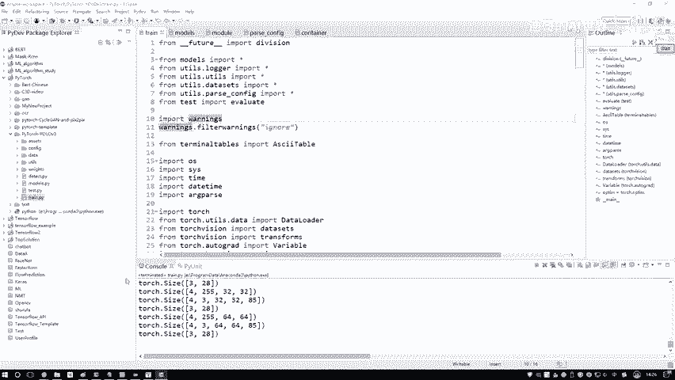

然后我们进来看一看啊，在这块如果说大家对这个yo感兴趣，你就直接搜一下这个yo，然后呢右边它会有当前你搜一下结果吧，你看一下这里有什么，这里有一个呃KIOS版本的一个YOO，然后这边还有什么。

这边还有一个PYTORCH版本的yellow。

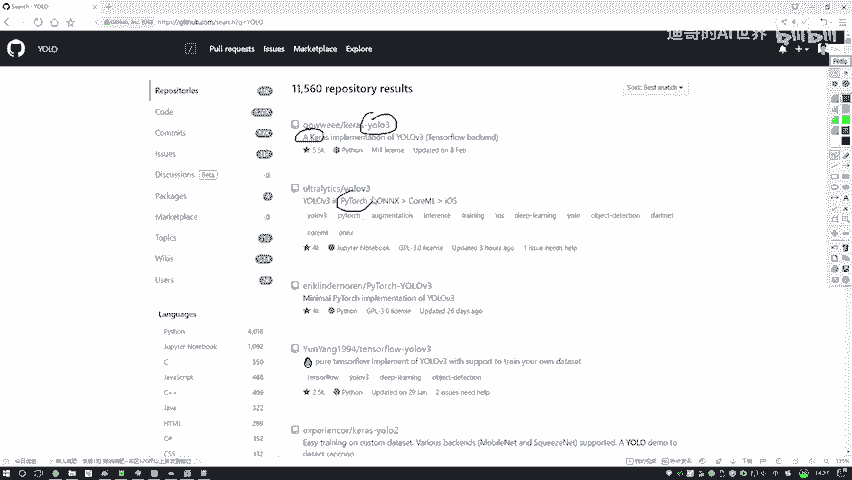

然后我看看还有没有TENSFLOOR，肯定有啊，就是YOO当中呃，这是KOSKOS的。

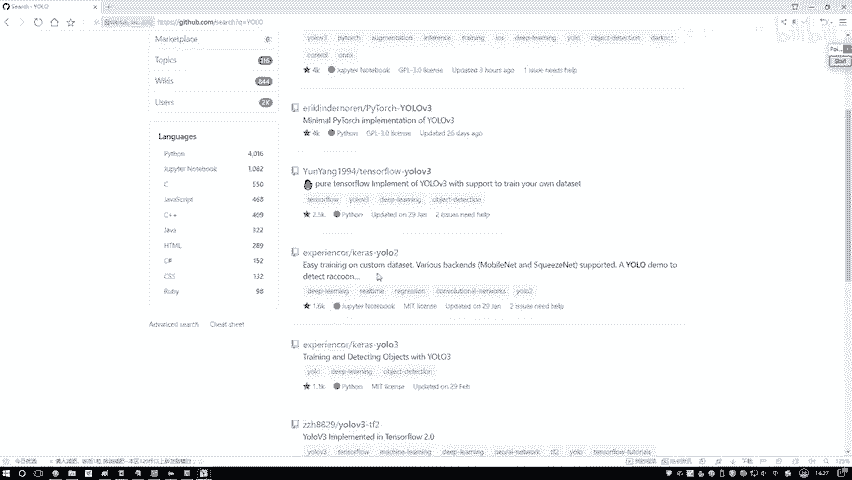

然后你看这有TF2的吧，基于TENSORFLOW2版本来去做的，所以说啊就是大家呃你们在玩的过程当中，你喜欢用什么样的版本来去做，在GITHUB当中都有，只不过说我觉着现在这个PYTORCH。

可能用的人会更多一点。

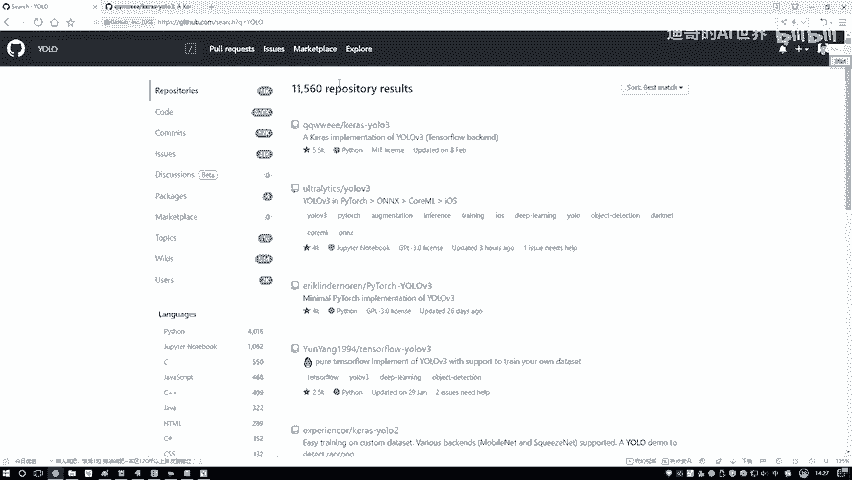

咱拿这个PYTORCH版本来大家讲的，到时候大家自己玩的时候，你们根据你们大家自己实际的一个需要吧。

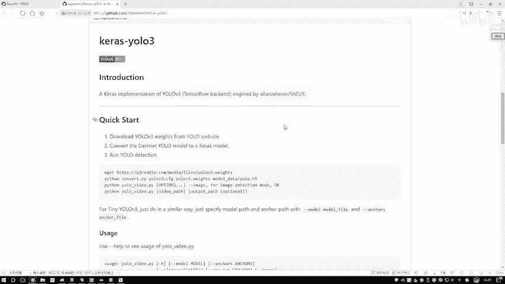

然后进入到GITHUB当中，按照人家的要求，我们来去做什么叫error要求啊。

这一块有一个叫这个read me点MD的，它是一个markdown格式啊，在这里人家的一个项目的作者会告诉你，怎么样哎去做咱当前的这个东西。

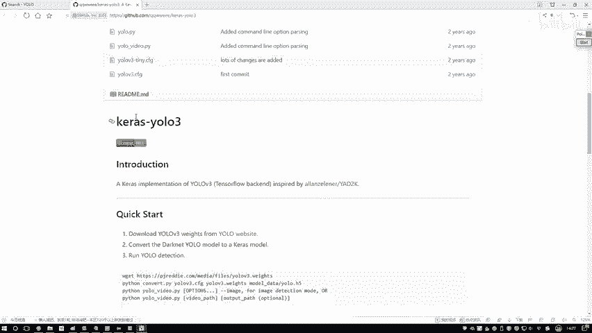

一般就是你把这个任务下载下来，然后放到你的id当中。

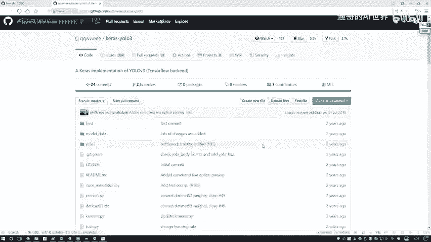

发完之后呢，然后你按照人家步骤是这个下这个代码啊。

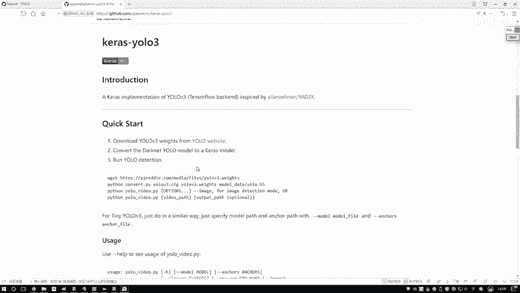

还是写配置文件啊，反正人家基本上都会跟你去说的，怎么样去用基本使用方法，但是呢有个问题就是你看人家这个代码啊。

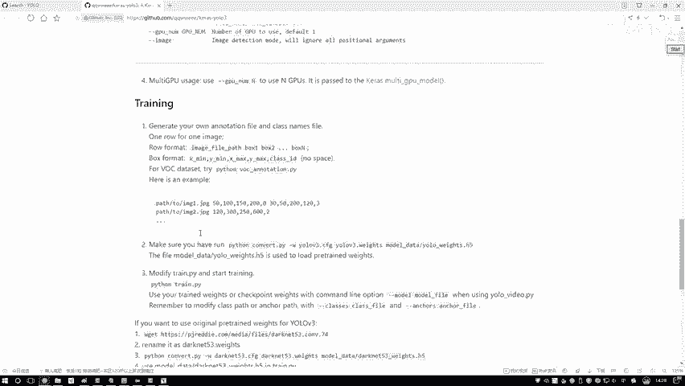

不一定能像我似的把每一行给你讲到。

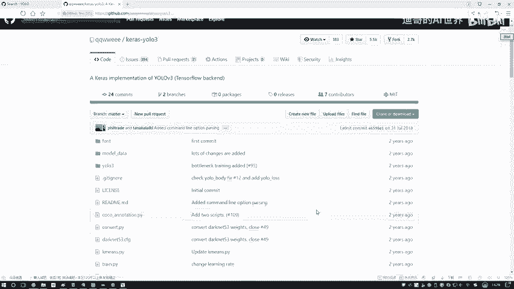

因为就是大部分代码都是没有注释的，不会像我在这debug给大家一行一行去讲，需要大家自己做一件事，就是debug这个操作了，我也是给大家推荐推荐，就是后续的一个进阶之路，因为我觉着啊就能看咱们这套课程。

yo这个系列课程的，那肯定都是有一些基础的准备，做些提升，做进阶的，我觉着最好的一个进阶方法是干什么，就是看论文了，看论文结合什么，结合我们的一个复线吧，什么叫付线，不是让你自己来动手，费一行行实现。

你找一些有代码开源的一些论文，哎，比如说一些经典的像YOO系列的，可以说yellow啊，从建设角度来说啊，已经不是最好的了，只不过说它非常经典哎，也非常好用，大家用的人多，大家呢也可以看一看啊。

就是最新的诶那些论文有很多论文啊，都是提供源码的，提供源码过程当中，将我给大家讲的思路先看什么，先看他论文的原理，我给大家总结出来这些个PPT也可以。

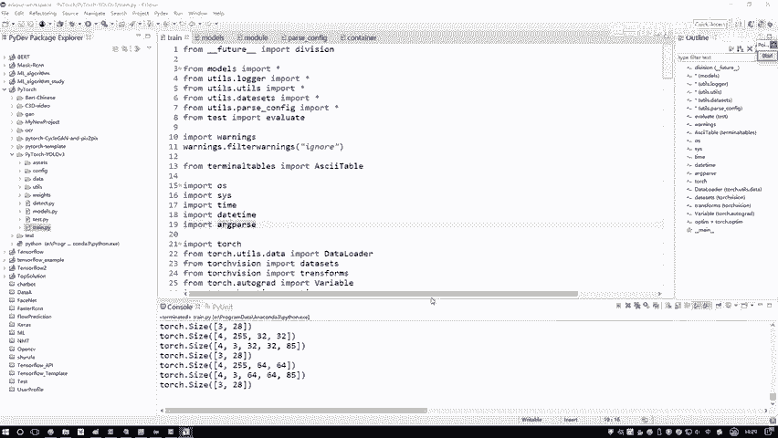

大家可以看这里有一些很多图，是不是这些图哪来的，都是论文当中截出来的，我给大家讲这个东西的思路也是一样的，先看论文，但但是这个论文可能大家觉得是不是看一遍，截个图就完事了，少说吧。

这些论文看了十遍八遍了，才能把人家原理给捋明白吧，所以我建议大家也是一样的。

先在论文当中哎去熟悉这个任务，他是怎么去做的，但是呢你看论文会有个问题，论文当中啊，就是所有的细节基本都没有，因为论文只会告诉你个大框架，哎，告诉你他怎么想的，得到什么结果，实验怎么样了。

然后一些所有的细节都没有，那细节在哪儿，细节就是在我们当前给大家打开的源码当中，因为论文当中啊不给你写一些细节，那没毛病，我觉着论文就是阐述嘛，但是呢源码当中所有的细节，我们是不是都包括了。

所以我觉着就以后大家啊但凡要去做一些进阶，做一些提升，有些同学啊，可能觉着哎这样东西我又不是做科研的，我为什么要研究论文啊，其实以后到公司也是一样的，你做一个算法工程师，做一个深度学习工程师。

你所花费最多时间，我觉得不是写代码，而是干什么，去读一些算法，读一些论文，并且呢把这些个实践论文，应用到你自己的项目当中吧，这个我觉着是以后大家做的最多的一件事了，可能有些同学来咱们课程当中。

是那些没有毕业的，或者说是准备转行就业的，我建议大家把这两个当做是一个重点，因为后续啊，因为就是我带着就业班带很多年了，很多同学给我的反馈，就是去面试的时候经常会提到。

而一个论文阅读能力以及你源码复现的能力，或者说说白了就是你的学习能力，如果你没有一些论文的基础，论文的积累吧，或者是这些开源项目的积累，面试过程当中啊，我觉着会稍微有点坎坷啊。

因为这些面试官人家肯定都懂，肯定都看过，你跟人去唠，你把这些细节唠明白了，人家也明白，相当于这个是个很愉快的过程，能把这个话给他对下去，别让面试官就在这盯着你的简历问你，最好就是你会做什么做什么。

你去给人去说，去说这个细节哎，这就是建议大家把这个论文诶，和这个源码最好结合起来行了，课程当中哎呀再给大家多说了一些废话，就是强调了一下哎，大家以后的一个进阶的思路吧，最好哎论文和源码行了。

咱们说到这了，这就是咱们这个优鲁V3当中。

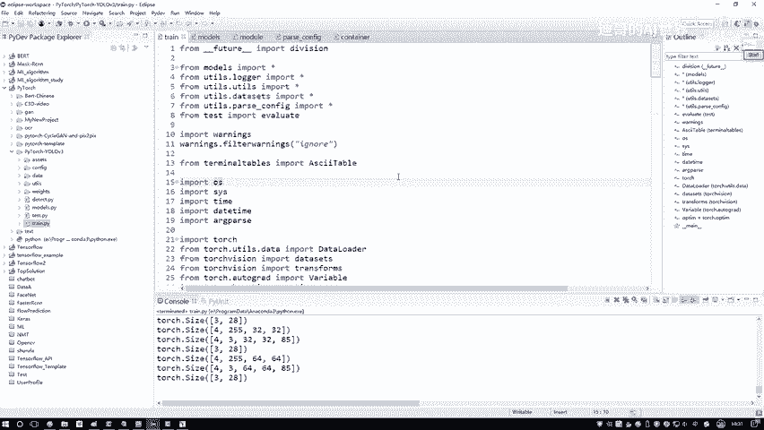