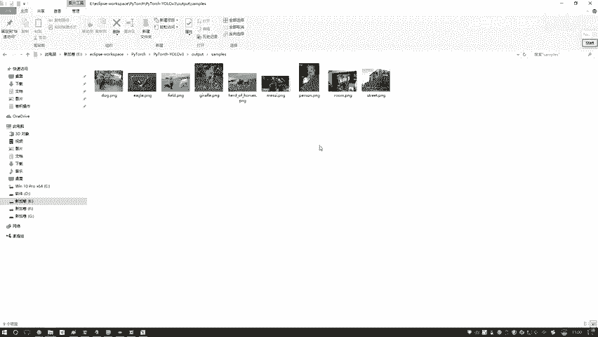

# 比刷剧还爽！【OpenCV+YOLO】终于有人能把OpenCV图像处理+YOLO目标检测讲的这么通俗易懂了!J建议收藏！（人工智能、深度学习、机器学习算法） - P83：16-预测效果展示 - 迪哥的AI世界 - BV1hrUNYcENc

接下来咱们看一下，就是当我们训练完模型之后啊，该怎么样进行使用，首先呢这块有点打开了一个detail点PY。

这个就是我们的一个检测的函数，在这里啊，我们需要首先第一步来指定一下，咱们当前的一个参数，进入到我们的参数配置文员当中，然后看一下我这里啊写了一个imagine，然后传进来的它不是一张图像。

而是一个文件夹吧，给大家看一下，这里在我们的一个呃数据当中啊，然后这个电脑当中第二里边，然后有一个SYMP哎。

就是这个文件夹simple当中啊，有一些图像数据我们来看一看，这个就是要给大家说的一个狗和自行车吧。

然后后续后续你看都是大小不同的一些，其他图像只有一些码的。

然后后续还有一些诶踢足球的，然后这这还有个人和一个狗的，这下就是我们的一些待测试图像，一会儿呢我会把这些图像输入到网络当中，看一看这个网络能不能把其中啊。

有的物体咱们给检测到，哎，我们玩一个实际物理检测任务。

然后呢先跟大家说下流程，第一步啊就是去配置一下我们当前的参数，第一个参数就是你的一个文件夹路径，你想去测试哪些图像，你把这些图像全部的放到这个data，然后SIMPS就是我该给大家打开的那个文件当中。

然后呢点一下这apply，然后再点run就可以了，然后在我们这行之前，我跟大家再说一说它的一个基本流程啊，这个我觉得我不用给大家debug去看了吧，我把断言取消吧，不debug看了。

因为整体debug来说啊，跟那个训练来说没有什么区别。

都是一样的，第一个你先指定你用CPU跑还是GPU去跑，然后呢新创建一个生成文件夹，接下来这一步干什么，这一步就是构建我们的网络模型，我给大家点一下看一下哦，这也没点开，没点开就来点这里找吧。

就是这个model当中吧，叫做这个DARKNET的哎，就就是这个是吧。

所以说啊我们的训练的时候和我们测试的时候，咱用的一个网络结构是一模一样的，这一块没有任何的变化，我们训练的时候用数量模型，咱测试的时候模型是一模一样的，咱没有去改这个东西啊。

这个to device的意思就是说呃，你用GPU去跑还是用CPU去跑，咱都是KA哎，都是用GPU来去跑，那接下来就是加载我的一个权重参数，在这一块我们有给大家准备好一个，就这里在这个vs VR当中啊。

然后有有这个dre net53，然后cover点74，这个就是人家训练好的模型，咱到时候用的时候。

直接把这个模型也给加进来就行了，也不用大家自己训练了，这里给大家提供了一个我们训练好的。

然后选好之后，然后把这个model模式稍微改一下，改这个model模式啊，就是说呃接下来我在执行过程当中，你不要去对我的模型参数做改变了，你更新这个事咱就不用去做了啊，所以说它是只有一个前向传播的操作。

然后呢接下来定一个data loader，它的意思就是说呃一会儿我到哪儿去读数据，咱指定好我们在那个配置文件当中，刚才在这个配置当中。

我们是不是指定了一个，就是当前我的一个图像存在哪是吧。

这一块我们就实际的把这个imagine floor，给传进去，我到哪儿哎去找这个图像，哎，这就完事了，然后接下来这个BYSIZE这些，咱用默认参数就行了，这些都都不用需要大家去改，那下一步就是呃。

我去把一些呃id和名字对应的文件找到手，他是这个意思啊，就是说呃实际上最终你预测出来的结果是什么，是一个id吧，比如说当前它是属于3号物体，4号物体还是8号物体，然后呢当我在测试过程当中啊。

我说呃你别给我一个358的，你别给我数字，你给我实际是什么，他是自行车还是个狗，这个就是说你把id和名字映射咱拿到手，接下来接下来就是去走一遍，那你看在这块他就走吧。

在我们这个data loadad当中，我的生成器里边咱不断的去取哎一个BT数据，然后呢把这个POR数据转换成tensor格式，然后接下来我去执行一个前向传播，然后在执行前向传播过程当中啊，这块我也写了。

不需要去做任何更新吧，想要传播model拿到手，把你的输入往里去传，没有targets那个东西了吧，只有一个输入数据往里去传，咱得到一个预测结果，然后呢对这个预测结果。

我说我做一个MNMS，在PPT当中会给大家说了这样一个事啊。

这里有一个非价值意志吧，我们会预测的框是比较多的。

但是呢我们只选最好的那一些，在这一块把一些框给移植掉，这是一个经过了NM操作，然后呢接下来接下来就是一个画图的操作，你把这个图然后检测到的一个坐标结果。

然后绘制到这里，就是一些绘图的操作。

那就是啊去检测当前我们检没检测的框，如果说呢我检测到一个框，那我把这个框还原成真实的一个值，然后放到我们就是画到我们图像当中。

是不就行了，这些画图操作我不给大家去看了，反正就是整体的一个预测操作。

没有什么难的，只要大家能理解这个网络结构，把网络从前都走一遍，然后把预测值咱拿到手，这就完事了啊，这些就是一个画图，还有展示的一个操作，这样为大家执行一下。

我先把之前的结尾也删掉，在这里一会儿啊，它会生成出来一个叫做output文件夹，就是这个文件夹它一会会生成出来啊，我先把里边的一个检测结果我删掉。

然后咱们这里删掉了，然后咱们重新执行一下。

在这里我们执行一下挺快的啊，一瞬间就是一开始加载这个模型可能很慢啊，然后但是他预测的时候会非常快啊，行这执行完了，我们来看看结果，在这里这几个图像咱是不是有了，我给大家打开看一看，刚才我删掉。

这是新执行出来的。

然后这张图当中这只狗和自行车，还有后面一个什么，这是卡车是吧，是不是检测到了，然后下面一个这是一个鸟，然后这个是一个人马狗。

这些就是咱们当前给大家演示了一下，我们用这个yo a v3诶。

它的一个检测效果，基本上就是图像当中常规的东西。

咱们都能检测到吧，这个是我们拿coo数据集进行了训练，然后最终啊咱的一个实际诶检测的效果行了。

给大家看了一下，我们该怎么样去做一个检测，其实很简单，指定文件夹路径里边全是图像，然后呢把模型加载进去。

前向传播走一遍，然后把图画出来就完事了吧，括号代码在这里也给大家画出来了。

就是把咱们预测坐标做一个还原，然后呢在原始图像当中，把这个框以及它是什么表示出来。

哎这就完事了，这个就是我们的一个呃实际使用的阶段哎。

