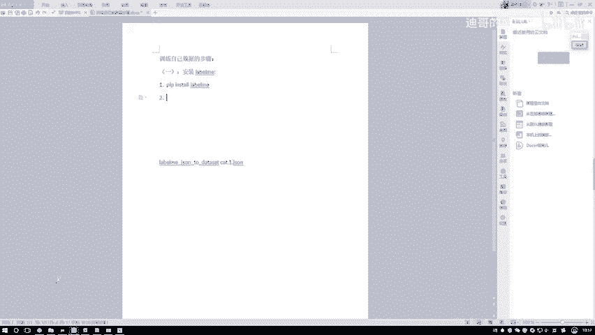
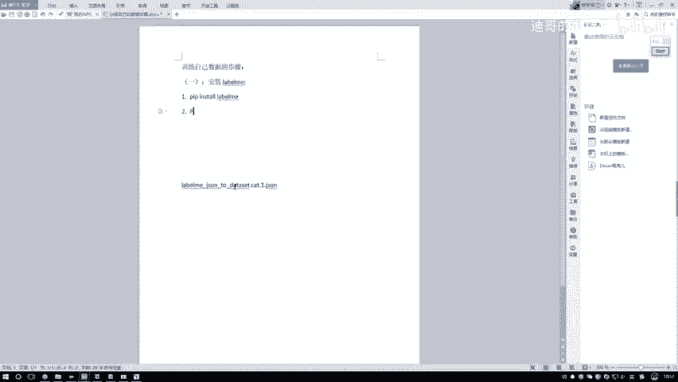

# 比刷剧还爽！【OpenCV+YOLO】终于有人能把OpenCV图像处理+YOLO目标检测讲的这么通俗易懂了!J建议收藏！（人工智能、深度学习、机器学习算法） - P84：1-Labelme工具安装 - 迪哥的AI世界 - BV1hrUNYcENc

这节课咱们来一起动手去做一下，怎么样基于mask r cn去训练，我们手里自己的数据集，之前呢给大家演示的时候啊，都是啊，要不是基于coco的，要不是基于线程列数据集，有了数据，有了标签。

然后并且人家把这些接口都给咱们写好了，直接训练起来是不是比较容易啊，那这回假如说啊我们手里有一份自己的数据集，那可能是一些航拍数据，可能是一些建筑数据，或者是一些小的模型数据之类的啊，都有可能。

那这回我们该怎么样进行个训练呢，在这里给大家从头到尾的进行一个演示呃，首先先说第一个，这里我也打开了这个工具，叫做一个label min呃，他的意思就是说我们可以对数据啊，自己进行打标签。

绝大多数情况下都是这样的，就是当咱们拿出去之后啊，肯定是没有标签的，需要我们手动给数据做一个打标签的工作吧，在这个master r cn当中啊，我们需要给数据哎给出来这么一系列标注。

后续呢我们才能进行训练吧，好了，先跟大家说一下label me这个东西啊该怎么用啊，以及我们怎么去安装，首先建议大家这样就是嗯先进到这个GITHUB，它的一个主页当中啊。

然后我们可以简单看一下他的一些介绍，这块有一些他的一个基本介绍，然后下面这些图啊，这几个图就是它操纵的一个地方，我们要把图像读进来，然后一个图像一个图像的给它进行一个标注啊，然后先跟大家说一下吧。

怎么安装，然后一会儿给大家演示一下怎么去用呃，安装过程当中就是这里它有一些版本要求呃，大家也不用去管了，就是你的python3最新版本应该都可以的啊，咱们就用三版本来给大家演示。

然后呢这里安妮康纳肯定大家都有的吧，这个就不用说了，然后呢我们找到自己对应的一个环境，其实无论什么环境啊，咱们安装方法都是差不多的，我拿这个windows举给大家举例子。

第一步我看这里他写的不是那么特别全啊。

我看下面没有没有啊，算了，我也这块，我刚才打开word，我怕大家就是后续要训练自己数据的时候，然后可能经常就是得反复的去看咱们视频，看一下，暂停一下，然后去慢慢做数据，我觉得这样挺麻烦的。

不如把这个数据给大家，咱们按照流程给大家写一写哦，第一个就是一个安装安装label me这个工工具，安装label me啊，其实也挺简单的，这块我写一个这个大一吧，第一步先把工具装好啊。

无论什么样环境咱都能装，然后安的时候，就是需要大家额外的去装几个包啊，呃第一个包就是我直接写了pip install一下，然后这个label me就可以了，这是第一步。

然后安装完这个label me之后还不行啊。

因为一会儿呃它有一些可以展示的图形界面，让你去操纵的，像是一个小程序的一个感觉啊，所以说这块我们还需要再安装额外一个，我看下这里啊，这里这个PYQT哦，应该是个PYQT5。

我把这个写进去，第二步就是PIP，然后还是一个install。

把这个PIOT5也装进去，然后第三步，第三步就是最后一个，我看这块他有一个版本的一个要求啊，就是你看这里他写了一个conda install一下这个pillow，然后它的一个4。0版本。

这个既然人家这么要求了。

咱也就装这个4。0版本就行了，这是第三个需要大家额外装的一个工具包，就是我们在命令行当中啊，就是麦尼康塔permit里边敲一下，这个哎呀，总是大写的嘛，pip哎呀，它自动变大写，无所谓。

把前面复制过来吧，Pip store，然后哇这个word操作不是特别熟练。

算了他一直跳大写，它就跳大写吧。

不管他了，把这个PO，然后他这个4。0版本写进去，这个是需要大家咱们额外去装的啊，三个工具包，然后装了这三个工具包之后，它默认情况下会把这个环境变量都给你控制。

就是都给你配好的，然后我们只需要打开你的这个ANACCOUNT里边。

然后进入到这个permit里边，你看我点进去，现在就是进入到这个permit里边了。

然后呢你要想打开这个工具啊，你直接输入命令就是一个label me啊，就是咱们刚才给大家说的这个标注工具，然后直线回车它会自动啊，帮你把这个工具给它运行起来的，我稍等几秒啊。

这个工具它现在马上就会出来一个界面。

然后给大家演示一下。