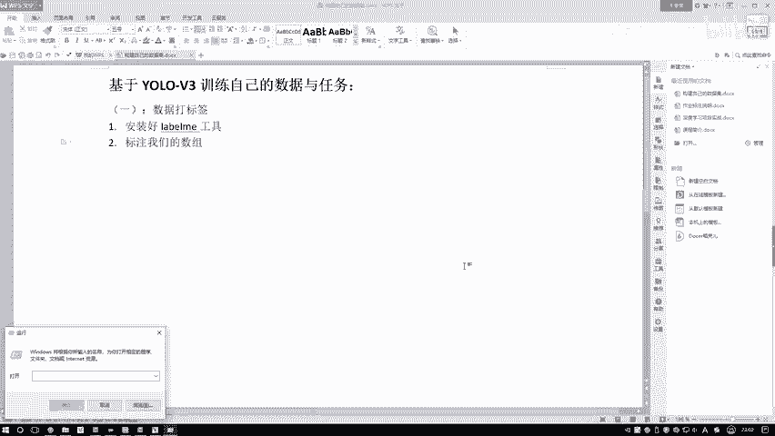
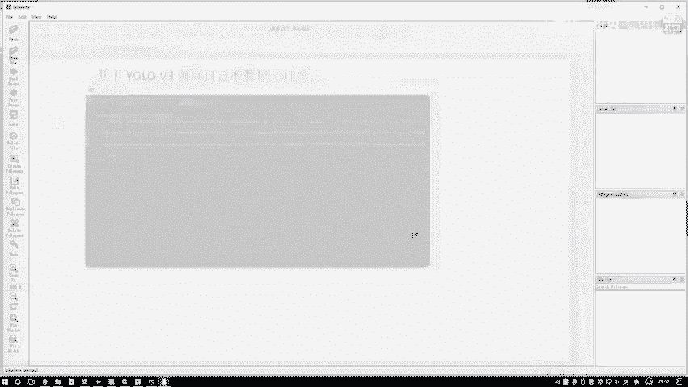
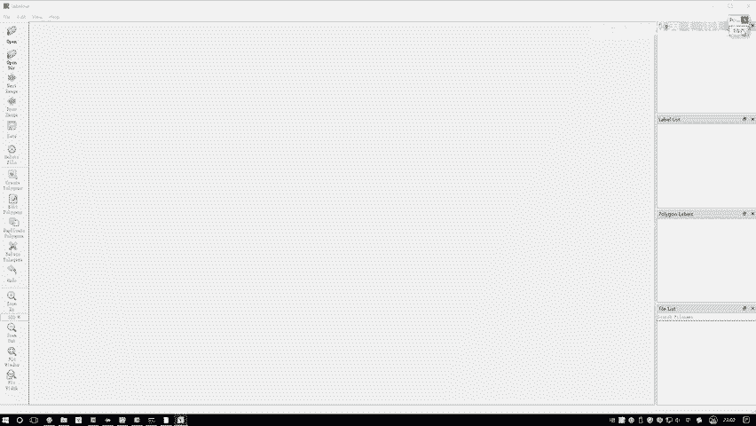
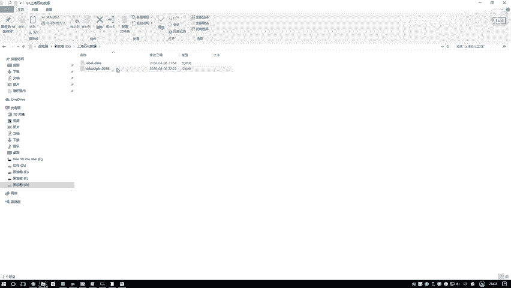
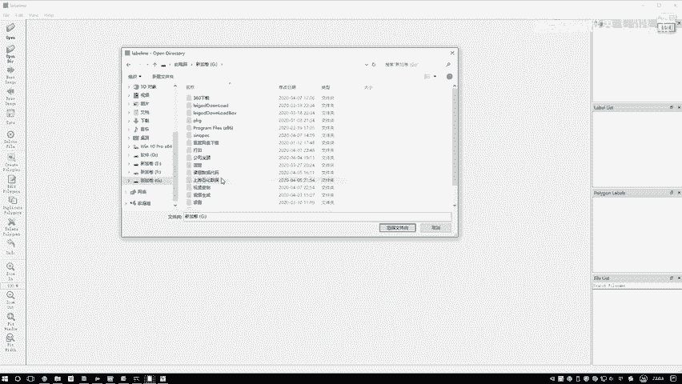
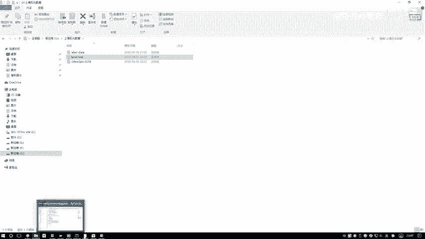

# P85：2-数据信息标注 - 迪哥的AI世界 - BV1hrUNYcENc

首先啊打开一下咱们这个标注工具啊，就是这个label me，我们在这个CMD当中先进到CMD。

然后呢直接啊打这个label me就可以了，这样这个标注工具啊。

它马上就会弹出来，弹出来之后啊，它有两个选项需要我们大家打开一些图像数据，或者说是一个图像文件夹在这里啊，你打开这个open，它是打开一张图像，然后呢这个open dir它是打开一个文件夹。

这样我直接打开文件夹，我给大家看一下，在这个数据当中，我为大家随便找一些，到时候大家自己玩的时候呃，你们玩什么数据都行，也不用一些专门的数据啊。

比如说你想识别个狗啊猫啊，那你就找一些狗啊猫啊，在查找中数据都行，如果大家自己为了练手，如果说你有一些专门的任务，那我们再打开一些特别任务来单独来圈玩也行，比如这里我打开一些。

这里有一些就是呃现场施工画面啊，这个可能是我的任务，大家任务可能跟我不一样，那比如这任务当中他是不是有些人，那我想我说我现在做一个检测吧，我有检测到诶这个数据当中啊，人在什么样的一个位置。

咱们做一个行人检测，可以吧，好啦，这个就是咱们一会标记数据啊，呃只不过说在课程当中啊，不给大家标那么多，咱们就标几个意思意思就得了，这是一会儿咱会标的一个数据，然后呢我打开一下这个label min。

然后这里我直接open dir吧，在这个open dir当中啊，然后你去找哎咱们当前数据啊所在的一个路径。

我把这个文件夹哦，这个文件夹我说传进去就完事了，他会直接帮我打开一张图像哦，这个是我之前标过的，我们不看，我们看后面几张，我给大家从头开始去标啊，呃找一些人稍微多一点的哦，哎比如这个吧。

这里人稍微多一点，那这里呢当我们标的过程当中啊，大家可以点下这里，我们创建哎一些标注区域，然后呢创建标注区域啊，大家可以看一下，一开始的时候它默认是什么标注，它是不是一个点一个点要连成一个区域啊。

给大家感觉像什么，像不像是做那个掩码啊，做那个实例分割似的，让你编完之后，然后让你打上它是什么样的一个类别，在这里哎，我说这样，我说现在啊我不给他啊，一个点一个点进行标，我说呢直接按照一个框来进行漂。

可不可以啊，再看一下吧，比如这里诶我给他再换一张图哦，算了下，我我得先把它标上，然后一会儿我再给取消掉吧，这里我说哦他是一个人，然后标上，然后呢这里我先把这张图像呃，这张图像我就我就先不管了。

这张图我先不管了，我直接就下一张吧，这个咱就先不保存，然后我去标下一张，在这里呢我们来看另一种方法啊，咱们来标实际的我们正常循环标啊，不是一个点一个点去标吧，而是什么。

而是说现在在这里我要产生一个矩形框，一个矩形框当中呢，比如这里我们按右键另外点啊，你可以选啊，咱当前是一个点一个点的，还是这个矩形框的，还是这个圆形，还是画线画点哎，这都随便，我们点。

第二个就是画一个矩形框，大家来看我画一个我点矩形框，然后呢我选中起始位置，然后往下去拉呗，拉到一个终止位置，比如这里再点一下好了，点完之后它就会弹出个窗口，弹出窗口啊，相当于就是你告诉我了。

当前的X1Y1和这个X2Y2，但是呢你还没告诉我，当前诶你这个标注信息来说啊，它是什么这块呢，我说啊我给它打上个标签吧，比如说它叫一个person，哎叫做一个人，可以吧，这是我的标注信息。

然后这块是我之前自己写的，可能我有些其他任务要标一些这个燃气瓶，还有其他的，这大家不用去管，咱们接下这个任务就标一个吧，就标一下呃，里边这个人我们做一个行人检测，然后呢这里如果说呃大家打开这个软件。

他应该是什么都没有的，让你自己去写啊，比如说你的类别，你写个person，然后一个猫狗cat dog自己去写吧，写上它这个类别，这里呢因为我之前写过了，我直接选当前它是个person。

然后点OK就完事了，这就是啊说你现在标注完了第一个框，然后我标第二个，这是不是还有人啊，我说标第二个，这里也是个person吧，好了，那再标呗，咱就快点标了，这他也是个人，那这一块被挡住了也没关系。

那腿搭在这，这也是个人吧，那好了，现在我们这几个人才标完了，上面这几个我也标出来吧，这也是个人，然后这也是个人，这也是个人，我把所有人咱都标出来行了，标完之后我们点一下这个save。

就是说保存一下当前我们的一个标注信息，我点一下，点完之后啊，他会问我就是你把这个标注信息啊给它存到哪，这样我说我再新建一个文件夹吧，在这里新建一个名字叫做一个label杠test就得了，咱们做个实验。

然后呢，我把我的一个标注信息保存到这里，然后呃在我的label me当中。

我说这块做一个保存保存里吧，这个label test好了，那我们就保存到当前的一个label test当中。

