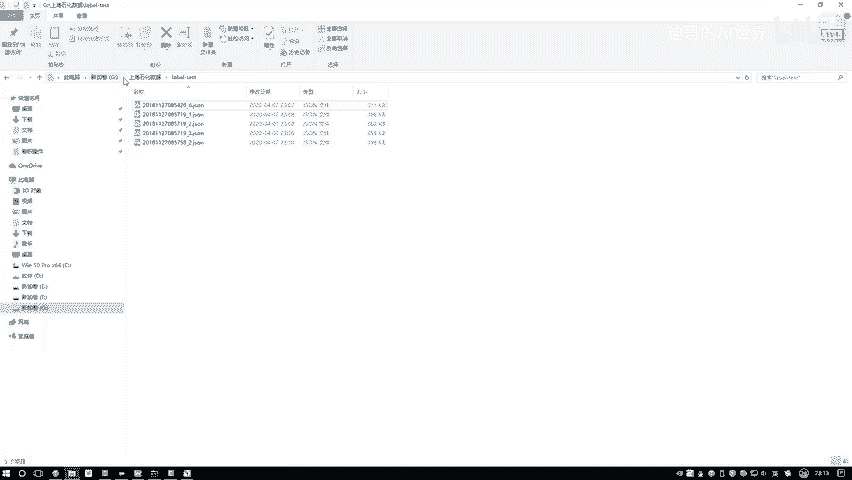
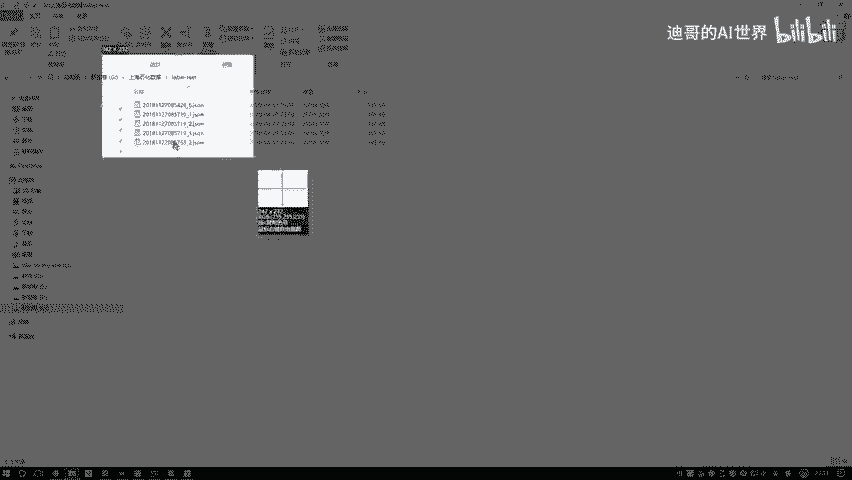
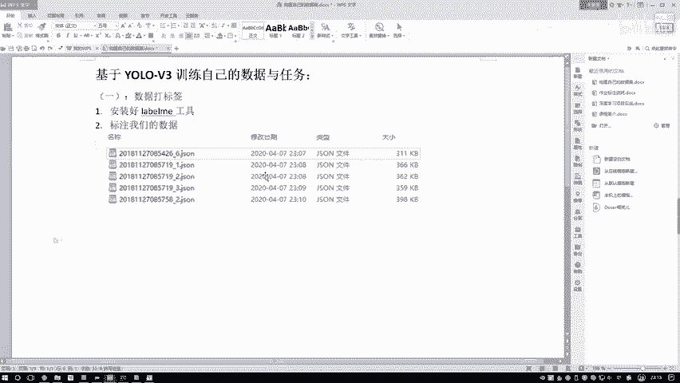

# P86：3-完成标签制作 - 迪哥的AI世界 - BV1hrUNYcENc

标完第一张图像之后，你可以去nice imagine，因为我们是打开的，哎咱们是一个文件夹吧，在这个文件夹当中还有好多图像，所以说我们可以下一个，我再找一个稍微有点不同的啊，比如说再往下几个吧。

哎这个当中我们还哎呀，这个人看着都是半个的，我看有没有远点的这个吧，咱把这个人再标一标，我说这是框，然后他是个person，然后呢这个他也是一个人，然后这个他也是一个人，咱一共这样吧，我们就标五张图像。

多了咱就不标了，咱就标五张图像，然后做训练，因为一会啊咱是玩一个迁移学习的啊，所以说五张图像，咱一会在训练集上试试，效果应该没问题啊，然后这个这个人不标了，这个人给他标一下，这个人也得标一下。

可能那两个小的估计检测过程当中够呛，检测到行了，我们标完第二章了，咱也是保存一下呃，test当中第二张图像，然后我们下一张呃，这张图像当中也是一样的，把这些人全部标过来，那大家可能也发现一件事了。

那你就标一个数据来说容易吗，不太容易吧，这咱们标一张图像，大家可能说哎我花了好几秒，但是其实这个咱是往快乐标，为什么，因为咱们只标了人吧，那如果说在我这个任务当中，我不光要检测人呢。

我可能要检测有那么100多种需要检测的东西，你要先在图像当中去选，我哪块儿有这些个人，哪块有这些个东西，然后你再给框起来，这些事儿，你说做起来麻不麻烦，相对来说就是会比较麻烦了吧。

所以说啊你看我现在标个人，大家觉得挺简单的，但实际任务来了，你们要标的东西可能都不一样，不仅仅是一个人，可能有很多东西，那大家可能刚才看我了诶，你之前点一个点一个点的，那是要干什么。

那个是要做一个mask，就是你要做一个分割的，你想把这个人诶单独给他分出来，你可以做mask，那个就更麻烦了，比这个我拉一个框就麻烦多了吧，我看看咱现在标几个了哦，四个了，咱们再来最后一个我们就完事了。

呃稍微稍微找个人多点的，稍微大一点的哦，这个吧，这个是我们最后一张图像，这里边人稍微多一点，这是一个再来一个，然后呢哎呀这个人真挺多，比之前几个都多很多，也是个人。

然后到到时候大家你们自己玩的过程当中呃，你可以就是既标人，也标一些其他的，咱可以多标几个类别，但是啊如果大家自己做训练的话，我觉着就是你自己标那点数据啊，肯定是效果来说是一般的。

实际这样训练最少我觉着也得个几千张图像吧，才能达到一个稍微好一点的效果啊，行这里啊咱们就给大家举例子，所以我们也不管效果了，我们就标了五张图像，可以吧，好了，咱们把五张图像标完了，这个我就关掉了。

咱一会儿就不用了，这是我们的一个label me标注工具，然后市面上标注工具其实挺多的，咱们虽然说啊今天用这个yellow，用这个label me，因为我用这个用的比较习惯了。

然后还有一个东西叫那个yo mask吧，还有优菈什么东西啊，他是专门做优菈一个标注的哦，但是我觉得大家没必要安装那么多标注工具了，用一个现在用的人最多的这个label me就行了，一会我跟大家去说啊。

咱们的标注格式啊，就是最终结果该怎样进行转换行了，我把这个就关掉了，这里我们只是标了一些人，然后呢在这个label test当中，我们看下结果，这个结果当中啊，有这个123啊，就是一尾缀吧。

都是有点JASON的，我们随便打开一个来看一看啊，这给大家打开一个，然后我们来看一下它这JASON的格式啊，看看里边都有什么，首先有个label，这个label表示的是诶，你之前标的是一个类别吧。

好这个类别当中他是个person，那我们之前是不是自己写的，他是一个人吧，然后呢这个points当中啊，就是我们要的实际的一个标注信息，这里吧它是一个呃X1Y1，然后下面它是一个X2Y2，那这是什么。

这个它就是个框了，为什么说它是个框，这一块它有一个那个shift，它的一个类型，你看它是个矩形框吧，然后呢如果说啊你不是用矩形框标出来的，它是有一些其他信息啊，这里你都可以自己做筛选。

然后呢下面你看你又不要了，人，这是一张图像，这是对于一张图像来说，它的一个一个标注的一个JSON文件，然后这块它也是个person，然后下面它有这个X1X2，然后还有就是X1Y1，然后这个X2Y2。

然后也是个矩形框，下面还是person，就相当于你标几个哎，这里边它有它就有几个啊，最后它会有当前你标注这个数据哎，咱俩去取的，以及呢呃这数据信息这个东西没用，咱一会实际还得读图片。

然后以及啊当前图像的一个长度，还有图像的一个宽度，咱们拿出来数据啊，相对来说可能会比较大哦，因为这个长度宽度你看都是1000多的，到时候呢咱们用的时候啊，还是得把这个数据啊做一个压缩啊。

太大数据咱玩不了，这个就是我们的一个JSON文件啊，咱们标注好的，然后接下来我就跟大家去说啊，咱们该怎么样去处理啊，当前我们这份数据先完成第一件事，我们把数据啊已经全部标注完了，找你就是现在你手里哦。

不管你之前怎么标的，反正你这个JSON文件你手里已经有了，然后呢我们来看一会儿，我复制过去啊，先先放着吧，一会儿咱们再用，然后呢进入到我们的项目当中，还是进入到我们源码里边啊，在这个PYTORCH当中。

然后U是V3，这里边需要大家呃做的事挺多的，我给大家记一记这块标注我们的数据呃，这样吧，我给大家把这个图给截过来吧，方便以后大家自己来去看，这个是呃鼠标数据当中，test当中。

这个是咱们标注好的一个结果，额稍等一下，我把这个截图工具啊，我先给他先先把截图工具给他打开，要不然mar截图了，在这里边我去打开一下截图工具啊，然后把这些给大家截图一下，然后顺便说一说其中每个都是什么。

这个是咱们到时候啊需要完成的东西啊，你得有得有这样一些JSON文件。

这个是需要的，我写一下呃，标注我们数据，然后这块就是我们的一个结果标完的，然后JASON里边名字我给大家解释过了。

