# 比刷剧还爽！【OpenCV+YOLO】终于有人能把OpenCV图像处理+YOLO目标检测讲的这么通俗易懂了!J建议收藏！（人工智能、深度学习、机器学习算法） - P87：4-生成模型所需配置文件 - 迪哥的AI世界 - BV1hrUNYcENc

然后呢我们写第二步，第二步啊需要大家去做的就是啊去写好啊，写好所需的配置文件呃，什么叫配置文件呢，比如这里我们现在这个任务啊，跟那个coco数据集当中哎，比如说这里大家说的UV3当中。

我们做了一个coco数据任务吧，跟那个库数据任务肯定怎么样不一样吧，人家做个80分类的，你现在做个几分类啊，说白了你都谈不上什么分类的，你就做了一个行人检测吧，只检测一个人。

所以这里啊我们得去稍微的改一改啊，比如这里呃进入到咱们当前的项目当中，项目里边PYTORCH，然后用了V3，我给大家说怎么去改啊，首先进第一个就是一个CONFIG当中呃，在这个CONFIG里吧。

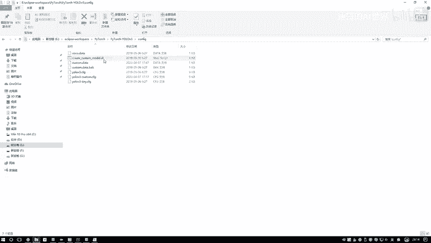

就这里我给大家说一下吧，给大家截个图呃。

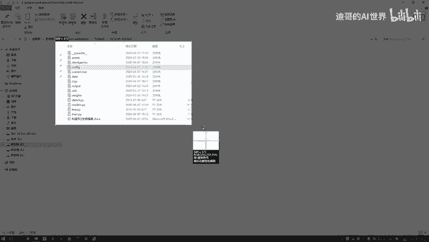

修改我们配置文件，在这块在这个CONFIG文件夹当中，我给大家一步步去写啊，呃写好吧，写好模型所需配置文件吧，第一步写好模型所需配置所需配置文件啊，第一个进入到这个configure当中。

然后呢第二步哎呦这个一写这么这么这么地吧，然后第二步在这个CONFIER当中啊，这里有这个create啊，customer model点SH，它的意思啊，就是说呃你去执行一下当前一个自定义的模型。

因为你的模型啊有一个就是有一个分类啊，或者说用那个最终value那个yellow层，跟咱们正常的那个coo是不一样的，你是只有一个类别是吧，然后一个背景yo当中呢有80个类别，加上一个背景是吧。

所以这里啊我们得去自定义一下，那大家可能会问一个问题，哎这个点SH文件啊，我该怎么样去用啊，在问就是在LINUX下，大家就是直接拜师，什么什么都点SAH完事了，那windows下怎么用，我跟大家说一下。

因为估计大部分同学啊，咱们都是用这个windows版本的，然后这样需要大家额外装一个工具，叫做一个get，这给大家点开看一下呃，你去百度搜一下这个git啊，我也不给你介绍是什么了啊。

这个东西说起来挺麻烦的，你不写GITHUB，不写那些东西，可能跟你去说，这个东西比较抽象，你就是把它当做一个工具得了，再也不用它其他什么属性，你只需要打开一下它这个git的官网，给大家看一下。

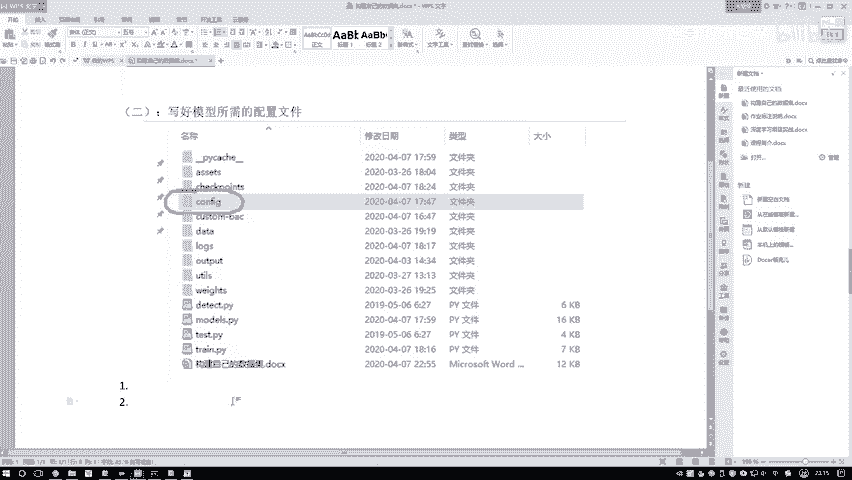

在这里记一下，然后这个是get的一个官网，然后这块有一个download，你点到这个download当中，当load当转点进去之后，然后它会给你弹出一个最新版本，哎就这里或者说你点这个就是呃点这块。

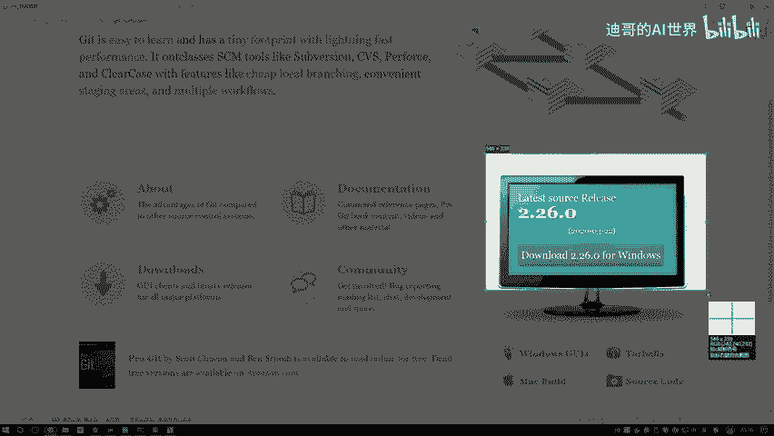

然后你去下载一下，当前windows当中最新的一个版本哎，这就完事了，这是去下载个git，下载完git之后啊，你就能去执行这个点SH了，如果说啊你这个官网这个官网经常会比较慢哦。

然后你到时候大家自己下吧，指windows的Mac linux，自己选自己合适版本吧，然后下完之后自己装一下呃，装也挺简单的，如果说啊你这个你觉着这个get it哎，下载比较慢，你这块不有2。26吗。

现在行了。

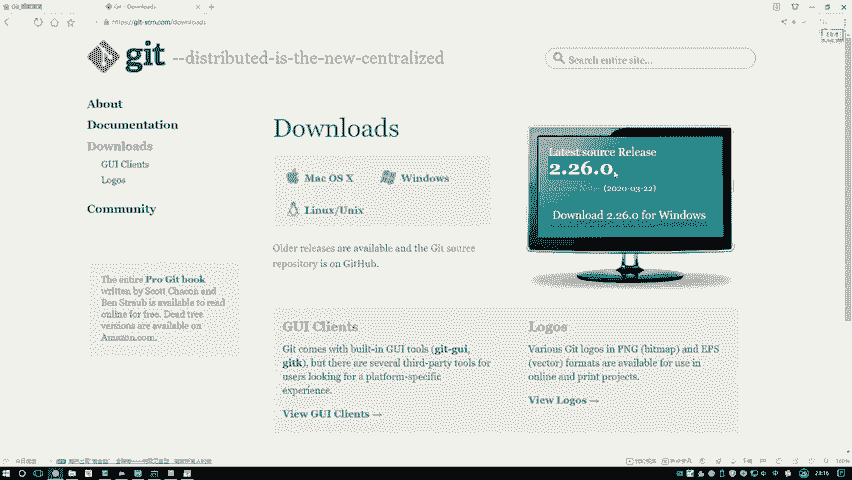

你得了，你直接在这百度搜也行啊，然后你随便找一个网站，是不是啊，比如这个我也不敢说网站了，你就点进去，然后随便一下就完事了吧，你把这个功能给他下好。

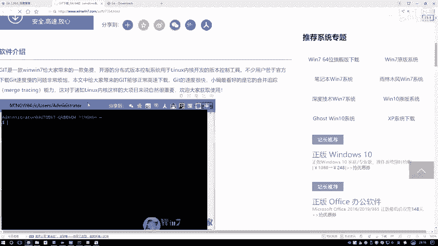

这是第一步去下一个这个get it软件，然后呢下完之后进入到当前的我们这个VR当中，进入到这个VR当中啊，然后你去右键一下，然后会发现这有有这样两个东西啊，呃哎呀这东西还不好截图了，算为大家截图了。

有个什么git bash here是吧，你点一下这个点完这个之后，我们来看一下，这个是在你安装完那个git之后哎才会有的啊，一定是安装完之后你点一下，点完之后呢，给我弹出窗口，像不像命令行似的。

然后你可以怎么样，你就把这个命令比如说这个match这个东西，然后呃我说我当前这个任务吧，然后把它复制过来哦，把他的名字复制过来，然后呢复制过来之后，然后复制过来之后，然后你需要填建一个参数。

就是呃你的一个类别的个数，比如说现在啊咱们当前这个任务，你是做一个五分类啊，还不是就是你这里边你添加多少类别，比如今天啊咱们这个任务，我里边是不是就添一个人啊，一个人数太少了，我觉着这样吧。

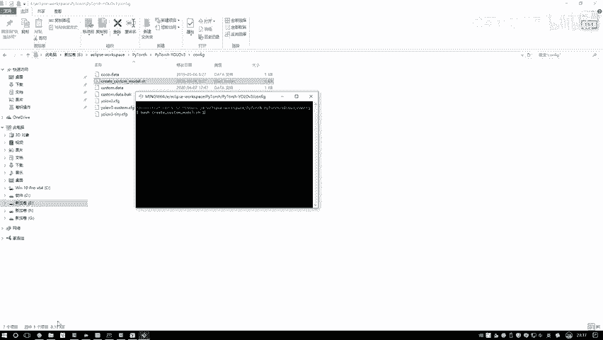

我给大家额，咱们多添两个类别吧，咱们好举例一个，我觉着举例举例不是特别不是恰当。

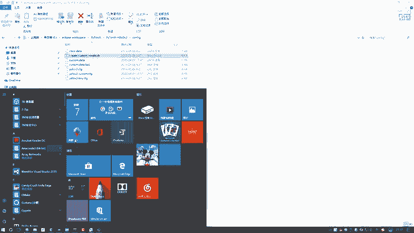

这样为大家再来一个呃，再来一个吧，一个我怕大家就是有误会啊，呃雷波密吧，咱们再打开一个，我们再再重新编，就编一个得了，我随便打开一个，然后咱加上一个数据，要不别别做一个类别，一个类别。

估计到时候大家有可能会，可能会产生一些误会啊，这样我给大家换一些哦，我找再找一个嗯。

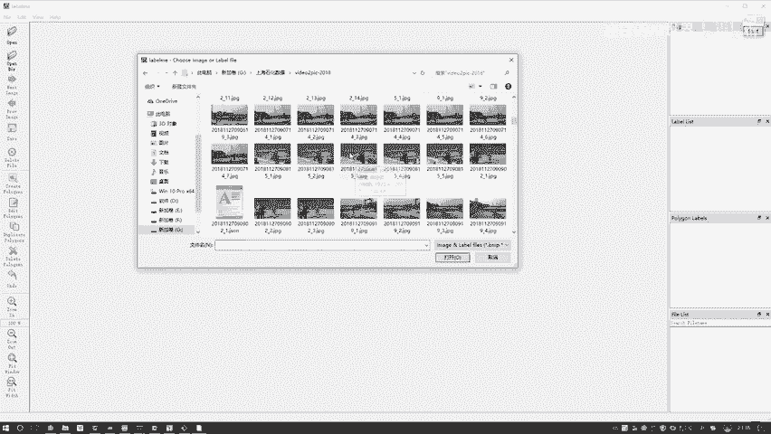

就这个吧，这个当中哎这里边也行，我们我们再来标一个，然后比如这块我重新的去标一下，然后这里边这个人哎呦，怎怎我怎么点到这个了，点到这个方框，然后这个他是一个人，这个他是一个人，然后这个东西啊。

咱们再加上一个吊车行吧，好了，我们就单独再加上吊车呃，加上一个吊车得了，然后这块我再把这个人再标一标，这是一个人，然后这也是一个人啊，这这把这几哥们都标完拉倒了，好最后这个胖哥们行，编完了，编完之后。

我们还是保存一下啊，跟之前咱一样，也是保存到我们相同的地方呃，test当中好把数据保存一下行了，这回怎么样，我们现在不是一个类别了吧，我们是有两个类别了，我把这个关掉了，好整理数据当中。

我们现在是有两个类别的。

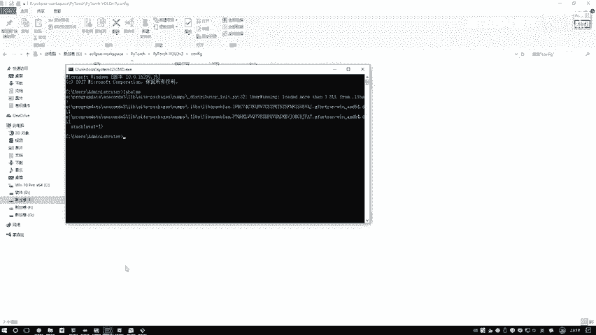

这个咱也不需要了，好了，这个拿出来，然后呢我们指引一下这块写个几，写个二，这块写个二的意思啊，就相当于是呃你要怎么说呢，就是你要做是两个，就是两个类别，因为这个最终优路层啊，它是什么。

咱们这coco当中是805吧，80什么意思啊，80个类别吧，那你这个任务呢是二吧，就是一个2+5，最后那个层，所以这块儿咱们我把这个命令给大家复制一下，在这个这里边吧。

然后第三步咱们去执行一下当前这个办事，然后呢我写一下哦，后面的数字，后面的数字表示呃你的任务的类别个数吧，啊就是看你在那个标注过程当中啊，你选了多少种不同的框，诶，有人比如这个我还写了一个吊车的。

那咱们执行一下吧，这里哎我说我指定了一个二，然后执行完之后啊，咱们来看这个时间啊，这挺晚了，咱们已经11。20了，在这里我们来看一下这个就是我新成出来的吧，跟我这个时间完全匹配的。

它相当于啊就是会给我新生成出来，一个这样的文件，为大家记一下，这个是会自动生成的，然后呢自动升哦，自动生成咱们当前这个文件，这个文件相当于是我们这个配置文件了，一会儿呢我给大家打开看一下。

在这个配置文件当中啊，呃呃没有什么太多的不同啊，就是跟我们任务是一样的，只不过说呃有一些小细节，比如说咱们最终啊我的一个类别的个数啊，是不一样的，然后呢接下来整体网络架构都没有什么变化。

最终啊只是说你的一个输出结果，哎对于咱们这个输出结果来说，你看优路层来说，你这个CLAES等于几等于个二吧，其他的都没变啊，如果说啊，大家到时候大家你觉着你的任务来说啊。

你觉得不不应该用那个coco级那些先验框，你可能用更大的或者更小的这些东西啊，到时候大家你们就自己去改啊，自己去改其中的一些参数，但是我觉着整个网络大架构基本上不用去变啊，提特征那些东西你不用去变。

你可以去改一改这些相应框啊，就是你或者说你干脆你自己做个聚类吧啊，去看一看你自己任务来说，什么样的一个框是合适的，这个到时候大家咱们都能去改，咱们检验一个人啊，这个框哎是完全够用的，所以说我们不改了。

只是最终我们的class当中啊，他改成个二而已，好给关掉，这里给大家看了一下，就是第一步哎去构建我们的一个配置文件啊，这个点SH相当于啊把我们的模板复制一下，然后class当中给它改成哦。

你想要的相应的一个数值哎，在这里给大家记录了一下，这是我们第二步呃。

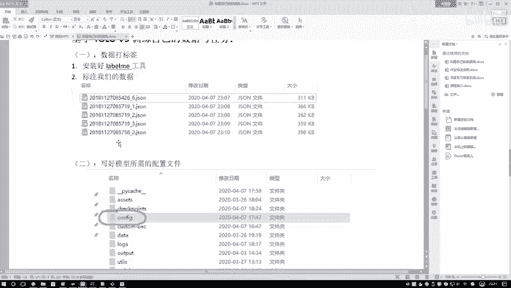

去写好模型。