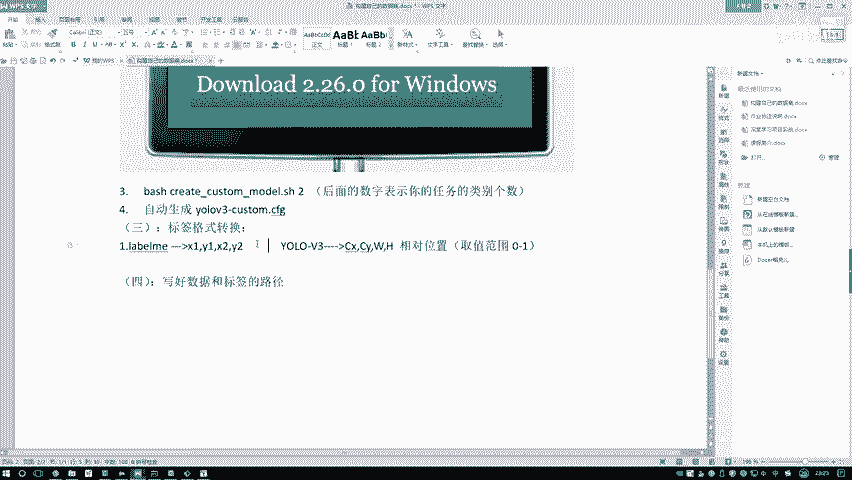
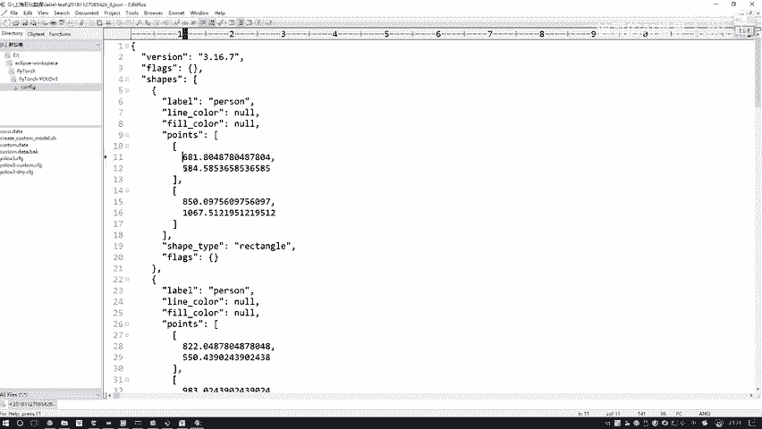
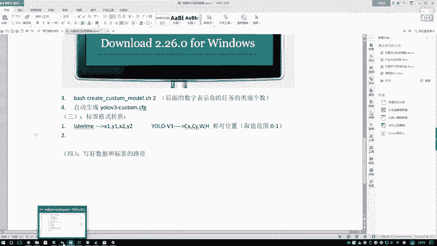
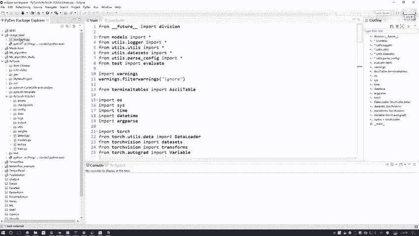
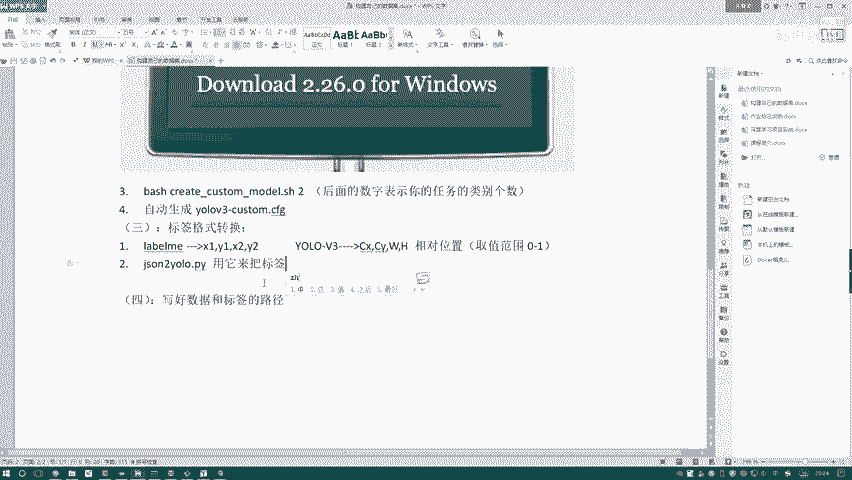
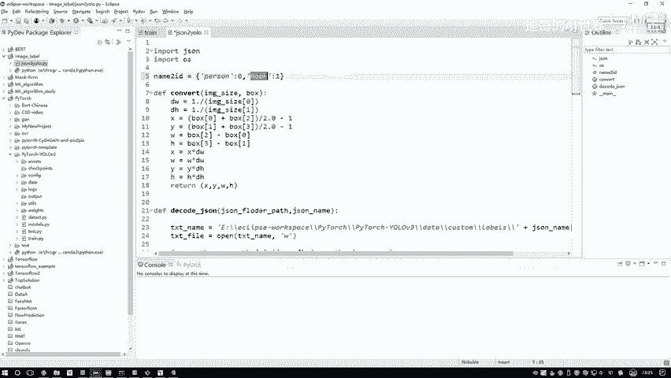
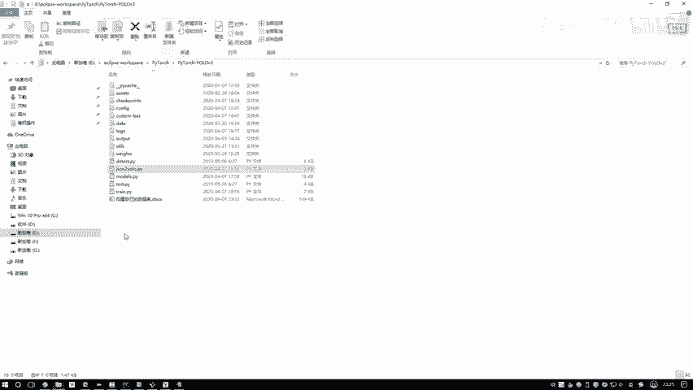
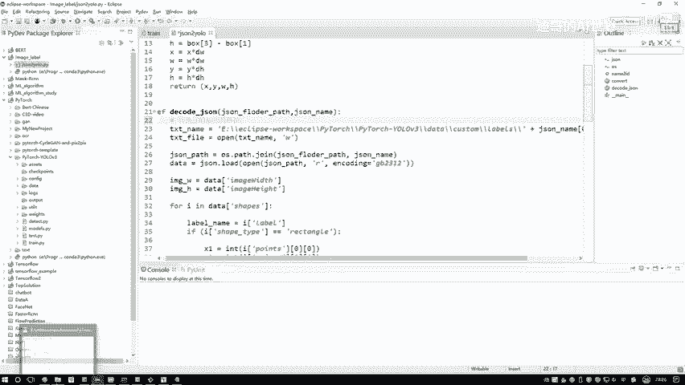
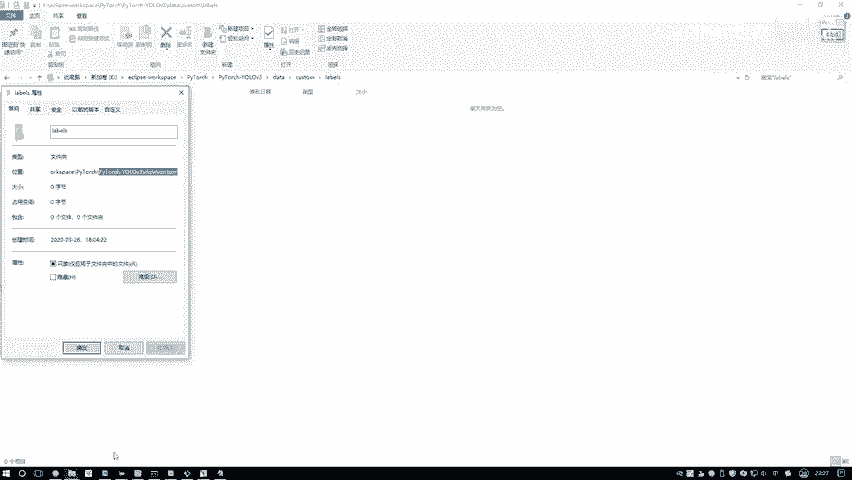
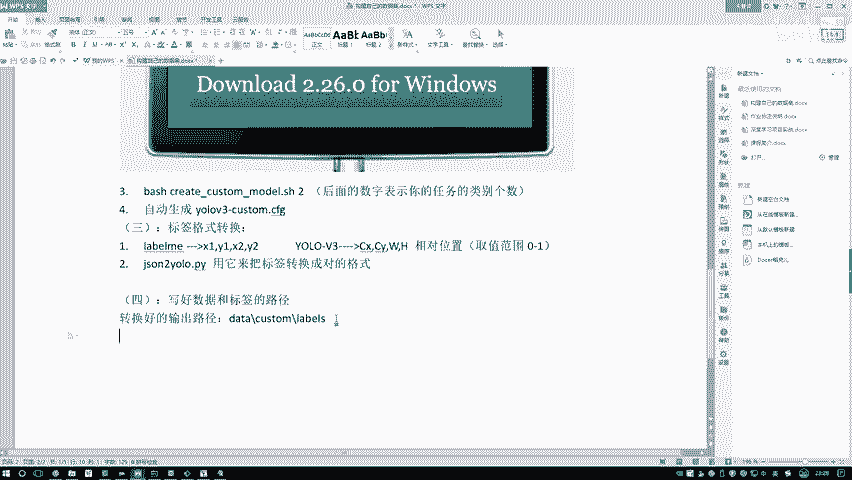

# 比刷剧还爽！【OpenCV+YOLO】终于有人能把OpenCV图像处理+YOLO目标检测讲的这么通俗易懂了!J建议收藏！（人工智能、深度学习、机器学习算法） - P88：5-json格式转换成yolo-v3所需输入 - 迪哥的AI世界 - BV1hrUNYcENc

然后呢我们第三步在这个第三步当中啊，我们配置文件写好了，然后那你就接下来就是呃，在得写好咱们的一个数据和标签的路径了，因为一会儿模型啊，按照咱们这份源码来说，哎不是这还不是，这是这里是第四步了。

才是先有这个，然后我们第三步要做这个第三步，我们还有一件事，呃，咱们这个标签啊还得转成相对格式，标签格式转换，标签格式转换，这个就是看你用什么样的一个源码来去做了，咱们这个任务是什么，我给大家写一下。

咱们那个label me当中啊，呃我们得到的结果是什么，是不是一个X1，然后一个Y1，然后呢接下来一个X2，然后一个Y2，是不是，但是呢咱们这个yo当中我们需要什么，比如说这个UOV3当中。

我们需要的一个格式，跟那个label meat格式不太一样吧，UV3当中哎我们是不是说是一个中心点啊，比如说我写一个大C吧，大C然后X1，然后一个大C，然后一个呃没没有C1，就是CXZY表示中心点吧。

然后呢我还有一个W，还有一个H表示我的一个长宽吧，但是大家注意点，我这个CX还有CY，咱们之前讲原理的时候，哎我们说这个X和YW也是都是什么，它是什么相对位置吧，什么叫相对位置啊。

那也就是说它的一个呃取值范围，是从这个0~1之间的吧，啊，所以说现在我们的我们的标签，和我们当前yellow这个咱们那个开源，就是咱们那个项目当中啊，所需的标签你说一样吗，肯定不一样吧。

我们得把这个标签咱做一个转换再看一下吧，我们label me当中嗯，label密的label me当中这些写哪去了呃，在这个test当中。

我们得到这些标签，你看一看它里边数值都是怎么样，都是实际值吧，681。

584哎，八百五一千多，但是呢我们这个任务当中也是不一样的吧，所以这块我们得做一个格式转换，然后呢格式转化这个很简单啊。

看一下你的数据，可不是看你的标签什么点JASON吧，把我们JASON数据读进来处理一下就完事了好了。

这里我把这个处理代码已经给大家写好了，就这里我给大家来看一下呃，在我们的哎我找一找在哪去了，在我任务当中啊，写了一下，就是这个叫in啊。

这个jason to yoo啊，我自己写了一个，我给大家复制一下，然后呃复制到咱们当前的这份代码当中吧，然后方便到时候大家自己用，我到时候给大家打个压缩包额，在这个eclipse当中。

然后PyTorch yo3好，我给大家复制过来啊，诶哦他怎么不让我复制这个，我说我去copy一下，然后粘贴一下好了，这里有个jason to yo，点PY这个文件啊，我给大家复制一下，然后给大家写一下。

用这个文件咱们来进行转换哦，这个呃用它来把标签来，把标签转换成哎对的格式啊就得了。

给大家看一下我们是怎么转换的。

在这个代码当中啊，嗯其实很简单，只需要大家做这样一件事，呃就是你先去写一下，就我这块先写了字典，一会我们要打印名字，那比如说我们这个任务，那咱们现在这里边是不是有一个person，然后没有的。

我就先删掉，没有先不管了，然后这是我之前自己写个小例子，我做测试的，然后这里比如这里我们有吊车啊，这那那这个吊车啊，他就是一个一是吧，然后在这个哎我看这块怎么怎么回事，哦我把这些给他删掉。

没有多余多余的，咱就删掉好了，那这块我们就按顺序写，就是牛奶类别，那咱就person是第一个，那咱们这个按那个Python当中啊，是不是第一个用零来表示，然后第二用一来表示，然后这个名字你别写错了。

咱们那个是一个小写的HOK是吧，哦我看一下哎。

不看了，我记得是个小写的，咱们是一个那个吊车嘛，这里这样就是你有多少类别，我写一下啊，呃你有多少类别，有多少个类别，然后呃在这个字典中吧，就写哎多少个对应的就可以了，哎这就是从零开始。

那你就按你标注信息呗，但是你也知道啊，你是谁是零，谁是一，因为一会儿嘛还要写个文档，那个文档你也需要按这个顺序啊，咱写好一个字典，然后接下来我们去读取这个JSON文件，在这里啊。

需要大家呃改这样一个东西，就是这一块这一块有一个txt name，因为一会儿我们会呃先去就是指定好，我们先打开个文件，在这个文件当中我们要写转换好的一个标签呃，这个就是呃转换好的标签的路径啊。

你希望把转换好的一个标签放到哪儿诶，但是但是这个呃这个路径我建议大家放这里啊，就是给大家看一下这个路径啊。

在我们这个项目当中啊，是不是有一个叫data文件夹是吧，好我们点开这个data文件夹，data文件当中啊，有个叫customer是吧，哎这是我们自定义文件夹，我们点进去在这个CUSER文件夹当中啊。

有一个labels，有一个images是吧，好了这个labels这我之前写的测试的，我给它删掉，然后呢我给大家把它路径给拿到手呃，就是从咱这个名字开始吧。

我把这个路径给大家写一写，然后我想输出啊，转换好的输出路径，然后在这里他要是这个杠，我就这个杠得了，到时候大家自己改吧，然后在这里哦，它是一个labels，这里啊我建议大家就是你把路径都写到哎。

我们对应的位置就是data啊，就把这个去掉吧，前面那个没什么用，就是当前的一个路径当中哎，当前项目文件当中，data customer当中有个叫labels的输入到这里，因为啊咱们在那个代码当中啊。

啊我们一会儿就是这么去写的，我不让大家改源码了，你就是改成相应的一个路径就得了，或者说在代码当中啊，你要去指定成其他路径也行啊，不让我去做也行啊。

这只是这么做简单，第一步。