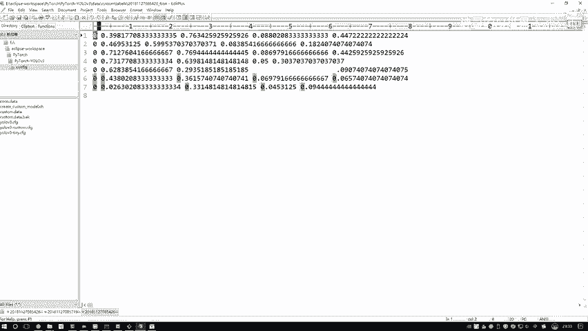
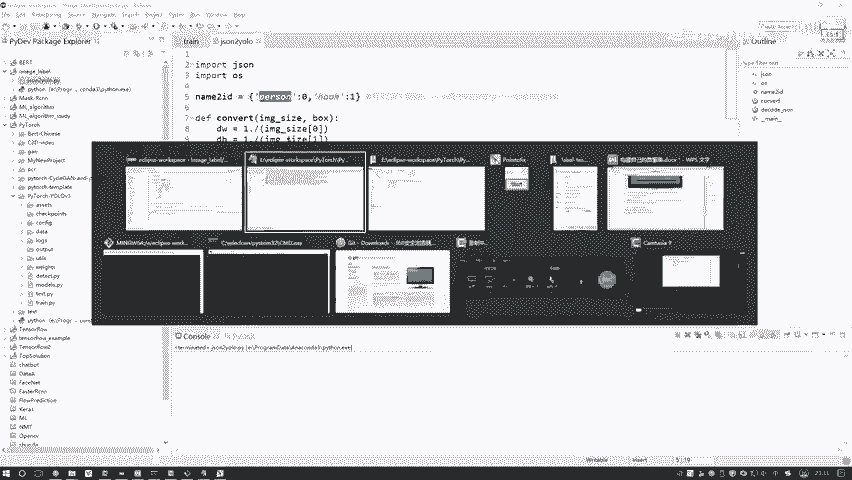
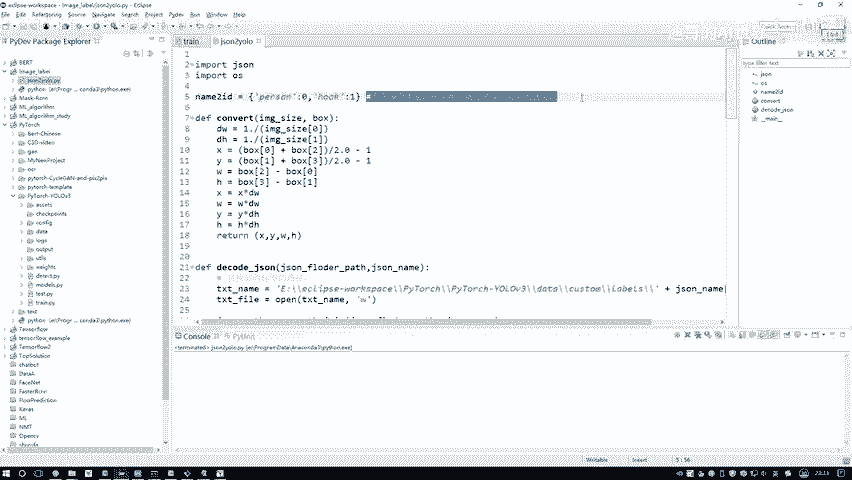
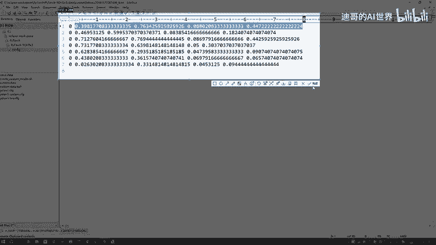
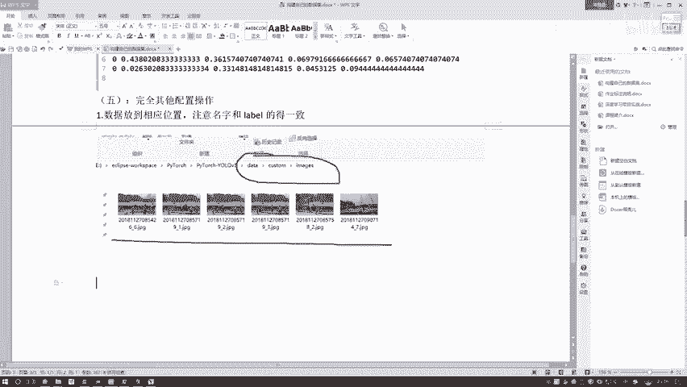

# P89：6-完成输入数据准备工作 - 迪哥的AI世界 - BV1hrUNYcENc

好了，代码当中我写一下呃，我这里我就不用去改了，就是我的eclipse当中，然后项目路径，你看data customer labels，然后呢后面加这个就是呃，咱们是按他那个JASON的一个名字。

然后跟那个点TXT啊，就是取JASON他的一个名字，然后去给他尾缀点TXT，这就是我输出的一个路径，咱用这个open，然后W1下，咱们一会打开文件往这里去写啊，就是这个意思好。

接下来接下来呢就是呃我要去写，那我是不是先得把这个JASON诶给它读进来啊，在这一块就是我们得去指定一下啊，我们JASON的一个路径，这里啊，你去指定好给大家写一下。

这个就是额咱们那个label me啊，Label me，然后label min，然后生成标签的路径啊，你指定好你当前生成标签的一个文件夹吧，当前生成标签的文件夹哎就行了，在这里就是我们生成标签文件夹呃。

我看一下当前文件夹，我也改一改，跟咱们刚才写的不一样，为了把咱们这个任务完全对应上，我把稍微改一改啊，在我们任务当中哦，看label data test，哎不是这个，在哪去了，我找一找吧。

在我们这个数据当中，哦这里有一个label test是吧，这样吧，我给他也放到这个C盘当中吧，放到我们项目当中呃，到时候一到时候一给大家发过去方便，到时候大家自己来看呃，PYTHOR当中yo好。

我给他复制过来这个label test当中好了，我把他的一个路径写一下，大家注意一点啊，就是你我直接写绝对路径啊，不写相应路径了，这样一会防止出现什么问题好了，把绝对路径写过来，然后呢在这个UV3当中。

然后它是一个label test诶这个文件夹，然后注意点啊，就是你在windows当中啊，你注意点，这是杠杠物理是什么，因为怕呀啊遇到一些就是转移的字符哎，比如说一个T开头的那数学不行了。

所以说windows当中啊，你保险你就写一个杠杠啊，这种方式是肯定没有错的，然后这是第一个，我们写一下，一会儿呢到哪儿去读这个JASON文件，然后它会啊就是JASON的文件夹。

然后呢它会遍历一下这个文件夹当中啊，有多少个JASON文件，然后对其中每一个JASON文件读进来，都要做这个decode，JASON就是我们上面这个代码，在上述代码当中啊。

他会先诶找一个地方去输出我的输入路径，然后呢把我当前这个JASON给读进来，当前JSON读进来之后啊，我要去得到什么，大家想一想，我现在有的是一个X1Y1，然后X2，然后一个Y2，我说要得到一个CX。

一个CY，还有一个WH，但注意点这些值都是个相对的吧，所以说啊我需要知道诶，你整个图的一个W还有H是等于多少，我一会儿要算一个相对值吧，好了，第一步我说我把这个W和H我都给他计算出来。

然后呢编辑每一个这个SHARS，这个shops，就这个就是咱们在这个标准文件当中，给大家带着大家打开看一看，在这个当中你看每一个标注信息，它都叫一个sharp啊，所以说每一个就是一个标注信息啊。

咱来便利的在这里啊，代码当中，我说我去呃遍地吧，每一个shops啊，这就是遍地每一个shops，然后呢编译过程当中，我需要得到当前他这个label name，比如说他是一个人呢还是个吊车啊。

就是一个person，还是一个其他东西，然后如果说啊当前标注它是个矩形的，我们这个任务当中所有标注都是矩形的吧，好了，我把它的一个X1Y1X2Y2对应的坐标，咱全拿到手，可以吧。

组成了咱们的一个bounding box啊，就是X1Y1X2Y2，然后呢我要对这个邦定boss啊做转换啊，这块有个convert操作，来看一看convert操作当中很简单，第一步啊，就是呃。

我们去要把这个东西压缩成0~1之间吧，相当于都是除上一个W或者都除上一个啊，H就完事了吧，好了，得到我放错的一个比例，然后呢，X我说我去算一下当前它的一个中心点啊，X1加X2比上二。

Y呢也是算中心点WH分别做计算，然后呢相应的你是X的，那你就是跟那个W哎去除就除这个W，然后是Y的Q跟Y相关的Y和H除了这个H吧，这样我们做了一个convert操作之后，相当于就得到了我的一个中心点。

还有W和H的一个坐标吧，好了这里啊，咱完成了我们当前的一个任务，给大家说了一下，怎么样啊，去呃把我的一个标签给做个转换，然后呢我检查一下没有问题啊，没问题，我来执行一下。

我看下输出路径输出到这个labels当中，我我之前那个label当中可能有数据，我把它先删掉，data customer当中，然后labels啊删掉了，然后我来执行一下，额执行一下啊，瞬间执行完了很快。

然后你看这里刚好删掉了吧，这一块你看现在是二十二十三。32，23。33，唉，刚打刚执行出来的结果吧，我们打我们打开一个给大家来看一看，打开一个看一下吧，这里边你看什么X1啊，就是CXCY。

然后还有那个W和H吧，这个就是我们当前的一份数据了，并且呢它这一行代表什么，你标出来的一个矩形框，这一行一个矩形框，这一行一个矩形框，这个零什么意思啊。

咱们之前在这里啊，不是指定了吗，零代表什么一个person吧。

所以说最开头的表示的是呃它是什么，然后后面那四个就表示的是当前啊，它是一个X还是一个Y啊，我们的一个就是我们的一个boding box，咱们的一个数据啊，还有这里我们做完了。

就是已经转换完了当前我所需要的一个标签了。

为大家再截个图吧，就是这个是我们转换完的一个结果呃。

生成对应文件夹，然后我们转化完之后得到了我当前额，就当前这个结果吧，标签哎我们就做完了，然后呢标签做完之后啊，接下来啊，接下来就是一些呃你去一些辅助操作给大家，我给大家在一起说吧。

额这块咱们就不写这个五了，我就直接一起说，在这这样，你看啊，现在这个labels标签没有了吧，还缺什么，还缺一个这个imagine，imagine当中就是实际哎他的一个数据吧。

在这里我们也做这样一件事啊，这块我就不就一共就这几个这几个数据啊，呃我就不给大家写代码了，太慢了，直接复制复制得了，用一种比较low的方法，呃，这里这样我再打开一个文件夹，啊这些咱不用的我就都关了。

然后再打开一个文件夹，额然后进入到咱们的数据当中，我把这些数据复制过来得了，咱用个比较low的方法好了，我去看一下，就是呃第一个，哦把这几个把尾缀给去掉好了，这是我们的一个数据啊，我先复到这里吧。

然后一会儿咱们来一个就一个去剪切啊，然后这是第二个数据，这里我不写代码，正常情况下咱们是不是应该去写一个代码，然后把这个数据指定好两个路径，然后给它复制过来啊，好这里我嫌麻烦不写了，直接没几个。

我们就直接搜得了，好把这个TIT去掉好，这是一个数据，相当于呃一个对应的文本，我们都一个对应的标签，我们都需要有它配套的一个数据，这是再来一个，还有最后一个就完事了，我看看还有还有最后两个。

再再来一个挺low的方法是吧，好我们还有最后一个数据，这个是一个其要写代码，其实很简单，也就是几行的事，懒得折腾了这个东西，因为我那个我那个脚本啊，不是做咱们这个数据的，不给大家看那个比较复杂的脚本了。

行这里我们把这个数额就是图片都有了，然后给大家把这个图片，然后做一个剪贴吧，然后剪贴到哪，在CUTABLE当中啊，有一个images我在这里做一个粘贴呃，给大家看一下我们这个路径啊。

我还是剪一下，然后重点啊，你就注意一下呃，把你的一个数据啊给它放到哪儿了。

这个是我们的数据啊，放到的一个位置，注意一下，就是你的数据，它这个名字和你标签的名字怎么样得，是一致的啊，呃这块我再写一个吧，写个五得了，就写个五，然后就写个完成其他配置操作吧，哎这是这是第一步哦。

第一步当中数据啊放到相应，相应位置，然后注意啊，注意名字和label的得一致啊，就是尾缀不一致，其他名字得是一模一样的名字，你不用去改了，没这个必要好了，这是我们第一步啊。

