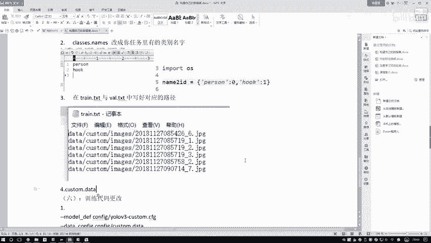
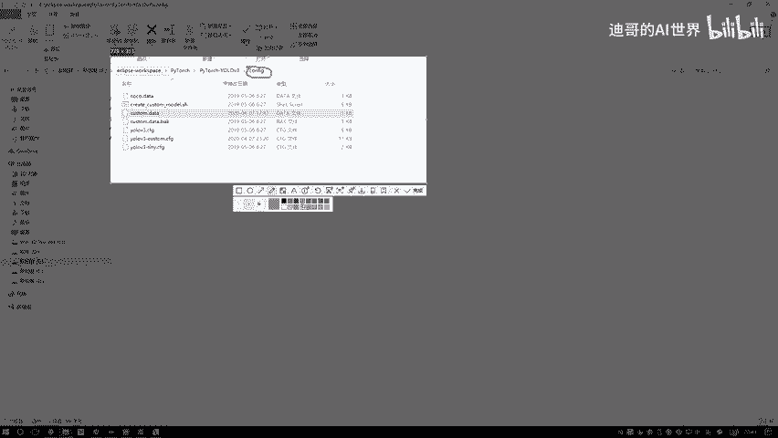
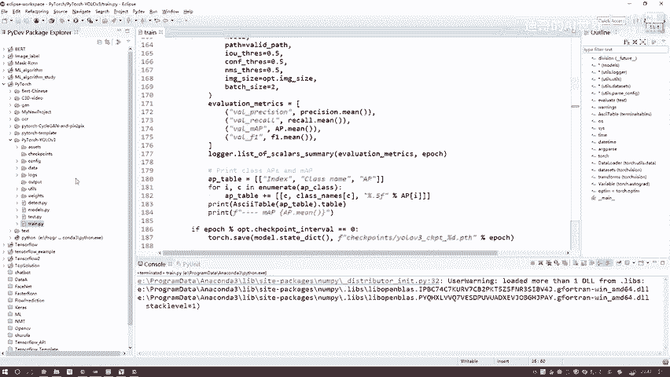

# 比刷剧还爽！【OpenCV+YOLO】终于有人能把OpenCV图像处理+YOLO目标检测讲的这么通俗易懂了!J建议收藏！（人工智能、深度学习、机器学习算法） - P90：7-训练代码与参数配置更改 - 迪哥的AI世界 - BV1hrUNYcENc

然后呢拿完这份数据之后，接下来在这个COSER当中啊，有这个给大家写一下这一块就是class啊，classes点names当中也需要自己去改呃，这是第几步了啊，这是第二步，第二步看看name。

然后改成呃，改成什么呢，就是改成你任务里哎有的类别名字什么意思呢，一会给大家截个图，大家看明白了，在这里我们打开一下呃，Names，然后我打开一下，你看这边有什么哎，是不是就是一些类别啊。

好了把我们这去掉一下呃，我们这个类别当中里面没有这么多啊，这些都没有，就我刚才自己做自己跑了下实验了一下，然后这个然后我们之前指定了，这是有一个吊钩是吧，然后这个也没有，然后一共一个类别。

两个类别是完事了，只要注意点啊，比如说你两个类别在这块，你你你多打一个回车啊，像这块啊，就是你让这光标到下一行，你别写完这一行，比如说你别写完这一行就完事了，你多打一回车。

要不然他可能那个第二行加载不到啊，就是多加一个CN这个字符啊，然后呢保存一下，这给大家看一下，这里边就是呃你去按顺序去写，之前你是什么样的顺序，然后在这里我们也什么顺序哇，这个图太大了呃，放小点。

我为什么说之前什么顺序啊，在这块给大家做个对比啊，就这里啊你是不是构建了一个字典，你字典它的一个顺序，比如这里你看字典零它是一个person，然后跌下来是那个吊钩是吧，这里你要按顺序啊，写好啊。

你的一个哦类别，比如第一类别是人，第二类别是什么东西啊，一定是给你字典里边是一致的，就是D0是什么，第一个是什么，这里你也是D0是什么，第一个是什么，你顺序不要去改啊。

好了这里呃咱完成了第二步就是class names，然后接下来这个names啊，咱们现在也整完了，那接下来，接下来就是我们的一个实际的TRA点TXT，还有validation点TXT。

我给大家打开来看一下啊，呃我给大家写一下，来这里这第三步tr点TXT呃，与这个VL点TIT呃，写好好解吧，在在春点TXT与这个VODN点TXT中啊，然后我们去写好啊，对应的路径好了，写到对应路径。

这个写对应路径啊，到时候大家你自己写个脚本吧，就是你去读一下images当中哎这些图片路径，然后把这个路径直接的写成一个重点TXT，这里这里这样吧，我也不写脚本了，这给大家复制吧，第一个呃。

第一个你看这个TRA点TXT当中，它是一些图像数据吧，好了我就复制得了，到时候大家你自己写脚本，这个脚本很简单啊，就是遍历一下这个文件夹，取每个文件它这个名字，然后写到这个记事本当中，这个没难度吧。

我那个脚本不是做这个事的，不给大家去改了，好我那个脚本是个一键生成的，但是那个一键生成脚本是我做我自己任务的，那个我就我就不给大家分享了，这个简单操作我们自己来去做啊，就是建议大家第一步吧。

你也不要去做这个一键生成了，你就是啊自己一个一个去写，先把这个流程再捋明白了，捋明白之后，然后你自己哎，你说你再完成一个一键，完成了一个脚本也行啊，然后第四个呃，第四个，然后还有第五个，这是一个第五个。

然后最后这是第六个完事了，这几张图咱们就直接写得了，第六个完事了好了，这是现在我们这里啊，就是把我们的一个呃相当于是数据哎，路径咱全指定好了哎，validation里当时也一样。

validation别那么多了啊，validation我随便复制得解得了，咱不管那套了好了，这是数据的，这是啊，这里咱们把这个称点TXT写了validation啊。

就是因为咱们没做那个validation那个文件夹啊，没做validation数据，我就随便拿经验数据来充数了，正常情况下你那个VUDATION数据啊，你单独指定一批。

然后TRA的数据你自己单独指定一批啊，我不打了，波密那个东西啊，再标太麻烦了，随便拿几个数据来充数得了，这是你构建好一个为大家把这个复制一下，这是一个train点TXT。

还有一个VOYDNER点TXT哦，在这里写好它的一个对应路径就行了，这点也比较简单，然后呢注意啊，就是你项目的一个项目的一个路径，在咱们这个任务当中啊，它是data customer images当中。

然后这个数据这个是跟我们的路径是一样的，如果说你的任务你的任务来说啊，跟咱们这个数据哎它的路径是不一致的，那你自己改一改啊，你就是把这个路径让它能找到哎，这就行了，这一块就是在我们的CUOMER当中啊。

咱需要去改的几点啊，我一个跟大家都说了一下，所有的配置文件在这里，哎咱们就给大家说的差不多了，然后呢接下来就是代码当中的啊，代码当中呃也得稍微的去改一改啊，我一个大家来概述一下这个呃。

这个是我们那个学员代码吧，在热宣传代码当中，我们还是这个春点PY啊，然后这一块我们来看一下这个参数啊，咱得稍微改一改呃，我给大家写一写，就是呃这是第几个了，这应该是第六部了，第六步了，好。

我们训练代码额，训练代码更改在这呢，第一步啊就是我们的一个参数了，呃参数当中哦，这块我得先来执行一下，然后去配置一下它的参数，用什么id都行啊，这个跟id没关的，这块有些参数呃。

我为大家说一下都什么意思，这些是呃你需要去加载进来的一些参数，比如说这个model，model的意思就是说呃你当前配置文件还记没记着，咱们之前做了一个customer的一个CMG。

也就是我们自己类别的一个配置文件，我们构建好了吧，好了，他放在那个configure当中了啊，就是在我们这个路径当中，然后呃在这个这里吧，有个configure，咱们之前不是自己做的那点SH吗。

然后生成出来了，你把这个生成出来的哎，给他传进去啊，这是我们的一个参数，然后第二个呢第二个啊就是这个customer点data，哎这个我好像忘说了，我给大家看一下这块还有个customer点data。

我找一下我这里这个customer点data啊，咱们之前好像忘改了，这里还有coser data塔，哎呀这块忘改了，我给大家说，我也复制过来呃，这里咱们也需要去改，这里就是这就是第四步吧。

cos点data呃data，然后他是在这个CONFIG当中，我给大家截个图吧，他是在这个CONFIG当中的ACONFIG当中。

然后customer点data，把这个数据啊，然后呃你去要稍微改一改，我给大家写一下，就是把里边的一个类别啊一改就完事了，这里边然后COOMER点data，然后你去呃可以打开，打开当中啊。

这有个classes是吧，哎你就是指定成对应名字就行了，比如这个任务当中咱们是一个二，然后呢训练唉我们去哪儿读那个路径，Validation，去哪读路径，这个咱们之前是不是写好了呃。

就是根据你自己路径来吧，如果你自己路径改了，你在这个呃我们的一个就是配置人员当中，你也得去改啊，但是我们这个任务当中我们是没有去改的，所以说就是默认路径classes names。

咱们这件事也改过了好了，这个咱们都不用不需要去做了，只需要你把这个呃类它有两个写好就完事了，对应的一个个数回复，再再截个图吧，改成两个就完事了，然后关掉呃，把这个图给截过来啊，行了，这就完事了。

好接下来接下来就是我们的一个呃训练代码，刚才说了，就是第一个模型的定义，第二个这个cosmeer data啊，上哪儿去读这个训练数据，然后验证数据多少类别，以及我每个就是每个类它这个名字。

接下来就是一个perrot model，它的意思啊，就是说你要不要去加载一个预句练的权重，这里啊咱们来看啊，就是我们这个模型啊，到大家自己决定啊，你想在人员基础上做训练，那你就是做一个迁移学习哎。

在人家基础上去玩没问题，如果说呢你想自己从头开始去做啊，在这写吧，这块就是呃看你想不想在人家基础上你去做哎，就是迁移学习的事，建议大家把这个东西加上啊，不加也没关系，自己从头训练，当然自己从事训练。

你那点数据量啊，就你拿个三五张，十来张，889张的，那就是跟瞎玩一样啊，建议大家在人的基础上做这个微调，除非你数据量是个几千的或者是更高的，那咱们自己同时训练，这也没问题，这个是呃训练代码当中。

我们的一个第一个就是呃train t r a n，我们这个哎呀这个这个手瓢了，train点pi当中啊，需要设置的参数，哎第一步啊咱们把参数给设置好，然后第二步参数设置完之后，然后点一下这个apply。

然后我们先给它关掉就行，一会儿再来执行，然后我们来看一看还有没有哪些个细节，需要大家自己去调的，然后由于啊就是呃这里吧，这里比如说呃有两个参数，就是一个checkpoint，就是多少次一保存啊。

咱们没就是咱们这数据太少了，没必要，就是你隔个一个epoch epoch1保存，比如说你迭代100个epoch1会就完事了，咱可以50个E保存也行啊，然后由于我的数据也比较少，那一会儿一验证。

一会儿一验证也也没用啊，我把这两个都改成50啊，相当于是呃验证集这个东西就偶尔做一做，然后模型保存50个epoch再保存一下，这个我们不当重点啊，只给大家做一个演示，这是参数当中你可以去改的。

然后呢第一个这个就是一共叠了多少epoch，我改成了101啊，就是一共做100一次，然后会保存50次和第100次的结果，然后这里拜日size啊，拜日size呃，训练白日size这一块。

建议大家是指的稍微小一点吧，看你自己的一个显存来定啊，你要是一个显得比较小的，你就是一个一或者二啊，像我给大家举个举个例子，一会训练会会比较快啊，我就指定一个二哎就完事了，然后呢。

接下来接下来我看看还有没有哪些个参数啊，需要大家去改的呃，应该基本上就没什么了，下面代码来说啊，跟我们那个就是训练库数据集啊是一模一样的，因为我们只需要去改一个配置文件啊就行了，其他内容啊对我们来说。

基本上咱都不需要去改的哦，这是训练的地方，咱们给大家做了一个简单的介绍。

都需要去改诶。