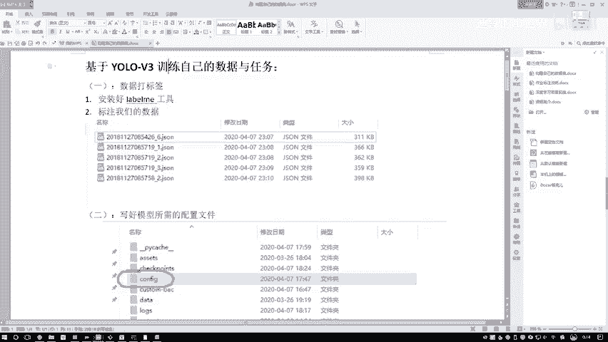

# P91：8-训练模型并测试效果 - 迪哥的AI世界 - BV1hrUNYcENc

接下来我们把参数写好之后啊，直接来运行啊就可以了，这块运行过程当中啊，它会打印出来啊，每一个epoch来说哎它的一个损失呃，这里啊由于咱们给的数据啊相对来说会比较少，所以说你看这检验速度好像挺快的。

实际上就是数据比较多的时候啊，那一个epoch跑起来可能都会比较慢啊，所以大家不要有假笑，哎这个任务是不是训练也很快，其实它只是检测快而已啊，训练的时候通常情况下都会比较慢的，大家可以观察一下。

这是当前损失啊，就是我是用GPU来跑的，一会儿就是看起来比较快，你看这损失还在下降吧，一会再看损失值怎么样，一直在下降，我们只需要关注最终的一个呃，就是所有损失就得了，然后呢大概一共会跑100次啊。

然后会得到一个最终结果，等到跑完之后，我给大家呃来实际看一看吧，其实我心里也没底儿啊，咱们就六张图像，看一看能不能做一个行人检测任务出来啊，然后这里刚才还有一点我再给大家强调一下。

就是当咱们去做这个呃create model点SH的时候，然后呢如果说你重复执行诶是不行的，这会给大家强调一下嘶，额这块再写一些额外注意吧，额外注意，然后额这个东西，然后他是不能重复呃重复执行。

然后呢每次执行之前啊，然后你需要先把这个东西删掉，就是你先把你配置文件删掉，然后再执行你这个create点SHR啊，要先把啊这个删除掉才可以，要不然他会在那个基础上哎再做一些叠加啊。

所以说会使得你这个模型哎配置文件变乱啊，这个额外大家注意下行，用这个create model的时候，然后把这个呃这个CFG这个东西啊，给它去掉一下，然后呢我看现在叠叠加多少次了，这应该挺快的呃。

18了已经lost啊，现在17次行，一会儿吧，咱们就稍微等一会儿，然后等一会儿唠得到时候给大家演示一下，当前哎我们的一个效果是怎么样的，当咱们把这个模型学完之后啊，在诶这个项目当中啊。

有个叫做trl points文件夹，哎咱们会设置一个保存啊，因为在代码当中啊，这个就是春甲PY，最后的时候他会把我这个模型啊，比如说每50个epoch会保存到这个tripod当中。

当然这个路径大家可以也可以自己去改啊，我们来看一下，在这个拆判当中我们可以去找哎，比如最后一个就是这个优路V3，然后拆point子100，这个就是啊以我们现在已经训练好的模型。

然后呢一会儿我们要做一个检测，检测的时候啊，咱就用我当前炫耀模型，然后进行一个预测操作，我先把这个名字啊复制下来，一会儿呢在参数当中我要写上当前啊，我这个拆point子诶，用哪个模型来做测试好了。

回到我们戴尔当中啊，训练咱们就不看了，这块有个detect点PY，我们点进去，在当前我们的一个检测员当中啊，我们先去呃rise一下，先配置一下我们需要的一些参数，额，我还是把参数给大家复制过来吧。

呃这里就是最后一步啊，比如说这一块额外注意的放后边吧，这就是我的呃，第七步吧，第七步就是一个呃，咱们现在要做一个预测了，预测操作，预测操作过程当中啊，这些是我们需要的参数额。

第一个参数就是预测哪些个文件，你要放到一个文件当中，呃比如这里我就把所有的文件重新复制一下，在这一块咱也别找什么测试集了哦，因为我这个训练集的数据实在来说是太少了，咱就直接的去预测一下咱训练数据得了。

举个例子，在这个customer当中，然后images我把这几个拿到手吧，然后呃放到data当中，然后有一个SIMPLES，哎咱们就是呃哎呀把这些删掉，不需要，然后我们这里就是data点。

simple当中是我的一个预测数据，在这块一起大家写一下呃，把需要预测的数据啊放到这里，因为我们一次啊相当于是把整个文件夹诶，都预测一遍，或者说啊你想自己一次传建一个数据，然后画个图啊也行。

都觉得太麻烦了，你可以你也可以自己你也可以自己设置啊，就是要预测多少东西，这里呢我们就先把所有要预测的，放到一个VR当中，然后这个就是呃训练好模型的路径，咱们刚才是不是说了，训练好一个模型。

然后这个这是画图的时候用的画图的时候，然后要把那个要把框上显示呃，出来它是什么物体，所以说他也知道啊，你对应的一个零二是哪个类别，一是哪个类别，因为最终预测结果它只有一个index值是吧。

把index值啊转换成呃它的实际的一个name啊，就是这个意思，然后保存一下吧，我们来执行一下，在这里我看一看啊，没有什么要改的吧，基本没有什么要改的，这个呃优LOV3，我看一下是不是我的名字一样。

优LOV3，然后拆换100啊，跟我跟我们应该一样的，这个我该改过了行，这咱都不用改了，然后直接点下run就可以了，点下run这个呃就是第一遍执行可能速度有点慢，后面执行速度会比较快了。

好这是他现在开始做一个检测，检测完之后啊，然后我们会得到结果呃，这些是我实际预测的图像，然后我们看结果结果它保存到这里了，保存这个output当中，这个output当中啊，这是我们的结果技术当中啊。

然后也是SIMPLES，我们来看一下哦，这里有一些之前的，我把之前的去掉吧，这是之前的我给大家演示过的coo数据当中，把这些去掉，然后我们重新执行一下，现在空了吧，我们重新执行一下这块。

他会帮我生成出来啊，就是所有咱们需要的检测的一个图像，在这个output当中好了，已经生成出来了，我们看一下这里边你看我们刚才是不是标些人，那这里我们在炫技当中啊，也是能把这些人怎么样全部的检测到吧。

因为我们这个我因为我这个我这个属于作弊了，我直接拿训练集，然后给大家做演示了，因为我们数据太少了，你拿一些其他几可能就检测人啊，检测的并不是那么特别好，因为训练的可以说有点少啊。

但是在训练集上表现效果是不错，这些啊就是给大家举个例子啊，该怎么样去做，然后实际上你们大家自己去玩的时候呃，数据就是建议大家这样第一遍你玩的时候，你别整个几千张啊，就是先试试水啊，标有几张，自己玩一玩。

有点感觉，然后呢你把这个流程整明了之后，或者说把咱啊这个所有要做的事，你都整明了之后，接下来哎你说你再自己玩一些实际大型项目，你想怎么做，那就怎么做吧，啊这个跟大家从头到尾解释了一下，在这个优鲁V3啊。

我们的项目基础上怎么样啊，去标注数据，以及怎么样去把我们所有的配置该怎么去改，我把所有细节以及流程，给大家从头到尾演示了一遍，建议大家就是呃看完咱们课程之后啊，尽量可以自己动手做一遍。

因为自己做也是学习和熟练的一个过程，反正以后你实际工作，我觉着配置这些东西那都是家常便饭啊，天天哎就是去搞这些东西的行了，今天咱们这个课程就给大家说到这里了，咱们整个优菈的系列啊。

