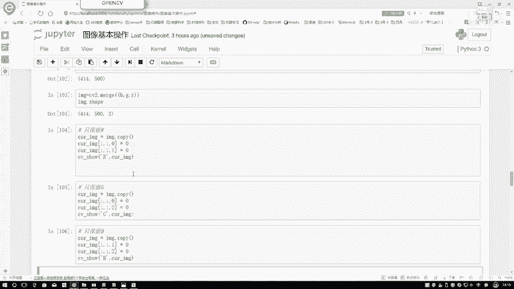

# 比刷剧还爽！【OpenCV+YOLO】终于有人能把OpenCV图像处理+YOLO目标检测讲的这么通俗易懂了!J建议收藏！（人工智能、深度学习、机器学习算法） - P9：3-ROI区域 - 迪哥的AI世界 - BV1hrUNYcENc

然后咱们来看一下嗯，当我拿到一张图像或者是拿视频当中某一帧吧，其实他们道理都一样。

在这里呢还有几个简单操作啊，给大家快速过一遍，第一个东西叫做一个ROINRI。

翻译过来就是region of interest，什么意思啊。

你感兴趣的区域或者说一张图像来了，比如说这张小猫吧。

咱们来看一下这个啊，cat这个东西，这只小猫来了，可能现在我想观察的并不是整个的一张图像，可能我现在的一个观察点，我在中间的某一个区域行吧，我想在图像当中啊，把特定的一个区域给截出来。

咱后续啊再给大家看各种各样的数据，操作过程当中，经常要用到这个RI，这个就是这个方法，相当于在图像当中只取其中的一部分，我们来看一下怎么去做的，首先把图像数据读进来。

然后呢在这里既然它是一个ND类的结构，是不是它就是一个数组类型啊，在这个数组数组类型当中啊，我们可以自己设置一个索引或者是一个切片，来去选择你感兴趣的像素点，或者是这样一个区域，咱们来看，首先这是什么。

这是从0~200吧，这从02~200吧，相当于什么，我指定了一个切片吧，在这个切片当中啊，把我想要的区域给我选择出来，这就完事了，这样我给大家选一下，比如说这是一个50，这是一个200吧。

咱们来执行一下，看一下行了，这个就是我得到的一个结果，我的H它是等于50的，我的一个W它是等于一个200的，相当于原始图像可能是长这个样子，它在这里呢，只把其中的一部分给我截取出来了吧。

这个就是咱这个ROI啊，它是什么意思，在我原始图像当中进行一个截取。

这就完事了，然后呢，有些时候就是我们还有还要分别啊，对图像进行一些特殊的分析，比如说咱们刚才说的一个彩色图像，它是三个颜色所组成的吧，BGR一定注意好它的一个顺序啊，Bgr。

然后呢在我们open CV当中啊，我们可以把三个通道分别切分出来来看一下，其实这里你用SUV two点split一下也可以，或者说你刚才拿到的这个image图像，它是不是一个三维的，你写个冒号冒号零。

冒号冒号一，冒号冒号二。

是不是也是一个BGR啊，它做法都是一样的，咱们来看一下，再看一下吧，就是它的一个split操作，切分完之后得到什么BGR，分别来看一下，对于B来说啊，还有对于这个B的一个shift值，然后咱们来看一下。

无论啊你是对于这个B还是对于这个R，还是对于这个G他这个shift值都不会去变的，比如在这里来大家看一下，我看这个东西改成G，然后改成一个G点，shape来看一下，无论是一个G还是一个R。

虽然说它在右侧就是不是右侧，就是在这一块它像素点的一个结果是不一样的，但是他们那个大小是不是必须都是一个，相同的呀，这不值啊，必须是一致的，要不然这个东西就就不是一张图像当中，切出来的。

这个就是它的一个顺序啊，BGR的一个顺序，然后呢当你把它切完之后，那你说你分别处理完了，然后我还想把它再组合在一起，行不行啊，也可以open CV当中啊，有个函数叫做一个merge函数，非常简单。

你按顺序BGR写进去就默认完了，再来看一下，默指完它的一个结果，默认完之后还是原来4145百，就不要忘记，最后还有一个三吧，最后这个三表示着我的一个BGR。

我的一个颜色通道啊，又还原回来了，然后呢再来分别看一下吧，哎呀刚才你老说这个BGRBGR，那这个BGR，它沿通道当中分别都是长什么样子啊，咱来看一看吧，首先咱们说第一个我只保留R通道，按照这个顺序。

BGR只保留R，那是不是说你这是012这个索引来说，那你是不是让这个B的全全部为零，G的全部为零，只保留这个R啊，再来看吧，在这里指定一下前面冒号，冒号表示取所有吧，02B设置成01G设置成零。

只保留R那就是R没变吧。

咱来看下结果，这个就是在我的一个R通道当中，就只有R通道当中，看是不是挺吓人的，像是个猫妖似的，这个就是只保留R通道它的一个结果。

然后咱再看不知保G通道，其实啊就是你把其他两个通道值置为零。

就完事了，这是G通道它的一个结果，一个绿色的毛。

然后呢下面其实是一个蓝猫啊，一个蓝色猫，这就出来了，这个就是分别不同颜色通道它保留的结果。

然后呢当咱们把这三个结果综合在一起的时候。

