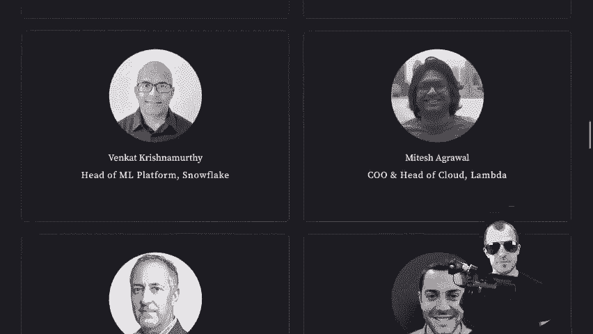
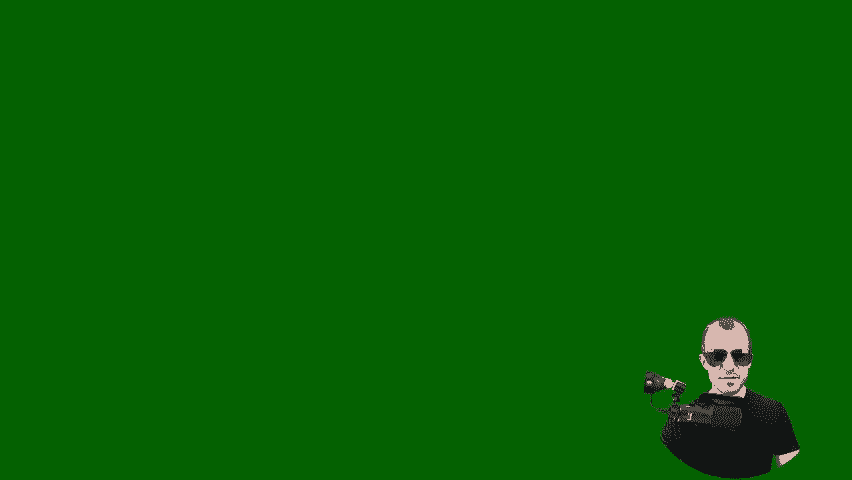
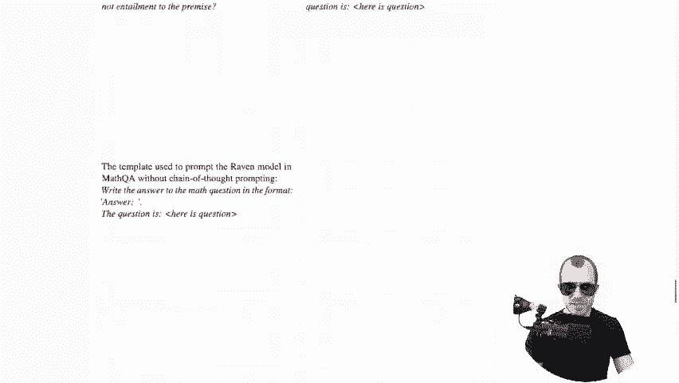
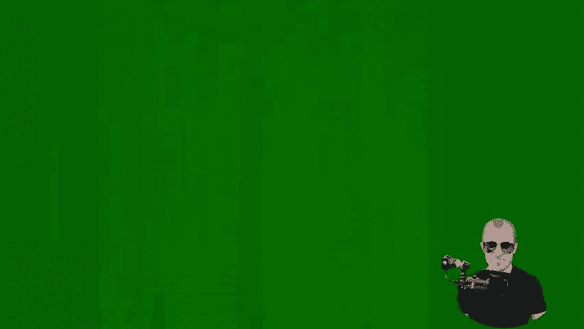
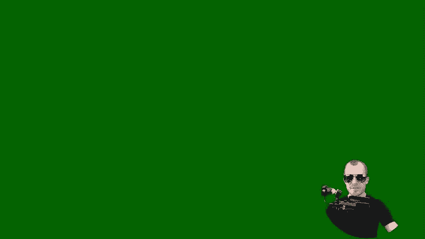
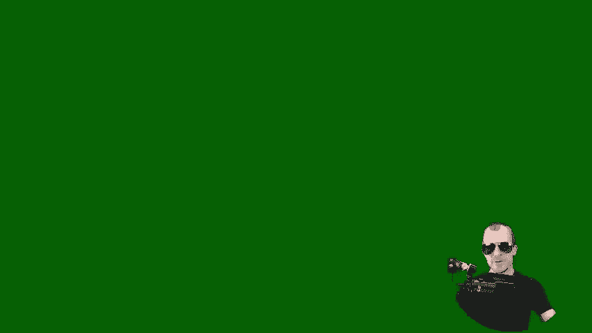

# [双字] 在{Transformer}时代, {RWKV}是RNN的[文艺复兴]--论文详解 - P1 - 编程语言观察 - BV11N411C76z

Hello today we're going to look at RWKV， which in its own words is reinventing RNN for the Transformer era。

 This is a very interesting project and very interesting model architecture because it has some properties of transformers。

 notably it's a model architecture that's very scalable in terms of training so you can stack it really deep and you can still train it and also you can parallelize training。

At the same time， it avoids the quadratic memory bottleneck that transformers have by essentially being an RN。

 It's kind of a recurrent neural network in the sense that during inference。

 you can compute the output step by step and always have a constant memory because everything is put into a hidden state。

 We're going to look at how these two things come together and what the tradeoffs are between the two。

 The project is also very interesting because it's been largely developed by one person or by just very few people who have worked on this and then compare this to entire corporations that are pouring their human resources into transformers and still the results are that this model in some cases。

 not in all cases， but in some cases can be very comparable in terms of performance with transformers with really big transformers and as I said。

Is scalable， which so far RnNs have been lacking。We'll go over the paper。

 We'll go over the architecture and see what's actually happening right here。

 I have some of my own thoughts and you know， just opinions on this。 And I hope you're with me。

 But first， let's。

Let me show you this。 fully connected is a conference。 It's by weights and biases。

 It's a one day event， and it has pretty cool speakers。

 So not only the cofounders of weights and biases themselves。

 but the cofounder of Langcha is there The cofounder of Cagel I there。

 Richard Soer from U do co is there Chiyian is there of Clapot there's so many people right here and so many cool speakers and as I said。

 if you are in around the San Francisco area go give that event a visit if you want。

 I'm going use put a link and a promo code into the description of this video that will make the tickets cheaper。

 So the tickets will be 49 buck instead of what you see right here。

 So that's going to be on June the 7。 don't forget that June the 7 in San Francisco。

 It's an inperson event has a max capacity。 So grab it now。😊。

That's it。 Thanks to Bs and biases for also giving me this opportunity and also giving this to you。

 It's very cool。So。RWKV， it stands for。Let me not screw this up。 Receptive receptance， Receptance。

 R is for receptance。 W is for weight。 key K is for key， and V is for value。

 These describe the different elements of the model architecture and will go through that will go through it。

 So what are we dealing with。 We're dealing with a model that you can use for lots of things。

 but we're mainly dealing with a model that in the instance it is outlined here is for language modeling。

 by language modelling， we simply mean we have a piece of text， yada， yada yada， yada。

 and what we want the model to predict is the next set， the next tokens or the next word in the text。

 So from here， predict this thing and from here predict this thing and so on。

Transformers are usually used in this manner。 notably I would stick the entire prefix here into a big transformer and the transformer would spit out the next step。

 it will do that in a form that we call causal attention。

 which essentially means that every piece in the text right here。

 So every token can attend to all the other tokens that are before it。

 So all the other tokens that come in front of it would have be would be inputs to that token using attention that results in a quadratic in a quadratic requirement of compute and memory Now if you can see there if every token attends to its back。

 it's like T times t minus-1 or something like this。Interactions that need to be considered。

 so t squared in expectation。And。No， yes， maybe。Yeah， that makes about sense。

So transformers naturally have a limit because if you add one token。

 then you always add a memory requirement of of T。 And so very quickly that scales to be out of proportion。

 so their power is traded off by the fact that they can only consider a limited set of tokens at a time。

 Recurrent neural networks trade this off。 recurrent neural networks if they have to do something like this。

 if they have to have an input and then predict the next thing。

 what they'll do is they'll just start here。Then they'll put something into a hidden state like a little memory。

 I'm going to represent that as a box。 People have forgotten how R and Ns work。 I figured。

Like a few years ago， I could have talked about RnNs。

 and every one of you would have known what I've talking about。

 And then transformers are kind of the new thing。 And now it's more like I have to say。

 I don't even have to mention stuff is a transformer But I do have to conversely explain RnN。

 So it would put whatever it learns into a memory like this hidden box。

 this box right here is the memory。 Then from that， it would consume the memory。

 and it would consume this thing and it would build a new memory。

 and then it would consume that memory and it would consume the next input。

 it would build a new memory。 So it does this step by step。 and it can always。

 you can drop the old memory。 So you can forget about the old memory because all you need pun intended to go forward from here on out is that current memory。

 So you do step by step。 and you always save stuff into the memory into the hidden state or whatever you want to call it。

 So RnNs have this really great property that they only require a constant memory in order to do inference。

😊，However， the individual， the individual inference step， for example， when we are here。

 we have that memory， we predict the next the next token from it。

 so we predict the next this thing right here。We can only consider the memory and the previous token。

 That's all We cannot explicitly consider any token that is in the way back because everything goes through that hidden state。

And that bottleneck has usually been one of the downfalls for RNNs。

 There is a problem of vanishing gradients。 There are a couple of other problems that you can't just compress information into that one hidden state plus RNNs have been notoriously hard to train because the inference always requires this step by step thing。

 which means you have to do back propagation through time which is part of the vanishing gradient problem but also means that you can't parallelize the training in a transformer I can input a tokenop a token sequence of 50 tokens。

 and that gives me 50 training examples which I can train all at the same time because of the causal attention mask。

In an RNN， if I have a sequence of 50 tokens， I can still only train one token loss at a time because I can't infer everything at the same time。

Our WKV is going to strike a trade off in the middle of those two things。 And in a sense。

 so people ask， or I asked， is this a transformer more， is it an R and N more。

 and I've come to the conclusion。It's a convenet。 and I'm going to I'm going to explain my reasoning。

 and they they also refer to that， by the way。s it's not like I found out something great right here。

 but in the most basic sense。You can think of this thing as a convolutional network across a one dimensional sequence of tokens。

That's that's going to be my statement and we'll go through it。

So they give a bit of an introduction right here on what it。

What this means and what I essentially just said， transformers scale quadraically with sequence length。

 RNNs exhibit linear scaling， which is very beneficial， very advantageous。

 The RWKV model combines the efficient， parallelizable training of transformers with the efficient inference of RNNs。

So it's like almost two modes between which you can switch around。

They say they have a linear attention mechanism and as I said。

 they formulate the model either as a transformer or as an RN。

 that linear attention mechanism is something that we're going to focus on in just a bit because。

It's not， it's not their fault because people have been doing it before them。

 but I think it really stretches the word attention and what it means。

 I think it stretches that to like a point where I don't agree anymore more calling it attention。

 but again， they are not the first people。Kind of doing that。

 so I'm not going to hold them to account right here。

They say this is the first nontransformer architecture that to be scaled to tens of billions of parameters。

 So one of the properties of this thing is really you can scale it。

 you can scale it and you can train it in parallel which also means you can pump a lot of data into it。

 and that's very advantageous And there is a lot to be said here about maybe maybe it's not that much the architecture we're dealing with。

 but more you know good models are simply models with architectures that are scalable。

 So it's not maybe that's a hypothesis like how much of the performance of something like G4 is due to the fact that it is a transformer and how much is due to the fact just that is a scalable architecture you can pump a lot of data into We don't know。

Yet too well how those things exactly trade off。 But there is good argument to be made that， hey。

 if you can find some other architecture， just just scales really well， then you know。

 you might as well reach the same performance。This is a complexity。

 a asympttic complexity table on the different ways of doing attention mechanisms。

 so the transformer is that classic mechanism as we said it needs quadratic time in t big T is the sequence length of the sequence we're processing and then in terms of space it needs a little bit more。

 but the leading term is also this t squared right here。

 the D is the dimension I believe of the embeddings of the hidden spaces which is usually a constant factor across all of these things。

There there are various tradeoffs like a reformer and so on， performer， a lot of these。

 they do approximations to the original transformer attention mechanism。

 and it's also notable to say that RWKV is not an approximate attention or anything like this。

 It doesn't try to approximate the original attention。

 it replaces it with a different mechanism of considering the past。

So what does that mechanism look like？y。Lets let's go into it。Maybe yeah， this is， this is smart。

 Let's first look at this here。 If you've been in in deep learning and are old like me。

 you remember this， this is an LSTM。 This is a long。

 shorter memory cell from back when before attention was a thing。

 So this was one of the main ways people build RNN's recurrent neural networks that would actually somewhat avoid that vanishing gradient problem and could learn to remember things for a long time。

The idea behind Ls Tms is that you have。Youre the hiddens。 you have two hidden states。If I'm correct。

am I correct。Yes， so you have two hidden states， this C and this H H being the real hidden state。

 and you have a lot of these gating mechanisms。What the gating mechanisms do。

 it's often represented like this here。 This is an element wise product。

So what you would do is you would give in again in a hidden state， you would get in an input。

 youd put the input through some sort of computation， neural networks， non nonlinearities。

 yara yada yada， and then you'd have some result right here。

 which would be a vector and then the question is obviously you can compute an output from that at this particular time step but the question is how should the next hidden state look like。

And the idea behind LSTMs and similar architectures is that we're going to take the last hidden state。

Sorry， we're going to take the last hidden state。And we're going to update it。

In a if in a really basic RnN we would just kind of replace the hidden state or we would maybe add the two together and then for propagated。

 But what an LSTM does very interestingly is introduces these these gates。

 So what we'll do is we'll have something like a forget gate。And the forget gate is simply。

A binary or not a binary， but say a， obviously。Continuous。

 but we can imagine it as a binary vector where just it's a mask values between 0 and1。

 and wherever it's 0， there is an element wise multiplication， wherever it's 0。

 this hidden state is going to get forgotten。And then the new state is going to be updated at that particular point。

 So there is going to be a forget gate。 There is also going to be maybe a gate right here that tells which things of the hidden state to even remember。

 right that's also a binary vector， maybe only these things。

 and so the network itself can control which parts of the information it wants to remember。

 which parts it wants to forget and which parts it wants to retain and then the new hidden state is going to be sort of an addition of these masked inputs and then that goes on。

In order to do that， there's a lot of computation needed as you see right here。 And in particular。

 I want to draw your attention to one fact。 the next hidden states， for example。

 if you take this H right here， the next hidden state is always going to be some nonlinear function。

 for example， this is a sigmoid。 I believe it's a nonlinearity or a tan H or something like this of something here like of this Ct。

 the Ct in itself is a linear combination， but a linear combination of this。

 this in its turn again is a non linearity and then a linear combination of the things and this ultimately is the last hidden state。

 So you can see from the last hidden state to the next hidden state。

 we pass at least two nonlinearities And there you see this sequential stepwise nature of things。

 Its always it's always。You have to compute。😡，The step， then you have to。

Compute the next step based on this step。 and the outputs are non linearly related。

 So there is no way you can like。Jump a you ahead or take five steps together or something like this。

 because they're non nonlinear。 It's not like linear functions。

 Linear functions compute really easily， right， No nonlinear functions that are stacked where every next thing needs the first thing as an input。

 Those are really not parallelzizable， not。Like agregable or anything like this。

 So that's the problem with RnNs if they're formulated like this。

They also go a little bit into the attention mechanism。

 which I guess by now I don't have to explain too much anymore。

 There is a query and a key matrix both are produced from the data So the data enters and three matrices are produced。

 queries keys and values will do an outer product between the queries and keys which defines this quadratic interaction。

 So every token can attend to every other token sometimes you would then mask this with the causal mask with the upper or lower triangular matrix。

 then build a softm across that。 So the softmax essentially converts some values。

 So let's say your values or this positive negative negative positive would convert that into a distribution。

 we can interpret it as a probability distribution or you can interpret it as。Essentially。

 whatever you want。 But you can and it defines where to put the attention， right。

 It defines which things I should look at like this one and this one a little bit。

 I guess that's why it's called attention because it defines the weights。

In by which I aggregate information。 So it dynamically。

Allocs attention to some of these values right here， rather than others。

That's what attention means to me in the sense how it's described。

 and that's why I said the term is stretched a bit far。

You can write attention in a different way and you can decompose it recurrently almost like an RN。

 so you can decompose attention computation， and this is done in parts to also get around the memory bottleneck however you trade it off with computation right if you compute these things in sequences。

 you have to compute them sequentially where you could just compute them in parallel by doing a big outer product matrix multiplication。

 so you do trade off time and memory here。And by the way。

 you have to remember all of these things or you can sum them， I guess。I mean。

 any matrix multiplication， you can probably。Do that with。 Never mind。

You can decompose the attention computation。Same one as above in a way like this。

 So I have the outer product of just。Pair of keys and queries。

 I raise that to the I have the exponential of that。 that's part of that softm computation。

Ultimately I divide by the sum of these values so that's the softmax operator。

 and then I multiply the value at that particular location。

 So you can see here this part here defines a weight and v is the value。

 so it's a weighted sum of the values。Now we come to attention free transformers。

 which is a piece of work that this paper takes a lot of inspiration from attention free transformers。

T to go about this in the same way as attention， but they say， hey， can we reformulate this。

 this formula up here， the one that we saw。Can we reformulate this and。

Just turn it into something that doesn't need that whole quadratic memory， Chaen。

And they come up and say， if we don't have to do the outer product up here， this outer product。

If we don't have to do these out products， then that would sort of。

Mean that we don't have this token to token。 Every token can attend to every other token interactions anymore。

 which means we don't have that quadratic thing anymore。 and therefore。Wei。Would， you know。

 we could save a lot of memory。 So they replace the interactions between query and key。

 They replace that， and they say， let's， let's not even compute a query。

 We'll just compute a key for each token。 So we're now only producing matrices K and V。 no queries。

Instead， we'll have these ws right here， the Ws are learned， so W is a learned matrix。

 so not a not computed from the data。But learned， and it just learns how tokens interact with each other。

What does it mean， it means that I just have a matrix。And emphasize size T by T。And in there，1，2，3，4。

5，1。2，3，4， or 5。 And in this matrix， there's going to be number like 7。 Okay。

 and that means that the interaction， that the weight， the attention weight。

 essentially of that token 1 has with respect to token 2。 So how much is token 1 gonna。

Attend to token to。 Let's assume it's not causally masked。Is 7。Okay， that that's that's that。

 it's the same for all the sequences。 you all you just say， well。

 the first token is always going to attend 7 to the second token， all the same。

 it's one set of learned parameters， and therefore you can this is just now a multiplication by a constant essentially。

Now。That just defines a fixed attention， which is a bit too little。

 so the fixed attention is not flexible enough before we had completely dynamic attention and now we go to completely fixed attention that is just learned across the whole data set and the authors there said。

 wisely， hey， you know。It is in。 It is the fact that。Depending on the current data point。

 we might need to look back further， or we might need to change that attention pattern a little bit。

So they say， okay， how about we simply add the keys here？

So the keys are values that are computed from the data， right？

So now the data can define essentially an offset to that。 So maybe for one data point。

 it's eight important because it says token 1 should really look at token 2 and for another data point。

 the K is negative one。 So this is6 right here that depresses that a little bit。

 So there is a modulation in that attention pattern。

 there is one across the data set which is fixed and then on top of that there is a modulation given by each individual data point to modulate that。

 However， the interaction is not multiplicative as it is in the transformer attention that you see up here。

 it's additive， which is in a sense， a lot less powerful because the multiplicative interaction really defines when two things are close and when two things are far apart between keys and queries whereas here we just multi a little bit that fixed that fixed pattern right here。

However， that fixed pattern can't take into account a token 1。If it decides on its K value。

 it can't take into account the what token2 is。 It simply says， I'm the word cat。

 I should probably really look three words behind me。 That's really important。

Whereas the original attention can decide， I'm the word cat。

And I should probably really look at words that relate to fish or fur or or sleeping。

 Like those words， those kinds of words really interest me。 And that's how it would craft its query。

 and that's what it would be retrieved from the keys of the other words。

 Whereas here it can just say， well， I'm cat， I should probably look three words behind me Seems really good。

I hope you can see how this is。😊，Kind of less powerful than the original attention。But。

 it is more scalable。Again， you see what it defines is essentially this part right here。Is a weight。

 so you have awaited some of the values。Lastly。We have this paper right here。

 so it formulates the attention mechanism It says yeah but here what we still need to do is we still need to learn that interaction matrix。

 which crucially also means it's still limited by T。

 It's still limited by you know sort of a fixed size。 we can we can't go bigger than that and。

What they say now is， how about we don't learn this matrix。 All we learn is a vector。

 All we learn is the vector W。And the vector W， its the same for all， and it defines。

 so it defines it's a vector。And it has the same dimensionality as the hidden dimensions of the hidden state。

 And it defines for each dimension， it defines how much。Does the past matter。 So for one dimension。

 it could say， well， the past matters a lot， therefore。That value is very high。

 And for the other dimension the casino， that value is very low。 The past doesn't matter a lot。

 What happens if we do that，Ultimately， we're going to do something like。Again， something up here。

 So you can see we have E the exponential function of W T I。Plus， K。Ki。嗯。😊，So。😊，They now say， okay。

 we multiply this by this term， T minus I means how much back I'm looking。 So if we wonder。

We are token one。How much do we attend to， or let's go the other way around。 We're token 4。

 How much do we attend to token number 2。Okay， then we ask in which dimension in the first dimension。

 or， the first dimension is really large。 therefore we're going to attend a lot to the general past of dimension 1。

Okay。So maybe that's this drop off。 And then we look two tokens in the past because the current time step is 4。

 and this I here is 2。 So how。Which token are we and which do we attend to。

 And you can see it's minus。 So this is getting bigger and bigger as you go further back in the past。

 So it's essentially a linear drop off in the value of W and W itself can be big or small。

 And these two things together define how important a past token is in that particular dimension。

 So it's a multiplication of how far back is it and how much is this dimension in general。

Considering its history。And then you can see it's considering this much。

 it's two tokens back so this much attention， and then that is modtable again by a key value that can depend on exactly what the current token is。

So I hope that's understandable， the attention matrix is built on the fly in R WKV。

And it's defined a by the V。 It's defined per dimension。The vector W defines a general importance。

A list for each dimension， it divines how relevant is the past。The second component is this。

 it's simply a linear decay on into the past。 So the further back， the less important it is。

That being said， this is obviously then put through the exponential function。

 and therefore it's a linear decay in the exponential function。 So I guess an exponential decay。

And then the third thing is the modulation， and this is where the actual value that the actual what the token is plays a role is then to modulate that point we determined right here。

 modulate it up or down a little bit also in the exponential function。

So that is how RWKV considers the past in general， it forgets the past in an exponential fashion。

 modulated by the global importance of dimensions and a value that's dependent on the current token。

All right， so it has the same trade offs as these attention free transformers。Now。

 what do we do with this with these things somewhere we have， we have。

 sorry for scrolling around so heavily。Okay。そう。This is how the model is composed。

 This is a recurrent application of the model。 So we see the same model applied to three tokens in succession。

 So the my name is。Bob， okay， you input my and you're trying to make it output name。

 then you input name， so you input my name， you're trying to make it output is then you input my name is you're trying to make it output Bob。

So it's three applications of the same model， so the model isn't composed of these three columns。

 but the model is composed of one column and then we just apply that over and over again。

You see it has a beginning， essentially。Which is a token embedding。 It has an end。

 which is a language modeling head， which is a fully connected or a stack of fully connected layers that just maps into the vocabulary。

 But in the be in the middle， it's composed of。ARecurrent。Or sorry of a series of layers。

 So there is in each layer， there is always sorry in each layer。

 there is always a time mix module and a channel mix module。

 So the time mix module being here and the channel mix module being here。

 And those are repeated time mix channel mix time mix channel mix and so on。 And then on top。

 there is this language modeling head。So what are the two blocks。

 This is a schematic of how the two blocks look like。 I know this is a bit small， but the。

Time mixing is down here， and the channel mixing is down here。

 We're going look at this in a bit of detail in the math， But observe right here。

 what you always have is you have the input signal。You're going to compute R from it。 R is a value。

That is going to be used as。A for like a gate， a forget gate。

 So R always defines how much of whatever is in coming here or whatever is in coming from here。

 How much of that do I want to retain and send up to the next layer。

So as you can also see or is computed over here as well。So for every of one of these blocks。

 we're going to do a computation over here or over here。

 and then we're going to have a decision made by this branch of the computation of how much of that we even want to accept and then send up to the next layer。

So that's the purpose of the left branches of these computation。

 There is residual signal across all of these things right here。 So that kind of mimics the。

The state of。Of an LSTM， maybe， but in a， in in an upwards way。 So in a layer to layer way。

 So we always have a residual module。 We also have a forget gate in front of adding it to the residual signal。

What does these two modules look like So actually， let's first go to the channel mixing block。

The channel mixing block is very reminiscent of。Kind of feet forward， maybe layers。

 So what we have is ignore， ignore this part for a moment right here。As I said。

 the R is computed from。The input X。And just a linear layer。 So x times a matrix that's R。

 So that's a linear layer that defines R。 Then we have K also x times a matrix。

It's a very simple fit forward layers right here。Then W， which is this part right here， that's no。

 sorry V。V is this part right here。You can see that's a nonlinearity and the nonlinearity here is the squared relu。

 the squared relu nonlinearity on top of k， and again a linear layer。And at the end。

 we are doing that element wise multiplication by this signal right here。

 so the R pushed through the sigmoid here is that forget gate that we talked about。

But you can see it's a。😊，Essentially。If you follow if you follow the signal through the actual path of signal。

It starts here x， well that's a funky。X。It's multiplied by a matrix。

 so a linear layer that becomes K that's put through a non linearity。

 then multiplied by another linear layer。That becomes the value V。

And then send through the forget gate。 So it's essentially。

A feat for neural network with one non linearity。 And at the end。

 a forgetgate as like another non linearity。And that's it。 That's the channel mixing module。

 I guess it's channel mixing because this matrix， the the linear layers， they do， in fact。

 mix the channels， which means that every dimension sort of can get inputs from every other dimension。

 which is is a big of a feet forward network。 Now， I've crossed out all of this stuff in the back right here。

 So we should talk about this as well。What they do is something called time shift or token shift。

 or I believe that's。One of them。Token or time shift。And that is。

 they always not only take the input to the current layer at this particular time step。

 they also always take the input from the last time step。

 and the linearly interpolate between the two。 So you can see here mu and1 minus mu the mu and 1 minus mu or either hyperparameter or their learned parameters。

 but they are per operation。 So mu R here is a parameter for the general computation of this R is not dependent on the particular data point。

 Only this and this are dependent on the data point with X T being the current input to the layer and X t minus-1 being the last step input to the layer。

 So this is pretty interesting because it means that we not only always only take the current input and the hidden state from before like in a general R and N。

 but we always take the current input the last input and。This layer， that's it。

 But in the time mixing module will then take the hidden state onto these。

 That's why in this diagram， you see these these lines right here， these diagonal lines。

Are the token shift lines。 So you see this channel mix module is going to take the current input。

 whatever it gets from the lower layers or the original signal and the input to the last to the same layer at the last time step so。

Current input and input to the last time step。 And that also goes in。

 These two things are linearly interpolated， and that then is the input quote unquote to the current layer。

 So it's the interpolation of the last step and this step input。No。

 it's not like we don't mix like the internal states right here。

 we mix the inputs before they go into the layer。Now let's look at the time mix。

 you can see there is also this token shift happening。 so this token shift。

 that's just something you can do， I guess if you have a a one directional sequence that you need to predict。

 you can do this token shifting but。What's also interesting is we have a second line。

 which are these states。 So how does that work， and that's going to be now the actual recurrent part of this model right here。

You can again see here we're always working with the token shift， we never just work with the input。

 but you can just think of these things here always as like X， sorry。X tilde。

 where x tilde is a mix between the current。Input and the last layers input。So we have we compute R。

 which is it's just x tilde times w times a feet forward layer。

 and that again becomes the forget gate down here with an elementwise multiplication。

 we do have an output layer， an output sorry we do have an output feet forward layer kind of a projection that's I'm going to guess they put that in because it was advantageous to do so it can also change the dimensionality and whatnot。

Then we're going to compute two things K and V。 So you'll notice before。

Whatever was called V was produced from K， but now both K and V are produced from X。

I don't know why they call them the same， probably to keep as much in line with the transformer terminology as possible。

 but it's really there's no relation between like the V here and the V before the K is computed similarly。

So this block right here， the K and the V are computed。

Modular the time shift as they are computed in the original transformer architecture。

Which is just the input times a linear layer。Then what happens is interesting then。

As you can see right here， we go into this， into this weighted sum。 So youll。

 you'll see something familiar here。That's await weighted， await weight and V T， That's the values。

 So V， we computed here。 So we're going to look for a weighted sum of the values B。But， oh， sorry。

 No， no， no。 forgetget that。We're not only going to look for a weight that sum of the value V because you also see here are V's。

 but these are Vs， and this is V T。 The Vs， in fact， are the past values。

So we're going to look for a weighted sum across the entire。Asked。And that's actually， oh， sorry。

 It's actually the same。As before。Yes。Blan me back up。So that I here only goes to t minus1。

So you can see that we sum the Vs here， and then at the end we also sum the VT。

The only reason that there is a difference is this U right here is a different parameter than those ws。

 but is in essence， it's again a weighted sum over all the values and the values are from the entire sequence。

So so far， we've just considered the current time step， the current input， and yes。

 the last steps input， but in this step right here， we consider the entire past。

And we want a weighted sum。Across the values of the entire past。

 like in these attention free transformers and whatnot。

 But because we now no longer are limited by having this fixed size。

 this fixed size attention matrix， right here， or even if it's learned， right。

 even if it's not an attention matrix in the attention for transformers。

 it was still a fixed size because we're no longer limited because all we do is we say how important is each dimension。

And how does it decay with time in the past。

That does not is not limited back in time。 It just gets really small back in time。

 but it is not limited， and therefore。We can do this until perpetuity。

 And especially we can do it until I equals one。 So going back to the very first token。

 So for every token that we need to do inference for。 This step。

 this value right here will be awaited sum across the values of the entire past， right。

 and you can see easily that you can do this in a recurrent fashion， this is a， it's a soft max。

 And you can see there is exponentials that here and。😊，These are multiplied by the values。

 And down here we go just over some of the exponentials。 So it is a soft max。 However。

 you can just keep track of the the numerators and the denominators separately。

 And then that becomes your hidden state and you can pass that forward。

 So you just grab this sorry right here and this down here and before dividing them。

 you just pass them on right and then in the next step， you simply add something on top。

 divideiv them for the current step， but then pass on the hidden states separately So that's what they mean by states if they say。

They don't mean the United States。 I'm sorry。 They mean these values here that you need。

 You can compute this in a recurrent fashion， or you can compute this in a parallel fashion。

So just to finish here quickly， this value here， this weighted sum over all the values of the past is then。

Feit fed into this forget gate， as you see here， and the output is computed from it。Now。

 multiple things to note right here。 multiple things to note Note that the aggregation over the past here contains essentially no non linearity。

 right because。V， the thing that is being aggregated or in general， these hidden states。

 they're just produced as a linear function of a linear interpolation of the inputs。 right。

 There is nowhere where the previous state goes through and on linearity in order to compute the next hidden state。

 You can essentially track this as a。A big sum。 So as as a list。

 you can track it as a list and then do the sum or you can just track it as the sum。

 which also means that。The parallelism of training this becomes feasible again。

 so you can train these in parallel because it's just all a big sum that you can compute for an entire batch and an entire sequence at the same time。

And， yes， also， you can use it in an or and fashion where you do it step by step。

 But because that's because it has no non nonlinearities in between。 it's it literally just a sum。

 And that's also why you， why you see what I mean， This is essentially a convenet。 And I mean。This。

 it has two parts， right， The first part is this stuff right here， this token shift。

 Look at the diagram and the diagram you clearly see。If you are this element right here。

 what do you have access to， you have access to this。And this。Oh oh by extension。

 you have access if you just go via the token shift。

 you have access to this and this right and so from the lower layer to this and this。Right。

 so by here。 So you have a receptive field that grows with depth。 right， If we had another layer。

 the receptive field would grow again。 So the token shift itself is already is sent very directly。

 a convenet and you。You know， you only have known nonlinearities as you cross these layer boundaries right here。

 otherwise it's essentially just a linear interpolation。

 which is exactly a convolution with the kernel being mu。And 1 minus mu。

 That's your convolutional colonel。 subsse，2。 You slide it over。

So that that defines a con convolution and the same thing for these things right here。

 that is very reminiscent of if you know about these like S4 or state space models and so on。

 which essentially what they do is they define a way to linearly aggregate the past， right。

 which is exactly what this big sum is right here， they define a way to weighted sum across the past。

 that in between has no no nonlinearities， So you can just track it like this。And。Yeah， so。Again。

 and， and S4 is essentially like a big convolution。

So if you want to think about this model in another way than a transformer or an RN。

 that there are not already enough ways， it's essentially a big conve。

Particular in this way right here， it's a conve that has sort of an infinitely long convolution into the past or until the beginning of the sequence。

 I guess。 And you the way it's done is there there is a standard con kernel。

 And then that's modulated by these K values right here。All right， so that is。How that works。

 I hope I've made this a bit clear the why this is called channel mixing and this one isn't called channel mixing。

 like this is just as much channel mixing as the other one is， the only difference is that down here。

 there is kind of a non linearity within the layer。And there is and， and here， we have this。

Aggregation over times， I guess calling this time mixing is fair。

But this is just as much channel mixing， because。These feet forward layers， they mix the channels。

Yeah， but that's that's naming that doesn't doesn't really matter。 So they specify here。

 this can be used in time parallel mode complexity of processing a batch of sequences in a single layer is this so you can process a batch as a batch。

 right。So it requires they say meanwhile updating attention scores requires a serial scan and has a complexity of this they've implemented this in a custom kuda kernel。

 you can actually go look at the code I've done that and it's fairly easy to understand the kuda code is one of the more understandable pieces of kuda code and you just write this function Kuda takes care of sort of parallelzing that and putting that across cores and workers processes and so on。

The element wise computation is time dependent but can be readily parallellyzed along the other two dimensions。

 On the other hand， you can also use this as in a time sequential mode。

Can be conveniently formulated recursively for decoding during inference。哦哦。Mai。

Connection here is spasing out。One second。

And we're back。Yeah， so they say each output token is dependent only on the last state。

Which brings obviously all the advantages and disadvantages of R N Ns with it。 So， again。

 we can only consider information coming through this bottleneck of the hidden state。

 But I feel because it's this big sum of aggregation is essentially a weighted sum across the past and not non nonlinearity across non nonlinearity across non nonlinearity。

 It can much more easily look back into the past in， but it can do so in a linear fashion， right。

 So I feel this is。Among all the situations like Transformer， LSTM and this one。

 this is probably the weakest form。Of being able to look into the past with nuance。

 you can look into the past， but you can only do so in like a general fashion。

 whereasas a transformer can go look into the past and have exactly the same amount of detail as it does for the recent past。

 So it can look into the long past as long as it's within the context and do exactly the same computation there as it can do for the recent past or for the current token。

 whereas an LSTM can't do that。 It can't look into the past at all。 However。

 it can do a lot of considered computation in each step before it saves it to the hidden state。

 So it's weaker because it can't go back but still， it can do a lot of complex computation。

 This model right here。😊，It can look kind of， it also goes through the hidden state。

 but it can look the easiest much more easily into the past as an LSTM because it's just this weighted sum instead of nonlinearity after nonlinearity。

 but it kind of has the weakest form of computation that it does in in the exact moment。

I hope that makes a lot of sense that is not a scientific statement that is just me trying to ramble。

Maybe I'm also totally wrong about this。 or maybe， you know。

 you can easily make up for that by stacking a lot of layers because now this model is being able to be stacked really heavily and be scaled really heavily。

 And that is probably enough to make up for all the lack of computation in the individual cell。

 It's just like a let's just stack the stuff。Yeah， another property that I have mentioned。

 but is not entirely maybe come through is the fact that they always compute from the inputs so they don't take。

 they don't take necessarily the the hidden states over so but all the functions are like linear functions or exponentials of linears of the inputs。

 So there's no like non nonlinearity in between that time aggregation and the。

And where and the inputs it themselves to the layer。Sorry enough， Rammbling。

 here you can see scaling behaviors， very， very beautiful， cumulative time during text generation。

 as the tokens go up， obviously this model has a linear scaling where everything else goes b。😊，是。

The experimental evaluations are also really interesting。

 at least at the data sets that they have considered right here。 it can hold its own。

 Sometimes it's a bit better。 sometimes it's a bit worse than other similarly sized transformers。

 but it it performs。Along the same lines。 now， I have heard people say that the model is qualitatively not as good。

 I have as transformers of the same size。 I've heard other people say it is better or for some things。

 it's better。That I don't know。 It still has to be shown。

 Also these challenges or these data sets right here。

Don't really show me what I would want to find out。 So if I compare this to a transformer。

 what I would want to find out is。How like where is the， where then is the actual difference， right？

 And I'm going to guess the difference is， let's compare something that is not in the recent past。

 but a bit more back。 Now， if I have to consider something that is a bit more back in the past。

 And if that's a very complex thing。Whose or the computation of which。

 Like how I have to treat that depends on the current token。

I can't really tell you now an example for that。 but in a situation like this。

 a transformer would be way superior than like any LSTM or this model right here。

 So maybe during programming in certain fashions or if the context for something is only given much later。

But for a lot of applications， probably not that important。

They also can show easily how increasing the context length since they can do that now。

 increasing the context context length nicely decreases the loss of language modeling on the pile data set and they give some。

Some suggestions right here。 So for example， improving computational efficiency by applying a parallel scan in this step to reduce the computational cost to this。

 which would be another improvement that's theoretically possible。

 but I'm going to guess that's not done right now。嗯。They also discuss the limitations。

 so they're very open about the limitations and all the comparisons right here， right this is。

The linear attention leads to significant efficiency gains。

 but still it may also limit the model's performance on tasks that require recalling min minnuier information。

Over very long context。 Okay， that's essentially what I was trying to describe。 But it's。

 it's done in much better words than I did。The recurrent architecture inherently limits its ability to look back at previous tokens。

 that's like an RN。 And they also discovered that there is an increased importance of prompt engineering comparison to standard transformer models。

 So there are multiple hypotheses， the one they give right here is the linear mechanism limits the information from the prompt that will be carried over to the model's continuation as a result carefully designed prompts maybe even more crucial for the model to perform well on tasks。

 it could be it could be that that is the reason there could also be other reasons maybe this model overfits a bit more so or is less generalizable。

 and that's why changing the prompt really matters more although maybe not。

mIt's just one of these things where there is probably a thousand possible explanations of why with this model。

The getting the prompt right really matters a lot more than in a transformer。But I I wouldn't put my。

 my bet on any one of those until we have really good experimental confirmation。

 There's usually a lot of。A lot of。I shall I say。There's a lot of Okhamm's razor that should be done。

Alright， the last thing I wanted to show was this experiment right here， which I found really cool。

 So the first one is this time decay， so。😊，Comicate sorted along channel axis。

 which is where you can see the the difference。 So here is the channel。 This is the dimension。

 right This is the dimension。 We're looking at W right here。

 This vector W how important is the past in layer 1 you can see as far as I can tell the past is not that important。

So for many of the channels， the past is kind ofba for some of the channels。

 it's sorted by that value。 So for some of the channels。The past is important for， for a lot of them。

 It's really not really not important。 And you can see as you go up the layers of this network。

 they more and more and more consider the past。And then what's interesting is the drop off right here。

 So you have some channels really specializing in near term information。

 but a lot of channels really looking back at at the long time into the back。

 So the W will define almost no drop off whereas at the lower layers you have much more local information that the thing considers。

 So I found that pretty cool to see that visualized and to see that progression as in a trained model as you move up the layers。

 The second visualization here， it's an example。 So here you have a input of tokens。

 the Eiffel Tower is located in the city of and then they look at how likely is the word Paris right here。

😊，And what they do is they。Change。In each layer， they change in each layer。

 they they swap out the weights or they disturb the weights。

 and they see how much influence does that have on the probability of the word Paris appearing。

 This is a way we've previously looked at that in the paper on Rome， I believe。

 was the technique where you can it's a way to figure out what are the important information paths that you're considering。

 So in this case， you can clearly see。After the I fell， we see that layers 1 to like。

20 or so light up， right。 And after that， it's what's， what's cool is。So， after that。Only layers。

 whatever 21，22 and 23 light up until the end right here。 So only these light up。

 which means that you can， you can disturb these lower layers right here。

 because the information that Paris should probably is a very likely word has already passed from the lower layers to the higher layers right all the way up and is then stored and carried along in the hidden states of these higher layers across these tokens。

 such that the information in the lower layers is only mildly relevant to the output right here。

 Of course， it is relevant。 There is not zero values right here， but it is mildly， mildly relevant。

So I thought that was a pretty cool visualization of what was going on in this model。

 Let me quickly scroll through and see if I forgot anything。 I did not。

 There are some examples at the end， which is pretty cool。 The models are available。

 You can go check them out。 you can go test them。 the code base is also。

 I found it to be fairly understandable。 So if you want to go look at that， it's also available。

 And yes， my。😊。

Thing is spasming out again。 That's where I'll end it。 Go check out fully connected。 again。

 code is in the description to get you some discount If you're in San Francisco。 June 7。

 I unfortunately will not be there， but many， many， many， many cool people will be。 How is it。

Thank you， bye bye。