# 【项目原作解读】RWKV Foundation候皓文： 新型RNN模型RWKV，结合Transformer的并行化训练优势和RNN的高效推理 - P1 - AI试库の小土同学 - BV1Tu411Y79S

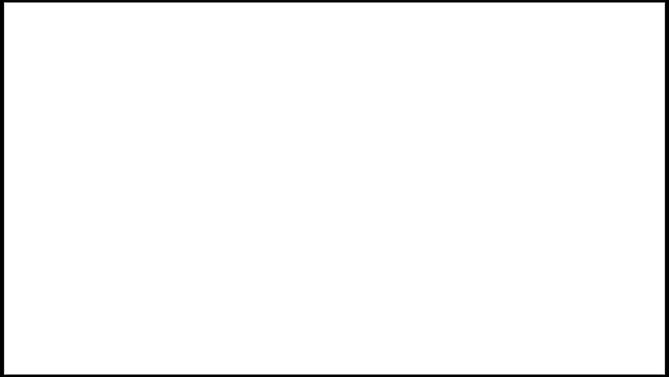

。呃，欢迎各位观众今天来参加我们的直播。我受这个彭博的委托来给大家讲一讲我们的paper raku。啊，对，这个的话标准的发音叫raku，不只是不是不是这个RWKV。嗯。OK好。

那咱们今天的直播就开始吧。

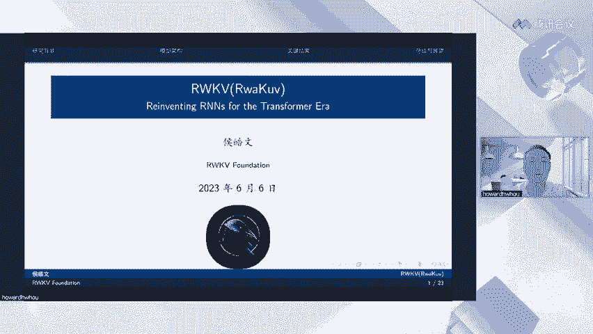

首先先讲一讲核心卖点吧，毕竟大家的时间都很珍贵。嗯。让你先看看我们的核心卖点，让你觉得值不值得把这个整个直播看完。首先主要kuve的核心卖点是OE的推理复杂度是真的很香。首先。

单投ken的推理时间是恒定的，总的推理时间随序列长度线性增加，而传统的transformer呢是随序列长度二次增加啊，甚至有可能三次增加。在特别长的序列情况下。内存占用恒定，不随序列长度增加。

第三点呢是推理时间。和内存占用。呃，都是随随尺模型的尺寸线性增长。大家可以看这两个图啊，就是为了表表达这个推理时间。和内存占用其实。都是随模型尺度线性增长的。

可以看到其他的transformerQ就飞起来了，这个是它的啊内存的使用。这个呢是它的推理时间，也是Q就飞起来的啊。我们可以观察到数量级别的优势。在这个方面的话，所以说这也就意味着。大模型的硬件限制。

和部署成本。所有如果使用抓Q模型的话，可以大幅的降低。我们已经在CPU和非NV的加速卡上部署raku模型。这个的话就不再受美国卡脖子的限制了。你买不到英伟达的显卡也没有关系，用你的CPU就可以跑大模型。

然后呢，是服务器上的大模型部署成本可以大幅下降。普通的台式机和笔记本的算例。内存就已经足够部署一个本地的大模型。手机端将来也成为可能啊，手机端现在的主主要问题是内存还太小。如果手机芯片厂商进一步跟进。

例如说加入一些PF16的尺寸的啊这种这种数据格式。那么未来也有可能手机端可以部署啊，但我我是比较乐观的，我觉得可能。一年甚至两年啊，就可以部署这个在手机端部署大模型了。所以说不夸张的说。

我们觉得raku将推动大模型进行一次。架构迁移，从现有的transformer架构迁移向reku这一类的线性transformer，或者叫做线性attention的模型。OK那你看香不香啊。

如果觉得足够香，那就跟着我继续往后。看我的直播吧。OK那么就回到这个一开始先介绍一下。RNN和transformer各自的局限性。首先这个RNN吧它训练长试液的时候容容易出现梯度消失的问题。

所以前十0年20年都提出过一系列的工作，如GRU如LSTM。就是来解决这个长序列梯度消失的问题，但解决其实也不是很好。LSTM差不多在100个token或者说100个字之后，它的。梯度就停止下降了。

说明他已经开始遗忘过去的信息了。另外一个问题呢。是安安在训练过程中无法进行并行化。他也是必须每一步一步的进行训练，限制了其可扩展性。这就是为什么之前的RI模型都没有办法训练的很大。就因为它没有办法并行。

就使得他有就算力用不上吧，可以这么说，所以之前都没有得到过很大的RN模型。然后transformer的问题呢是传统的transformer或者说标准的transformer。

它的tension是具有二次复杂度的。在长序列任务中呢，计算成本高，占用的内存多。我们可以看一下。右边这张图表啊，transformer在时间上它的复杂度是T方。空间上的复杂度也是提方。啊。

T方站主导的T的话就是序列长度。Araku。时间上是。OT的复杂度，而空间上是OD的复杂度。D的话在这里是一个常数，就只是它隐层的向量大呃隐层的这个维度，也可以简单说，它就是OE的复杂度。啊，所以说。

本文呢主要是提出了raco架构，它结合了RN和transformer的优点。同时缓解了他们已知的限制。好，我们提出一种线性的线性注意力机制。最后呢我们展示了raco在。

大模型长距离依赖关系任务中的性能效率和它的可扩展性。OK来讲一讲RNN它最简单的形式是什么样的呢？那最简单的形式其实就是XT是它的输入。HT呢是它的影像量。然后呢，每一步我们会有一个遗忘门。

决定这一步我们把多少信息放多少输入信息和多少上一步的影像量信息放到这一步的影像量信息当中。啊，可以看左边这个图啊，右边这个图就是这样的一个意思。所以说RN它是一步一步执行的。嗯。

每次只能处理一个字或者一个词。如果你分词的话。它的内存占用很小，它计算量也很小。因为它每次值处理一部的数据。但是呢因为他对前一项是有很强的依赖的，这里指的话就是HTI。啊。

H确是这个HT减一是它的所谓的前部，是它很依赖的。所以说使得它没有办法并行化训练，这极大的限制了RN的可扩展性。相比较transformer呢它一次性是可以处理一整句话或者处理一整段话的。

所以说是可以并行训练的。OK那我们下面再讲一讲transtransformer的attention啊，和我们从transformer attention中受到的启发。

然后提出了我们新的attention机制。哦，这里的话是传统的tstion，然后对它进行了一点改写，改它改写成向量版。你可以这么理解，就是对于某一个T当前啊这T就是当前的token或者字或者词。

我们使用它的呃cory。和他的key和和不是和他的和他所有的key和这个序列里面所有的Tkey计算一个分数。然后这个分数呢再对。它的直向量进行加权求和。那么我们就可以得到。这个T它的一个向量了啊。啊。

下面这个呢是一个规划项，也是把所有的它的。现啊所有它的这个叫做啊注意力的分数给它加到一起。大家要需要理解的话，可以看一下左边这张啊，右边这张这个图。然后AFT呢是指。

pottention free transformer是21年苹果的一篇论文。他在这个里面呢，它把QT乘以KI。改成了WTI加上KI这样的一个格式。这个格式的特点在哪里呢？嗯，这么说吧，我先换支笔。

这个WTI它是一个矩阵。然后呢，是T乘T的矩阵，就是说它是序列和序列之间的矩阵，它代表的含义呢是一个位置的token对另外一个位置的位置偏置呃，positional bias。它是一个固定矩阵。

就是说它对于所有的词，所有的所有的序列而言，它都是固定的。啊，那这个的话就很不好了，就太静态了，没有没有办法学习到很多的知识。所以呢。作者又使用了1个KI，这个是和每个token强相关的1个KI。

用这一个值来调制它的这个啊positionpositional bias可以给把它调的高一点，或者把可以把它调的低一点。通过这种方式呢形成了一种线性的attension。然后很受这个想法的启发吧。

就是说哎那就可以摆脱了这个Q乘以K的乘法，对吧？那也就摆脱了，不再需要依赖之前整个序列里面所有其他值的这个限制。所以呢raku就提出了一个channel wise的时间衰减向量，就是这个W。呃。

这里先解释一下channel吧，因为这个channel和可能大家在其他配per里面看到channel和CN的channel是不一样的。这里的channel其实就是。就是隐藏隐藏层的维度就是。

D啊它就是一个W，就是一个D位的向量。每一个其中的一个值，我们称之为一个channel。啊，你。OK好。那么这个公式的含义是什么呢？就是说比如说我们有128个channel。

然后它前一个向量就是-1W前两个向量就是-2W前三个向量就是-3W，它都是跟自己的位置和它之前的token的位置有这么一个关系。因为它是在一当中的，它又是个负值。所以他其实就是一个时间衰减下来。

你可以简单简单的理解为。距离当前token越远的token，它就会衰减的越多，越近的token，它就会衰减的越少啊，但实际情况下比这个还要复杂一点。

后面我们有个图来可视化这一部分channel的信息衰减。好，这个其实就是reco的一个核心思想。我们下面来完整的介绍一下reco的架构吧。首先，raku里面的RWKV分别是4个字母。的含义组成的啊。

这四个字母呢是R代表一个过去信息接受程度的向量。W就是刚才说的时间衰减向量。K是间值向量，就是之前说的用每一个token自身的一个值来对位置向量进行调制啊这么样一个向量。V呢是每个token的值向量啊。

它也类似于传统注意力机制中的V。然后我们来观察一下一个embedding进入reku之后会经过什么样的一个东西呢？首先它会进入time mixing模块，在time mixing模块里。

它会和它之前的所有的文本信息进行一次融合，所以叫time mixing，它会把过去的历史信息加到自己的身上来。然后呢，经过一个lay norm就进入到channel mixing。

channel mixing设计的目的呢是因为time mixing，它其实并没有考虑到每一个词，它每一个维度之间的这么一个非线性啊，所以在这个模块里面呢。

会对每一个词的它本身的channel进行一个强烈的混合和非线性，增强它的非线性能力。使得模型的学习能力更强。好，那我们来讲一讲这个time mixing到底是什么样的一个含义吧。嗯。先来看公式吧。

这个time mixing里面你会发现就是之前讲的那个W向量，它是有两部分组成，一部分呢是之前的所有的。呃。这种时间衰减的向量乘上它之前的token的。直件向量和它的直向量进行聚合，得到的这么一个东西。

然后加上当前token。的一个。呃，权重对吧？这些权重和它的一个直向量。那U呢是单独设计的一个专门为当前token的而设计的一个。举证吧啊，这样这样的话，可以把和之前的向量区分开来。很更大的一个问题。

根据之前的公式，你会发现，如果T减T到就变成零了，对吧？那你不可能用零乘自己的这个限值加自己的键值嘛，那不就没有学到东西了嘛？所以说必须换一个向啊换一个向量来表示它。😊，下面你层依然是个规化函数。

我们可以用这个。右边的图来解释一下它具体是什么样的一个过程。呃，首先对于第一个偷token进来的时候呢，你会发现它会和EW这个向量里面的这一列产生作用相乘，得到一个新的Ebedding。

当我们往前走一步。你会发现它是这当前第二个向量和它前面的向量呢，会和它的时间衰减的这个矩阵啊做一个就是点对点的乘法吧。然后以后以后以后又是形成一个新的项链啊，第三步和第四步都是一样的。啊，同时你会发现。

因为时间衰减向量，你可以看到当前token它的这个向量的强度一般是最大的啊，然后呢它会逐步的减小，颜色逐步的变浅。也就说明这个时间过去的信息在当前这个token这里看的话啊。

它的信息的重要性在逐步的降低。通过这样一个方式呢，我们就实现了一种新的线性复杂度，就是这个。WKV啊就表示一种新的线性复杂度。这个新的线性复杂度，我觉得重要的意义在于。

它其实上用一种接近EMA就是exsponential moving average，就是指数平滑啊移动平均的方式，把过去的信息都加到当前的token里面来。啊，这其实是一种序列建模的方式。

我们觉得这个方式其实非常好。另外一个点很重要的话，我想提一下，就是你会发现哎这一部分。😊，和这一部分。都是过去可以提前算好的。把之前的信息算好了，传进来放到一个state里面。

就可以直接和新的两项相加一下，就可以算出新的WKV啦啊。这个的话其实就是raku可以RN模式运行的基础。后面我们会更详细的讲一讲一下这个东西。好，当。一个token经过了time mixing之后呢。

他又会来。进入到channel mixing的模块啊。像我说的channel mixing，它主要是为了给这个token它的channel之间加逞强的非线性。所以呢这里使用了。

这个叫square loop，就是说啊这么是一个很强的非线性函数，一个sigoid的函数，也是个非常的强的非线性函数啊。😊，就可以对这个每个token它的 channel进行一个mixing。好。

那后这一篇页PPT的还有一大目的呢是要讲一下这里。WT和啊不是WTXT和XT减1，这个就是论文里面提到的token shift操作，就是token的平移。我们会把每一个当前输入和上一步的输入一起加到。

一起加到它mixing module和这个channel mixing module里面来啊，像这样的话，其实也会很多种理解的角度啦。一个角度就是说强行做了一个by ground。

这个是一种NLP的角度，认为说我强行的把所有的字组成一个词啊，组成一个只有两个字的词啊，这是强行的bground这是一种理解方式。还有一种理解方式呢，其实可以把这个理解为一种CNN的过程。嗯。

在这个CNN里面呢，它相当于是一个窗口为2。一个参数为UR，一个参数为一减UR的。卷积神经网络。啊，从这个角度来看呢，你会发现。随着整个信息在向上传导，整个模型叠加的模块越来越多。整个模型在这个地方。

它的感受也是越来越大的。我可以简单画一个图，你们可以感受一下啊。首先对于第一个token而言，他能看到token就只有他自己。对于第二个token而言啊。

他其实他可以看到的东西是他自己同时他可以通过这条通道这个token shift通道看到他前一个token，对吧？那么他其实现在的感受也就是2。对于第三个头盔，这里可能不太准确啊。

他可以通过自己的channel看到自己。通过这个 channel呢看到上一个token。再通过这个channel能看到上上一个tken，这个时候它的感受也就是3。如果这个模型可以堆叠100层。

那么我们可以说这个模型在最高一层的时候，至少它会有100的感受。就是说它可以直接看到100个位置以前的token啊，这个在我们看来，这是很强大的一个序列建模能力，通过这种token shift的方式。

使得模型具得具有了非常巨大的感受。那某种角度说，如果你能把它对到1000对吧？那它其实就相当于可直接建模1024，或者直接建模1000长度的上下文了。

所以说这个token shift在我们看来也是这个模型设计中一个很很很很不错的点吧啊。好。下面来说一下。模型因为这样的设计，它就可以高度并行化啊，因为你可以发现这样所有的这些值它都是可以提前算好的啊。

都是可以通过矩证计算的。它脱离了对上一个状态的依赖。然后呢，WKV使用一个串新的扫描，就可以把它计算出来。这就使得它可以像其他的transformer一样的并行训练。

一次把整一句话放进去就可以计算它的lo。像样这样的话，就使得它的可扩展性和transformer是一样的。好，下面来讲一讲它是怎么像RN1样解码的。我之前留了一个线索吧，对吧？

我说这个项呢其实可以等于它之前的项加上它现在的项相加。你每次只要把它之前的这一项和这一项当做一个state传进来，对吧？那它就可以马上计算这个状态下的WKV了，所以简化之后呢，使得整个模型。

就变成这个样子，1个IN的形式。我只需要把当前的token和它的state一起传进去，会返回一个新的state。要下一步再依据这个新的state再去计算。

每次我只依赖上一个状态state和当前的token，我就可以快速的对模型进行解码，这就使得模型摆脱了它之前的上下文啊，使得它每次只依赖前一步的state，极大的提高了它的计算效率，降低了它的内存消耗。

好，让我们来看一些关键的结果吧。嗯，首先reco通过三种机制。循环时间衰减和token shift来捕捉序列传播中的信息。循环我觉得这个呃这个我觉得这个有点不好讲啊，这些是常识。

就是它每一步其实都依靠前一步输入进去这样的一个循环计算过程，本身就是一个序列建模的方式。时间衰减之前说了，是通过这种channel之间的时间衰减的这个量来捕捉之前过去的信息。

然后tokenship刚才也说了，是相当于一种CN的窗口。当模型堆的足够高，它的感受也就非常大。那我们可以看一下，这个是之前LTM的一个呃pro token loss，就是说在。

就是说计算这个los在100位置的时候，就会发现它已经饱和了，基本上就没法下降了，说明STM把它100个token之前的信息都给忘掉。他没有这个长序列捕捉的能力，但rakuve可以做到多少呢？

至少现在可以证明他可以做得到。4096的长度啊，在4096的实线上，我们发现它的los还在下降，它并没有体现出任何平台性，说明它的长程序列捕捉能力是非常强的，至少在4096的上下文下。

它依旧可以捕捉到之前的信息。好，然后来看两个可视化的结果。嗯，这个是之前留说过的，就是他对于每个channel。之间的信息是怎么传递的啊，它表现出来是什么样子。我们可以看一下，就是这个其实很有趣啊。

第一层第一层第一层的话，你可以看到它在后面这些channel的时候啊，这个总共是有74七84维啊，所以说它的这里划到是接近800。你可以看到它后面一些channel，它基本就衰减为0了。

意思就是说是这些channel我根本就不关注之前的信息，我只关注当前信息，我不去捕捉之前的信息，我只关注好当前的token是什么样子的。但是随着模型层数的上升，你会发现高层的channon第12层。

它已经有很长的一个平台了。这说明什么？这说明在第12层的时候，它是一个全局的视角，它会从全局来看这个信息，它会保留之前的信息非常长的时间啊，它的都不衰减。它的这个它的这个time bK都接近一。

然后最后这这就是使得它具有了一个很好的长啊，这种长城信息捕捉的能力。OK另外的话我们来看一下。使用因果追踪方法来展示这个信息的传递路径。

这里呢输入了是the ever tower is located in Paris。我们预测paris过程中，这个模型的信息是如何传递的呢？首先你会发现。当模型进入到第四个位置，第四个token。

这是这时候af这个词已经完结束了。模型就会通过一条路径把它传递到。20层21层这样的位置。然后在这个地方储存着这个重要信息。当模型继续往前的时候，这个信息呢也在不断的被向向前传递向前传递向前传递。

而且你可以发现它有两条路径在向前传递。当最后我们要预测它的时候，它就被传递到最后一个位置，告诉我们说。因为埃尔铁塔在paris，他们两个有高度的相关性嘛，他就可以正确的预测出paris。

这个可视化也是很有趣的。他展示了说R客模型到底是如何处理，在它其中的信息的。其实。他在看到efer的时候，他就已经猜到了，可能后面这个信息很重要，要把它用到哦，然后就把它放到了比较高层的一个位置。

储备着啊，如果你之后真的是要问他和everer相关的信息，那他马上就会把这个储备信息拿出来。然后把它用于预测，帮助你得到正确的答案。好。下一页是一些evaluation，这这一页也非常重要啊。

因为之前声称做transformer线性化的工作非常多啊，但是其实他们都没有办法接近一个真正transformer标准transformer的效果，所以大多数人都没有跟进啊，因为他们的性能损失太多了。

虽然你各种效率上有很大的优势，但你性能损失这么大的话，就没有办法用。但这个评估过程中，你大家可以发现，在多个数据集上。把酷5的效果都是非常好的。甚至超过了一些同参数的OBT呀。

blumom呀这样一些基于transformer架构的大语言模型。好。哎，还但于这里我还想分享一点，就是说其实在我们看整个结果的过程中，我们发现其实raku模型它当它的这个。参数量不是很大的时候。

其实是有一些劣势的啊，例如说。这个时候这个这这个嗯朗姆da这一个测试集，这个测试集非常有意思，它是一个能够证明你模型序列捕捉能力很强的测试集。因为它相当于它每次只要求你测试它最后一个字是不是正确。

一开始的时候，在模型参数较小的时候，其实它和transformer之间还是有一些差距的啊，因为transformer它因为可以保存过去所有的信息。每一次去请求，他都可以把过去所有信息拉出来重算一遍。

就使得他在模型参数小的其实优势很大。把Q模型这个时候略趋于劣势。但是当模型参数上升到7亿，我们看到的是差不多7，不是7亿7B70亿参数的时候，就已经开始接近transformer的效果了。

等到14笔就是140亿参数的时候，集和银和transformer效果不相上下了。啊，说明其实对raku模型而言，scaling它获得的收益更大。他sing获得收益大于transformer。

我们分析的原因是这样的，transformer架构是非常强大，是非常通用啊。但是呢它对于很多任务来，他这么强大的模型效果可能用没有办法完全发挥出来。嗯，而recqui呢它虽然有一些局限性。

但是呢当它的模型参数逐步增大之后，它的模这些局限性就被克服了，使得它在足够大参数情况下，效果可以快速提升，然后就接近transformer的效果。所以说其实runQ真的是一个大语言模型时代的产物啊。

因为对于他而言，如果所有的模型都停留在berrt级别，那么它可能就没有那么有价值。但它真的到大语言模型时代。比如说模型参数70比7B14比甚至更大。在这种情况下，它的优势就体现出来了。好。

然后是核心卖点了，就是推理复杂度，生成长度为T的序列transformer需要T方的这么一个复杂度。所以说真实在真实的测试下，它也是受它整个这个需要的时间就起飞了reco它是一个线性增长的啊。

所以说对于特别长的文本生成。那么reccove在推理效率上就有很大的优势。然后是一些我们在呃。非GPU架构上的结果，例如说在CPU上，raku可以使用int8模式。in特8模式的话。

它的los损失非常小。延迟很低啊，同时模型参数也不大。它就可以快速运行，而且可以编译出各种各样的ESE支持的平台。包括。inux呀、windowsmac arm都可以支持。然后呢，是也有了主要客户。

也展现出大模型在端侧匹配的潜力。简单说就是说。CPU上16G内存就可以运行70亿参数的模型了。然后12B的话可以运行in8的71毛钱。在英特尔BF16的芯片上的话，它的速度可以更快。然后在GPU上。

15GB的显存可以运行70亿参数的模型。9GB的显存可以运行。可以运行int870参数的模型。那这个就是真的是入门款的GPU就很多都可以支持支持大模型的推理了和和啊对。

所以说这也展现出raku在端侧良好的潜力。如果之后模型再进一步做一些小型化。那么同时手机的性能再进一步加强。那么部署到手机上也是完全有可能。好，最后总结一下吧。首先。

这个raku提出了几种关键的改进策略。首先是实现了线性注意力的RNN，使得它的复杂度呢从T方降低到了T。实现了高效的并行训练和高效的创新推理。然后还有一些更好的初始化方法啊，这个没有讲。啊。

但其实在论文里面是有的，就是。大家可以去啊看一下，感兴趣的话，例如说一生叫啊small embedding initiation就是把传统的呃。参数初始化的维持度啊，又下降了2到3个数量级。

这样的话模型收练初期收练会更快啊。这都是反正我觉得论文里面其实宝藏很多了，都是彭博和大家长时间实验得到的一些珍宝吧。希望你能够从里面发现一些有价值的东西。

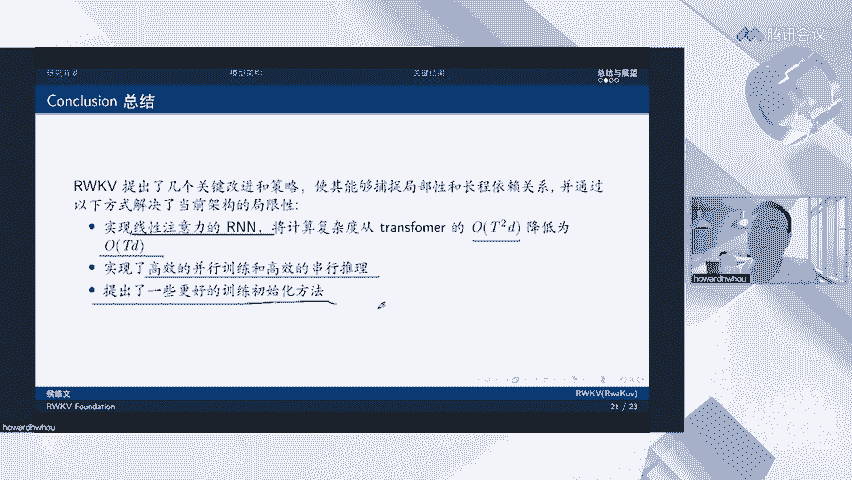

好，然后就是raQ5的局限性啊，这一点我们也毫不避讳它本身的局限性。因为它的这种RN的架构其实限制了他的回望能力，就是说他必须还是说他没有办法重新得到之前已经丢弃掉的那些信息，对吧？

他只能通过一些记忆或者压缩的方式，把之前的信息保留保留在这个模型里面。如果这个模型它真的很需要非常细节的回忆，就要非要需要回忆非常细节的内容，那么可能如果模型在之开始对它的重要性判断错误的话。

那可能就没有完整的保留下来。当它传递到后面的话，可能就忘了啊。从这点上来讲。和完全的自注意力机制相比呢，机制上是存在一定的限制的。啊，但是就像我们说的，因为你要保证完全的自注意机制。

你就必须把之前所有的上下文都带着计算。那这个计算的成本是非常高的那我觉得大家可能需要做一个权衡的。你真的觉在你的业务上，或者在你需要做的事情上有这么重要吗？

还是说用我们reku的方法就可以很好的解决你的业务了。那么你这个时候也许不需要保留所有之前的信息，那也就不需要用传统的transformer架构了。另外一点呢。

其实我们发现racco其实对prom engineering更加敏感了。呃，就像我之前说的，因为回望的机制，使得说那么你一开始可能就是更需要告诉他一些任务相关的重要的东西啊，他通过这些信息。

他才能更好的帮助后面的模型进行预测。所以精心设计pro的更加重要啊。你会发现，如果这个pro设计不好，它的性能可能就不好。但是他如果pro设计的呃好一些，马上他就可以和同等尺度的transformer。

性能基本上就是一模一样的。好，然后最后说一下未来的改进方向吧。啊，一个的话是。并行扫描。这个的话可以使得它的这个计算成本进一步降低到loglog t啊，这个的话我觉得也是很有价值的。

就是说是那你T如果很长1天01万10万，那对于log T而言，那这个就非常快了，对吧？就不只是OT了，到时候就整个就是log t的一个计算度长度的话就非常好。

另外的话用于这种呃encoder decoder架构。现在reco的话，它还只能用于deder架构。然后是对他的一些上下文的可解释性。可预测性和安全性啊，就是之前看到的那个可视化的一些东西。啊。

最后的话是经再引入一些高效微调的方法，使得再用很少的呃机器，或者说就很少的数据就可以高效的精调软客户模式。好的，这就是我今天给大家分享的内容。欢迎大家提问。

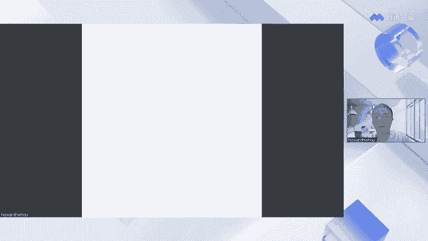

呃，好，我看到我已经看到一些问题了啊嗯。😊，第一个问题是为什么叫做RNN，而不是transformer的改进版。首先叫做RN是因为它确实有1个RN运行的模式。

大多数的transformer是没有这样的运行模式的啊。所以说我们把它叫做重新发明了RN。但它其实上也是transform的改进版啊，大家可以看到呃呃哎我的这个屏幕有问题。它的改进的路径非常明确啊。

这一页上面已经谈到了它的改进路径了，就是说它是从他是从attention free transformer这个上面来改进的。其实上它也是一种线性的注意力机制。他其实是从transformer发展过来的。

啊，所以说你也可以把它称作一种transformer吧。但是我们觉得它更有趣的卖点就在于它的RN运行模式，使得它可以高效的解码，这是其他所有传统的transformer做不到的。嗯。第二个问题。

channel mixing中的m指的是啥？啊，这里对吧？这个的话其实就是一个你可以理解为它就是一个。我之前说了嘛，就相当于一个卷积神经网络中的。的参数。一个参数是缪U，一个参数是一减缪U。那。

在这个地方的话，它其实就是一个对当前这个token和上一个token的一个线性叠加嘛，对吧？这个m的话其实就是一个参数，你可以把它呃就对，就是一个参数。第三个问题，raku对图像。怎么样？

Transformer。对，文本和图像都是so塔，文本模型扩展到多模态模型就很自然。呃，其实这里首先说因为reco是一个decodeder的模型啊，它现在。还没有迁移到一些。还没有迁移到一些图像上去。

所以说。还不能评价它图像上的效果怎么样啊。但是其实根据之前的一些观察，如果把racode改成双向的啊，它也完全是有可能可以做这个。呃，图像的他这个问题就在于。图像它没有那么长的序列啊啊。

你是否需要这样的一个东西呢？对吧？然后而且图像很多时候啊，我觉得解码有可能就是生成式图像。解码过程中也是基于上一步的话，那整个图像解码可能也可以加速。

但其实在我看来sdble diffusion这种方式也也比之前的已经快很多了。所以这个地方到底哪里有优势，其实不太好讲啊，但是我觉得。ku作为一个未来文本册的decodeder是非常有前景。

它还可以和其他trans进行融合嘛，对吧？就是说。把其他的已经有的图像的音频的一些呃特征提取器，例如VIT直接拿进来和它进行结合来使用，也是完全可以的嘛，对吧？

所以说我觉得呃这个还是得结合各种任务和各种模型自身的特点来看。第四个问题，AFT中的EKV是怎么理解的哟？这边的WKV能像交叉注意力一样，处理两个长度不同的。

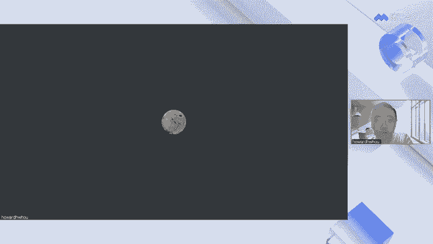

序列吗？OK我来看一下。诶。AFT中的。EKV。嗯。他我觉得他理解的就是这一点吧，这个都像我说的。😡，K的话就是和自身词相关的一个。向量V的话就是它本身的值向量啊，这两个值都和纸开的自身相关。

不和其他token相关的。

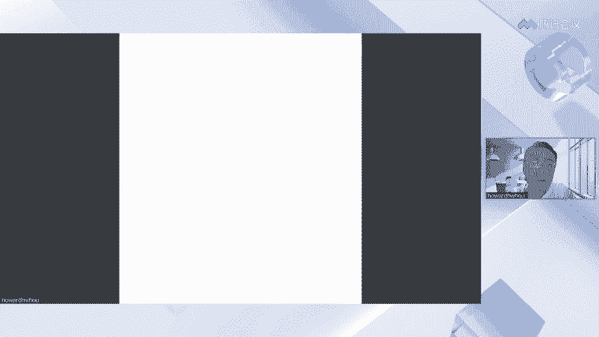

然后WKV能向交叉注意量驱动驱呃处理两个不同长度的序列嘛。其实我觉得这是两个概念来呃。

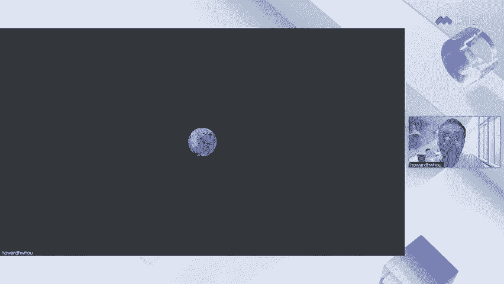

我觉得有可能可以改进，但是现在的看的话，它其实还是只是处处理自己这个长度的序列上的一个信息。它不像pros attention那样的话，其实是两个序列的聚合。其实我觉得还是还是有点不一样。

啊，第五个问题，多轮对话之后，raku可以跟GBT1样回答我第一个问题是什么的能力吗？

嗯。呃，是可以啊，因为多轮对话之后reku因为他把每一次的对话之前的结果都存存到state里面去了，甚至有些办法可以优化这个state。例如说你第一和他第一第一个问题的state。

第二个问题state第三个问state对吧？通过良好的设计这个state那他可以把第一个问题state给你直接传进来呀。那么他自然就记得了这个之前的状态，一种还有种办法就是说那它取平均呀，对吧？

那你之前多轮对话中的信息也完全保留到你现在的这一轮多对话当中了呀。从这个角度来讲，那在多轮对话中reku优势还是蛮大的啊，因为它每次已经把你的那个对话压缩成一个state后续直接来使用。

而不像transformer一样的，要把之前所有的上下文再来重新算一遍。那他只要只要设计者在使用你的这个reco的时候，把你第一次问他问题的state。通过一些聚合的方法，聚合到最后ex个t里面。

传到raku模型里。那reku模型就能记得你对他说的第一个问题啊。而且计算效率还超高啊，对，计算效率没有变还超高。他还把之前的过去的你的问题都给他记住。这多好呀。

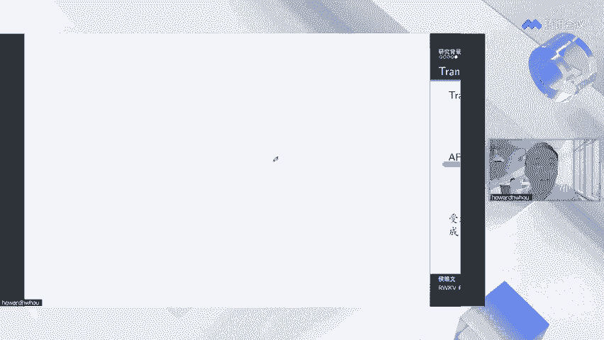

第六个问题，理论上怎么解释这个方法避免得了长序列遗忘的问题。

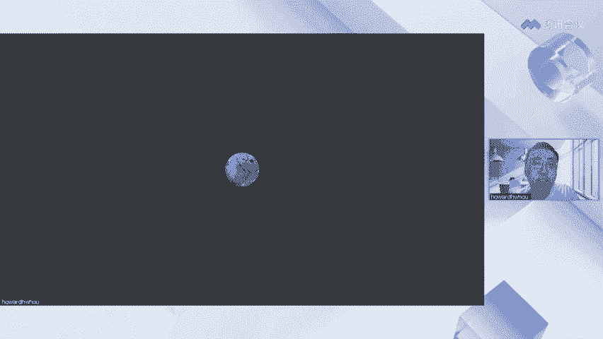

这个我想我之前已经解释过好多好多次了，我想也是一个重要的点吧，就是这种三种机制循环时间衰减和token shift。啊，然后我觉得很重要的就是时间衰减和token shift的这两点都非常重要。

这是之前STM没有的哦。这是STM没有的哟呃第一点LSTM没有哪里呢？没有这个WKV它没有这样一个指数移动平均的过程，把一开始所有的信息都给他加到这里面去了。

对TM说他忘了他就是忘了他没有这种加权过程的，他有没有说保持一个对最初始的这个你的第最初始的词或者一开始的词的这么一个ten在那里。但从这公式里面去可以看他是有atten的哦，客户是有ten的。

他在场他对第一个词都是有ten的，只是说这个ttion可能因为后面不断新加的信息，它的tion会逐渐变小。但是它一一直都是有tention的。如果这个模型一开始认为这个词超级重要，对吧？我说的。

那他可以通过这种chan的方式，直接把它拉到很高的层里面来。那很高里面层的这些参数其实就是存储的这个信息啦啊，这也是一种说它保持长程序列捕捉能力的种的的方式嘛，对吧？这个的话是时间衰减。

另外一个就tokenken就是我说的CNN的那个意思啊，就是说层数越多，那他CNN的感受也越来越大越来越大呀，对吧？那跌10千层就有10千0层的感受也了。那一就100个ken的感受也了。那像这样的话。

它不是也就保证了一种啊这个。呃，长城区的捕捉能力嘛，这两点都是STM没有的，我觉得这这是重要的创新点。

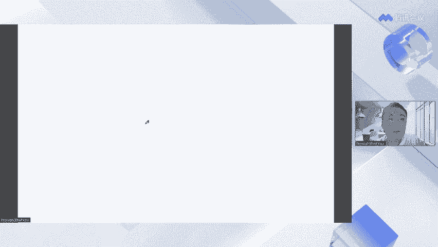

好，然后第七。推理越长，软库效率越高，效果如何呢？哦。这个怎么说呢？至少在这几个测试集的长度下。😊。

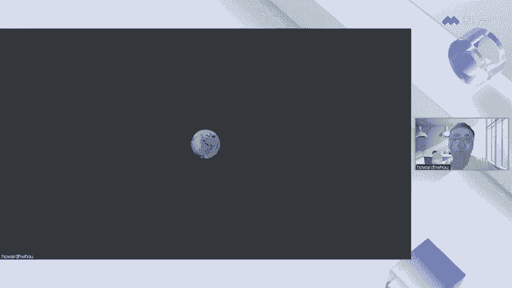

就是这个。这几个标准的这种语言模型测试几下reku在他们这个长度范围内效果和transformer基本上是一样的呀。再大一点的reku下更长的。例如说你专门设计了一个超长的。

比如说十0万字的这么一个对吧，它什么样的，那现在不清楚。那至少来说。在这些测试机上没有表现出比atransformer差的性能。

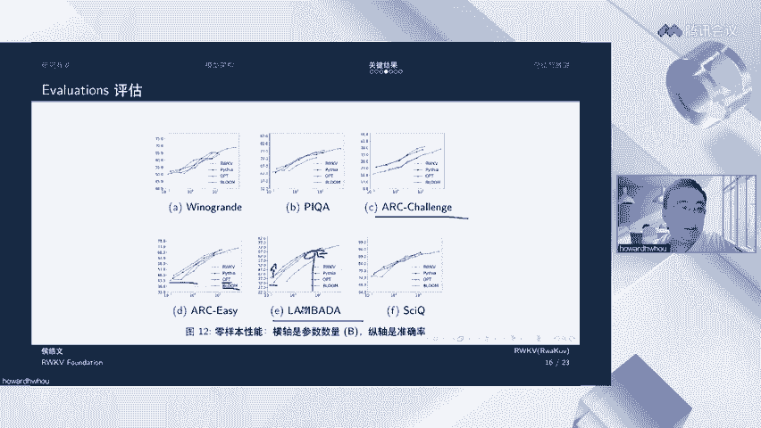

随着技术发展transformer是不是也可以支持CPU和小内存运行？

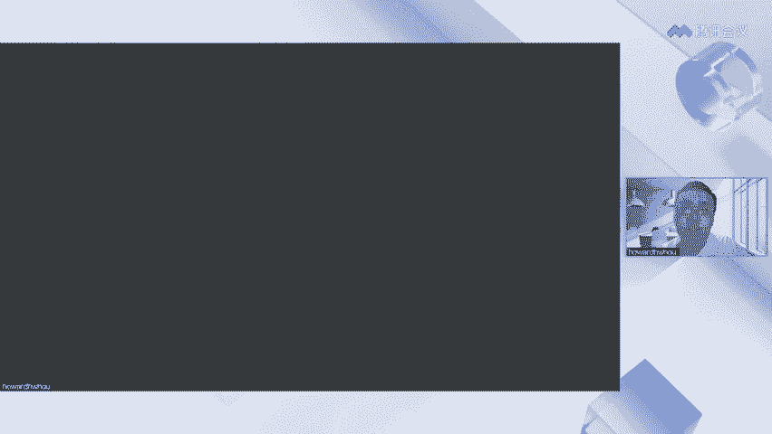

呃，我觉得是可以的，就是说但是说因为Ctrans本身的这种架构上的限制，使得他再想怎么压缩啊，他也没有办法达到racode。你可以理解为racode其实已经是一种极限了啊。

就是把所有之前的信息压缩到压缩到一个状态里面，这其实是一种极限了。我感觉没有办法说你不压缩任何状态就可以再做下去了。那传字母可能有很多种办法可以减少它需要呃需要拉回的上下文。

可以减少他需要的计算的这种呃量，对吧？例如说KVc这样的机制，大家都见到过。但就算如此啊，他在这种计算效能上还是没有办法和raku相比的。能不能放到CPU我觉得最大一个问题在于啊最在于。嗯。

对于大模型而言啊，我们就做一个简单的假设吧。因为大模型你假设有一个。

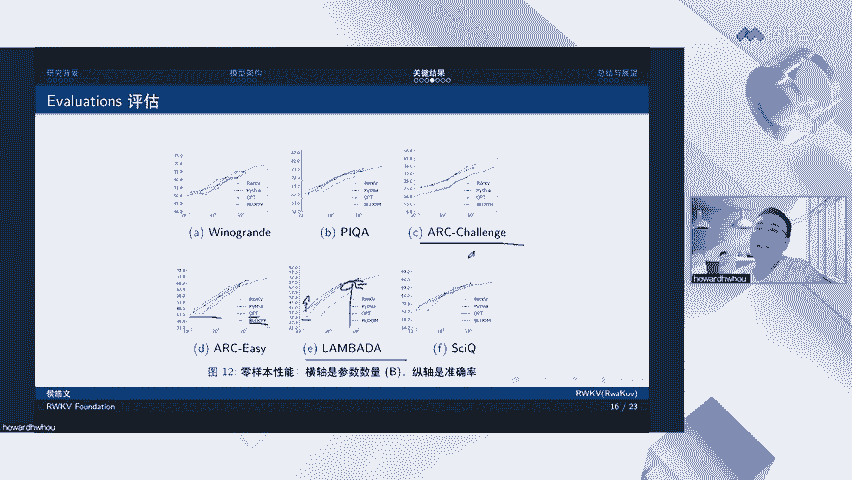

呃，是就按我之前说的那个，免得又不假设了。假设你在1个16GB的内存的CPU上，对吧？运行1个70亿参数的模型。简单来说。其实参数的本身就是其实。啊。7亿了嘛，然后他需要的内存，这就是7GB了。

然后你的序列越长，你中间还有一些中间结果嘛，这些也会产生大量的内存嘛。那他这个序列越长，那要存储这些中间结果的内存就需要的越多呀。对吧所以说。

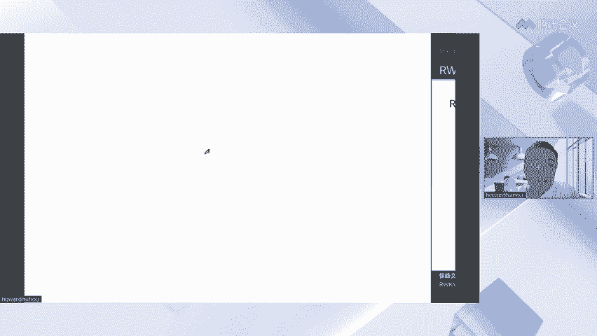

所以说的话他其实上是。呃，需要的内存就会比软客户多，就是说就是按传统的这种标准的trans而言，它需要的内存就会多很多。那CPU上的话，除非你说很很大CPU的服务器来算，那其实上就。啊。

我觉得我觉得这这回答不太好啊，真正好的回答是说，你看每次它就进一个token，对吧？一个token跟整个模型参数算一遍，你就可以得到下一个 token了。

你所有的transformer你都得把之前的几十个上百个上千个token拿进来一起算对吧？那么你如果有100个 token。

那你是不是就得多算10个ken的计算量100个ken你就多算10个token计算量对吧？从这个角度讲，那transformer怎么都算的会比呀，那因为慢那CPU根本没有办法支持它的推理了，对吧？

哎我觉得这个回答更好。😊。

然后。微调7B需要多少显存呀？我这里跟你说了嘛，15G呀。在BF16上调15G就可以了。那这个现在的4080不就是15G了吗？对吧？4090也能调嘞。嗯。请问团队怎么看最新的mega bat这篇论文啊。

这篇论文我记得是印象中其实就是说拿1个CN去把各种bet给它组合到一起。

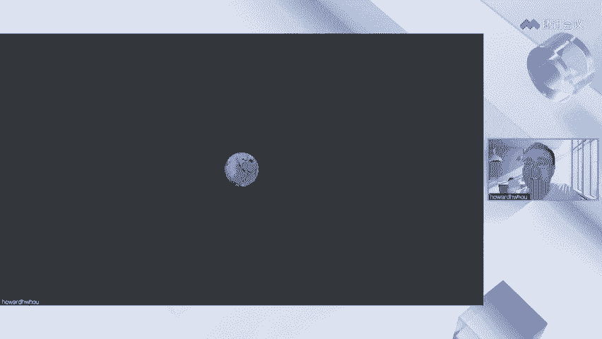

呃，这个想法其实宏博也是有的。彭博一直觉得之前现在的做法是每个be不知道他自己这个词的长度，对吧？因为每个be它只有8个字节，但其实对于中文来说，它可能是呃三个字节对吧？

或者两个字节或者4个字节那这个东西他就不知道后面他到底有什么了嘛。如果他能知道自身的长度的话，那可能学习起来更好啊，我觉得这个也是一种这个也是一种很好的方式。

但我觉得并不矛盾ra甚至可以之后把ga这个ide给他引进来是完全可以。

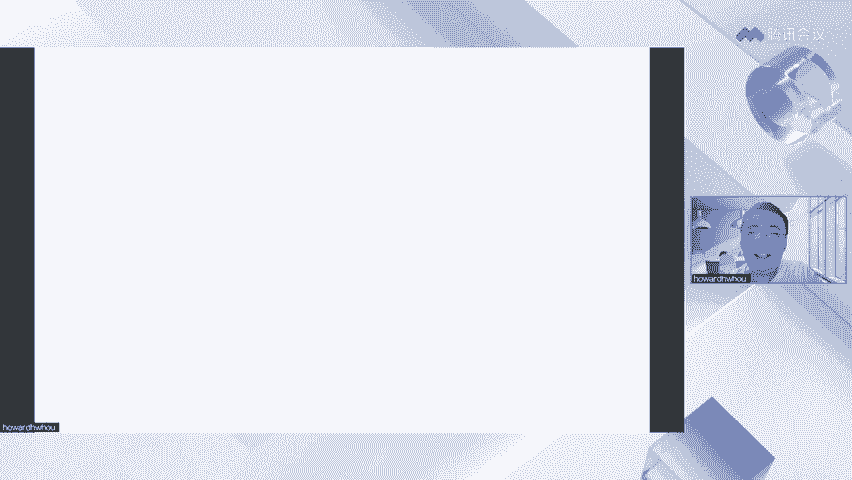

训练环境需要什么样的？像我说的，如果你只是微调的话，那30904090都可以的。请问对于短序列和较小的模型，raQ仍然有效吗？有效啊，序列越短，那它的遗万问题就更更轻了，更没有问题了。

只是说序列短的时候，可能相对于transform的优势就没那么大了，对吧？那么你在一些序列短的情况下，小模型的情况下，你可能用transformer还更容易一些，对吧？哦。十4、请问一下。

如何组织堆轮对话的训练数据？训练raco有官方资料吗？呃，这个官方资料的话，其实在那个charec里面也有。其实我们的微信群里面也有，有很多有这方面经验的人。我觉得你感兴趣的话。

我之后可以把微信群发一下，大家可以加微信群去微信群里面问大家其他人的一些学习资料问和训练资料，包括微调信微调资料等等。15、现在趋势不是不做太复杂的prompt吗？为什么这里还要做很重的prot适配啊。

第十5这个问题我其实之前也讲了，就因为更敏感嘛。因为对模型对pro更敏感，但其实我觉得这个敏感也是指啊你的一些任务可能比较复杂，你的就必须好好去调。但是对于一些标准化的任务，我们可以提供标准化的pro。

你拿去直接用就好了，那就不用调。其实pro也是一个探索的过程，一旦摸索出来一个好的，直接拿去用就行啊，彭博其实发过很多这种他摸索过的很好的prot，你拿去试就行了。这个其实我觉得对于个人而言。

使用起来的也没有太多上手的难度啊，甚至借鉴别人的经验就行了，也不需要自己呃摸索太久。训练用了多少张卡啊，这个东西的话就不方便透露了啊。

17、二次预训练和supervise fine two可以学会领域知识吗？当然可以啊，这个没有问题。可以，没有问题啊。18、中文语经它的效果能接近GPT3。5吗？呃，老版的可能有点有点差距。

因为老板主要是在拍这样一个数数据集上训的那个数据集的话呃中文少一问多，但是我们最近在做一个新的模型，叫做ra word，它就是一个多语言模型，里面加入了海量的中文数据，现在已经完成了40%的训练。

欢迎大家去试一下新的这个ra word，我们感觉它的训它的效果已经接近GP3。5了，还是蛮不错的。然后理论上长度可以扩展到100K，可以呀，理论上完全可以，只是说100K真实情况下会什么样子的。

我们觉得还需要再测试一下看看。但是理论上说，模型其实是可以扩展到100K的，它不像transformer有。固有的这种理论上的限制，是吧客户在理论上是没有限制的啊。

只是说实践中可能会有点限制而transform是理论上就有限制，那实践中更不可能实现。19、模型结构比transformer复杂。作者有没有想过简化结构？其实现在这个结构啊是作者们。很多年摸索出来的。

其实reku的get upub的那个文档上写写过它的V一版本，V2版本V3版本和之前的V4版本V一版本是最简单的。你可以去看看它的最简化结构啊。

但是我们现在觉得我们加的每一个东西其实都是经过实验论证的啊，简化的话效果一般都是会下降的。我觉得。

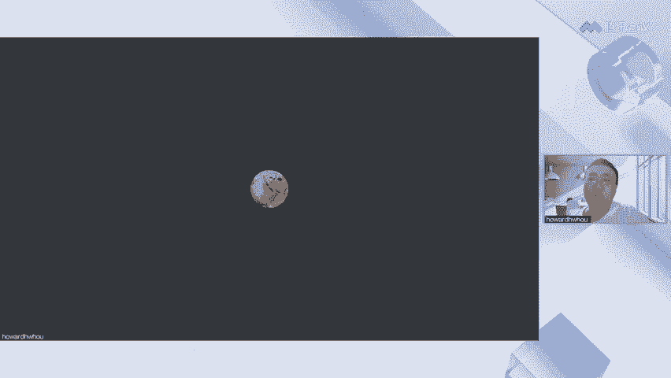

简化不合适啊，因为我觉得几种机制啊，就像我这里这里所说的几种机制。这几种其实其实都是很巧妙的。你去简化它的话，呃，一般都会掉点。所以说不如再往其他方向来想一想，如何改进rapku。

像之前说的那mega batt，我觉得是一个很好的新的视角，会会会可能是会有正向收益的。

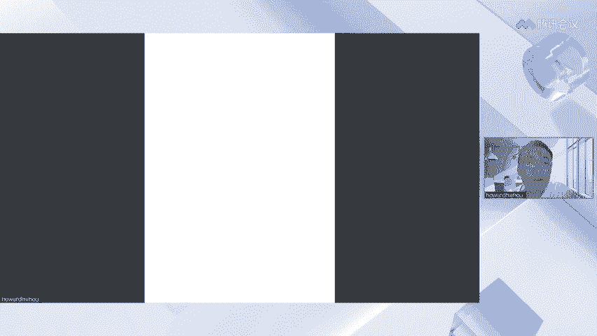

80个问题。roco可用在computer vision上嘛，我之前回答了，就是现在它还只是个deder，但大多但是很多computer vision任务是encoder结构的。

当然也可以用在一些生成上，但生成上的还没有经过实验。如果感兴趣的话，你可以拿去试一试啊，去做这种我图像生成它效果怎么样。理论上来说，因为它这种RN结构也可以使它在图像生成的解码过程中啊变得比较快。

会比传统的那种transformer这种解码要快。21、目前开源的。RWNB有推荐的吗？啊，我觉得你可以先去试一试几个吧，一个是我之前说的最新的word，这个是在多语言上面训练过的啊。像这样的话。

你会发现它中文能力提升很多。另外一个就是raku的riveri是它是raku的呃聊天版本。如果你想用在一些多轮对话里面的话，那raku ribbon是更加推荐的。

然后用lara微调7B的模型显存需要多大？其实我觉得呃像我今天说的，这个你用BF16其实都只用这个十几G的显存。lara它就更小了。lara我自己都试过很小很小，你根本不用担心这些东西。

一般的GPU就是比较平民版的GPU都是可以加载进去的，都是可以都是可以微调的。23、基于现在的实验，是否可以说明GPTG样模型顶层transformer是稀疏的。我不知道你这稀数什么意思啊。

但是其实从attention的角度来讲，transform后面训到收敛基本都是稀数的。它每一层其实只关注几个头肯的。你可以理解为每一层它其实它就它是蛮稀疏的，很多它的attion都是零。他都是你。

这个都不是说用我们实验证明，之前很多已经paper里面证明过的这个事情。WKV可用于。网络可解释性研究吗？可以啊，我觉得就像我之前说给大家看到的这个因果追踪的方法来展示信息传递路径，就是一种很好的这个。

呃，展示模型科解是新的方法嘛。

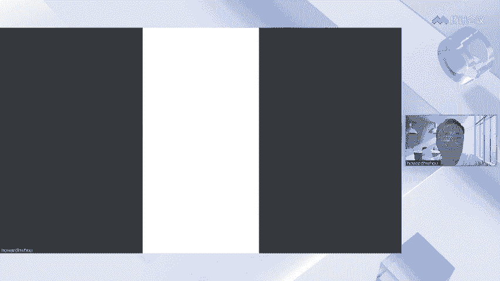

可以讲一下reku的长短记忆吗？其实这个地方已经没有LTM那种长短记忆的概念了啊，因为他已经把一些重要的东西都换掉了。可以简单说一下呀。模型迭代历史嘛？V1到V4。看代码没理清。啊。

其实我觉得那个过程还是比较乱的，因为不断的试过各种各样的东西啊，这个东西也没有办法很好的理顺。但是核心点其实我已经在之前的PPT里面给你讲出来了。

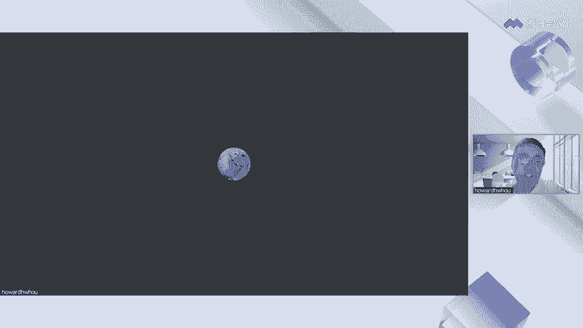

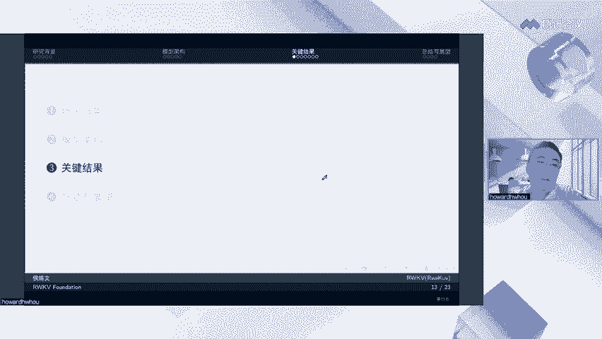

其实就这几点啊，这这三个机制其实我觉得是很核心的点啊，包括。对，所以说主要先去看free attentiontranser那篇paper理解。

理解它这个里面的这个ttion是怎么算的那再理解我们怎么把这个W向量给换掉的啊，那你就可以基本上我觉得reku的东西就理解50%了。如果大家感兴趣的话，我可以后面再写一个代码版本啊。

代码版本可能就更能帮助你理解说怎么这个re的这个呃线性t是怎么计算的啊，那就可能你一看代码马上就懂了啊，我可以后面再出一个呃在B站上在我的B站上出一个视频，大家可以来可以来看吧。

可能可以更好更好的帮助你理解re。27可以使用深腾的atla进行。能训练和推理吗？可以呀，就是我们其实也有也有算同事吧。

正在和华为接触at last的话其实是可是现在正在正在做一些相关的工作来支持raku的学习啊，现在现在的raku是兼容排to，因为是方便训练。那其实也有很多模呃很多是脱离了排touch了啊，包括啊对。

包括一些纯扩大版本的已经是脱离。脱例派陶式，但是那些版本只能用于推理，还没有办法用于训练。呃，28lara加ra库训在有工作了吗？好像有了，我之前看到过，你们可以搜一下，我觉得应应该是已经有人做过了。

写那个未来工作的时候，其实已经是应该是也是上个月的事情了。所以说现在已经有人做掉了这个事情。14B的大模型大概什么时候发已经有了呀，就是你去hing face上看，已经发布了。

就是那个word版本就是14B的。呃，ra有说明文档吗？可以去哪里看。其实现在所有的文档就是github上的那个项目。其实我觉得后面如果有需要的话，还可以整理一个更加清简洁清洁的。文档吧。

要运行在我觉得这是两个问题吧。理论上当然可以啊，CPU可以运行CPU地方就可以运行reku的CPU版本。如果你的K8S上还挂了GPU，那就可以运行GPU版的嘛。😊。

如何评价white box transformer这个工作我不太了解，我就不评价了。嗯，好，那我回答完了。😊，呃，如果没有问题的话，那今天的直播就到这吧，谢谢大家，谢谢大家来参加这次直播。

希望你们希望这次直播能给大家带来一些收获吧，谢谢。😊。

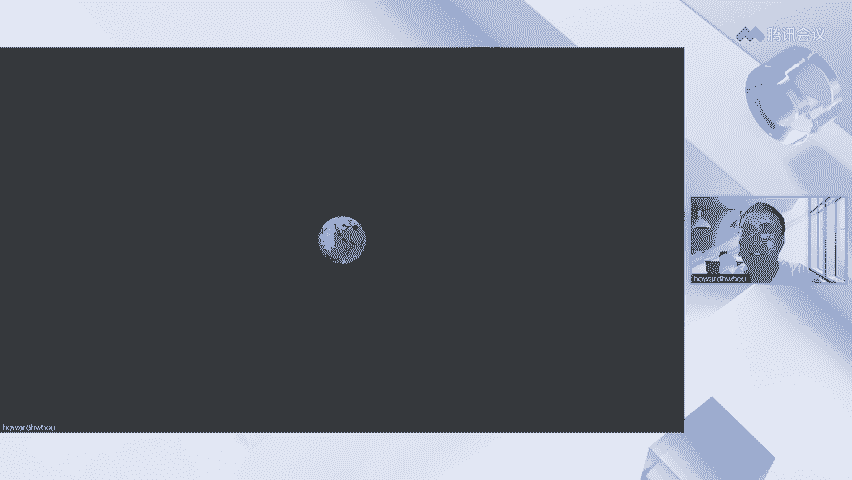

喜欢记得点赞，投币收藏一键三连哦。😊。

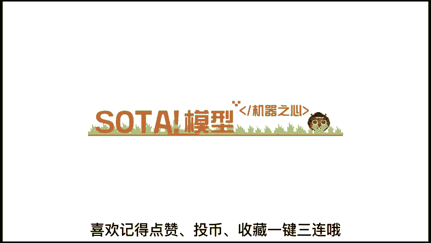

上机器之星soer模型资源站查找最新soer算法实现代码预训列模型，定期还有社区福利放送哦。😊。