# RWKV-6论文解读 - P1 - 霍华德vlog - BV1tz421z7bT

嗯，欢迎大家今天来参加咱们的raku6的论文解读。ra酷6这篇论文其实已经投出去很久很久了啊，这其实我印象中一两个月前就已经挂到 archiveive上了。

当时的话我们投的是这个新的一个会议叫做conferenceon a language model。投完之后，我们就把它整理成archive版本发出来了。那解读呢是今天才终于有时间来解读一下。呃。

欢迎大家来参加咱们的解读会。好，先介绍一下背景吧，因为不太确定来的这些呃朋友们是什么样的背景，可能对这个ra酷transformer的了解并不多。所以我先从一些更基础的方面来讲嗯。

其实raQ和transformer可以代表两类模型了，一类是RNN。ra酷是一种新型的RNN。然后另外一种的话就大家都听过的，transformer或者叫变形金刚啊。其实两类模型在之前都有各自的局限性。

RNN例如大家耳熟能详的LSTMGRU1类的模型，在训练长序列的时候，很容易出现梯度消失的问题。而且那时候的RN都是没有办法为并行化的，所以他们的训练效率非常低，他们的可拓展性也受到了很大的限制。

后来发展出了transformer。然后transformer呢一大优点是它可以运行训练。但是呢他的问题是它具有二次的复杂度，在长序列任务上计算成本和内存占用都非常多。啊，内存占用其实也是一大问题。

就是说如果你内存占用持续增加呢，在在推理过程中很容易就就out of memory了。就呃怎么说呢？就内内存就爆掉了，就没办法继续执行下去。而这方面软酷是很好的ra库是一个恒定的线性的呃。

不是线性的恒定的一个内存占用，使得它在运行过程中的可靠性要高得多好，呃。咱们再来看看右边这张图吧。我拿我我把这换成一个笔，看看大家能不能看得到嗯。一。荧光笔。圆珠笔。好，哎。

大家能看到我现在这个笔画了吧。呃，我们现在我们来看一下循环的传统的RNN传统的RN呢，它是每一步执行的时候都会先要呃处理上一步，每一步的结果要等待上一步的结果出来之后才能继续计算下去。啊。

这使得阿安没有办法并行化。相比呢，transformer可以一整句话一整句话的处理，所以说它就可以并行化IN的传统结构，可以用下面这张图来表示。啊，就是从可以从上往下来看。

当一个字一个词经过linea层之后呢，它必须在当层内的RNN不断的往前走，最后走到结尾，那么跑运行出来。嗯，好，那就回到了raQ6。ra酷6其实有几个核心贡献了。我这里只是简单的写了一下。

首先ra酷6这篇paper里其实是同时展示了raku5和ra酷6两个架构啊，因为我们架构迭代太快了。所以说一篇paper里面把我们两个之前的工作都放在里面了。

表酷五的核心贡献呢是把 matrix value state引入。嗯，这个的话后面我们会详细介绍raQ6呢是把这种我们称作dynamicna recurrence。

或者更直白一点叫做datadatadepend recurrence引入到模型里，使得raku模型的表达能力得到了巨大的提升。

同时呢我们展示了raku5和raku6在各种多模态任务上的性能效率和扩展能力。简单的从这个图可以看一下现有的一些架构和软扣的一些特点了。最早的是传统的LTM啊，像我说到的，它有。

OE的time和memory influence，但是它没有办法并行化。transformer可以并行化，但是它的。复杂度非常高啊，他训练过程中，包括推理过程中的复杂度非常高。

那其他的这几个linear transformer呢。嗯，首先最原始的那篇trans linear transformer，它的复杂度确实是和raku是一样的，但是它的效果比raku差很多啊。

这个可以从各种呃测试集的指标上来看出来。然后S3和S4两篇呢其实是基于一种叫做long long convolution的方法啊，长卷级的方法来做的。所以它的训练的时间复杂度是N log N。

它远没有线性的ON的raku和member和rednet更优。好，那咱们进一步。啊。呃，先来介绍一下软库的总体架构吧。raku是由四个字母组成的，叫做RWKV。其实这四个字母是用了很多心思来取的。

并不是随便取的。RWKV和QKV相对。贯穿了整个RWKV系列啊，贯穿了整个古Q系列。无论从456这几代来看，这个基本的思想其实从来都没有变过。怎么说呢？首先我们想象有一个信息，我们把它称作值value。

同时呢我们给这一个值value一个地址或者用。一个键来标记它，我们叫做key。QKV呢就是transformer使用的。一种存储或者叫记忆方式。啊，后面我们也会在这个方面再。啊，进一步谈一些。

那么transformer检索一个记忆的方式，是指是先使用corry和key进行匹配，找到最匹配的key，把那个它中的value取出来。是这样的一个思想，而racode的RWKV是另外一种思想。

他这个思想在在于说。我有兼职。我有剑，我有值。但是呢我并不使用一个corrry去对它整体进行计算，找到最相关的key，把它的value取出来。

而是说我把我整体的所有的这些key value先做一个dey啊dey也是ra库的核心思想之一。同时呢作一个对这个信息接受程度的衡量，就是receptance。dK是必须的，因为一个整个模型里它。

记忆的容量是不限的，你不diK一点点出来，你不把一些旧的记忆知识删掉，新的记忆和知识进不来。所以这就是wait是W的含义。那有了这个还有了这个知识之后，有了这个信息之后，我要不要接受他呢？这个也很重要。

也许它是一个垃圾信息，也许它这个时候它就是一个空格，或者它就是一些乱码。这种情况下，那我的模型完全不应该接收这样的信息呀。那我就需要用一个receptance来控制模型对这样信息的接收。

当然反过来说也会有很多高价值的信息，需要模型好好的记住它，那么也是通过一个比较大的receptance来使得这样的信息赋予足够高的权重进入到整个模型里面来。好，这个这种基本思想我就先介绍到这里。

我们看一下右边的视爪扣的一个。每一个block的一个。基本结构吧，每个raku block有两个部分组成。第一个部分是channel mixing。啊，我们叫做通道混合。

另外一个部分呢是time mixing，我们叫做时间混合。channel mixing呢和transformer和其他的一些大模型架构差异不大，都是主要是1个MLP层。

核心raku的核心贡献和核心的价值都在于这个time missing。好，我们可以看一下啊，这个。有两有一条虚线在这里，这条虚线呢是ra库5和raQ六的一个核心差异了啊。

ra库5和raQ6的参数是一样的。但是它们的核心差异在于他们的计算过程不同。酷六专门引入了这样一条虚线，使得。每次在计算WKV这个算子的时候，是依赖于当前收入的啊，这是非常重要的一个。呃。

设计和核心的理念吧。好，那我们下面再进一步细细的讲一下呃，这个架构里的各个部分。

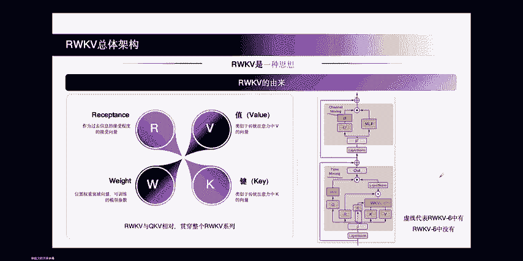

6首先是所有raku进来的数据都会做一次token shift。token shift呢是将当前的token和前一个token做混合。啊，然后raQ5和raQ6采用了两种混合方式。

ra科5的方式呢就是简单的线性差值。这个线性差值呢可以公式里面看出来是由一个参数缪来决定的。这个参数me决定当前token和前一个token各占多少比例混合到模型的输入里面来。也许当前token很重要。

那么谬就是一，也许当前token不重要，那谬当前的谬孔就是0点。反过来，前一个token就是0。9或者0啊，就是就是0或者0。9。但这个做法。的一个问题在于说。

其实上我们的这个差值的参数应该是由我们输入来决定。那么它的效果是更好的，而不是仅仅是一个可训练的参数啊，这样可训练参数其实是一个静态。所以在ra库6里面呢。

我们提出了datadependent linear interpretation就是有数据依赖的线性差值。有数据依赖的线性差值，我们可以同时样看到m这个位置被替换成了一个laura。而lara里呢。

其实就是一个标准的lara了啊。然后这个缪呢变成缪嘛X。软酷六借鉴了rara技术。为每个参数引入了两个全新的矩阵，就是A和B。通过计算，Y撇等于Y加上。

tangent HXAB来动态的生成token shift的量和衰减率。啊，这个在计算成本有限的情况下，呃，就增加了很少的计算成本，但是很好的提高了模型的容量。还有一点啊，这是我我的我的感觉啊。

就是采用这个lara的设计，其实。可以更好的复用raku5训练的结果啊，因为我们的ra库6是在raku5上构建的。酷其实已经训练好了很好的这个。呃。差值的参数。

其实在这个差值的参数上进行一定的lura式的这种调整或者平移。就可以得到很好的效果，并不一定需要从头来训一个全新的。呃，这样的一个参数。所以这个地方用lara，我认为这个也是其中的一个点啊。

就是可以更好的复用之前的参数。

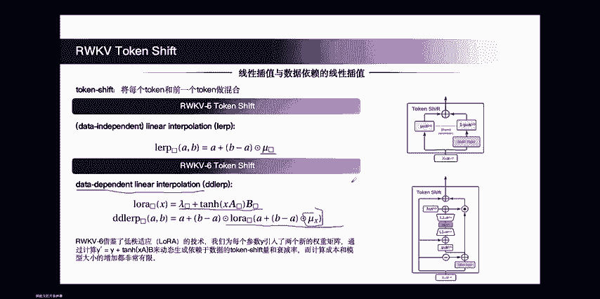

好，然后我们下一步来谈一谈ra酷一系列模型，time mixing核心公式的演进啊，我觉得这个也是整个ra酷系列最有价值的最干货的地方之一了吧。我们先来看一看ra库四是怎么做的。ra库四的mWKV都是。

都是一个向量，这个向量的维度是D大D，它的headets是一，就是说它是个单头的。好，那么第一步的时候，T这里是它的时间步啊，第一步的时候，我们会对。K0V0进行一个计算，算出它的KV来。

同时呢给他一个buus，这个地方的me就是个buus。我们认为就就是给当前token的一个重要性的增加吧，对吧？同时呢会把它现在的buus乘以K0进行一个规划。第二步。会加上。K0和V0之前的。

同时呢当前这一步的也会加上一个buus。等到第三步就会开始对K0和V0进行dK了。这个时候就像我之前说的，是为了把模型中的记忆空间给它留出来，把K0和V0的一些重要性，一些信息给它dK掉。

但同样的会进行一个规划。好，第四步我就不说了。一样的举动。只不过说呃相应的K0会再乘一个m，就是说它是一个exential decayK，它是一个指数衰减，就是说越远的信息我会dey的越多啊。

会多次呈W这个矩阵来dK它。哦。好，那我们现在来讲ra酷5。首先，ra酷的一个核心设计就在于。无论是缪缪虽然这里是向量，但是我们会对角化W也是向量会对角化KV。本身就是矩阵。

所以他们都拥有一个维度是64乘64啊，这个地方其实是它的headt size。就是指。ra酷5它会把模型的维度区分成很多的heads side。每个head size是64。

那这个地方如果我们的维度是512，headide size是64，那么就有8个头8头64维啊。但是每个头其实是变形算的。所以我们单独看一个头就可以了。第一步。第一步也是加一个m一个buus，然后。

把K0。转制和V0成到一起啊，这个的话其实就是所谓的value matrix value state。可以叫张量值或者叫举证值。通过这种方式。我们可以发现。模型原本的。容量或者说叫state的大小。

是D。到爪科5力呢就成了64乘64，其实它是要比一般的地要大，64乘64这个44096了嘛，对吧？其实通过这种方式使得模型的状态增大，通过增大状态。来提升模型的效果。第二步。

beyond加一个buness，要当前的保留。第三步加上dK，第四步DK加两次。好，所以说我这边总结下来，ra库的一个核心区别在于消除了归一画像，没有了分母，没有了ra库斯里的分母。

瓦库我引入了矩证值状态。使得它的维度呢从D变化成了到了D除以HH就是head size。这样的一个举阵，从一个向量。State。进化成了一个矩阵state。这是ra酷5的最核心贡献。通过这种方式。

巧妙的扩大了整个state的规模，使得模型有更好的记忆能力和者模型容量。好，我们再来看ra酷6，ra酷六又做了什么呢？你可以看到ra酷六的公式，其实和ra库5是一样的。它在递归方面。

它的核心贡献就在于DDLPDDLP这个地方在差值的时候，使得我们差值的。这个token shift是依赖于是依赖于我们当前的输入的。啊，是这里对，是这里。

然后我们的wa decayK因此也是依赖于我们的输入的。啊，之前的这个可以这么理解，这个W。都是一个静态的可训练的值。但到了ra酷6，每一步是一个全新的。依赖于当前输入的。

所以我们在下标上做了专门的区分，一个是软，一个是W1，一个是W2。而第二步呢是W1乘W2。这就使得ra库六是一个完全动态的递归形式。

所以我这里说raq6的核心贡献是引入了channel wide的衰减率WT。好，我们进一步来看一看吧。软后的安安视角。我们把raku写作这样的一个递归形式，就是。每1个新的WKT。状态等于。

前一步的状态加上当前的goness。和KV之间的一个。新的KV。然后对状态进行更新的话是。做一步dey加上当前的显言部的状态，再把当前的KV加上去。呃，在这里可能会更清晰一点啊。

就是它整个的RNN的se里面的一个过程。爪库和爪酷六的区别就在于这个虚线啊，爪酷六中有虚线，吧酷中没有虚线。然后另外一个曲性区别就在m这里。啊，ra酷5是。

data independentra酷6是data dependent。好，我们再来看一下代码吧。我觉得代码可能对大家更容易。更容易理解了。首先。我们在代码里呢加上了B可点H两个维度。

B的话是be size。H的话是number of head头诉啊。然后每个的话，这个是它对应的has size。对。B除H是ha size。然后W呢是这样的一个。呃，对于raku5来说。

它是因为它是这个和输入无关的嘛，所以它没有逼这个维度。ra库6是和输入有关的，它有B这个维度。mU这个buus呢，现在它还是和输入无关的一个状态。好，那么当我们的新的KV进来的时候。系。会对KV做一个。

举真程啊，你可以这么理解，然后先获得新的KV值。这个地方是个Y啊，对对，这个地方我要说的更明确点，这个地方是个Y，为什么使用Y？因为。呃，这可定扯的更多一点吧。从很多角度来说，呃。

raku的这个记忆通过外籍的方式来update他们之间的干扰是更少的。这个是从很久以前的像hoop field的一系列工作以及assoocasial associate associateciative memory network一系列的工作都有证明。

更往之前追溯的话，那个common filter啊，也也有相应的思想在里面，它就是用外籍来更新它的这个的话，是是干扰最少的，效果最好的。好，然后呢我们这先算出输出这个输出的话，其实就上面公式一样的啊。

WKV的state加上buus和KV的一个。即再乘上一个receptance来判断它的接受程度。同时呢要跟清当前这一步的WKV state了。呃。

WKV state也是说用这个 decayK乘上它前一步的state，再加上它当前的KV就好了。啊。这个的话可以给大家看一下它WKV state的一个形状是什么样的。

所以说WQV的形状呢是bech size乘上它的headd的数量，乘上它的head sizehead size是两个维度，它是一个矩阵形式的head size。

所以说呃我们叫做它mtrix value的 state。

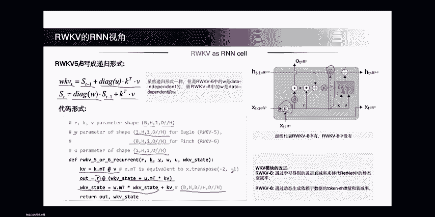

好，下一步我们再来做一下计算成本的分析。ra酷5和raQ6的一个计算成本的分析，首先参数了，参数就举证乘法，加time mixing加ele norm加词表，它就变成这样的一个形式。

计算量infer的时候的计算量简单的认为是两位的参数量，加上6倍的WKV。训练时候的参数量简单的认为是3倍的forward，就3倍的inference的。Flos。酷6，他因为引入了一些新的。

他 mixix的参数，所以说它在这个地方的参数会比raku更大一些，其他部分都是一样的。下面这个表可以给大家一些直观的感受。

raku5 Raku6他们的state sizeparmeter和他们inferd flows和train floats大概是要什么样的一个数量级，大概是么什么样的一个规模。

我还想很讲很我还想讲一讲的地方是在这里就是。state大小ra酷5raQ6还raQ4以及transformer是什么样的一个情况。raQ5和raQ6都是66倍的DL这样一个状态大小。啊。

第一的话是模型的维度，L是层数。所以说所指模型维度的增加和层数增加，它的t大小也会增加，但它前面的长数是固定的。ra库斯的话，因为使用的是向量的一个state状态来存储信息。它只有5倍的DL。

我们再来看一看transformer是多少，transformer是2倍的DLT其是序列长度。就是说transform是它本身它内部状态大小是其是它的KVc了。

是和它输入的序列和它infer时候序列是相关的。我其实我们可以稍微估计一下C等于多少时候就等于rap库5和rapQ6的内部状态大小，也就是33。所以说其实上ra库6和raQ5的C大小。

仅仅相当于一个上下文长度有33。各KVc的transformer相比来说比transformer这个地方要小的多啊。因为你33个KVc的transformer很多时候都做不了什么任务。但是对于软酷来说。

他66个就已经够用了。从这个角度上来说，transformer它的状态的存储效率是很低的。酷用33个，它相应KVc的存储容量就已经在很多任务上效果都超过它了。但换句话说。

nake可是说transformer它是无损的对吧？raQ的话，它是一个不断的有损，或者说是不断的压缩过程中获得它全新的state。但这个必然你降无损的一个压缩，必然带来问题就是它的内存膨胀嘛。

你推理过程中，你的输入的越来越长，没有办法了。那你这个C的容量越来越大，那你最后就是降之说的那内存就爆掉了嘛。

我这里主要是想比较一下racode state和transformer大概是什么样的一个状态啊，其实只相当于33个KB开始。好，再和其他架构的这个。time missing对比一下。

其实这也大家最关心的了。因为在这个赛道上绝对不只是ra库这一个玩家嘛，其实和ra酷比瓦酷晚一点，或者说同期的一个工作，就是大家都知道的S4abber谷提出的S4模型。啊，SSM模型。状态空间模型。

他当时他的dey的 mechanism只是使用了一个静态的dey，所以它的阿尔法这个地方是一个不带任何T的。参数。可训练的这么一个st decay呃st decay它是一个静态的。

man巴呢是S4的进化版。满把可以认为就是dynamic的S4。它的核心贡献就在于把它的尔法从一个静态的转化为一个动态的，转化为依赖当前输入T这样的一个d机制了。retite是另外一个非常漂亮的工作。

但recknet它使用的是headwise的t decay。这个伽马这个地方上面带了一个波浪线，说明这个参数是不可训练的啊。这个参数是不可训练的，你去看过代码就知道了，它这个参数是人工设计的。

比如说10。8570。60。5、0。45、0。25、0。125是这样的一系列的人工设计出来的衰减参数。他用这样的人人工设计的静态的衰减参数来设计的模型。

这也是我们认为reckogni nice表现不够好的一个核心原因。然后member2呢，它其实又走回了lining attention的路线，它的表达形式也和recite非常像，但是他把。

伽马这个地方有。静态的headwise dynamic decay。变成了动态的。head wide dynamic decay啊。

它这个伽马这个地方是依赖于它的输入的这就是member二的一个核心改进跟贡献所在。然后就到ra库系列了，虽然ra库是我们对外宣称ra库5，但其实ra库内部有好多个小版本的迭代。

其中第一个小版本就是ra库5。1ra库5。1呢用了一个table的伽玛来定traable的head wide的 decayK的参数啊，这个是相比re light的一个进步，从它的纯静态的。

改变为一个trainable的。伽马，但是我我们认为下降还是不够好啊，因为你。只是把它改成trainable的，它还是没有数据依赖，它没有依赖输入。所以到了raku5。2又把它去改改变成了啊啊。

我说错了，这个逻辑有点错啊，我们认为headwise不如channel wise。所以我们把5。2改进到了channel wise的traable decay。等到ra库6。

我们又把channel wise的trainable decay改进成了chan wise dynamic decay啊。

ra酷6的chan wise dynamic decay是现阶段表达能力最高的设计啊，也是我们所有看到的模型里，我们认为是最优的一种设计。

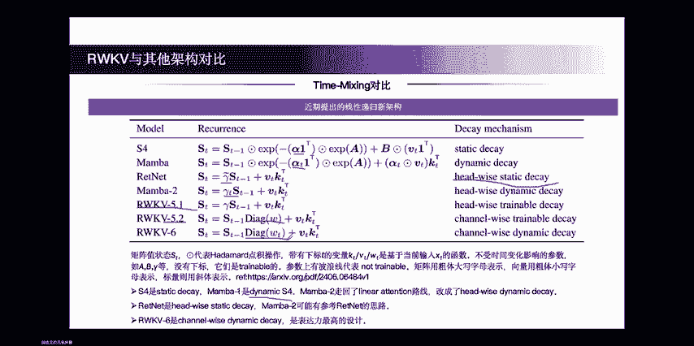

好。再想发散一点啊，这里其实是我自己的一些想法。raku和transformer的核心差异到底在哪里？难道仅仅是一个叫做tention，一个叫做linear tension吗？或者说。仅仅是。

一个是二次的，一次是一个是线性的嘛，我觉得觉得不是本质了。本质的问题在于它是两种记忆模式之间的PKtransformer的记忆模式，我们叫做寻址记忆。addressing memory。

什么叫dressing memory的其统transformer记忆呃，它计算过程中就能看出来，它每一次是先通过query搜索词去寻找它的地址。找到对应的地址了，再把它对应的value拿出来。

是这样的一个过程，它就特别类似于计算机里工作的方式，就是寻址的过程。我们把它称作addressing memory。那它的优点是说呢，我进来的所有memory我都可以在后面不断的拼接，不断的拼接。

会变得无限大，对吧？我只要给他每一个。新来的valueue或者新来的信息都给他一个key，那我就可以无限的检索它，对吧？只要我的硬件系统能扛得住。

我可以给他100万、200万、1000万甚至一个亿的上下文都可以，我只要把它把它存下来就可以。ra库呢是联想记忆。什么叫做联想自？这个东西其实上。可能对于这个领域不熟悉的人的话，我稍微简单的介绍一下吧。

联养记忆认为是这样的，我有一个记忆进来。有个信息进来，例如说是V0。我给他一个KK0，我把它乘到一起，加到我们state里面来。例如这个零这个图像零，它就是一个信息。然后呢，我们每一步给它新加一个信息。

到KTVT的时候，比如说这个酒是当前这一步新加的信息。那我们所有的信息就都存在ST这个状态里面了。那我们这个信息怎么从ST这个状态里面？回忆出来呢其实用的这样一种机制。

我们对ST可以乘上1个K0T的转制。这个时候呢，因为K0T和K0反制之间的内积必然为0，所以V0的信息就可以检索回来。而其他部分的信息呢，我们都要保证它是正交的，证交这他们之间的内积就是零。

就所有其他项都消掉了。这是一个简单的实验呢，我们存进去9，我们可以用一个残缺的9，就可以把我们存储在内部的9的信息给它还原回来，或者给它检索回来。ra扣。其实他真正用的方式就是这样的联想机。

而并不是一个巡视记。那更深刻的问题就在于AGI背后真正的记忆之是什么呢？到底是寻址记忆还是联想记忆呢？不好说。但是对于人而言，肯定是联想记忆。因为人的记忆能力是有限的，是一个固定的大小。

没有谁有无限的记忆能力，可以记住无限的信息。这个是在人脑里面绝对做不到的。第二，人。的记忆其实是除了除了青青春期和青年时期是在增长之外，到了成年以及老年期，它都是在衰减的啊。

所以你更不能说你的记忆能力是在增长的了。对于人而言，记忆是越来越差的。如果得了一些病，像什么呃阿尔阿尔茨海默症什么的对吧？那记忆忘的更快，记忆速度晃的更快。

所以基本上学术界都认为联想记忆是大脑中真正的工作方式，因为他的这些特性是完全匹配的啊，更深一次更深一步的说的话，那个就和神经元结构的突出什么有关系，那就不在这个咱们这个呃直播里讲的。好。

这就是我自己的一些想法了，和大家分享一下。

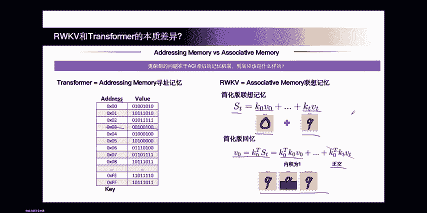

有。好，我们继续介绍raku六论文的一其他的一些东西。比如说我们专门设计了一个全新的分词器，我们叫它word分词器。因为我们的目标是希望它能够兼容全世界更多的一些少数语言。

BPE的核心问题在于它都是在大多数的英文语料上训的。因为BPE是依靠高频把它们连在一起。那么在英文语调训出来中的BPE词表大多数都是英文的对英文的代表性确实很强，但是对其他的一些语言代表性却又很差了。

或者说就表现不佳，同时也会带来推理成本。所以我们手动筛选了多个分词器的词汇表把，它们融合在一起。词汇板大小为65536，然后给他每一个段设定了相应的这么一个呃含义吧，就是说。

然后rakuword的分词器呢是一个贪性的分词器，每次选择当前能匹配到最长的token来匹配。采用call tree前缀溯来优化它的编码速度，这个是ra库社区实现的一个rat的分词器。

可以看到它的性能是非常惊人的。优于优于openII的 token，也优于其他一些现在大家使用的tokenr的性能。所以从这个角度讲，raku的这个分词器，绝对不会被性能方面的问题卡住的。好。

那再介绍一下阮库。6论文中我们使用的数据集吧啊，我们使用了这么多种数据的来源，总共是1。12T的tokens的多语言数据集，70%为英语，55%为多语言，15%为代码，没有进行任何的上采样和下采样。

保持了数据的原样进行学习。

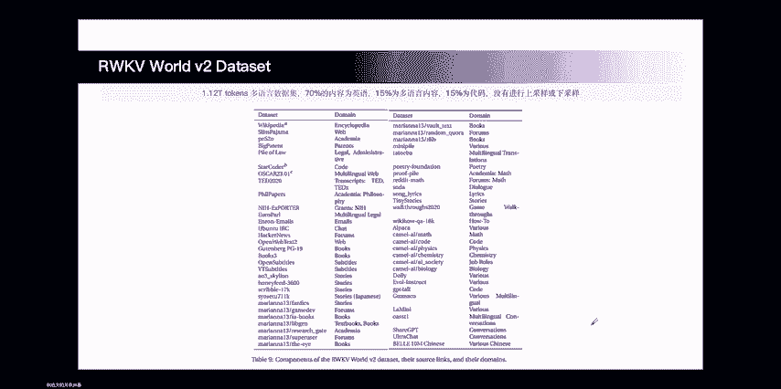

好，然后是一些语言模型的基准测试。首先是多语言任务上。rap酷6表现出了很好的效果。啊，基本上。在多语言上的平均分都是最高的，也超过了其他同规模的模型。然后英语上面呢，因为。诶。之前说到的。

我们兼顾了其他一些语言，所以说它的表现呢也是名列前茅。虽然在有一些场景下，可能是minial7B呀，或者member1。4B稍微好，效果好一些，但是同样是能力名列前茅。

这就是准确率和lope之间的一个对比了，左上角是最佳位置。可以看到越往左上角越好。啊，在多语言上，我们可以发现最好的其实就基本上是ra酷的两个模型。

然后英语中的话表现最好的是在左上角应该是这个BDLM3B。

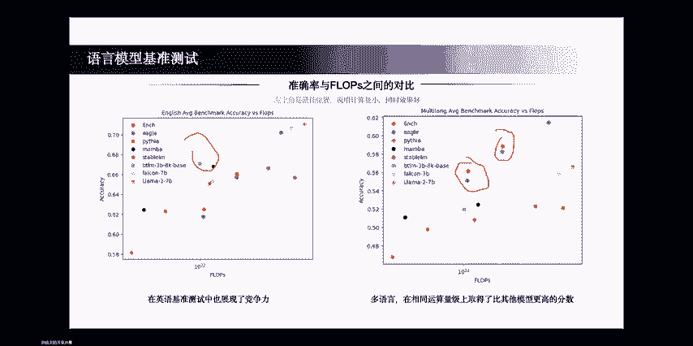

好，再来谈一谈关联记忆的测评。这个关联记忆话其实是和之前的我说的联想机忆是很接近的一个东西。其实它是用来设计的一个合成任务来衡量。新型架构随着炫涡序列延长，他能否回忆出他从其中的信息？他其中有两个任务。

一个是叫做associative recall。比如说我给他一系列信息，我以key value的方式排列。P在前value在后。那么我当我问他。A这个key的value是多少的时候。

看他能不能准确预测出三啊，如果能预测出三，那么说明他答对了，他成功的recod这个信息了。mti query associate recall能是指我一次不只问他一个corry了，我增大它的难度。

我可以问他A是什么，A的value是什么？C的value是什么？D的value是什么，看他能不能同一个长序的这种一次性的把所有的信息给它回忆回来。

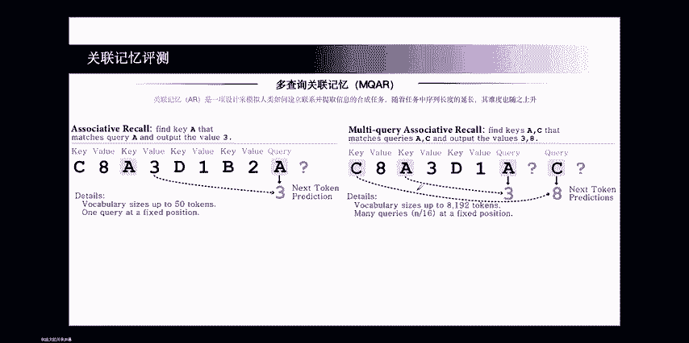

在这个任务上的ra库展现了极高的准确率。首先我们来看。64的sequence长度的时候，其实对大家这个模型来说都没什么难度了。等到128的时候，就有些模型呃，就ra酷4就表现的不是那么好了。

但是呢软酷五和软酷六依然都还在上面。还还是百分之百的准确率。等到256的时候呢。呃，又有其他的一些模型掉队了，其实还主要是pinina和软酷4。等到512的时候，你会发现只有ra扣6。

依然在64的维度上依能保持非常高的准确率。而其他的模型呢，在这个维度下，他们准确率都已经下降了。超越了3000的所有已知的其他非transformer的价格。

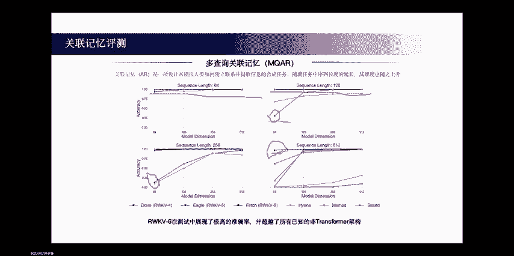

好，然后是这个上行上下文的一个实验。在PG19上，我们对软库456进行了它序列和损失的一个。测试训练长度都是4096，但是我们会发现，对于ra酷而言，ra酷5和ra酷6而言，它超过4096。

当它达到1万左右的。情况时，他依然能够保持很低的los。啊，软库4的话，这个时候它的los就已经升上去。如果熟悉transformer会发现的话，transformer如果没有特殊的设计。

到4096就已经飞上去了，到4096就已经飞上去了啊，它的软transformer的外推能力一直都是一个问题吧。但现在后面有一系列的改进了。但是对于软酷而言，天生的能力，天生的长向下文的能力就是很好的。

完全不需要特殊其他的改进和设计。

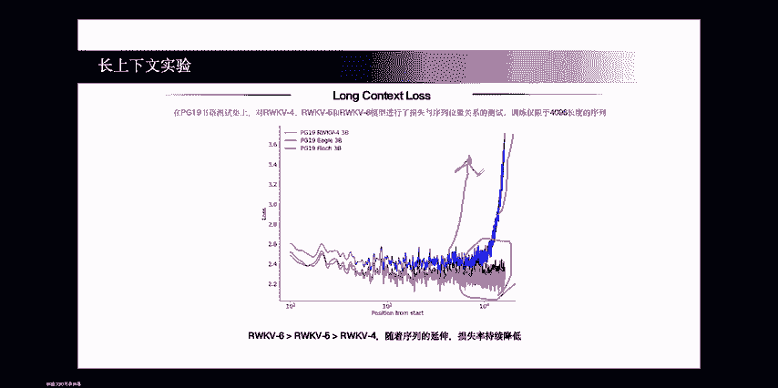

好，然后是速度内存性能的评估。哦。对。这里我们测试的批量大小都是8，维度都是4096。flash attention和rle6的head side都是64。我们可以看到。其实。

从memory的 usage来讲啊，ra酷6一直都是最低的。而且随着序列增长，它这个低的程度会越来越明显。而flash attention虽然它已经是非常优秀的一个工作了，但在超长的序列上时。

它memory usage。还是会快速提高。另外一个是inference time。inference time的话呃。

flash attention其实基本保持了attention的一个2次2次性的关系了。然后raco的话是一个线性关系。依旧是一个线性关系。随着序列增强，它依旧是线性的增加它的推理时间。

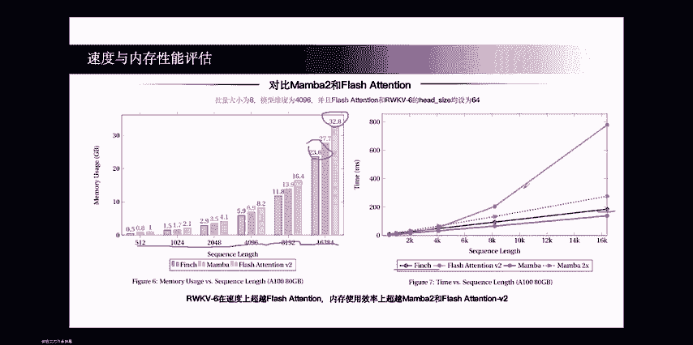

然后是多模态的一些结果，以及其他任务上的一些结果了。这是raQ5在音乐数据集上的一个效果。相比软库斯，他约谱部分的损失降低了2%左右。在泛化和建模能力方面都有增强。

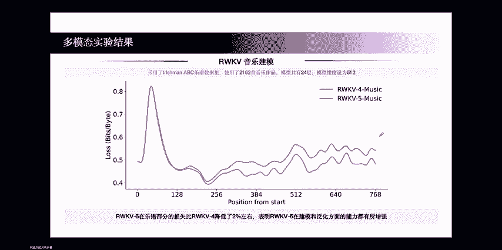

然后是软核5的视觉模型。呃，用clip做视觉编码器，软后做LM。老控我这里我专门强调一下它的。他的他用的是data independentdepend recurrence。

然后同时它的图片呢是放在最前面的，同时它只使用了单向扫描。所以它的效果一般般啦，就是说和其他一些模型比还不错。但是和索塔比的话还是会有一点差距。所以我在这个地方我们就升级到了ra酷6。

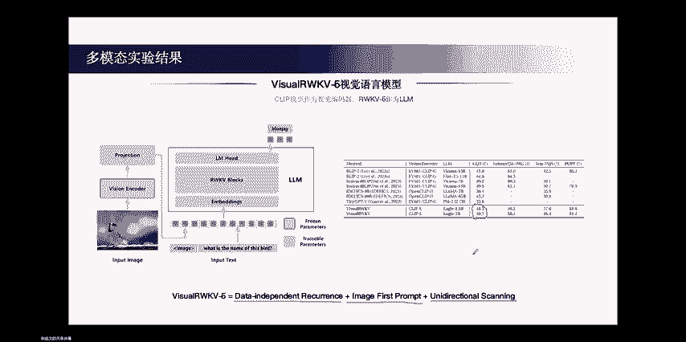

然后六对。VUra库进行了大量的改进来，使得它的效果真正的得到了快速的提升，同时可以和当前的transformer的最优的lava呃掰一掰手腕了。这个地方的话，在4个数据集上都超越了lava。

特别是在中文数据集上比lava好很多，这也得于ra库是多语言模型的这个特性。那在其他的一些学术数据集上，如今QQMMB。呃，都同样优于。同样优于呃lava啊，当然这里是挑了几个比lava好的啊。

还有些测数数据上不比lava强。啊，但是至少在有些方面能比拉拉强，就就已经能够说明很多问题了。同时，ra酷Vra酷同样表现又保持了它它的很好的内存呃很好的推理时间，它线性的推理时。

时间像这个等到2万多的长上下文长度的时候，已经比lava要快4倍了。很好的GPU memory的 consumption。同样是这个GB的模型，等到2万多的时候，可以节省54%的内存效率啊。

这个东西就是说我明我们依旧保持住了re软酷的这个在效率方面的优势。然后效果方面呢在快速追追赶上transformer。好，那我们再进行进一步讲一讲这个VU点Q6到底做了哪些东西吧。

首先是 sandwichwich fruit。我们发现对于raku这的模型而言啊，就是说。你仅仅把图片放在前面是不太好，不太够的。因为我们需要说让模型先知道我大概要提取哪些信息，然后再来提取做任务。

会的效果会好很多啊。这个地方我没有放玻璃实验来，可以到论文里面去看玻璃实验。玻璃实验的提升也是很明显的，用了s的时候， sandwichmch意思就是说把图片像三明治一样的夹在中间，两边是两片面包。

这面包就是它的文本啊，像这样的话可以提升它的。哎，怎么跳出来了？像这样的话，就是呃使可可以提升模型的效果。另外第二点呢是这个双向的。扫描。因为对于文本而言，它是单向扫描，但对于图片而言。

你单向的信息其实是不充足的。例如说单向信息，它总是从左向右扫。那么右边的信息其实知道左边右边的头ken是知道左边的信息的。但左边的头肯是不知道右边的信息的。那么例如说我就问这个鸟。

这个这个地方都是没有这个东西。例如说在路上或者什么，你就问这个左边的车的右边是什么东西。那么这个时候模型往往会遇到一些问题，就是说因为我左边的车我都没有看到右边的东西呀，那我怎么知道右边是什么呢？

所以说要使用一个双向扫描或者多向扫描或者其他的一些扫描的方式，这个地方我觉得有很多可以改变的空间了，来帮助模型提取它四面八方的信息。然后再交给单向的ra库去进行生成。像这样的话可以提升它的效果。好。

所以说这个地方就加了双向和三位之后呢，其实有了很大提升。特别是SQA上提升了接近10个点啊，然后另外一个很大提升其实就是ra库6的datadepend recurrence。

这个地方提升也是非常巨大的VQA提升了将近15个点啊。呃，其实从raQ5和raQ6paper里面来看，效果是没有那么惊艳能爆炸的。但是当它迁移到多模态上来看，你会发现raQ6的提升简直就是毁天灭地级的。

就是说我我做AI这么久，都从来没有看到过一个改进，可以提十多个点，这么爆炸的这么一个东西。所以说我觉得raQ6这个工作其实确确实是非常漂亮，真的是解决了一些核心问题。好，这里又吹过了。

我们继续呃继续往后走。呃，还做了racode在audio上的一个实验。raq audioio就像我说的，它引入了四项位移技术，但它因为它不和racode的LM强耦合。

所以它这个地方其实是相对容易做一些的。他能够更好的捕捉二维拼铺中的临近关系。Okay。

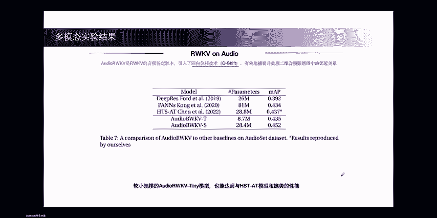

还有一个呢是rale clip，这也是最近出来的一个效果，呃出来一个paper。没有想到的是raku再把transformer替换掉，然后来做对比学习，也表现出了非常好的效果。同时使用raku的话。

就是et同时使用raku效果特别好啊，可以看到这里比同比你错配的使用效果更好。然后在他的这个VU可视化的过程中会发现。raku clip它和它的test image之间产生了某种奇妙的联系。

他们之间被奇妙的对齐了。这个事情其实现在还不知道什么机制，但确实是很有趣的一个现象。呃，感兴趣的朋友们可以去深入的研究一下。而在transformer和非对称的这种结构中。

其实他们之间的分离度是很大的啊，这个东西其实就我不觉得是一个很很神奇的事情呢。好，然后还有人把软库用到了点云数据上，也取得了很不错的效果。

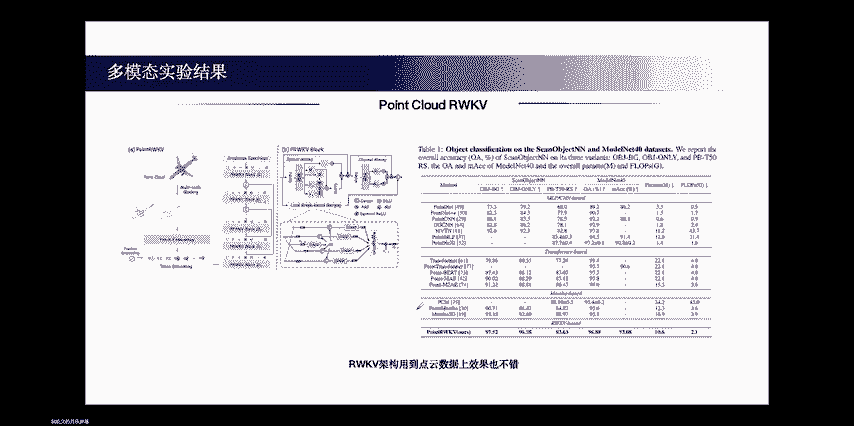