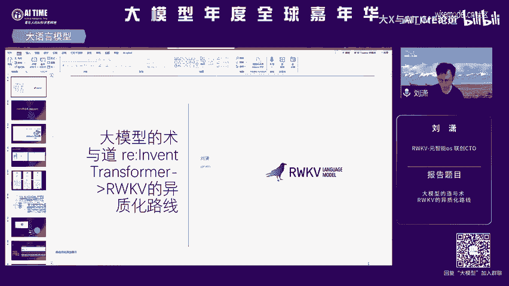
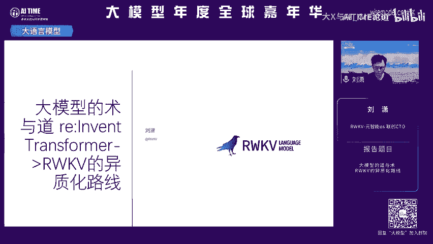
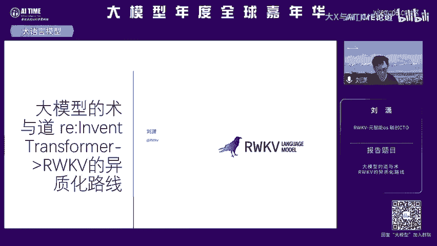
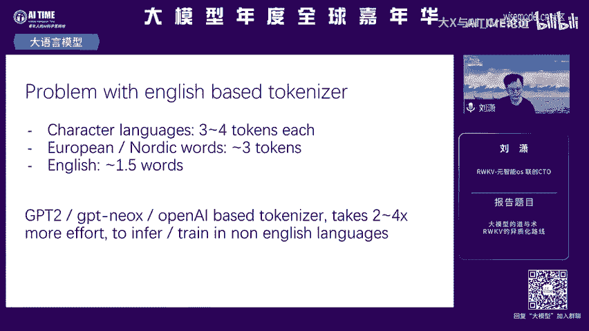
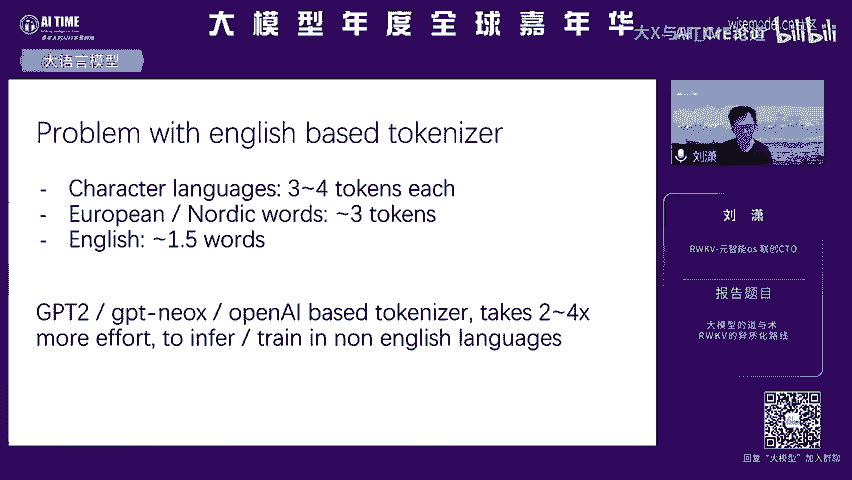
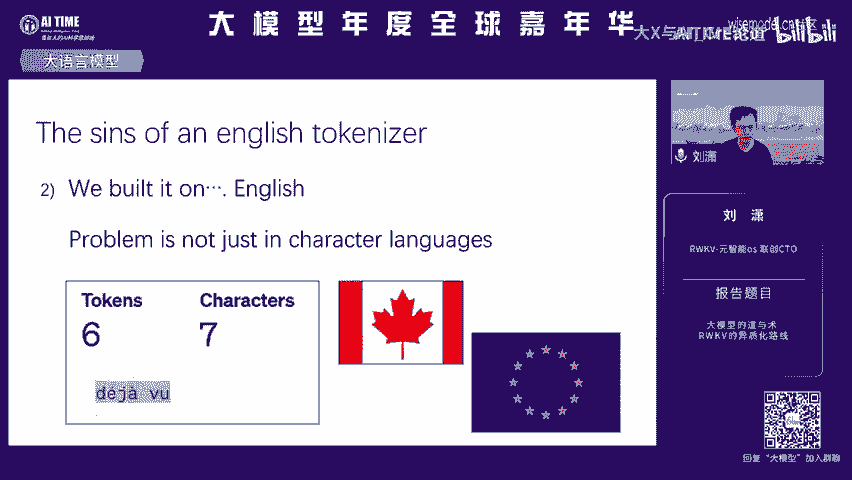
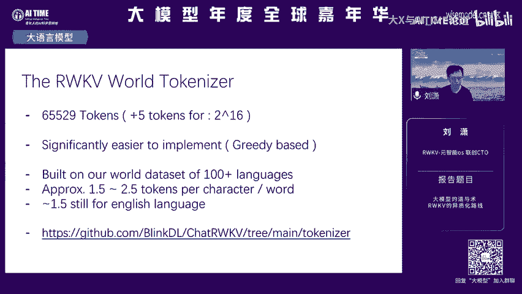

# RWKV异质化路线-大模型的道与术 - P1：RWKV异质化路线-大模型得道与术 - 吉尔的电影之旅 - BV1Y64y1E7Jk

呃，团队成员。然后今天我的题目是这个RWQV的一制化路线。啊，其实听到一直化路线，大家都可能这个想到PSplay stationation和space。

啊，那么就是我们来说一下这个RWKV的由来。RWKV是一个新的。

呃，大原模型的技术架构。啊，它是一个全球唯一的RN base的这个语言模型。啊，它是一个不同于transformer的一个不同的技术架构，它也是一个生态，也是一个技术社区。

这里面蕴含了这个作者以及社区彭博在这个三年之中，我们做的这些工作的努力啊，各位可以去关注一下这个呃RWKV点com可以看一下一些技术细节啊。那么其实RWKV的由来，它主要来源于两个啊有几个其实有不少。

但是我觉得我的理解是有几个初衷啊，它是首先它是需要像人脑一样思考，怎么通过transformer或者说呃就是之前是transformer，然后现在是RWKV就是这些架构来表达这个大脑的这个结构啊。

这是第一个初衷。第二个初衷是啊那么。呃，我们可以看到transformer它已经是一个。啊，模拟这个大脑的一部分能力的这么一个结构啊，我们认为它海马体，它有很强的记忆能力。我们都知道。

但是这时候我们仍然需要一个state啊，需要长城记忆，需要planning啊，需要去这个呃把这个信息抽取压缩抽象。然后刚才子源老师也讲到很多关于认知的理解。那么RWKV是认为首先宇宙是连续的。

是一个state一个state的变换。那么啊我们希望通过这个state来去寻找一个答案啊，那么这是RWK初众。在这个基础之上，我们演变出了很多的这个差别，以及这个和和传送的这个区别，后面我会提到。啊。

那就是刚说到这个架构的这就是我们是做这个架构的，跟各位同学就是有做架构，也有做这个数据，然后有做各种各样的分析的啊。那么啊之前也听了不少。那么V就是我们的WK在三年之中。

它是从从transformer到CNN到R就是他从RN在演变的过程中，它实际上是一个有一个就是有一个基本的思考方式。

就是说我怎么去重新去把这个这个transformer的结构再去演化到这个R就是我们要的这个结这个结构里面你可以看到第一个图右边是我们的V4版本啊，现在市面上的论文是V4的版本啊。

社区里面引到V5和V6了。那V4版本这个结构很像这个TMTM核心的这个回路，就是上下的这个回路。如果大家熟悉的话，它是被这个 shift的替代的。也就是这个。结构啊，首先它是非常像RN的结构。

同时它这个tken shift实际上是1个CNN的结构。我们可以理解这个无线上下文的这个state呃，就是RN的这个外推的这个天然性。是远强于这个transformer的。

当然我们不能说他的记忆力是远强于transformer的。之前吕欣老师也分享过。啊，但是就是它的这个state，我可以无限外推。但我训练过程中，这个state选择记忆什么，选择压缩什么。

实际上是一种啊是对这个信息压缩的一种抽象抽象理解啊，这个是RWKV的一个完全意制化的路线。这里这三张图实际上呃比较复杂，看起来很多结构。实际上是说我们从最左边到右边是V4V5V6版本的不断迭代。

不断迭代。那我们既然是针对一个state去不断的操作它和理解它。我们认为state是一个接近大脑的一个东西，或者是一个记忆体，或者是一个信息压缩的能力，或者是一个planning的能力。

那么我们的state在V4到V5的时候，它是在扩展的。就是不断变大的，我要变怎么变大这个state，这个这个很直接，但变大的过程就是需要很多tck和这个技巧。那到VV5到V6。

那么我如何选择变大的s记忆什么？或者说我怎么让它增强它的泛化和抽象能力啊，这是这个V6做的事情啊，它是data啊dependent啊。

我的dey是我的这个啊我的这个state是依赖于当前的data输入的。啊，这些细节都可以在我们的这个官网以及我们的技术社区里面找到，可以去知乎上面搜这个一些文章。那说到这个大家可能在V4版本之前。

就是RWK都有一个鲜艳的认知，认为RWKV它的唉这是一个linear的这是个线性的transformer啊，它这个性能肯定还是有差距的。毕竟复杂度不够，实际上到V5的时候，这个复杂度已经起来。

我们不能说V4的复杂度不够，它的能力就不够。因为我们跟transformer是做的不同的任务。啊，transformer它是一个就是先回到这个问题啊，V5版本的这个ch mark我们可以看到1。

5就是这几张图最上面那张图1。5B的这个这个这个RWKV已经是一个ta的水平了。然后V7的呃就是这个V5的7B的模型也已经啊接近拉满2的水平。啊，你可以想见一个开源模型。

它并没有什么专有数据SFT数据的时候，数据这个可能还是完全是依赖开源的时候能做到这个水平啊，我们现在不能直接去打榜，但实际上也已经证明了底座的能力。在V5，这还只是V5的能力。嗯。

所以说我们在谈到这个RWK它的性它的优势的时候，我们一般不会单单说它的这个性能优势，毕竟它是一个呃当然就天然的一个state。

那我的推理性能是ON的跟这个跟这个transer这个欧方这个显存消耗的完全不一样的水平啊，那么在这个多模态的就我说就后面我会讲一些这个RWK的差异和呃一些优势。那么在差异上面来说，其实就很自然。

在多模态就非常的自然啊，那刚才之前的这个多模态基本上都讲到这个lava这个还有这个呃这个赋余。那在RWK这边是一个呃state啊，而这这个state它有这个天然的信息压缩能力，它有这个RN的序列化能。

可以理解在这个我们怎么去让多模态的信息接入到这个t里面有大量的工作，可以去这个可以去啊探索，而且有很多非常有就是就是transformer本身有局限的地方啊，会是RN的，就是RWKV的点。

下面有就是这个这下面有一个呃viualWKV是我们现在开源的一个项目地址。大家可以去getub上搜一下。然后这个呃右边啊大家可以先看一下，这个是我们的音乐模型。在端上面跑的这个是在红米上跑的。呃。

这个能听到吗？OK那这是生成。OK刚才听不到，可能我再放一遍。🎼啊，这是一个乐谱的纯续写模型，前面是乐谱的这个prot，后面是乐谱的生成的结果。🎼呃，当然你也可以去选择呃手动输入乐谱，然后让模型能够。

🎼根据你任意输入进行无限的商城。🎼啊，这是很简单的，后面我会就还有mii模型。那左边这个图是指的是这个呃我们在mac pro上面跑的这个AI小镇。AI小镇实际上是AIMPC。我们因为是state。

我的state切换是没有性能消耗的。那么我跑了200多个agent，同时在这个小镇里面进行交互。啊，是一个啊天然的优势啊。这是一个mii模型RWK runner就是在社区里面。

我们会有这样的本地化的项目。RWK runner啊，可以去啊对话，可以去微调，可以进行这个mii音乐的这个的创作。啊，这是基于RWKV的一个项目。

它可以让1个500兆显存的这个极显的这个这个laptop，就是这个笔记本可以跑这个PDF的cha。啊，就是这个这个PDF大概是一呃呃一两兆的样子吧。它实际上是我只训练了16K的模型。

但实际上它外推到200K左。啊，就其实回到之前的长长模型的能力上面来说，当然大好捞针对我们来说是一个有点不公平的项目，不控的任务。但是我们其实可以在里面加attention。RW可也可以去改架构去。

往里面增加attention，然后去提到提升这个memo，就是这个记忆。嗯，说到这个这个差异，就是呃模型就阿WKV和trans的差异，就是这个state本身代表了什么含义？

它实际上是一种信息压缩和这种语言的一些呃特征的。抽象能力，这里是一个小说的例子，右边是GPT4的模型，这模型小说的续写，左边是这个RWK的模型啊，那这个RNA模型。

或者说我们认为state模型它有个天然的这个优势在于这个信息的捕捉能力啊，我对这个信息的抽象以及信息的这个风语言的风格的捕捉，让这个作者能够很好的去续写，符合他语言风格的能力。啊。

这个是我们在社区里面经常会看到的例子啊，就是也是基于runner去使用的一个小说模型。啊，这是一个多人对话，多人对话也基本上是跟刚才的AI小镇是非常相似的啊。

多人对话这一点在于说啊这个项目在于说它实际上是一个啊模型编辑的结果，就是它是通过多种模型的编辑之前。啊，刚有位老师提到这个模型编辑来增强某些能力啊，比如说他为了让角色扮演能力很强。

我们在attention和FFFNN这个模块上面进行编辑和融合之后，他的这个猫娘的自我认知能力更强一些啊，然后呃这个角色扮演更贴合一些。这是一个这个呃这也是个很有趣的项目。

它是完全基于RWKV57B的模型啊，就是在本地做了一个rug助手rag它核心需要一个inbedding，还需要一个数据库，还需要一个本地推理模型。那这这个这个inbedding的模型推理模型啊。

以及这个呃中间的这个查询的模型都是用7B一个模型做到的。它是用了laura的方法，做把这个7B的模型变成了一个embedding模型啊，因为它存在一个statestate某种变相的意义上面。

它做lara做做这个模型改造之后，可以变成一个7B大小的embedding模型。啊，从头到尾就是呃RWKAE间扛，就是这样stateate模型能够呃既把这个inbeing模型做了，也能做推理模型。

然后也能做这个查询的模型。把这些这个呃呃就是完成了这个contest，就这个rug的任务啊。这个在这公众号各位可以搜一搜这个啊7BLMRug这个个人助手也是能看到的。啊，这个项目也开源了。呃。

提到这个开源就是社区里面的一个项，就是这关于这个模型的大小的这个就是各位对这个RWKV模型肯定还有scale这样的东西非常的怀疑。比如说200B100B的模型会怎么样啊。

社区里面就是通过这个迁移学习啊后预训练这个优化。然后有各种tck，然后把这个12B的模型做出来了啊，当然这个12B模型并不是这个啊本身出于这个RWKV来做的，就是这官方团队来做的。社区做的啊。

它的训练呢还不是很充分。但是后续在这部分来说，大家可以可明确的看到啊，因为这个RWKV模型的架构，它在不断的升级啊，在预训练层面上面。

我们在模型升级的同时还能保就是提升这个训练效率会极大的加速这个更大模型的落地啊，所有人都喊着说我们要1个60B100B的。模型我觉得这个这个我们会很快就有，而且大家可以很快能用上。啊。

这个是社区的一些这个介绍啊，我们有disco，也有这些项目相关的项目。很有意思的地方是这个RWKV的模型，它是中国人自己研发的创新的啊，我们不管怎么说它的起点是这个这个AFT或者怎么样。

但是在后面啊不断的这个架构升级过程中，呃，是我们作为这个开源社区的一个非常重大的贡献啊，就在我们在跟随拉嘛同时，也是我们在贡献也也也从RWKV这角度，我们在贡献这个开源的这个项目。呃。

后面我会讲一些这个除了这个模型本身，也会讲到这个模型的这个talkne这一个我们的为什么要选择我们自己的talkneer啊，因为这个这个GPT各位都知道，这个对中文很不友好。

我在一个很有限的contest里面，如果这个这个用中文的话，三四个字才能它就就是一个字代表三四个taken，它就非常低效。英文才是1。5啊，这个RWKV啊啊对，对有一些语言来说。

7个字符就有6个talk。

对RWKV来说，它是一个wordtaken，对任何语言都是一。5的taken的这个公平的这么一个状态。所以说作为多语言来说，RWKV也是一个很好的起点。

啊，这是一个呃嗯这个性能消耗的一个例子啊，每模型推理的这个交消耗产比这个是很这个是很直观的。因为我们是一个state，它的性能比这个是天然优势啊。就是啊就是之前的一个日语的榜单。好，这里我说一下。

就说刚才我们之前这个吕行老师也提到了长文本模型。那么长文模型里面这个复杂度来说呃，这个呃我们是N的啊，这个transformer是N方最下面transformer。但RWKV它不是现在不是一一个。

而是有多个啊，有这个runnet有man板啊，这还没有说到这个man板啊，这个时候还没出man板RWKV。对呃呃这个这个带来的这个就是很这是很朴素的优势。对。啊，这是一些相关的呃外国的一些报道。呃。

这里我想说一下，就是嗯说到这个信息的压缩之后，大家都会怀疑说我在大海捞针这个项目，如果纯天然的RWKV，它到底有没有这个记忆能力，记忆能力足够是否足够强啊，我们做了试验。这个V5的1。

5B的这个re这个size加概是11900。那么我们估计14B左右在18000。那其实呃我们就是你就是因为各位我们在开源社区里面没有特别好的数据，直接能SFT或者我们用的很多都是开源的数据啊。

各位如果在做不同的transformer模型的同学或者老师可以去试用你们的模型数据直接来训RWKV的模型。因为底模型是没有，就是底模型啊训练的方式还跟传统模型。

就跟transtransformer也不一样啊，它是非常这个呃我理解是非常包容这个不同结构和这个这个格式的你们可以任意。构造自己的数据集和能力去训练模型，它也能就是在这个基础之上去做不同的任务啊。

会有很大呃就是会有非常非常多的可能性。哦，谢谢大家。这个不是我们希望达到的这个目标，100B还不是节点。我们希望后面有200B的模型，而且在一个很低的性能消耗下面来做啊，这个呃共同大家共同努力。好。

谢谢大家。😊。