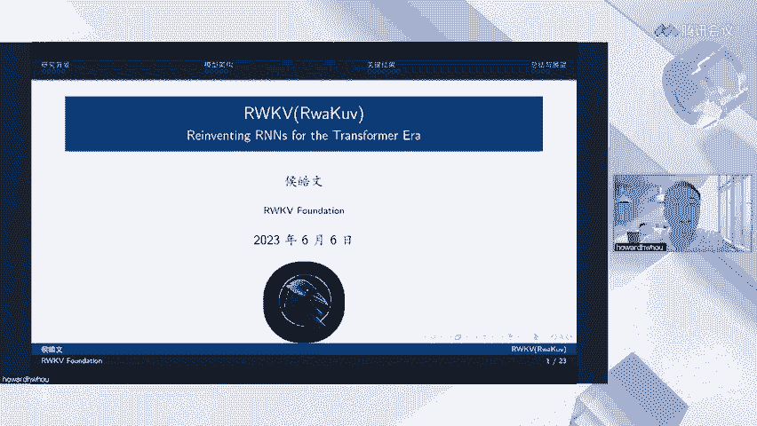
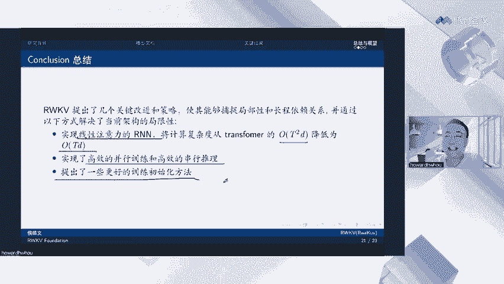
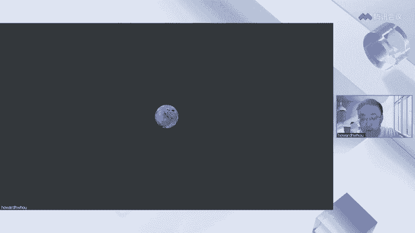

# RWKV：在Transformer时代重塑RNN - P1 - 霍华德vlog - BV1b8411Z7Df

呃，欢迎各位观众今天来参加我们的直播。我受这个彭博的委托来给大家讲一讲我们的paper Raku。啊，对，这个的话标准的发音叫raco，不只是不是不是这个RWKV。嗯。

OK好，那咱们今天的直播就开始吧。首先先讲一讲核心卖点吧，毕竟大家的时间都很珍贵。嗯。让你先看看我们的核心卖点，让你觉得值不值得把这个整个直播看完。首先runku的核心卖点是OE的推理复杂度是真的很香。

首先，单token的推理时间是恒定的，总的推理时间随序列长度线性增加，而传统的transformer呢是随序列长度二次增加啊，甚至有可能三次增加。在特别长的序列情况下。内存占用恒定，不随序列长度增加。

第三点呢是推理时间。和内存占用。呃，都是随随尺模型的尺寸线性增长。大家可以看这两个图啊，就是为了表表达这个推理时间。和内存占用其实。都是随模型尺度线性增长的。

可以看到其他的transformerQ就飞起来了，这个是它的啊内存的使用。这个呢是它的推理时间，也是Q就飞起来的啊。我们可以观察到数量级别的优势。在这个方面的话，所以说这也就意味着。大模型的硬件限制。

和部署成本所有如果使用raku模型的话，可以大幅的降低。我们已经在CPU和非NV的加速卡上部署raku模型。这个的话就不再受美国卡脖子的限制了。你买不到英伟达的显卡也没有关系。

用你的CPU就可以跑大模型。然后呢，是服务器上的大模型部署成本可以大幅下降。普通的台式机和笔记本的算例。内存就已经足够部署一个本地的大模型。手机端将来也成为可能啊，手机端现在的主主要问题是内存还太小。

如果手机芯片厂商进一步跟进，例如说加入一些PF16的尺寸的啊这种这种数据格式。那么未来也有可能手机端可以部署啊，但我我是比较乐观的，我觉得可能。一年甚至两年啊，就可以部署这个在手机端部署大模型了。

所以说不夸张的说，我们觉得raku将推动大模型进行一次。架构迁移，从现有的transformer架构迁移向reku这一类的线性transformer，或者叫做线性attention的模型。

OK那你看香不香啊，如果觉得足够香，那就跟着我继续往后。看我的直播吧。OK那么就回到这个一开始先介绍一下。RNN和transformer各自的局限性。

首先这个RNN吧它训练长试液的时候容容易出现梯度消失的问题。所以前十0年20年都提出过一系列的工作，如GRU如LSTM。就是来解决这个长序列梯度消失的问题，但解决其实也不是很好。

LSTM差不多在100个token或者说100个字之后，它的。梯度就停止下降，说明他已经开始遗忘过去的信息了。另外一个问题呢。是安安在训练过程中无法进行并情化。他也是必须每一步一步的进行训练。

限制了其可扩展性。这就是为什么之前的RI模型都没有办法训练的很大。就因为他没有办法并行，就使得他有就算力用不上吧，可以这么说，所以之前都没有得到过很大的RN模型。

然后transformer的问题呢是传统的transformer或者说标准的transformer，它的tension是具有二次复杂度的。在长序列任务中呢，计算成本高，占用的内存多。我们可以看一下。

右边这张图表啊，transformer在时间上它的复杂度是T方。空间上的复杂度也是提方。啊，T方站主导的T的话就是序列长度。Araku。时间上是。OT的复杂度，而空间上是OD的复杂度。

D的话在这里是一个常数，就只是它隐层的向量大呃隐层的这个维度，也可以简单说，它就是O一的复杂度。啊，所以说。本文呢主要是提出了raro架构，它结合了IN和transformer的优点。

同时缓解了他们已知的限制。好，我们提出一种线性的线性注意力机制。最后呢我们展示了raco在。大模型长距离依赖关系任务中的性能效率和它的可扩展性。OK来讲一讲RNN它最简单的形式是什么样的呢？

它最简单的形式其实就是XT是它的输入。HT呢是它的影像量。然后呢，每一步我们会有一个遗忘门，决定这一步我们把多少信息放多少输入信息和多少上一步的影像量信息放到这一步的影像量信息当中。啊。

可以看左边这个图啊，右边这个图就是这样的一个意思。所以说RN它是一步一步执行的。嗯，每次只能处理一个字或者一个词。如果你分词的话。它的内存占用很小，它计算量也很小。因为它每次值处理一部的数据。

但是呢因为他对前一项是有很强的依赖的，这里指的话就是HTI。啊，H确是这个HT减一是它的所谓的前部，是它很依赖的。所以说使得它没有办法并行化训练，这极大的限制了RN的可扩展性。

相比较transformer呢它一次性是可以处理一整句话或者处理一整段话的，所以说是可以并行训练的。OK那我们下面再讲一讲transtransformer的attention啊。

和我们从transformer attention中受到的启发，然后提出了我们新的attention机制。哦，这里的话是传统的tention，然后对它进行了一点改写，改它改写成向量版。你可以这么理解。

就是对于某一个T当前啊这T就是当前的token或者字或者词。我们使用它的呃cory。和他的key和和不是和他的和他所有的key和这个序列里面所有的Tkey计算一个分数。然后这个分数呢再对。

它的直向量进行加权求和。那么我们就可以得到。这个T它的一个向量了啊。啊，下面这个呢是一个规划像，也是把所有的它的。现啊所有他的这个叫做啊注意力的分数给它加到一起。大家要需要理解的话。

可以看一下左边这张啊，右边这张这个图。然后AFT呢是指。attention free transformer是21年苹果的一篇论文。他在这个里面呢，它把QT乘以KI。改成了WTI加上KI这样的一个格式。

这个格式的特点在哪里呢？嗯，这么说吧，我先换支笔。这个WTI它是一个矩证。然后呢，是T乘T的矩阵，就是说它是序列和序列之间的矩阵，它代表的含义呢是一个位置的token对另外一个位置的位置偏置呃。

positional bias。它是一个固定矩阵，就是说它对于所有的词，所有的所有的序列而言，它都是固定的。啊，那这个的话就很不好了，这太静态了，没有没有办法学习到很多的知识。所以呢。

作者又使用了1个KI，这个是和每个token强相关的1个KI。用这个值来调制它的这个啊positionpositional bias可以可以把它调的高一点，或者把可以把它调的低一点。

通过这种方式呢形成了一种线性的attension。然后很受这个想法的启发吧，就是说哎那就可以摆脱了这个Q乘以K的乘法，对吧？那也就摆脱了，不再需要依赖之前整个序列里面所有其他值的这个限制。

所以呢raku就提出了一个channel wise的时间衰减向量，就是这个W。呃，这里先解释一下channel吧。

因为这个channel和可能大家在其他配per里面看到channel和CN的channel是不一样的。这里的channel其实就是。就是隐藏隐藏层的维度就是。D啊它就是一个W，就是一个D位的向量。

每一个其中的一个值，我们称之为一个channel。啊，你。OK好。那么这个公式的含义是什么呢？就是说比如说我们有128个channel。

然后它前一个向量就是-1W前两个向量就是-2W前三个向量就是-3W，它都是跟自己的位置和它之前的token的位置有这么一个关系。因为它是在一当中的，它又是个负值。所以他其实就是一个时间衰减向来。

你可以简单简单的理解为。距离当前token越远的token，它就会衰减的越多，越近的token，它就会衰减的越少啊，但实际情况下比这个还要复杂一点。

后面我们有个图来可视化这一部分channel的信息衰减。好，这个其实就是reco的一个核心思想。我们下面来完整的介绍一下reco的架构吧。首先，raku里面的RWKV分别是4个字母。的含义组成的啊。

这四个字母呢是R代表一个过去信息接受程度的向量。W就是刚才说的时间衰减向量。K是间值向量。就是之前说的用每一个token自身的一个值来对位置向量进行调制啊这么样一个向量。V呢是每个token的值向量啊。

它也类似于传统注意力机制中的V。然后我们来观察一下一个embedding进入reku之后会经过什么样的一个东西呢？首先它会进入time mixing模块，在time mixing模块里。

它会和它之前的所有的文本信息进行一次融合，所以叫time mixing，它会把过去的历史信息加到自己的身上来。然后呢，经过一个lay norm就进入到channel mixing。

channel mixing设计的目的呢是因为time mixing，它其实并没有考虑到每一个词，它每一个维度之间的这么一个非线性啊，所以在这个模块里面呢。

会对每一个词的它本身的channel进行一个强烈的混合和非线性，增强它的非线性能力。使得模型的学习能力更强。好，那我们来讲一讲这个time mixing到底是什么样一个含义吧。嗯。先来看公式吧。

这个time mixing里面你会发现就是之前讲的那个W向量，它是有两部分组成，一部分呢是之前的所有的。呃。这种时间衰减的向量乘上它之前的token的。直件向量和它的直向量进行聚合得到的这么一个东西。

然后加上当前token。的一个。呃，权重对吧？这是权重和它的一个值向量。那U呢是单独设计的一个专门为当前token的而设计的一个。取证吧啊，这样这样的话，可以把和之前的向量区分开来。很更大的一个问题。

根据之前的公式，你会发现，如果T减T到就变成零了，对吧？那你不可能用零乘自己的这个限值啊，加自己的键值嘛，那不就没有学到东西了嘛？所以说必须换一个向啊换一个向量来表示它。😊，下面你层依然是个规化函数。

我们可以用这个。右边的图来解释一下它具体是什么样的一个过程。呃，首先对于第一个偷token进来的时候呢，你会发现它会和EW这个向量里面的这一列产生作用相乘，得到一个新的Ebedding。

当我们往前走一步。你会发现它是这当前第二向量和它前面的向量呢，会和它的时间衰减的这个举阵啊做一个就是点对点的乘法吧。然后以后以后以后又是形成一个新的项链啊，第三步和第四步都是一样的。啊，同时你会发现。

因为时间衰减向量，你可以看到当前token它的这个向量的强度一般是最大的啊，然后呢它会逐步的减小，颜色逐步的变浅。也就说明这个时间过去的信息在当前这个token这里看的话啊。

它的信息的重要性在逐步的降低。通过这样一个方式呢，我们就实现了一种新的线性复杂度，就是这个。WKV啊就表示一种新的线性复杂度。这个新的线性复杂度，我觉得重要的意义在于。

它其实上用一种接近EMA就是exsponential moving average，就是指数平滑啊移动平均的方式，把过去的信息都加到当前的token里面来。啊，这其实是一种序列建模的方式。

我们觉得这个方式其实非常好。另外一个点很重要的话，我想提一下，就是你会发现哎这一部分。😊，和这一部分。都是过去可以提前算好的。把之前的信息算好了，传进来放到一个state里面。

就可以直接和新的两项相加一下，就可以算出新的WKV啦啊。这个的话其实就是raku可以RN模式运行的基础。后面我们会更详细的讲一讲一下这个东西。好，当。一个token经过了time mixing之后呢。

他又会来。进入到channel mixing的模块啊。像我说的channel mixing，它主要是为了给这个token它的channel之间加逞强的非线性。所以呢这里使用了。

这个叫square loop，就是说啊这么是一个很强的非线性函数，一个sigoid的函数，也是个非常的强的非线性函数啊。😊，就可以对这个每个token它的 channel进行一个mixing。好。

那后这一篇页PPT的还有一大目的呢是要讲一下这里。WT和啊不是WTXT和XT减1，这个就是论文里面提到的token shift操作，就是token的平移。我们会把每一个当前输入和上一步的输入一起加到。

一起加到它mixing module和这个channel mixing module里面来啊，像这样的话，其实也会很多种理解的角度啦。一个角度就是说强行做了一个by ground。

这个是一种NLP的角度，认为说我强行的把所有的字组成一个词啊，组成一个只有两个字的词啊，这是强行的bground这是一种理解方式。还有一种理解方式呢，其实可以把这个理解为一种CNN的过程。嗯。

在这个CNN里面呢，它相当于是一个窗口为2。一个参数为UR，一个参数为一减UR的。卷积神经网络。啊，从这个角度来看呢，你会发现。随着整个信息在向上传导，整个模型叠加的模块越来越多。整个模型在这个地方。

它的感受也是越来越大的。我可以简单画一个图，你们可以感受一下啊。首先对于第一个token而言，他能看到token就只有他自己。对于第二个token而言啊。

他其实他可以看到的东西是他自己同时他可以通过这条通道这个token shift通道看到他前一个token，对吧？那么他其实现在的感受也就是2。对于第三个头盔，这里可能不太准确啊。

他可以通过自己的 channel能看到自己。通过这个 channel呢看到上一个token。再通过这个channel能看到上上一个tken，这个时候它的感受也就是3。如果这个模型可以堆叠100层。

那么我们可以说这个模型在最高一层的时候，至少它会有100的感受。就是说它可以直接看到100个位置以前的token啊，这个在我们看来，这是很强大的一个序列建模能力。通过这种token shift的方式。

使得模型具得具有了非常巨大的感受。那某种角度说，如果你能把它对到1000对吧？那它其实就相当于可以直接建模1024，或者直接建模1000长度的上下文了。

所以说这个token shift在我们看来也是这个模型设计中一个很很很很不错的点吧啊。好。下面来说一下。模型因为这样的设计，它就可以高度并行化啊，因为你可以发现这样所有的这些值它都是可以提前算好的啊。

都是可以通过矩证计算的。它脱离了对上一个状态的依赖。然后呢，WKV使用一个串新的扫描，就可以把它计算出来。这就使得它可以像其他的transformer一样的并行训练。

一自把整一句话放进去就可以计算它的lo。像样这样的话，就使得它的可扩展性和transformer是一样的。好，下面来讲一讲它是怎么像RN1样解码的。我之前留了一个线索吧，对吧？

我说这个项呢其实可以等于它之前的项，加上它现在的项相加。你每次只要把它之前的这一项和这一项当做个state传进来，对吧？那它就可以马上计算这个状态下的WKV了，所以简化之后呢，使得整个模型。

就变成这个样子，1个IN的形式。我只需要把当前的token和它的state一起传进去，会返回一个新的state。要下一步，再依据这个新的state再去计算。每次我只依赖上一个状态。

state和当前的token，我就可以快速的对模型进行解码，这就使得模型摆脱了它之前的上下文啊，使得它每次只依赖前一步的state，极大的提高了它的计算效率，降低了它的内存消耗。好。

让我们来看一些关键的结果吧。嗯，首先reco通过三种机制。循环时间衰减和tokenshift来捕捉序列传播中的信息。循环我觉得这个呃这个我觉得这有点不好讲啊，这些是常识。

就是它每一步其实都依靠前一步输入进去这样的一个循环自段过程，本身就是一个序列建模的方式。时间衰减之前说了是通过这种channel之间的时间衰减的这个量来捕捉之前过去的信息。

然后tokenship刚才也说了，是相当于一种CN的窗口。当模型堆的足够高，它的感受也就非常大。那我们可以看一下，这个是之前LTM的一个呃pro token loss，就是说在。

就是说计算这个loss在100位置的时候，就会发现它已经饱和了，基本上就没法下降了，说明STM把它100个to困之前的信息都给忘掉。他没有这个长序列捕捉的能力，但rakuve可以做到多少呢？

至少现在可以证明他可以做到。4096的长度啊，在4096的实线上，我们发现它的los还在下降，它并没有体现出任何平台性，说明它的长程序列捕捉能力是非常强的啊，至少在4096的上下文下。

它依旧可以捕捉到之前的信息。好，然后来看两个可视化的结果。嗯，这个是之前留说过的，就是他对于每个channel之间的信息是怎么传递的啊，它表现出来是什么样子。我们可以看一下，就是这个其实很有趣啊。

第一层第一层第一层的话，你可以看到它在后面这些channel的时候啊，这个总共是有74七84维啊，所以说它的这里划到是接近800。你可以看到它后面一些圈nel，它基本就衰减为0了。

意思就是说是这些channel我根本就不关注之前的信息，我只关注当前信息，我不去捕捉之前的信息，我只关注好当前的token是什么样子的。但是随着模型层数的上升，你会发现高层的channon第12层。

它已经有很长的一个平台了。这说明什么？这说明在第12层的时候，它是一个全局的视角，它会从全局来看这个信息，它会保留之前的信息非常长的时间啊，它的都不衰减，它的这个它的这个time bK都接近一。

然后最后这这就是使得它具有了一个很好的长啊这种长城信息捕捉的能力。OK另外的话我们来看一下。使用因果追踪方法来展示这个信息的传递路径。

这里呢输入了是the ever tower is located in Paris。我们预测paris过程中，这个模型的信息是如何传递的呢？首先你会发现。当模型进入到第四个位置，第四个token。

这是这时候af这个词已经完结束了。模型就会通过一条路径把它传递到。20层21层这样的位置。然后在这个地方储存着这个重要信息。当模型继续往前的时候，这个信息呢也在不断的被向向前传递向前传递向前传递。

而且你可以发现它有两条路径在向前传递。当最后我们要预测它的时候，它就被传递到最后一个位置，告诉我们说。因为埃尔铁塔在paris，他们两个有高度的相关性嘛，他就可以正确的预测出parris。

这个可视化也是很有趣的。他展示了说R客模型到底是如何处理，在它其中的信息的。其实。他在看到efer的时候，他就已经猜到了，可能后面这个信息很重要，要把它用到哦，然后就把它放到了比较高层的一个位置。

储备着啊，如果你之后真的是要问他和艾er相关的信息，那他马上就会把这个储备信息拿出来。然后把它用于预测，帮助你得到正确的答案。一。好。下一页是一些evaluation，这这一页也非常重要啊。

因为之前声称做transformer线性化的工作非常多啊，但是其实他们都没有办法接近一个真正transformer标准transformer的效果，所以大多数人都没有跟进啊，因为他们的性能损失太多了。

虽然你各种效率上有很大的优势，但你性能损失这么大的话，就没有办法用。但这个评估过程中，你大家可以发现，在多个数据集上。把酷5的效果都是非常好的。甚至超过了一些同参数的OBT呀。

bom呀这样一些基于transformer架构的大语言模型。好。哎，还但于这里我还想分享一点，就是说其实在我们看整个结果的过程中，我们发现其实raku模型它当它的这个。参数量不是很大的时候。

其实是有一些劣势的啊，例如说。这个时候这个这这个嗯朗姆da这一个测试集，这个测试集非常有意思，它是一个能够证明你模型序列捕捉能力很强的测试集。因为它相当于它每次只要求你测试它最后一个字是不是正确。

一开始的时候在模型参数较小的时候，其实它和transformer之间还是有一些差距的啊，因为transformer它因为可以保存过去所有的信息。每一次去请求，他都可以把过去所有信息拉出来重算一遍。

就使得他在模型参数小的其实优势很大。把Q模型这个时候略趋于劣势。但是当模型参数上升到7亿，我们看到的是差不多7，不是7亿7B70亿参数的时候，就已经开始接近transformer的效果了。

等到14笔就是140亿参数的时候，集和银和transformer效果不相上下了。啊，说明其实对raku模型而言，scaling它获得的收益更大。他sing获得收益大于transformer。

我们分析的原因是这样的，transformer架构是非常强大，是非常通用啊。但是呢它对于很多任务来，他这么强大的模型效果，可能用没有办法完全发挥出来。嗯，而recqui呢它虽然有一些局限性。

但是呢当它的模型参数逐步增大之后，它的模这些局限性就被克服了，使得它在足够大参数的情况下，效果可以快速提升，然后就接近transformer的效果。所以说其实raQ真的是一个大语言模型时代的产物啊。

因为对于他而言，如果所有的模型都停留在berrt级别，那么它可能就没有那么有价值。但它真的到大语言模型时代。比如说模型参数70比7B14比甚至更大。在这种情况下，它的优势就体现出来了。好。

然后是核心卖点了，就是推理复杂度，生成长度为T的序列transformer需要T方的这么一个复杂度。所以说真实在真实的测试下，它也是受它整个这个需要的时间就起飞了reco它是一个线性增长的啊。

所以说对于特别长的文本生成。那么reccove在推理效率上就有很大的优势。然后是一些我们在呃。非GPU架构上的结果，例如说在CPU上，raku可以使用int8模式。in特8模式的话。

它的los损失非常小。延迟很低啊，同时模型参数也不大。它就可以快速运行，而且可以编译出各种各样的ESE支持的平台，包括。inux呀、windows andmac arm都可以支持。然后呢。

是也有了主要库，也展现出大模型在端侧匹配的潜力。简单说就是说。CPU上16G内存就可以运行70亿参数的模型了。然后12B的话可以运行int8的71毛钱。在英特尔BF16的芯片上的话，它的速度可以更快。

然后在GPU上，15GB的显存可以运行71参数的模型。9GB的显存可以运行。可以运行int8701参数的模型。那这个就是真的是入门款的GPU就很多都可以支持支持大模型的推理了和和啊对。

所以说这也展现出raku在端侧良好的潜力。如果之后模型再进一步做一些小型化。那么同时手机的性能再进一步加强。那么部署到手机上也是完全有可能。好，最后总结一下吧。首先。

这个raku提出了几种关键的改进策略。首先是实现了线性注意力的RNN，使得它的复杂度呢从T方降低到了T。实现了高效的并行训练和高效的创新推理。然后还有一些更好的初始化方法啊，这个没有讲。啊。

但其实在论文里面是有的，就是。大家可以去啊看一下，感兴趣的话，例如说一生叫啊small embedding initiation就是把传统的呃。参数初始化的维持度啊，又下降了2到3个数量级。

这样的话模型收练初期收练会更快啊。这都是反正我觉得论文里面其实宝藏很多了，都是彭博和大家长时间实验得到的一些珍宝吧。希望你能够从里面发现一些有价值的东西。

好，然后就是raQ5的局限性啊，这一点我们也毫不避讳它本身的局限性。因为他的这种RN的架构其实限制了他的回望能力，就是说他必须还是说他没有办法重新得到之前已经丢弃掉的那些信息，对吧？

他只能通过一些记忆或者压缩的方式，把之前的信息保留保留在这个模型里面。如果这个模型它真的很需要非常细节的回忆，就要非要需要回忆非常细节的内容，那么可能如果模型在之开始对它的重要性判断错误的话。

那可能就没有完整的保留下来。当他传递到后面的话，可能就忘了啊。从这点上来讲。和完全的自注意力机制相比呢，机制上是存在一定的限制的。啊，但是就像我们说的，因为你要保证完全的自注意机制。

你就必须把之前所有的上下文都带着计算。那这个计算的成本是非常高的那我觉得大家可能需要做一个权衡的。你真的觉在你的业务上，或者在你需要做的事情上有这么重要吗？

还是说用我们reku的方法就可以很好的解决你的业务了。那么你这个时候也许不需要保留所有之前的信息，那也就不需要用传统的transformer架构了。另外一点呢。

其实我们发现racco其实对prom engineering更加敏感了。呃，就像我之前说的，因为回望的机制，使得说那么你一开始可能就是更需要告诉他一些任务相关的重要的东西啊，他通过这些信息。

他才能更好的帮助后面的模型进行预测。所以精心设计pro的更加重要啊。你会发现，如果这个pro设计不好，它的性能可能就不好。但是他如果pro设计的呃好一些，马上他就可以和同等尺度的transformer。

性能基本上就是一模一样的。好，然后最后说一下未来的改进方向吧。啊，一个的话是。并行扫描。这个的话可以使得它的这个计算成本进一步降低到loglog t啊，这个的话我觉得也是很有价值的。

就是说是那你T如果很长1天01万10万，那对于log T而言，那这个就非常快了，对吧？就不只是OT了，到时候就整个就是logT的一个计算度长度的话就非常好。

另外的话用于这种呃encoder decoder架构。现在reco的话，它还只能用于deder架构。然后是对它的一些上下文的可解释性、可预测性和安全性啊，就是之前看到的那个可视化的一些东西。啊。

最后的话是经再引入一些高效微调的方法，使得再用很少的呃机器，或者说就很少的数据就可以高效的精调软客户模式。好的，这就是我今天给大家分享的内容。欢迎大家提问。呃，好，我看到我已经看到一些问题了啊嗯。😊。

第一个问题是为什么叫做RNN，而不是transformer的改进版。首先叫做RN是因为它确实有1个RN运行的模式，大多数的transformer是没有这样的运行模式的啊。

所以说我们把它叫做重新发明了RN。但它其实上也是transform的改进版啊，大家可以看到呃呃哎我的这个屏幕有问题。

它的改进的路径非常明确啊，这一页上面已经谈到了它的改进路径了，就是说它是从他是从attention free transformer这个上面来改进的。其实上它也是一种线性的注意力机制。

他其实是从transformer发展过来的。啊，所以说你也可以把它称作一种transformer吧。但是我们觉得它更有趣的卖点就在于它的RN运行模式，使得它可以高效的解码。

这是其他所有传统的transformer做不到的。