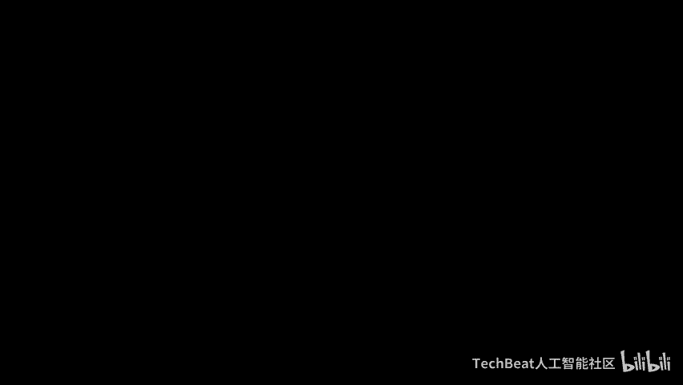
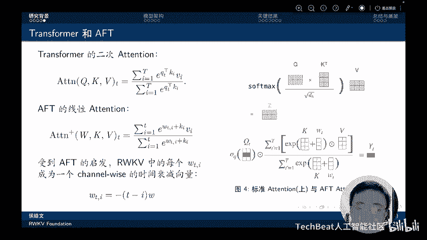
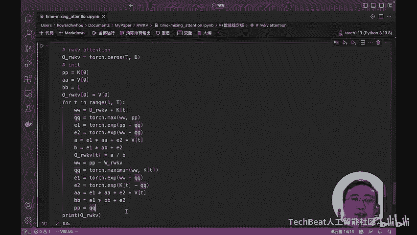
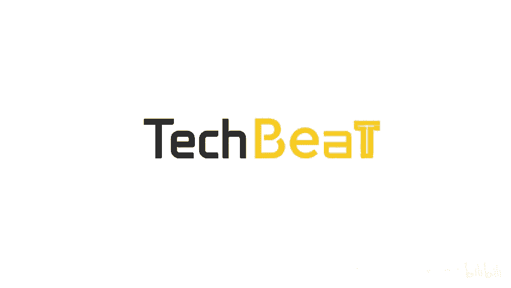

# Talk ｜ 新加坡国立大学博士侯皓文：RWKV论文解读 - 在Transformer时代重塑RNN - P1 - TechBeat人工智能社区 - BV1wu411j7WF

降门的朋友们，大家晚上好。受降门的邀请，我来和大家介绍一个新型的大语言模型架构raku啊，他不读RWKB读raku。好，那咱们今天就开始吧。首先呢介绍一下核心卖点，毕竟大家现在时间都很宝贵。

先听我说一说核心卖点怎么样，能不能吸引你。嗯，首先呢。raku最大的卖点在于OE的推理复杂度是真的非常像啊。单token的推理时间恒定，随着token增加。序列长度增加，线性增加，总推理时间。

内存占用恒定不随序列增长增加。无论你的上下文有多长，它的内存占用都是不变的这是一个很好的特性推理时间和内存占用随模型尺寸线性增长线性增长。啊我们可以看到其他的一些。标准transformer的模型。

他们随模型尺寸都是咻就起飞了。就就起飞了啊，可以见模型越大吧客户相对于他们的优势越大，这就意味着大语模型的硬件成本和部署成本将大幅降低。服务器上部署大模型成本降低，普通台式机和笔记本也将可以部署大模型。

而未来手机上部署大模型也成为了可能。所以我们认为reco将会推动大模型进行一次架构迁移。从传统的transformer架构向具有线性注意力的新型架构，如reco类型的模型迁移。好。

我们先来介绍一下传统的RNN和transformer有什么样的一些局限性吧。首先这个传统的RNN呢，首先有梯度消失的问题。所以后面提出了LSTM一系列的模型来。缓解这样的梯度消失问题。

但其实缓解的也不是很好嘛。然后第二个RNN在训练过程中无法在时间维度上并行化，这极大的限制着其可扩展性啊，这就使得RN模型在之前没有办法充分的利用GPU资源进行训练。

使得它的模型规模一直没有办法很快的扩大。然后transform有什么问题呢？transform的问题在于它具有二次的线性复杂度啊，不叫线对不叫线性，就是二次的注意力机制复杂复杂度。

使得它在长序列任务中的计算成本很高，内存占用很多。而raku模型呢，它拥有ODOT的时间复杂度和OD的空间复杂度。OD在这里其实是一个常数，就是模型的维度啊。

所以说可以也可以把它说是一种OD的空间复杂度。所以。我们。这次主要介绍的就是raco的网络架构，它结合了RN和transformer的优点，同时缓解了他们已知的一些限制。这是一种新型的线性注意力机制。

而且我们在后面会展示raco强大的大强大的长距离依赖关系任务时的性能效率和可扩展能力。OK那我们下面来讲一讲RN是什么样的一个结构。最简单的RN呢可以写成这样一个形式。这是输入的文本。

一个字或者一个词是他之前的一个状态。新的一个状态呢等于。之前的状态的一些。你可以说是遗万或者记忆都可以。然后一减掉这个一万或者激励的一个比率，把这两个信息进行一个线性加权融合。

然后RN总是这样一步又一步的向前进行的啊，我们可以从左往右一步输入一个词或者一个字，一步一步的向前。那优点呢是它内存占用小，计算量小，但缺点在于每一步都依赖前一步的结果，使得它没有办法并行化的训练。

这极大的限制了RN的可扩展性。而transformer呢一次是。处理一整句话甚至一整段话，那它的处理效率就非常高，可以很还可以轻松的进行并行训练。OK然后我们来看看这个transformer。

它的二次注意力机制是什么意思。呃，这是传统的transformer架构，可以理解为它需要一个矩阵Q和一个矩证K进行相乘。而这个矩阵和矩线的相乘呢就是一个二次复杂度的事情。

而为了改进这一点呢呃苹果之前有篇论文叫做tention free transformer提出了一种线性的注意力。这种线性的注意力呢取代了Q乘以K这两项，而是用一个固定大小的。W权重加上一个调至当前词。

重要性的全呃向量K这两个组合来计算模型的这个注意力机制啊。受这个AFT的启发。raku在每个词中其实也专门设计了一个W向量。但这个向量和AFT中不一样的在于它是一个随时间衰减的向量。

这个地方可以理解为T是当前的token，然后I是之前的token，通过计算当前token和之前token的一个距离，然后乘以它的W。那么来得到一个线性时间上衰减的注意力啊，它可以是-3-4-5-6啊。

那这样的一个注意力来使得raku可以把信息从很远的过去，通过一种指数加权平均的方式带到现在来。好，那么下面来谈一谈raku这四个字母的含义是什么呃，raku的R代表接受程度。W呢代表位置衰减权重。

就是刚刚。那个公式里面的WK呢是见向量，同时在我们可以理解为就是它对当前token的一个。重要性啊到一个标准。V应呢是直向量。类似于传统助力机中制传统激励助力机制中的V。好。

我们先从整体上看一下这个架构吧。啊。首先当一个词或者一个字进来之后，经过一个lay norm之后呢，会首先对这个这段话进行一个time mixing啊，这个后面会讲到，然后呢。对它进行一个输出。

这个输出呢其实也使用了跳脸的方式，把之前输入的信息啊，通过这个方式在后面和模块输出的信息做了一个加权融合啊，做了一个融合。

然后输入输出到输入到这个channel mixing的模块中啊channel mixing呢主要是为了使得通道之间进行一个混合。然后模型得到更强的非线性。好。那我们讲一下呃。

time mixing模块是什么样子的。啊，它mixing模块的核心的公式就在这里。大家可以用大家可以看一下右边这个图啊，我觉得这个右边这个图相对还更容易理解一些。首先。

EW是一个根据位置衰减的呃向量啊。然后他在不同的布场的时候，会有一个不不是布长，它在不同的位置会有不同的值。第一步，当我们把我们的词这个字输入进来的时候，它会和当前这个它的。EW向量进行相乘。

得到一个权重，或者得到一个注意力，两个融合得到所需要的啊inbedding。然后我们把词往。往前走一步，这时候看到的是第二个字或者第二个词，这个时候呢又会对它进行一个加权融合。

这个举这个都是通过啊点对点的。乘法来完成的，然后得到第二个词位置的向量。然后我们再往前走一步，得到第三个位置的词和第四个位置子的词的向量。最终呢我们就通过这种方式把过去的信息。

和现在当前词的信息融合到了一起。🎼所以RWKVraku在不引入二次复杂度的情况下啊，扮演了transformer中QKV的这个attention的这样的一个机制，只不过它是纯线性的。好。

在经过了time mixing之后呢，模型会进入channel mixing模块。channel mixing模块呢啊可以理解为就是给模型增强它的非线性而设计的。

而且这个地方要特别的指出channel mixing过程中啊，有两项，一项是XT减1和XTXT呢是当前的输入tokenXT减一呢是前一步输入token。

这是通过一个token shift这种机制来完成的，相当于是说对于每一步。我们把当前部和前一步的token一起输入进来，让模型看到，这其实上就增加了模成模型对啊这个序列信息的建模能力。

然后这个呃signoidRT和这个。嗯，square路啊都是为了增强模型的这个非线性。这个地方呢我还要再提一句，这个token shift啊是有什么样的价值，或者说是它是怎么来增强这个模型的呃。

序列建模能力的。哦，我们可以首先看第一个第一个字，第一个字输入进来的话，他就只能看到他自己。但当我们输入第二个字name的时候，它有一条路径，可以通过自己看到当前输入的token。

同时可以通过这个token shift的机制，看到前一个输入的token啊。此时那么对于模型而言，它的感受也就是R。当到is的时候呢，模型可以通过token shift在这这一层看到它自己。

通过token shift看到它前一个词，而在上上再再上一层，它可以通过token shift看到前一个词，并且通过这样一条路径看到前面两个字。通过这样的偷工 shift的操作呢。

使得模型具有了更大的感受也。而且我们可以看到，随着模型的层数增加，它的感受也是不断扩大的。我们可以说对于100层的模型，它其实真实的感受也是100。

在当前这个token它其实是可以看到这个token前面100个字的信息的。所以通过这样的设计，使得模型具有了更好的序列建模能力。啊。因为roku是高度并行化的。

所以说它可以像transformer一样的训练，然后它。的这个时间复杂度在训练过程中仅仅是BT的地方，而且QWKV依靠串新扫描的复杂度呢，可以实现到OBTD啊。好，那下面说说reccod的另外一个优势。

就是它可以像RNN一样解码。我们可以把red的这个。形式写成一个递归的形式。呃，WKV这个。注意力啊，其实呢我们可以把它之前的项写作ATT减一和BT减1。这两个项呢可以通过之前的项进行。计算得到啊。

所以说我们每一步进来都可以只需要两个量，一个量是当前的输入，一个量是token。啊，不是投ken，一个量是当前的输入，一个量是前一个模前一步模型输出的state。通过这两个。东西我们就可以计算下一步。

而不需要再去像传统的transformer去。把所有之前的那些token都计算一遍啊，所以使得raku具有很高的推理性能。对于这一点啊，后面。我还会专门用代码啊给大家展示一下。

就是怎么怎么一步一步的从标准的transformer改造成reco的并行结构，再把并行结构改造成reku的这种啊。递归形式或者说叫做循环形式。如果感兴趣的话，可以在这个PPT讲完之后。

我会专门再讲一个我自己写的呃notebook啊，里面可能会更清楚的让你看清楚这些这个raku是怎么做这个计算的。好，下面的话就展示一些关键结果。呃，首先的话raq中有3种。机制来够表示能够捕捉序列信息。

嗯，传统的LSTM对于它而言，它差不多在100个token左右的时候，模型的los就不再下降了，说明模型已经开始遗忘他之前看到的信息。而对于raku，我们使用了三种机三种机制啊，一个是循环。

这个循环就是它的RN形式，通过时间部的。方式传把信息传递下去啊，通过这种方式。来捕捉序列中的复杂关系。第二个呢就是time。a mixixing或者说time decay之前也讲过了时间衰减。

通过这种EMA的方式，把过去的信息带到现在，并且隐视的引入了位置信息。那第三种呢是token shift啊，一种理解呢是可以理解为它是bigram啊，强行的版。当前的字和前面的是组合到一起。

然后另外一种理解呢，就是像我说的是一种CNN的。呃，感受一。使得。模型层数越高的地方，它可以看到更长的信息。这三种机制结合到一起，使我们能够在4096，这里是4096的地方看到老客户在训练过程中。

它的los还在下架，说明模型可以捕捉长程序列中的信息。好，下面是一些可视化的事情。呃，一个是这个时间时间衰减的可视化。我们可以看到在不同层中，它时间衰减其实是很不同的嗯。首先第一层我们可以看到。

其实上基本上呃这个channel中很大一部分都衰减到接近0了。那说明在这些channel中，其实模型仅仅是关注它当前的token，它并不想关注太多之前的token。但随着这个呃模型层数的上升。

你可以看到这个模型它关注的信息的长度越来越长。在相当大一个平台里，这些层的模型它都是保持一个非常高的衰减，非常低的衰减系数。意思是说，它会把信息全部记住。前面那些重要信息全部记下来。然后不断的往后传递。

像这样的话，使得模型能够记住很长的信息。第二个例子呢是使用因果追踪的方法来展示信息的传递路径。呃，我们这个时候给的例子是the埃ffer tower is located in Parisis。

答案是par。我们看预测出paris的过程中，模型的信息是如何传递的。其实我们可以看到，当模型看到埃ffer铁塔的时候，它就把系信息给记下来了，同时把它给它啊储存到这个20层左右的位置。

然后随着这个信息序列不断的往下走，这信息其实一直是存在这个地方的，它就不断的往下走。然后等到off的时候，木型知道okK这个时候是需要输出paris了。

他在把模型的信息这样传递到最终要输出的token位置。啊，所以说这个图清晰的展示了。Q模型是如何？来传递他的信息的。好，然后到了下一个很重要的就是评估环节。然后。

这个评估环节呢对比了ra库伯和很多传统经典的transformer架构之间的结果。可以看到ra客在很很多模型，ra客模型在很多评测数据上啊，随着。它的参数量增大，它快速的接近transformer。呃。

例如这个在这个lammbda这个数据集上，一开始raku模型其实和其他的trans模型还是有一些差距的。但当它达到呃3B左右的时候，它的已经快速接近了其他的模型。当它达到呃7B的时候，14B的时候。

它其实已经和经典的transformer模型不相上下了。从这个角度上说，raku模型其实是一个更适合。呃，更适合可扩展性。它scalability更强啊的这么一个模型，它受参数增加的收益是更大的啊。

从这一点上来讲，其实我们非常看好一个大参数的raku模型。由于它很好的这种啊具有这种RNN推理的性质，我们可以在一些设备上用更大的参数的模型来来运行我们的任务。那它需要甚至可能会好于。

transformer因为在当在那个情况下，transformer只能用更小的模型来部署。而raccku模型在那个情况下是可以部署更大的参数啊，从这个角度上说，可能因为raku参数更多。

还会有更好的效果。好，然后下一步又是我们的核心卖点之一呃，推理复杂度。在生成T序列的这个长度，长度为T的序列的过程中，可以看到真正的这个累积时间，累积时间啊，累积时间，raku一直都是一个线性增长的。

而其他的这些transform模型都是数二次增二次增长的。在1000个token的时候，其实差不多可以看出呃是60秒和10秒的差距。从这个时候这个时候可以看出raku在性能上有6倍的这种提升啊。好。

然后再展示一些我们在一些端测上的一些结果吧，或者说在一些其他呃就是其一些呃其他的一些推理的结果呃，CPU上现在其实已经支持了int4int5到int8的高速运行。然后特别推荐in8模式。

因为in8模式其实它的lo损失很小。然后同时呢可以呃letten C也很小啊，只有89毫秒。然后模型的大小呢只有2。13B，所以的话这个其实是已经可能可以部署到很多的设备上了啊。

因为它可以在CPU上部署，所以说它的成本就很低啊。相比你如果要使用A100或者A6000会便宜很多。然后raku大模型的端测能力啊，这里我呢展示了raku模型在很多其他的一些呃平台上的这个部署的情况。

例如在CPU上，16G的内存就可以运行70亿参数的raku模型。12GB的模型可呃12GB内存可以运行8T呃in8的70亿参数的模型。而且我们发现这个如果新的CPU支持BF16，那么速度还会更快。

在GPU上，15G的显存可以运行70亿的参数。9GB的显存可以运行呃in8的70亿的参数。好，那么总结一下吧，就是raco提出了一系列的关键。改进和策略。使得它可以捕捉。局部性和长城依赖关系啊。

并通过以下方式解决了当前架构局限性。首先实现了线性注意力的RNN。将计算复杂度中transformer的T方降低为OT。实现了高效的并行训练和高效的创新推理。实现了一些更好初始化方法啊。

这个其实在PPT里没有讲，感兴趣的同学可以去论文里面看。其实我们在raku的训练过程中，还是发现了很多初始化方面有很有趣的结论的。然后raku的一些限制呢。

首先我们也坦诚raku的架构和或者它的这种学习方式，其实是限制了他的一些在上下文中回忆细节的能力的啊。因为它必须的循环结构，使得它其实上没有办法，那么就它没有现显示的保留之前计算的各种结果。

或者说之前的记忆。而是之而是就所以像这样的话，就限制了其回望之前信息的能力。这和完全的自注注意力机制相比呢，机制上是存是存在一定的限制啊，但这个其实是一种吹 off。如果你要保存之前所有的机忆。

那么必然会使得模型的计算量非常巨大，内存的占有量也非常巨大。呃，第二点呢是说这raco的这个pro engineering的重要性增加了。因为我们发现racco模型对promp的更更加敏感啊。

精心设计prot会使得ra code的性能可能有成倍的提升。然后我们觉得和transformer相比是更加敏感的。就是说可能需要设计呃pro的时候要更加注意一些。好。

那未来这些工作呢啊一个是说进行变形扫描啊，使得抓库的计算。成本从。现在的BTD降降低到B lock TD啊，这样的话可以进一步的提高ra库在一些超长序列上的计算能力。呃。

然后呢把roQ用到些encoder和decodeder架构里面。为reco增加很多能力啊，例如说这种多模态的能力，例如说一些呃retrival enhance能力啊。

同时呢还可以针对retrirere的状态，做一些数据可解释性呀、可预测性和安全性的研究啊，这些都是非常有前景的。好的，那这个PPT就到这个。就讲到这儿了啊。

下面呢我会给我会给大家啊用展示一个notebook，用代码的形式来展示一些raku最核心的。最最最核心的。呃，理念或者说是思想啊。好，让我们去看代码吧。好的。

下面呢我们来用代码解释一下各种模型的tenion是什么样子的。

首先呢我们先来介绍一下transform attention向量版。这个和大家平时看到矩阵版是不同的。可以看到这个。公式里它是首先计算Q和K的一个分数，然后再通过指数进行一下变换，再乘以VI，然后求和。

最后除以一个规划因子。就可以得到呃attention的。就可以得到transformer的ten。用代码来解释的话，可以看下面这个代码。首先呢我们初始化一个输出。

这个输出呢是由序列长度T和模型维度D所决定的。然后我们开始从第一个字或者第一个词，第一个token开始。我们先算一个当前token的硅化因子初始化一下。

然后初始化一个当前这个token的要输出的tenion。然后呢，我们就开始沿着第一个ttion开始往后逐步的便利啊，attention呢等于。对应的QT就是当前的。

token它的作为cory和后面一个token之间的啊这么一个。内积分数，然后取一个。指数都得到它的ten性分数是ten线分数呢再乘以后面的对应的那个token的。呃，value向量。

加到一起就可以得到后面的这个OT。同时，它规划因子也不断的积累了tenstion。最后呢。OT再除以一下Z就可以得到我们要输出的。我摊身了。从这个地方一个不严谨的说啊。啊，不严谨的时候。

你可以看到它其实是。两个循环啊，那么最简单的算法分析里面，两个循环就是ON方，或者说这里说是OT方的一个复杂度。对吧。好，让我们看一下这个计算结果和标准的selft一样吗？你会发现它是一样的啊。

当是标准的selft计算是矩证版它就更简单了。Q的整个矩阵和K的矩阵转置一下，得到一tention score。然这个ten score再和V做下聚合。

就得到我们标准的self attentiontion的结果，我们可以看到aser它是一模一样的。所以说明我们向量版的attention啊，可以计算和矩阵版一样的结果，那可能观众就要问。

那为什么我们要计算向量版的，明显的向量版好像效率很低呀。是，但是把attention转化成向量版，我们更容易看清楚后面的一系列眼镜和变化的。最初的模样。后面苹果就提出了。

attention free transformer的线性attention。我们可以再看一看这个是什么样子呢？他把之前的Q和K取消了，转而代之的取而代之的是W和K，这是什么意思呢？

我们还是从代码上来看一看，我觉得更容易理解。首先。W在。attention free transformer里面呢被定义为一个T乘T的矩阵。这个呢它代表的是点和点之间的位置的biers。

或者说位置的偏置项。可以理解为说我第一个词和第二个词之前就有个固定的偏执。我第零个字和第三个字之前就有个固定的偏执。模型就是要学这样一个静态的固定的偏执。OK那么当模型开始便利。

取到第一个token的时候，我们会发现它仅仅是取到。当前token。而是一个to困之后的，他不会取到。那它的计算过程呢也是把对应的。W矩阵里面。T和I之间的这么一个位置偏置拿出来。

同时呢加上1个KIKI是可以理解为第I个token的词权证或者自权证或者token权证。把这两个是加到一起。来相当于是说近似之前的Q乘以V啊。而Q上面Q乘以K的那个点击的结果，然后再取一个指数。

就得到一个这可得到了AFT的tension。然后呢，把attention的结果加到V上面。然后把验结果和VI相乘，然后把规划因子也加上最后。除一下规划因子就可以输出得到AFT的。发现没有？像这样。

那么他其实上。就也实现了一种线的ttion，但这个tction是线性的。为什么说它是线性的呢？那其实这个地方其实我觉得看的不是很准确。就像我刚刚说为什么我刚刚说那个是。不准确的，它也是一个双重循环。

但是呢你可以看到它其实每一个tension它。不再依赖于啊其他的所有的这个成绩啊，而是说依靠这样的。你可以理为，这个就是一个查表啊，理解为一个查表，加上个当前资权重的一个加和。他就不再需要做矩证惩罚了。

那他就摆脱了其他token和他之间的这么一个限制关系。所以他就变成了一个线性的tenion。好，那我们最后再来看一下recod线性attention是什么样子的呢？其实受AFT的启发。

reco的线性attention。也使用了W和K，还有V啊，所以在recd paper里面都把这一项attention叫做WKV。好，那我们来看一下这WKV这个公式是什么意思呢？

其实作者的思想或者说我们这是论文的思想是说，我们认为啊随着这个。距离和当前token。的变化。那么其实上这个词的重要性是有一个衰减的。呃，当前token我们给了他一个buus啊。

或者说可以理解为就是一个加奖加奖。然后呢，当前token前一个token，我们把他的这个注意力的W取为0。然后再前一个token，就前两个token为-W，前三个token为-2W之后以此类推啊。

就实现了这样的一个衰减过程。然后再。那我们现在下面来去看具体的计算过程吧。首先也是从第一个token开始取。然后计算到。这个token开始，但是我们呢注意pyython它只取，它其实最终取值取不到T。

它最终I的一个只是T减1。那么可以理解为最终其实上会计算到当前token的前一个token。那么。对于前一个token，我们怎么计算它的这个attention呢？使用W。响亮成语当前。成语，当前T和。

当前乘与当前tokenT和I之间的一个距离。啊，转化为之前看到的-W-2W-3W这样的一个形式，然后再加上。KI作一个词权重或者偷恨权重。取指数就得到了啊re。这么一个呃attention。

然后再把这个attention和V乘到一起，然后再把它加上，然后规划因子也同样加上。然后那下一步其实就有点不一样，就是说okK下一步是算一算当前token。它的这么一个attention是多少了？

我们使用了U作为它的一个奖励啊，我因为我们认为当前拓ken对于模型而言可能更重要，所以专门给了他一个奖励，用了U，然后加上。KT就是当前token的权重给了它指数，然后再加上最后就可以计算出了弹了。当。

像这样做的话，就实现了我们之前所说的，随以时间衰减的这样的一个规律。然后它具体的公式是这样的。啊，但是其实像这样的话，我们会发现他好像。呃。计算起来还是不快啊。

它所有的他所有的这个值还是需要依赖全面的这些所有再便利一遍，对吧？它计算效率还是不好。那其实我们会发现在这个公式里啊，它前面这一部分。和下面这一部分其实可以用另外一个因子给它记录下来的。

只需要把这个当做一个state。每次计算的时候，把它们输入进来，再和当前的这个token的这一系列的向量进行一个计算，就可以得到WKV了。所以我们其实上不需要把所有之前的值重新算一遍的。

而是在当前的话把。当前的把之前的纸啊放到一个cash里面，你可以把它叫做cash，也可以把它叫做state。然后再和当前的这个通分来计算，这样的话呢计算效率就可以大幅提高。所以我们来看一下。

raku的RN版本递归形式，其实就是利用了这样一个思想。把之前的所有的那些求和项啊记为AT减1。规划因子里的聚合项即为BT减1。然后呢，我们通过一定的推导。就可以发现啊，其实找客户第一个项就是V0。啊。

因为这个时候你可以认为它的tention就是一嘛。然后A和B可以初始化成这样。因为。因为它就是现在我们要呃OK然后从第一个token开始便利。然后我们把A。和B要加进去，同时自算当前这个token的。

值和它的buus，然后再乘上它对应的valueue。就可以得到。当前的tenstion，然后呢再更新一下，再更新一下我们的A和B。用这样的一个共式根线A和B，感兴趣的观众可以自己去推导啊。

这个其实推导过程并不并不复杂。然后我们就得到了我们的tension。那你会发现其实它计算结果和前面计算结果是一模一样的啊，说明我们这样的一个化解是正确的。但是其实这样做还有一个问题就是数值不稳定。因为。

X呃指数K其实是很容易溢出的，特别是在flow16的时候，它最大的数值只有65504啊，大家可以取个log，大概也就十几的样子。如果K大于十几，它整个值就溢出了。所以训练时呢，我们还需要做一个改造。

其实这个改造说简单也挺简单的，就是每一次我们在求ESP之前，要先把它的值减到一个最大值减掉这个最大值之后呢，就把EXP这个值压到了零和负数之间啊，像这样的它就不会溢出了。最后呢我们再计算一下。

就得到对应的ten啊，大家可以发现，最后这个版本其实就是。就是彭博作者，他在他的开源代码里面使用的方式了啊，所以说我们一步一步的大家跟随着，我就从最原始的tenion到AFT的tenion。

再到ra客的简化版呃简单版的tenion，然后再到递归形式的tenion，最后到了数值稳定版的tenion，就知道了啊整个工作是怎么一步一步的演进到最后的这个样子的。OK那今天想说的就这么多，谢谢。😊。

观看。Yeah。

