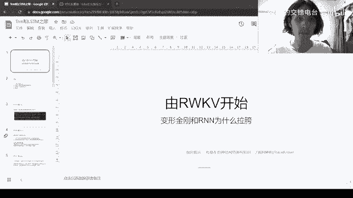
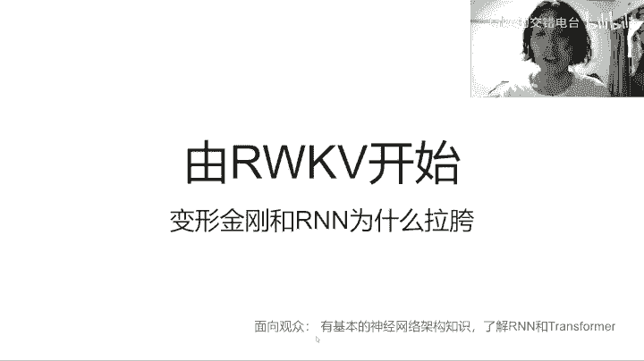
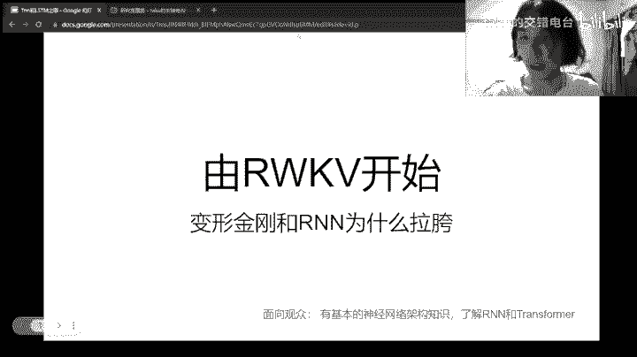
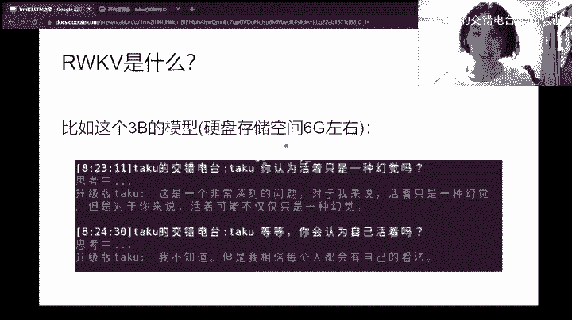
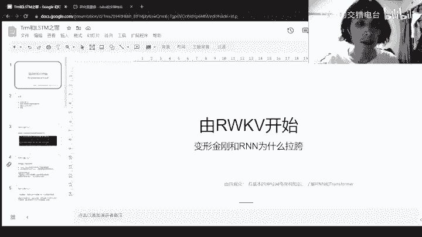
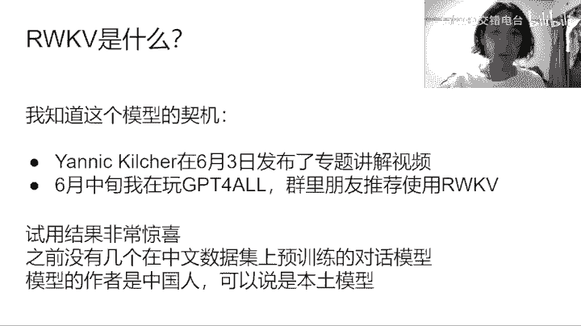
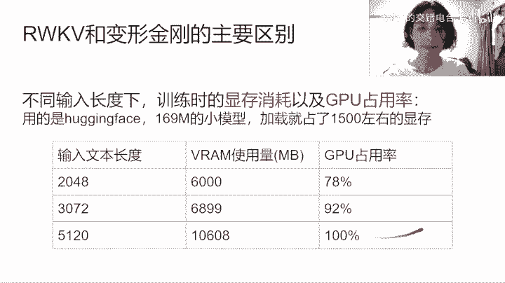
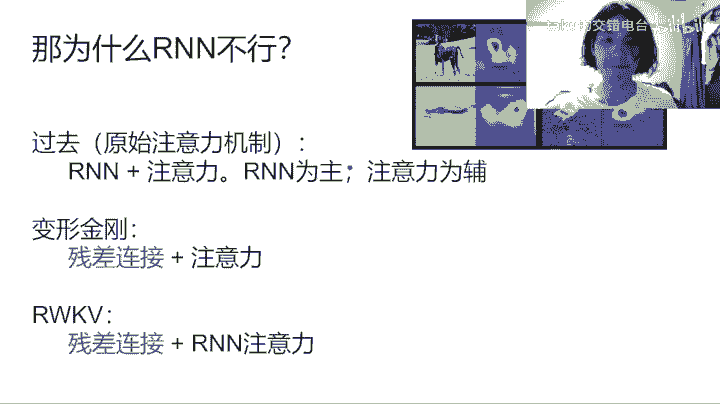
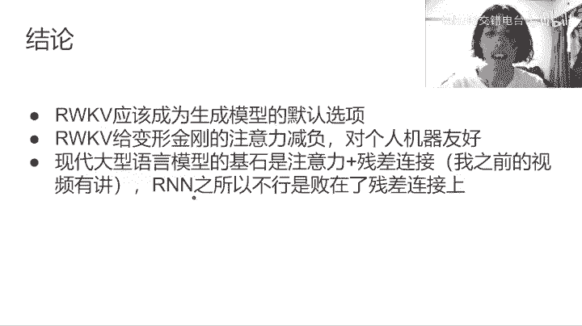
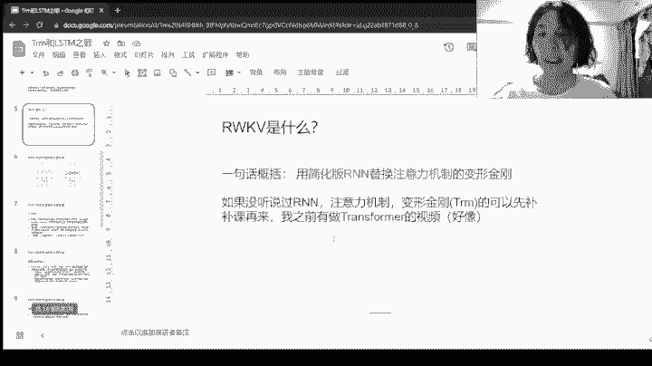

# 你必须拥有RWKV，以及其他模型为何拉胯，NLP杂谈 - P1 - taku的交错电台 - BV12h4y1u7uN

hello，大家好，我是海边的泰国。今天让我们来讲一下这个大型语言模型RWKV。这个模型好像发最早发布是在差不多两个月之前吧，就是它架构发布，要发论文，好像是在两个月之前吧，现在已经发展的比较快了。

然副标题是变形金刚和RNA为什么拉垮？然后变形金刚就是toform。面向的观众呢是有基本的神级网络知识的观众。

不好意思。

启用计完毕。等一下。

嗯嗯。为什么不能全屏呢？

不好意思不好意思。然后有基本的神奇网络架构知识，了解阿伦啊transform的一些观众啊，然后我们就入下一页。啊，首先这是目录，你们看一下就好了。首先RWKV是什么啊？我直接先演示一下它效果啊，它效果。

比如说我输入这个你不要看这个前面前缀，这是我在直播间里边的试用的一个一句话。你们可以到我直播间去试用一下。这个他谷是一个前缀，只有我在加踏谷才会被识别。然后我输入的是你认为活着只是一种幻觉嘛。

他会说这是一个非常深刻的问题，对我来说，活着只是一种幻觉。但是对于你来说活着可能不仅仅是一种幻觉。我觉得这是很了不起的一个回答吧。然后当然了。嗯，像是现在风梨就涨了死可以用来描某些于。你看到了吗？

他这个，例如当我们。这是我在直播间开的，我开的我的直播间嘛，然后你可以在这里弹幕这里试用，我就先不看这里了，我们直接看幻灯片了。然后我觉得关于意识的问题是一个很值得深究的问题吧。

我最近也在一直在看这个相这方面相关的一些。一些东西嘛所以。我今天我们就不。不做赘述了，我们就用下一页吧。啊，就是说他对比起那些去的GPT啊，肯定是。不够好的。但是但是你你要知道它只有这个硬盘空间。

只有6G左右的一个模型，它居然可以有这样的对话效果。而且你在自己的电脑上面能跑，我觉得是很了不起很了不起的。而且我推荐我最主主要为什么推荐这个RWKV是因为它是一个中文本土的模型啊，就它是真的在全有。

纯粹在总文数集上面训练的一些模型。就下一页，我知道这个模型的契机呢，首先是这个个。这个Q巧在6月3日发布了专题讲解的视频，这个人是我非常非常推荐的一个柔款up主。

我觉得他应该是讲嗯这些神经网络相关的题材讲的最好的一个优盘组了。然后6月中旬的时候，我在玩GPG for嘛，之前呢在知道这RWKV之前呢，我认为这个是我们就说能够企及的模型之中最好的模型吧。

然后群里朋友就推荐我使用RWKV我试用一下，发现。试用的结果非常惊喜啊。首先之前本来就没有几个在走成数据集上预训练的对话模型啊，不是fune啊，是Y预训练。他这一次呢他因为是中国人嘛。

模型作者是中国人嘛，然后可以说是本土模型。要后它有一些模型，小说的模型是啊100%在中文小说上面训练的。然后有一些对话模型呢是50%，英文50%的中文，那个效果是非常好的。然后我刚刚演示的这一个。

它其实就是那个啊英文跟中文对半的那个对话模型。据说就说中文的，如如果你纯粹在中文数集上面训练的话，那个性能反而会下降了。就说可能因为那数值太嘈杂了，就没有人没有人愿意花费那个费时费力去整理那数据集嘛。

我觉得这是很不好的一个倾向吧。在在中文圈子里边嘛。

总之我们先不讲这个了。然后RWKV是什么？用一句话来概括，就是用简化版的这个IN替换的注意力机制的变形性感啊。如果你没有听说过IN注力机制的话，啊，还有啊transformer的话，可以先补课再来。

我之前有做transformer的视频，好像是吧，好像是。不是很确定。我开一下激光笔啊。那这管也是哥哥的脸。然后我用这这个图来。就说说明一下RWKV和变形金刚的主要区别啊，这左边是RWKV。

右边是变形金刚啊，我们先看右边的变形金刚部分，我们这个是因为它是非常流行的一个架构嘛，所以我们先看这个。你可以看得到。这个地方呢就是输入嘛，每个token的输入，然后经过一层就抽取注意力键值的操作之后。

我们得到一个。就说KWE好像是对，我们得到KWE然KWE之间呢就通就通过这样的相互关，就怎么说呢？全连接。就说。怎么说呢？这个注意力的它的本质是每一个token要跟每一个token进行连接，你看到吗？

所以它的计算量就是你token的就是平方，它计算量是你token的平方。然后因为我们要保存那个结果嘛，所以。它的那个内存的消耗量是也是这个token的平方，你每输入加一个，你就要它的那个内存消耗是。

平方增长的还有计算量也是平方增长的。我们要知道这一点就可以了。但我们再来看RWKV啊RWKV我说过了，它是将这个平方级别的这个attention呢替换成这个RNMRN它的。他的计算。

算量是线性增加的线性增加，你看到吗？它嗯不像这样，你需要全连接嘛当就是线性增加的嘛，继续参加，还有那个内存消耗也都是线性增加的。所以它这是它一个好处啊，然后。嗯，怎么说呢？嗯，我想一下我想一下啊。

我想一下怎么讲。但是呢但是。既然他那么好，为什么以前的人不用它呢？是因为。是因为它不能够平行，就是说啊同时进行啊，你像是因为它无视顺序嘛，它这个attention这注意力其实是没有持续的。

所以你它可以同时计算这一个就算这个计算这个计算这个嘛，对不对？它可以同时计算嘛，因为它相互之间是没有关联的。但是你看这个它有个箭头相关联的嘛。

所以他只能够先计算完这一个再计算这个再计算这个再计算这个懂我意思吗？所以他是牺牲了那个同步的。同步计算的能力来达到这个。线性啊线性attention的懂我意思吗？我们接下来会详细讲一下。然后。几个结果。

首先是时序这个IN类似的注意力结构，天然编码的时序可以省掉这个positionencoding啊。这proincluding是transformer里边很重要的一个机制啊。如果没有它的话，所有的这些。

它已经是丢失了那个位置信息啊，丢失位置信息的话，那个性能会下降非常非常多。如你你想象一下，如果没有顺序的话，比如说猫是我跟我是猫是一样的嘛，那肯定是不一样的，对吧？然后相反在香草注意力机制里面。

单词的位置是不被考虑的。就跟我刚刚讲的一样嘛。然后第二点是连续性，这个RNANA结构提供了连续处理文本的可能性啊。安安是天生的文本处理者，或者说我们的语言就是以IN的形式被组织的。嗯，怎么说呢？

提供了连续处理文本的可能性。就比如说啊我现在先处理了一个句子，对吧？我拿到了这一个最后一个隐藏隐藏层的内容，对不对？然后我再在后边再增加一个句子，我可以沿用这个。包含了前面一个句子的那些信息的隐藏层来。

啊，进行新的处理，对不对？虽然transformer其实也是可以的啦。就说但是它更加自然了，因为我们的语言就是以IN的形式被组织嘛，就是线性的形式组织的语言嘛。你不可能说语言是可以打乱顺序的嘛，对吧？

你可以从后面往前面读嘛，当然是不可能的啊。因为我们的语言就是顺序持序的嘛。然后啊计算量方面呢，就是说计算量是下降了的，但是是以牺牲平行运算的能力为代价的。刚刚我已经讲过了，然后我们就下一页。

然后这里有几个需要注意的地方。第一点啊，首先IN注意力本质上是不能平行运算的。这个RWKV通过精简计算式来降低了计算量，那个代价也是显而易见的。然后就是那个代价就是注意力性能的下降了啊，不过有一说一呢。

我这是我个人的看法。变形金刚的多头注意力太夸张了。人类不是海德了，而不需要九个头啊。直源上处理一个句子，我们只只需要注意大概三个地方就够了。那个就是主主页B结构嘛，我是这样想的。

然后某个贡献者就是那个RWKV贡献者表示举证惩罚。这个模块呢计算量是IN注意力模块的1000倍啊，就是这举证乘法模块呢就其实两个地方都有。其实这个地方也有，这里也有。但是这个地方因为被精简了。

所以它可以忽略不计。但是啊这个地方呢抽取注意力键值的地方呢，会那个计算量会比较高，是这个这样一个情况的。那后边有还有一个feed forward，那里也是啊计算量比较高的地方，但是那是可以平行进行的。

嗯。是这样子。然后我们就不要讲这个了，下一页，然后需要注意地方。第二点呢，然后我怀疑IN注意力模块是。那信息注意力模块啊是性能瓶颈啊，因为在执行单次推理的时候，我的GPU计算量只能上到35%左右啊。

然后其实基本上不用怀疑，我觉得就是。但是当然这个可以通过怎么说呢？增加那个批处理的数量来，就说让计算量达到盘子几0百还是可以的，其实还是可以的，觉得没什么问题。那就下一页吧。然后第三点就是说。

所于本质上是持续运算推理的时候，我们确实可以扔掉计算过的hidden state，就那个隐藏层嘛。但是在训练然计算梯度的时候呢，中间结果是要保存的。所以你增加文增加那个文本长度。

还是要付出对应的内存代价的。那个增长速度是OL就是先性增长。然后具体实验部分呢，我们看下一页啊。然后如果通过切片方式训练呢，我们一次只能优画局部。我们可以，如果是以句子为单位的话。

我们可以拿到前面一个句子人的hidden day，然后。即系。计算那个啊第二个句子的那个。损失值的时候，我们要我们先沿用那个state，那个hidden state这是可行了。不过因为我们。

终究我们还是只能优画第二个句子对应的那些。那些。啊，权重对不对？是这个意思，我是这个意思啊。然后非要说的话，变形金刚也有切片训练的方式啊。

比如说我们选择那个呃class token对应的那个hidden stay作为前面文本的编码就可以了。当然了，IN的模式更加自然了，这是理所当然的。然后这是我的一个实验啊。

这个是不同输入长度下训练时的显存消耗以及GPU占用率啊。我用的是那个hugging啊，hugging face5月15号左右发布的那个RWKV的那个模块啊啊然后用的是169M的小模型。

然后加载就加就占用了1500左右的线存的。MB啊，然后输入文本长度200248的时候，2000的时候就是使用量是6000左右。那GPU按GPU占用率是78%左右，然后增加1024的话是增加了899。

然后再增加2000的话，是上升到1万1万多一点点。怎么说呢？它还是一个线性的过程吧。那比如说你现在书文本。就反而是线性增长的吧，你可以这样看这样理解，如果我用transformer的话。

可以想象得到就是说这里是以平方几增长了。

然后下一个话题是说为什么爱恋不醒。然后嗯简单来说，神奇网络的性能本质上是取决于深度的。然后还有那个参数量，然后在可训练的条件下。你不能说堆叠那个深度，但是你。对叠深度，但不能训练的话，那就没有意义。

对不对？那为什么对叠训对叠IN不行呢？为什么呢？因为长插连接是对叠的必要条件啊，以往对叠INN的研究没有考虑到长插连接。关于长沙连接，你们可以去看我之前的一个视频，是说。现代审计网啊现代。

人工智能的基石这两个基石，其实好像是叫这个名字的一个视频，你们可以去看。然后变形金刚和RWKV通用算式是这样子的，是hidden等于hidden，加上这个attention。

然后attention hiddendden就这个是注意力嘛，通过hiden计算的一个注意力。然后这个是hidden，为什么它这里要加一次呢？他这个因为就说本质上注意力是作为长沙附加到隐藏状态上面的。

这个是啊就说一个加plus函数嘛，对不对，对不对？所以这里是作为一个参材连接的。那所以我们才有了对点的能力，是这样子的。那为什么IN不行？过去我们有的原始的注意力机制是INN加上注意力。

这个机制呢是以INN为主，注意力为辅的。然后虽然你们可以看这个图啊，以前就是原始的那种注意力机制的应用的一个地方，就是说图像的那个识别，物体的识别。它这个地方就是注意力的大小，就越红地方。

注意力就就说明那个神经网络注意力就越强，是这样子的。注意力其实其实是很了不起的发明啊，只能这样说，那变形金刚呢是长叉连接，加上注意力。嗯。😊，WKV呢是长家连接加上INN注意力，他把这注意力改了一下。

但是产商连接是没有改的。你可以看我们可以看得到啊W个KV这里把INN直接等同一注意力啊。然后以前的是以注意力以INA为主的，这样是不行的。

我们进入下一页。我们就只接进入结论了，就说我觉得RWKV应该作为生成模型的默认选项啊。然后那个变形金刚呢可以作为一个升级的选项。因为RWKV它注意力是保留了那个最极致的精精度呢。

让RWKV在随着时间的推移呢，是慢慢的减少。对以前的token的那个注意力也是这样子的。所以我们认为啊就是说呃如果RWKV可以满足的情况下，我们就直接用RWKV就好了。然后如果不能满足的时候。

我们再用transformer嘛，对不对？所以我觉得它应该作为生成模型默认选项才对。让阿WKV给变形金刚的注意力减负啊，对个人的机器更加友友好啊。所以我认为这是非常非常好的一个反面吧，是这样想的。

第二啊第三点就是说现代大型语言模型的其实是注意力加产常连接。这个就在我之前的视频里有讲，你们可以去看。啊那之所以不显示就是败在了财产连接上面啊。

然后最后是一点点抱怨了，我觉得阿WKV主项目呢不应该为了性能而放弃通用模型了。我觉得那个通用模型就 hideenface嘛。我现在用的那个版本呢，就各种bug。

最最严重的CPU最严重的bug是CPU在提供state的情况下，就不能够训练了。我修那个bug坏了好几天啊，然后顺便读了一下源码，所以才有了这个视频。然后。啊，基本上就结束了，没有什么其他想讲的了。

我对这个模型的评价是非常高的，你们可以去玩一下。

我们稍微看一下我的直播间。的模型吗？你可以看一下啊，ta你在做什么？他现在在随机挑选那个弹幕来进行回答。我可以问他一个问题，他你觉得人活着。的意义是什么？稍微看一下。他出你觉着神握说的意义是什么？

思考中了，现在。因为现在开人的训练模式，所以所以稍微会有点慢。但是如果单纯是呃推理的话，是不会那么慢的。然后因为我还追加那个过去的对话终价值嗯。你可以看得到他回答是非常连贯的，有序的，然后还可以微调了。

这里还提供微调呢。你比如说你要说微调指定是你要说啊啊，我觉得人活着。没有嗯。没。等一上啊，我我觉得这没有意议。我开了一个叠加los啊。嗯嗯。哦，他已经t了。现在。调就结束，损失值。我再问一次再问一次。

他可能因为它很难反映到实际的生成上面的。因为那个那个什么那个lening rate比较比较低，所以很难反应的。不过我可以试一下，你觉得人活着的意义是什么？哎，等一下等一下好这条股是一个前缀来的。

一定要加才它才会回答呢。う。这网络有点慢，稍微等一下。不是，是他在思考吗。怎么感觉卡住了？有时候OB跟之前的回答有一些些不一样，我认为。所以说微调是一个很难的工作啊，只能这样说。然后基本上就这样吧。

今天视频就到此为止吧。