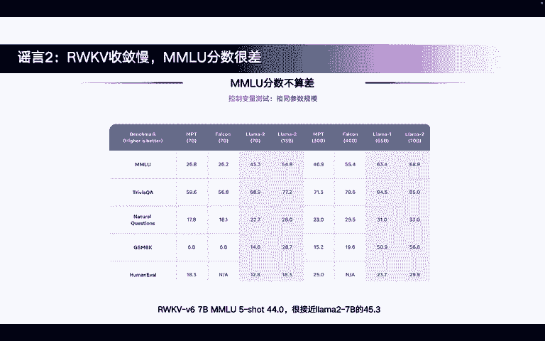
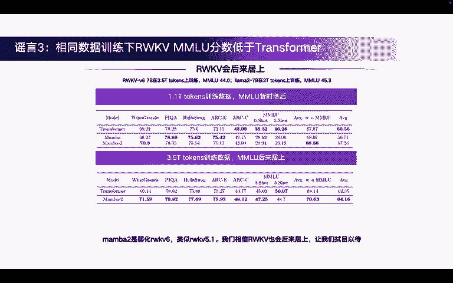
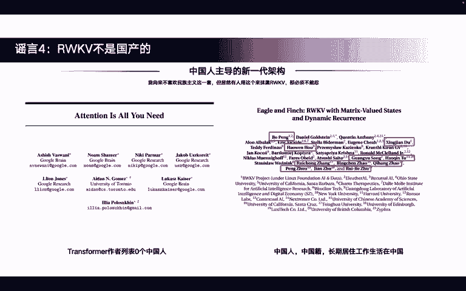

# 关于RWKV的5个谣言 - P1 - 霍华德vlog - BV114421S7pi

大家好，今天想要录一个视频，专门来谈一谈关于ra库的5个谣言。长期以来我都听到过各种各样的ra库谣言，经常使我完全绷不住。好，咱们开始吧。第一个谣言是说，ra户的训练效率贼低。

比transformer慢的多。往往散播这样谣言的人，还把ra库当做LSTM时代的那种RNN呢。他们认为ra库也必须要一个token一个token的处理无法并行，所以训练速度很慢。但实际上。

ra库早就已经鸟枪换炮，跟他们完全不是一个时代的RNN了。这里我专门做了一个实验来证明ra酷的训练效率很高，长上下文是更快。首先用的baseline呢是卡ac的 nanoGPT。

看过这个代码的都知道这个代码写的非常好。已经把它的训练效率优化到了单机上，普通人可以达到的极限，使用了混合精度，touchch compareflash attention全部都用上了。好。

那我们来看一看。右边这张图上显示的软训练时间啊，这个的训练时time最后一列训练时间是指训练一个step。训练一步所需要的时间。我们看当上下文较短时。

raku的训练速度确实略慢于GPT加flash attention。当时单达到4K的时候，基本两个都是1000毫秒左右，速度就已经很接近了。当上下文达到8K的时候，ra库的训练速度就已经比GPT要快了。

如果你还需要更长的训练上下文，那么ra库的优势将进一步显现出来。第二个谣言是什么呢？是ra库收敛慢MMLU的分数很差。但实际上，真正跑过ra库的都知道ra库的收敛速度比transformer快的多。

比GPT也快得多。啊，像右图所示，这是真实的训练结果，也是用了nnoGPT。作为对比参照物raku的los下降的比GBT要快。另外可以看看左边这张图。

这个是raku67B在一系列英文和多语言测试机上的效果。英文的效果仅仅次于拉ma38比和m7比。多语言能力是最佳的。因为ra酷使用了。2。5T的多语文本。好，那再来回答MMLU分数的问题。首先。

raku67B的MMLU分数一点都不差。five shot可以达到44。0，非常接近拉ma27B的45。3了。至少是在开元社区开元模型里也是相对比较有竞争力的一个分数了。好。

下一个要演是相同训练数据线ra酷MMLU的分数低于transformer。

嗯。😊，确实从上一页幻灯片我们就能看出来，raku67B在2。5T token上训练MMLU是44。0分。拉马27B在2T token上训练MMLU是45。3分，似乎多了0。

5T的token效果MMMU还差一点，似乎是说明在相同训练数据下，raku的MMU分数会低于transformer。但是最近英伟达的有一篇论文。指出了这样一个现象。他是在member上做的实验。

因为memba和raku都是一系列新型的。叫做新架构吧，对吧？他们其实都或多或少的是某种没有标准注意力机制的这样一个模型。他们遇到的一些现象或者观察到的现象。我认为是相通的。好，我们来看是什么现象。

在memba在1。1T token上训练时，其他测试集的效果都非常不错，甚至比transformer要好。但是MMU暂时落后，而且落后的分数还不少，这是挺让人失落的一个结果。似乎也真正的印证了这个谣言。

但当我们把训练数据提升到3。5T token的时候。MMU的分数就后来居上了。zero short的分数甚至超过了transformer。这说明什么？

这说明transformer和其他节些架构确实有不同的学习过程。他们在不同的token数的时候，可能会有不同的学习历程，或者说叫要那graing。的过程是不一样的。在3。5T的时候。

新架构的MMU分数会后来居上。门把2，我可以负责任的说是弱滑版的ra酷6，类似于ra酷5。1，我们相信ra酷也会后来居少，让我们拭目以待吧。好，第四个谣言，ra库不是国产的。

啊，我这个是最绷不住的，我向来不喜欢民族主义这一套，但居然又有人用这个来抹黑rapku，那必须不能认。我们来看看transformer的作者列表里，一个中国人都没有吧，国产化率0%8，而且这已经成为。

既定的历史永远不可能改变吧。任何使用transformer的，你都没有办法说你是完全国产吧，因为你的祖宗就里面一个中国人都没有。我们再来看看ra库。库无论是四还是五还是六的论文，都有大量的中国人参与。

而且软后的一座蓬勃可以说。就是主导整个软库架构架构创新和开发的主导者。他是中国人，中国籍长期居住工作，生活在中国。那么。可不可以说这就是中国人主导的新一代架构呢？那可不可以就是说ra库是国产的呢？

至少就就算退一步来说，确实有不讨不少外国友人也参与了ra酷的研发和写作过程。那么rap库的作者列表里也有大量的中国人。至少含中国的成分已经远远高于transformer了吧。我再多扯一句。

member虽然大家很多人都在followme的工作，但member的两个作者。都是美国大概率啊，我没有办法完全核实这一点。但是我认为。abber古应该是华裔美国人。道神应该是一个越南裔美国人。

如果其他人对此能有什么其他的铁证来证明我说错了，随时欢迎私信我，我也愿意。把我说的这些话删掉。好，最后一个谣言。最后一个谣言是说ra酷是名科模型。

不能因为蓬勃。不在学术界。就认为阮户是个名客模型。彭勃长期在对冲基金工作。对世界的人才分布有了解的人都会知道，这世界上的最顶级人才。很大一批都在对冲基金工作。

包括奥林匹克数学竞赛金牌、物理竞赛金牌、信息学竞赛金牌，很多都会到对冲基金工作。对冲基金吸纳了这世界上最优秀的一批人，可以这么说。相反，我认为彭勃有很好的创新能力跟学术素养。

他得到了来自全世界各路大神的认可。包括传奇程序员fabsbanard。LSTM支fu。油管大V康奈尔的教授，还有全世界的开发者。

你会在越来越多的paper里都会看到raku作为一个非常重要的基准或者benchmark进行对比。那么这个时候说明raku早就得到了全世界学术界工业界的认可，绝对不是一个名科模型。最后。

欢迎大家一起加入阮酷的社区，你一定会有收获的。