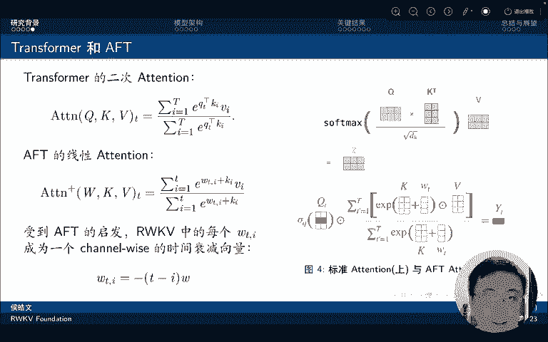
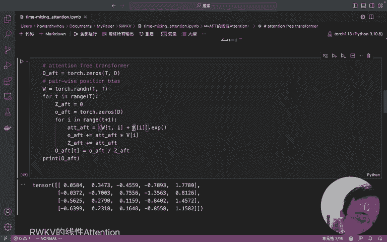
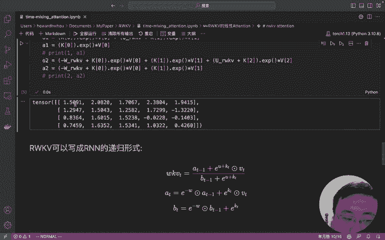
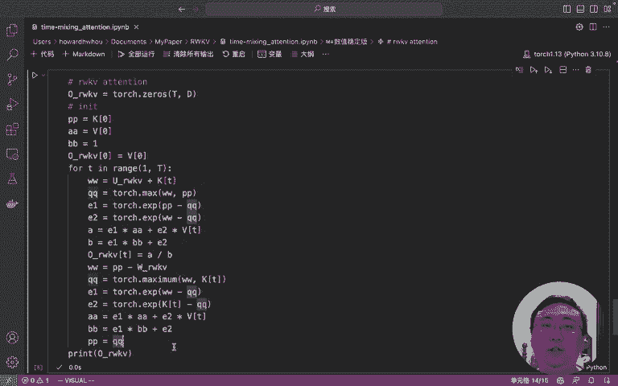

# 解密RWKV线性注意力的进化过程 - P1 - 霍华德vlog - BV1zW4y1D7Qg

好的，下面呢我们来用代码解释一下各种模型的tenion是什么样子的。

首先呢我们先来介绍一下transform attention向量版。这个和大家平时看到的矩阵版是不同的。可以看到这个。公式里它是首先计算Q和K的一个分数，然后再通过指数进行一下变化，再乘以VI。

然后求和，最后除以一个规划因子。就可以得到呃attention的。就可以得到transformer的 attention。用代码来解释的话，可以看下面这个代码。首先呢我们初始化一个输出。

这个输出呢是由序列长度T和模型维度低所决定的。然后我们开始从第一个字或者第一个词，第一个token开始。我们先算一个当前token的归化因子初始化一下。

然后初始化一个当前这个token的要输出的tenion。然后呢，我们就开始沿着第一个tion开始往后逐步的便利啊，attention呢等于。对应的QT就是当前的。

token它的作为cory和后面一个token之间的啊这么一个。内积分数，然后取一个。指数都得到它的ten性分数是ten性分数呢再乘以后面的对应的那个token的。呃，value向量。

加到一起就可以得到后面的这个OT。同时，它规划因子也不断的积累了tension。最后呢。OT再除以一下Z就可以得到我们要输出的。我摊盛了。从这个地方一个不严谨的说啊。啊，不严谨的时候。

你可以看到它其实是。两个循环啊，那么最简单的算法分析里面，两个循环就是ON方，或者说这里说是OT方的一个复杂度。对吧。好，让我们看一下这个计算结果和标准的selft一样吗？你会发现它是一样的啊。

但是标准的selft计算是矩证版它就更简单了。Q的整个矩阵和K的矩阵转制一下，得到一个ten score。让这个t score再和V做下聚合就得到我们标准的selft的结果。

我们可以看到aser它是一模一样的。所以说明我们向量版的attion啊，可以计算和矩证版一样的结果，那可能观众就要问，那为什么我们要计算向量版的明显的向量版好像效率很低。

是但是把attention转化成向量版，我们更容易看清楚后面的一系列眼镜和变化的。最初的模样。后面苹果就提出了。attention free transformer的线性attention。

我们可以再看一看这个是什么样子呢。他把之前的Q和K取消了，转而代之的取而代之的是W和K，这是什么意思呢？我们还是从代码上来看一看，我觉得更容易理解。首先。W在。

attention free transformer里面呢被定义为一个T乘T的矩阵。这个呢它代表的是点和点之间的位置的biers，或者说位置的偏置项。

可以理解为说我第一个词和第二个词之前就有个固定的偏执。我第零个字和第三个字之前就有个固定的偏执。模型就是要学这样一个静态的固定的偏执。OK那么当模型开始便利，取到第一个token的时候。

我们会发现它仅仅是取到。当前头ken。而是一个to困之后的，他不会取到。它的计算过程呢也是把对应的。W矩阵里面。T和I之间的这么一个位置偏置拿出来。

同时呢加上1个KIKI是可以理解为第I个token的词权证或者自权证或者token权证。把这两个是加到一起。来相当于是说近似之前的Q乘以V啊。而Q上面Q乘以K的那个点击的结果，然后再取一个指数。

就得到一个就可得到了AFT的tension。然后呢，把attention的结果加到V上面。然后把测结果和VI相乘，然后把规划因子也加上了。最后。除一下规划因子，就可以输出得到AFT的。发现没有？像这样。

那么它其实上。就也实现了一种现tenion，但这个tction是线性的。为什么说它是线性的呢？它其实这个地方平实我觉得看的不是很准确。就像我刚刚说为什么我刚刚说那个是。不准确的它也是一个双重循环。

但是呢你可以看到它其实每一个tenion它。不再依赖于啊其他的所有的这个成绩啊，而是说依靠这样的。你可以理为，这个就是一个查表啊，理解为一个查表，加上是当前资权重的一个加和。他就不再需要做矩证惩罚了。

那他就摆脱了其他token和它之间的这么一个限制关系。所以他就变成了一个线性的ten。

好，那我们最后再来看一下reco的线性attention是什么样子的呢？其实受AFT的启发，reku的线性attention。也使用了W和K，还有V啊。

所以在recd paper里面都把这一项attention叫做WKV。好，那我们来看一下这WKV这个公式是什么意思呢？其实作者的思想或者说我们这论文的思想是说，我们认为啊随着这个。距离和当前token。

的变化。那么其实上这个词的重要性是有一个衰减的。啊，当前token我们给了他一个buus啊，或者说可以理解为就是一个加奖加奖。然后呢，当前token的前一个token，我们把他的这个注意力的W取为0。

然后再前一个token，就前两个token为-W，前三个token为-2W之后以此类推啊，就实现了这样的一个衰减过程。然后再。那我们现在下面来去看具体的计算过程吧。首先也是从第一个token开始取。

然后计算到。这个token开始，但是我们呢注意pyython它只取，它其实最终取值取不到T，它最终I的一个只是T减1。那么可以理解为最终其实上会计算到当前token的前一个token。那么。

对于前一token，我们怎么计算它的这个attention呢？使用W。响亮成语当前。成语，当前T和。当前乘语当前tokenT和I之间的一个距离。啊，转换为之前看到的-W-2W-3W这样的一个形式。

然后再加上。KI做一个词权重或者偷恨权重。取指数就得到了啊re。这么一个呃attention，然后再把这个attention和V乘到一起，然后再把它加上，然后规划因子也同样加上。

然后那下一步其实就有点不一样，就是说OK下一步是算一算当前token。它的这么一个attention是多少的？我们使用了U作为它的一个奖励啊，我因为我们认为当前token对于模型而言可能更重要。

所以专门给了他一个奖励，用了U，然后加上。KT就是当前token的权重给了它指数，然后再加上最后就可以计算出了了。当们。像这样做的话，就实现了我们之前所说的，随以时间衰减的这样的一个规律。

那它具体的公式是这样的。啊，但是其实像这样的话，我们会发现他好像。呃。计算起来还是不快啊，它所有的他所有的这个值还是需要依赖全面的这些所有再便利一遍，对吧？它计算效率还是不好。

那其实我们会发现在这个公式里啊，它前面这一部分。和下面这一部分其实可以用另外一个因子给它记录下来的，只需要把这个当做一个state。每次计算的时候，把它们输入进来。

再和当前的这个token的这一系列的向量进行一个计算，就可以得到WKV了。所以我们其实上不需要把所有之前的值重新算一遍的。而是在当前的话把。当前的把之前的纸啊放到一个cash里面。

你可以把它叫做cash，也可以把它叫做state。然后再和当前的这个通口来计算，这样的话呢计算效率就可以大幅提高。所以我们来看一下。raku的RN版本递归形式，其实就是利用了这样一个思想。

把之前的所有的那些求和项啊记为AT减1。规划因子里的求和项即为BT减1。然后呢，我们通过一定的推导。就可以发现啊，其实找客户第一个项就是V0。因为这个时候你可以认为他的tention就是一嘛。

然后A和B可以初始化成这样。因为。因为它就是现在我们要呃OK然后从第一个token开始便利。然后我们把A。和B要加进去，同时就算当前这个token的。值和它的buus，然后再乘上它对应的valueue。

就可以得到。当前的tention，然后呢再更新一下，再更新一下我们的A和B。用这样的一个公式跟下A和B，感兴趣的观众可以自己去推导啊。这个其实推导过程并不并不复杂，然后我们就得到了我们的tension。

那你会发现其实它计算结果和前面计算结果是一模一样的啊，说明我们这样的一个化解是正确的。

但是其实这样做还有一个问题就是数值不稳定。因为。呃指数K其实是很容易溢出的，特别是在flow16的时候，它最大的数值只有65504啊，大家可以取个log，大概也就十几的样子。如果K大于十几。

它整个值就溢出了。所以训练时呢，我们还需要做一个改造。其实这个改造说简单也挺简单的。就是每一次我们在求ESP之前，要先把它的值减到一个最大值。减掉这个最大值之后呢，就把EXP这个值压到了零和负数之间啊。

像这样的它就不会溢出了。最后呢我们再计算一下。就得到对应的ten啊，大家可以发现最后这个版本其实就是。就是彭博作者，他在他的开源代码里面使用的方式了啊，所以说我们一步一步的大家跟随着。

我就从最原始的tenion到AFT的tension，再到raku的简化版呃，简单版的tion，然后再到递归形式的tenion，最后到了数值稳定版的tenion。

就知道了啊整个工作是怎么一步一步的演进到最后的这个样子的。OK那今天想说的就这么多，谢谢。😊。

观看。